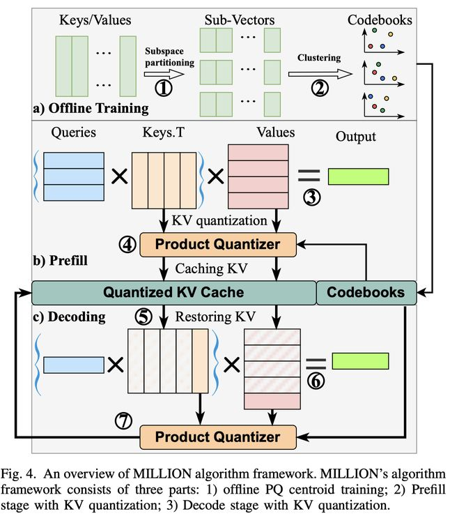

# MILLION: Mastering Long-Context LLM Inference Via Outlier-Immunized KV Product Quantization

> Zongwu Wang, Peng Xu, Fangxin Liu, Yiwei Hu, Qingxiao Sun, Gezi Li, Cheng Li, Xuan Wang, Li Jiang, Haibing Guan

> **注意：本笔记由 AI Agent 自动生成，生成时间 2025 年 6 月。内容基于论文全文阅读，可能存在理解偏差，仅供参考。**

---

## 一句话总结

MILLION 提出了一种基于乘积量化（Product Quantization）的 KV Cache 非均匀量化框架，通过离线码本训练、注意力计算变换和异步量化策略，在保持近乎无损精度的前提下实现了 KV Cache 4-bit 压缩，并在 32K 上下文长度下获得 2.09 倍的端到端加速。

---

## 摘要翻译

大语言模型（LLM）越来越多地用于需要更长上下文长度的复杂任务，一些模型支持高达 128K 甚至 1M 个 token。然而，这一趋势在推理速度和内存管理方面带来了重大挑战。KV Cache 机制通过存储预计算数据来缓解这一问题，但其内存需求随上下文长度线性增长，阻碍了 LLM 的高效部署。量化成为解决 LLM 规模与内存容量之间差距的有前途的方法。然而，传统量化方案往往因为两个关键因素产生次优的压缩结果：i) 在线量化和反量化导致显著的性能开销；ii) KV 值中离群值的普遍存在，对低位宽均匀量化构成挑战。为此，我们提出了 MILLION，一种通过乘积量化实现低位宽 KV Cache 的新型量化框架。首先，我们对 KV Cache 分布进行了深入分析，揭示了现有量化方案的局限性。其次，我们引入了基于乘积量化的非均匀量化算法，在高效压缩数据的同时保持精度。第三，我们为 MILLION 开发了一个高性能 GPU 推理框架，具有高效的注意力核和流水线设计，利用稀疏计算和异步量化，显著提高了推理速度。全面的评估结果表明，MILLION 可以实现 4 位量化，具有极小的困惑度和精度损失，并在 32K 上下文长度下实现 2.09 倍的端到端性能提升。

---

## 研究动机

### 1. 长上下文 LLM 推理的内存瓶颈

随着 LLM 上下文长度不断增加（128K 甚至 1M token），KV Cache 的内存需求随上下文长度线性增长，成为推理部署的核心瓶颈。例如，540B 参数的 PaLM 模型在 batch size 512、上下文长度 2048 时，KV Cache 可达 3TB，是模型参数量的三倍。

### 2. 现有 KV Cache 优化方法的不足

论文归纳了三类现有方法的局限：

- **优化注意力机制**（MQA、GQA、MLA 等）：通过 KV 共享减少开销，但通常以精度损失为代价，目前仅 GQA 被广泛采用。
- **稀疏注意力机制**（滑动窗口注意力、Streaming-LLM 等）：降低注意力计算复杂度，但近期研究表明其可能因历史注意力分布无法可靠预测未来需求而导致精度下降。
- **KV Cache 量化**：虽然量化在模型权重压缩方面已取得成功，但直接应用于 KV Cache 面临独特挑战：
  - KV 状态中的**离群值**扩大了量化范围，使低位量化困难。
  - KV 是推理过程中动态生成的，量化/反量化延迟严重影响实时性能（4-bit 反量化可贡献 20%~90% 的推理延迟）。

### 3. 现有 KV Cache 量化方案的不足

- **QServer**：提出 SmoothAttention 将量化缩放因子融入前层权重以减少反量化开销，但受旋转位置编码硬约束限制。
- **KIVI**：采用分组量化，通过通道级和 token 级量化适应离群值分布。
- **KVQuant**：进一步引入离群值隔离和非均匀量化以提高低位精度，但代价是推理性能下降。

MILLION 的核心动机是**在精度和效率之间实现更好的平衡**，避免现有方法的缺陷。

---

## 方法（技术细节）

### 1. KV Cache 分布分析

论文深入分析了 KV Cache 的分布特征（基于 Llama-2-13B、Falcon-7B、MPT-7B 等模型）：

- **离群值分析**：Key Cache 的离群值集中在少数通道中，Value Cache 也包含离群值但分布相对均匀。离群值显著扩大了数值分布范围，使得低位量化困难。
- **通道级标准差分析**：Key 的标准差在某些通道中异常突出（标准差离群值），而 Value 的标准差在各通道间相对一致。这表明 Key 的整数量化比 Value 更具挑战性，需要对不同通道使用不同的量化精度。

### 2. 基于乘积量化（PQ）的非均匀量化

MILLION 的核心创新在于将乘积量化（Product Quantization）应用于 KV Cache 压缩：

**乘积量化基本原理**：
- 将高维向量分割为多个低维子空间，每个子空间独立量化。
- 训练阶段使用 k-means 聚类为每个子空间创建码本（centroid）。
- 量化时将向量投影到最近的质心，存储质心索引作为紧凑编码。
- PQ 天然支持混合精度量化——量化难度较高的通道在码本中占据更多状态。

**MILLION 的 PQ 量化方案**：
- **离线码本训练**：在 baseline 推理时采样 KV Cache，用采样的 key/value 向量进行 PQ 训练，确定码本（存储在 GPU 内存中）。
- **在线 Prefill 量化**：在 Prefill 阶段，用全精度 key/value 进行注意力计算，同时用训练好的码本进行量化，将压缩后的 KV（质心索引）存入 KV Cache。
- **在线 Decode 量化**：在 Decode 阶段，当前 token 的 query 需要与所有历史 token 计算注意力，通过查找码本恢复量化 KV。

**量化/反量化公式**：
- 量化：将 KV 向量按子空间分割，对每个子空间找到最近的码本质心，存储索引。
- 反量化：通过索引查找码本，获取对应质心向量并拼接恢复。

### 3. 注意力计算变换（关键创新）

MILLION 将注意力计算分解为两部分，**避免了在线反量化**：

$$A_n = \text{OlSoftmax}\left(\frac{q_n \times \|\|_{i=1}^{M} C_{iK}^T \otimes \Delta_{iK}^T}{\sqrt{d_k}}\right) \times \|\|_{i=1}^{M} \Delta_{iV} \otimes C_{iV} + \text{OlSoftmax}\left(\frac{q_n \times k_n}{\sqrt{d_k}}\right) \times v_n$$

- **第二部分**（当前 token 的自注意力）：使用全精度 key/value，O(1) 复杂度，无需量化/反量化。
- **第一部分**（当前 token 对历史 token 的注意力）：
  - 步骤 1：计算 $q_n \times \|\|_{i=1}^{M} C_{iK}^T$，O(1) 复杂度。
  - 步骤 2：用量化索引 $\Delta_K$ 对结果向量进行采样，O(n) 复杂度。
  - **关键优势**：量化后的 $\Delta_K$ 可以直接计算，无需反量化。

### 4. 高效注意力实现（CUDA Kernel 优化）

- **查找表（Look-Up Table）**：将 $q_n \times \|\|_{i=1}^{M} C_{iK}^T$ 作为查找表加载到 GPU L1 缓存，实现快速随机访问。
- **float4 数据格式**：$\Delta_K$ 矩阵使用 float4 格式预取，增强连续内存访问效率。
  - 例如，8-bit 子空间量化（nbits=8）时，每个 CUDA 线程可同时加载 16 个索引到寄存器，然后执行 16 次共享内存地址查找。
- **并行化设计**：受 flash decoding 启发，有效并行化 $\Delta_K$ 的查找表查询和 $\Delta_V$ 的反量化。

### 5. 异步量化策略

- 解码阶段是内存瓶颈（memory-bound），量化操作与后续推理计算在时间上独立。
- **双 CUDA Stream 设计**：
  - **高优先级主流**：处理注意力计算和后续推理。
  - **低优先级辅助流**：负责 key 和 value 的量化。
- 当主流 CUDA kernel 的 GPU 利用率较低时，辅助流启动量化 kernel，从最近 KV Cache 中获取全精度 KV 进行批量量化。
- 这一设计有效平衡了注意力处理和量化的计算需求，优化了整体推理性能。

### 6. MILLION 数据流

1. 隐藏状态经线性变换生成当前 token 的 query、key、value。
2. Query 与码本进行 GEMM 操作，计算到所有质心的距离（O(1)）。
3. 用距离向量与量化 KV 进行稀疏注意力计算（O(n)）。
4. 同时，query 与最近 KV Cache（全精度）进行稠密注意力计算（O(1)）。
5. 稀疏和稠密注意力输出通过在线 softmax 合并，送入后续层。
6. 量化操作异步执行，将全精度 KV 量化后存入量化 KV Cache。

---

## 实验结果

### 评估设置

- **模型**：GPT2-xl（1.5B）、LLaMA-2-7B、MPT-7B、Longchat-7B（32K）、Yarn-LlaMA-2-7B（128K）
- **任务**：PPL（Perplexity）评估（Wikitext-2、PTB 数据集）+ LongBench 长上下文生成任务
- **基线**：fp16 全精度、KIVI（2/4 bit）、KVQuant（3/4 bit）
- **GPU**：A40

### 精度结果

**PPL 评估（Table II）**：

| 方法 | GPT2-xl (Wikitext-2) | GPT2-xl (PTB) | LLaMA-2-7B (Wikitext-2) | LLaMA-2-7B (PTB) | MPT-7B (Wikitext-2) | MPT-7B (PTB) |
|------|----------------------|---------------|-------------------------|------------------|---------------------|--------------|
| Baseline | 17.41 | 21 | 5.12 | 28.31 | 7.68 | 9.98 |
| KVQuant-3b | 18.59 | 23 | 11.21 | 12323.75 | 27681432 | 3E+07 |
| KVQuant-3b-1% | 18.24 | 22.35 | 5.22 | 24.34 | 7.826 | 10.14 |
| **MILLION-3b** | 17.6 | 21.14 | 5.2 | 29.55 | 7.79 | 10.08 |
| KVQuant-4b | 18.156 | 22.32 | 6.99 | 102.21 | 24043348 | 3E+07 |
| KVQuant-4b-1% | 18.108 | 22.15 | 5.14 | 25.86 | 7.71 | 10.02 |
| **MILLION-4b** | 17.57 | 21.12 | 5.21 | 29.56 | 7.75 | 10.03 |

关键发现：
- KVQuant 的非均匀量化在不同模型上表现不稳定，特别是 LLaMA-2-7B 上 PPL 严重恶化。
- KVQuant 通过隔离 1% 离群值以全精度存储才能恢复性能（"KVQuant-3b-1%"），但增加了复杂度和开销。
- MILLION 在 4-bit 和 3-bit 量化下均优于 KVQuant 的纯均匀量化，精度略低于 KVQuant 的 1% 离群值混合精度方案，但无需额外的离群值处理开销。

**离群值敏感性实验（Table III）**：
- 在 LLaMA-2-7B 上，MILLION 3-bit 量化时，隔离 1% 离群值仅使 PPL 改善 -0.38%；4-bit 时改善 0.58%。
- 这表明 MILLION **天然对离群值具有鲁棒性**（outlier-immunized），加入稀疏离群值处理几乎无益，反而会显著降低系统性能。
- 对比 KVQuant：3-bit 时隔离 1% 离群值使 PPL 改善 53.4%，4-bit 时改善 26.5%，说明 KVQuant 对离群值非常敏感。

**LongBench 评估（Figure 6）**：
- MILLION 4-bit 量化在 LongBench 各任务上保持足够精度。
- LLaMA-2-7B 上分数下降仅 0.95 分，Longchat-7B 上下降 0.93 分。
- 值得注意的是，MILLION 在 Yarn-LLaMA-2-7B（128K 上下文）上分数反而提升了 0.45 分，展示了其在最长上下文模型中的有效性。

### 系统性能

**生成速度（TPOT）（Table IV）**：

| 方法 | 1K | 2K | 4K | 8K | 16K | 32K |
|------|----|----|----|----|----|-----|
| Baseline (fp16) | 32.53 | 35.64 | 42.04 | 54.83 | 80.49 | 132.97 |
| KIVI (4b) | 46.69 | 46.88 | 46.92 | 47.86 | OOM | OOM |
| KVQuant (4b) | 75.73 | 73.92 | 75.34 | 74.90 | 78.17 | 90.16 |
| **MILLION (4b)** | 30.36 | 31.57 | 34.05 | 38.34 | 46.53 | 63.41 |

关键发现：
- KIVI 在 16K 及以上长度时 OOM（内存不足）。
- KVQuant 的非均匀量化和离群值稀疏方案导致推理显著变慢。
- MILLION 在所有上下文长度下均优于基线和其他方法，即使在 1K 上下文时也有优势。
- 在 32K 上下文长度下，MILLION 实现 **2.01x 注意力加速**和 **2.09x 端到端加速**。

**延迟分解（Figure 7）**：
- MILLION 在 SDPA（Scaled Dot Product Attention）和 cat（KV Cache 拼接）两个算子上实现了显著性能提升。
- 随着上下文长度增加（内存瓶颈加剧），加速比持续增长。
- 其他压缩方案由于反量化开销而产生更高的计算开销。

---

## 优势

1. **天然离群值鲁棒性**：基于 PQ 的非均匀量化天然处理离群值，无需额外的离群值隔离或混合精度机制，简化了系统设计。
2. **消除反量化开销**：通过注意力计算变换，量化后的 KV Cache 可以直接参与注意力计算，无需反量化操作，从根本上消除了反量化瓶颈。
3. **高效系统设计**：异步量化策略利用双 CUDA Stream 实现计算与量化的并行，最大化 GPU 利用率；CUDA Kernel 的查找表和 float4 优化进一步提升了效率。
4. **优秀的精度-效率平衡**：4-bit 量化下实现近乎无损的精度（PPL 损失极小），同时在 32K 上下文长度下获得 2.09x 端到端加速。
5. **扩展性强**：PQ 天然支持混合精度量化，可根据不同模型和场景灵活调整。
6. **实用性强**：与多种位置编码方案（RoPE、ALiBi、Absolute）兼容，适用于多种模型架构。

---

## 局限

1. **离线码本训练依赖**：需要预先对 KV Cache 进行采样和 PQ 训练，增加了初始开销和部署复杂度。
2. **对 KV 分布的假设**：PQ 的有效性依赖于 KV Cache 的分布特征，对于分布差异较大的新模型或任务，码本可能需要重新训练。
3. **4-bit 精度仍有损失**：虽然精度损失极小，但在某些任务上与全精度相比仍有差距（如 LongBench 上 LLaMA-2-7B 下降 0.95 分）。
4. **仅评估 KV Cache 量化**：未与其他类型的信息压缩方法（如 KV Cache 剪枝）进行对比或结合，可能存在进一步优化空间。
5. **对硬件的依赖**：CUDA Kernel 优化和双 Stream 设计高度依赖 GPU 硬件特性，可能无法直接移植到其他硬件平台。
6. **更低位宽的探索**：论文主要关注 3-bit 和 4-bit 量化，对于更低比特（如 2-bit）的 PQ 量化效果未做深入探讨。
7. **与权重量化方法的结合**：未探索与权重量化（如 GPTQ、AWQ）的联合优化，可能进一步提升整体效率。

---

## 与 EfficientPaper 相关的研究方向

### 直接相关

- **KV Cache 量化**：MILLION 是 KV Cache 量化领域的最新进展，与 KIVI（2024）和 KVQuant（2024）直接竞争，代表了乘积量化在 LLM 推理优化中的应用。
- **长上下文推理优化**：MILLION 的核心目标是降低长上下文 LLM 推理的内存和计算开销，与长上下文推理效率直接相关。
- **量化与系统协同设计**：MILLION 将量化算法和 GPU 系统优化紧密结合，体现了量化-系统协同设计的趋势。

### 扩展相关

- **非均匀量化技术**：MILLION 使用的乘积量化属于非均匀量化范畴，与 AWQ、GPTQ 等权重量化方法有共同的技术基础。
- **注意力机制优化**：与 MQA、GQA、MLA 等注意力机制优化方法互补，可以结合使用进一步降低推理开销。
- **稀疏注意力方法**：与 H2O、SnapKV、Keyformer 等 KV Cache 剪枝/稀疏方法可以结合，实现更激进的压缩。
- **异步计算优化**：双 CUDA Stream 异步量化策略与 GPU 计算优化领域相关，可推广到其他量化场景。
- **推理系统优化**：MILLION 的高效 CUDA Kernel 实现和延迟分解分析方法对 LLM 推理系统优化有参考价值。
- **在线 softmax**：OlSoftmax 操作与 FlashAttention 等在线 softmax 优化方法密切相关。
