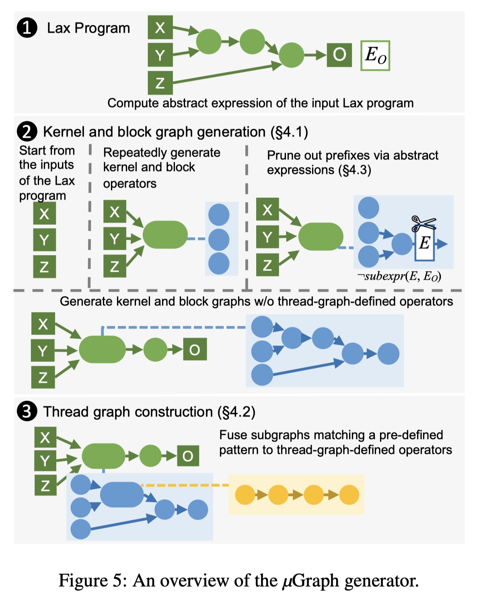

# Mirage: A Multi-Level Superoptimizer for Tensor Programs

> Mengdi Wu, Xinhao Cheng, Shengyu Liu, Chunan Shi, Jianan Ji, Kit Ao, Praveen Velliengiri, Xupeng Miao, Oded Padon, Zhihao Jia

## Abstract

We introduce Mirage, the first multi-level superoptimizer for tensor programs. A key idea in Mirage is $μ$Graphs, a uniform representation of tensor programs at the kernel, thread block, and thread levels of the GPU compute hierarchy. $μ$Graphs enable Mirage to discover novel optimizations that combine algebraic transformations, schedule transformations, and generation of new custom kernels. To navigate the large search space, Mirage introduces a pruning technique based on abstraction that significantly reduces the search space and provides a certain optimality guarantee. To ensure that the optimized $μ$Graph is equivalent to the input program, Mirage introduces a probabilistic equivalence verification procedure with strong theoretical guarantees. Our evaluation shows that Mirage outperforms existing approaches by up to 3.3$\times$ even for DNNs that are widely used and heavily optimized. Mirage is publicly available at https://github.com/mirage-project/mirage.
