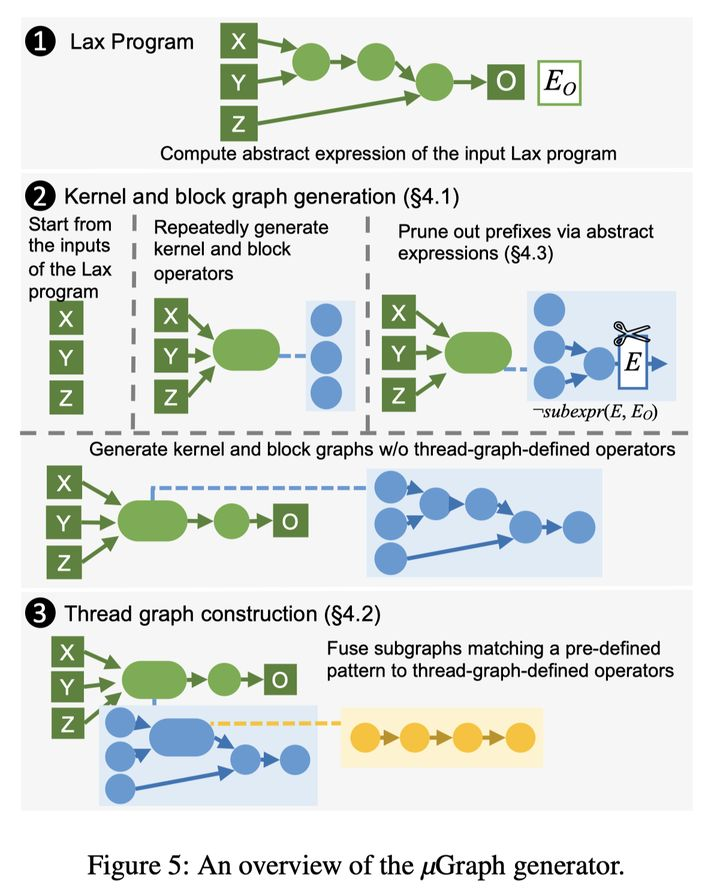

# Mirage: A Multi-Level Superoptimizer for Tensor Programs

> Mengdi Wu, Xinhao Cheng, Shengyu Liu, Chunan Shi, Jianan Ji, Kit Ao, Praveen Velliengiri, Xupeng Miao, Oded Padon, Zhihao Jia

---

> **本 note 由 AI Agent 自动生成**（Hermes Agent / Nous Research），基于论文全文阅读。生成时间：2025 年。内容仅供参考，建议结合原文阅读。

---

## 一句话总结

Mirage 是首个针对张量程序的多层级超优化器，通过统一表示 GPU 计算层级（内核、线程块、线程）的 µGraph 表示，自动发现并验证结合代数变换、调度变换和新自定义内核的高级优化，在广泛使用的 DNN 基准上比现有方法快最高 3.3 倍。

---

## 摘要翻译

我们介绍了 Mirage，首个用于张量程序的多层级超优化器。Mirage 的核心思想是 µGraphs——一种在 GPU 计算层级的内核、线程块和线程级别统一表示张量程序的层级图结构。µGraphs 使 Mirage 能够发现结合代数变换、调度变换和生成新自定义内核的新型优化。为了高效导航庞大的搜索空间，Mirage 引入了一种基于抽象的剪枝技术，显著减少了搜索空间并提供了一定的最优性保证。为了确保优化后的 µGraph 与输入程序等价，Mirage 引入了一种具有强理论保证的概率等价验证方法。我们的评估表明，即使对于已被广泛使用和重度优化的 DNN，Mirage 仍然比现有方法快高达 3.3 倍。Mirage 已在 https://github.com/mirage-project/mirage 开源。

---

## 研究动机

1. **现有方法的局限性**：当前 DNN 框架（如 PyTorch、TensorFlow）使用手动设计的规则将张量程序映射到 GPU 内核，需要大量工程努力，且可能错过优化机会。
2. **两类自动化方法的不足**：
   - **调度优化方法**（如 Halide、TVM、Ansor）：固定算法，只搜索执行策略，但 DNN 线性代数特性允许大量数学等价的算法表示，现有调度优化器只考虑用户手动指定的算法。
   - **代数变换方法**（如 TASO、Grappler、Tensat、PET）：在算法级别进行代数变换，但受限于预定义内核集合的性能。
3. **多层级联合优化的缺失**：所有现有自动化方法都需要程序员手动指定内核集合，无法发现需要跨内核、线程块和线程级别联合变换的高级优化（如 FlashAttention），这些优化必须手动实现。
4. **FlashAttention 的启示**：FlashAttention 需要同时进行代数变换（算法级别重排序）、调度变换（适配 GPU 架构的并行化策略）和新内核生成（跨 GPU 内核重组计算），这些变换无法被现有框架自动发现，Triton 实现需超过 700 行代码。

---

## 方法（技术细节）

### 1. 多层级图表示：µGraph

µGraph 是一种层级图表示，在 GPU 计算层级的多个级别指定张量程序的执行，包括：

- **内核图（Kernel Graph）**：每个节点表示一个在完整 GPU 上运行的内核，边表示内核之间共享的张量。节点可以是预定义内核操作（如 cuDNN 卷积、cuBLAS 矩阵乘法），也可以是图定义内核操作（由下层图定义语义和行为）。
- **块图（Block Graph）**：指定线程块内的计算，每个节点表示块级操作，边是块间共享的张量。中间张量存储在 GPU 共享内存中。每个块图关联：
  - **网格维度（Grid Dimensions）**：最多 3 维（x, y, z），指定块的数量。
  - **输入映射（imap）**：指定输入张量如何划分到各个块。
  - **输出映射（omap）**：指定所有块的输出如何拼接为最终输出。
  - **For 循环体**：包含输入迭代器、for 循环累加器和中间操作符，通过 fmap 指定每次迭代加载的输入部分。
- **线程图（Thread Graph）**：进一步将计算范围从块缩减到单个线程，包含输入迭代器（从共享内存加载到寄存器文件）、输出保存器和预定义线程操作符。

### 2. 表达式引导的 µGraph 生成器

- **混合生成策略**：在内核和块级别穷举搜索所有可能的图（直到一定规模），在级别使用基于规则的策略构建线程图。这是因为访问设备内存和共享内存的开销比访问寄存器文件高出数个数量级。
- **增量生成**：维护 µGraph 的前缀，迭代地用新操作符扩展。
- **规范形式**：定义 µGraph 的规范形式（按拓扑排序和秩），确保相同的 µGraph 只生成一次。
- **基于抽象表达式的剪枝**：
  - **抽象表达式**：将 µGraph 中的函数抽象为一阶逻辑项（忽略同一输入张量不同元素的差异），表征计算的数学结构。
  - **子表达式剪枝**：如果一个 µGraph 前缀的抽象表达式不是输入程序抽象表达式的子表达式，则剪枝。
  - **理论保证（定理 1）**：对于等价的 µGraph，如果其抽象表达式在等价公理下等价，则该 µGraph 会被生成（不会被误剪枝）。
  - **SMT 求解器**：使用 Z3 求解器检查抽象表达式的子表达式关系，结果缓存复用。

### 3. 概率等价验证器

- **核心思想**：在两个有限域上对输入和输出进行随机测试，以概率方式验证 µGraph 的等价性。
- **理论基础（定理 2）**：将多项式恒等测试（PIT）推广到 LAX µGraph（包含多线性算子、除法和有限指数运算），利用两个有限域 Zp 和 Zq 进行验证。
- **关键保证（定理 3）**：等价的 µGraph 总是通过验证；对于非等价的 µGraph，通过足够多的随机测试，错误接受的概率可以任意低。
- **数值稳定性**：通过浮点测试过滤有显著数值误差的 µGraph。
- **LAX 分段**：将输入张量程序分割为受限的 LAX 分段（包含多线性算子、除法和有限指数），减少搜索空间同时保留大部分优化机会。

### 4. µGraph 优化器

在验证后进行三项后验证优化：

- **张量布局优化**：将布局选择形式化为约束优化问题，使用整数线性规划（ILP）求解器（Z3）找到最优布局策略。
- **操作符调度**：通过动态规划计算每个节点的深度，按深度升序调度操作符，最小化线程块内的同步次数。
- **内存规划**：将内存偏移确定形式化为动态存储分配问题，穷举枚举所有可能的分配计划。

---

## 实验结果

### 实验设置

- **硬件**：NVIDIA A100 和 H100 GPU（40GB 内存）
- **基准**：6 个 DNN 基准（GQA、QKNorm、RMSNorm、LoRA、GatedMLP、nTrans）
- **基线**：TASO/PET、PyTorch（含 FlashAttention）、TensorRT、TensorRT-LLM、FlashAttention、FlashDecoding、Triton
- **数据精度**：半精度浮点
- **重复次数**：每个实验重复 1000 次，报告平均运行时间

### 关键结果

- **整体性能**：在所有基准上，Mirage 比最佳现有方法快高达 3.3 倍。
- **各基准详情**：
  - **GQA（分组查询注意力）**：比 FlashAttention/FlashDecoding 快高达 2.2 倍。优化来自自动搜索最优网格维度（充分利用 SM）和选择最高效的并行化策略（减少设备内存访问高达 7 倍）。
  - **QKNorm**：将 QK 归一化和注意力计算融合到一个自定义内核中，减少内核执行时间高达 1.4 倍。
  - **RMSNorm**：自动发现将 RMSNorm 和 MatMul 融合到单个内核的 µGraph，比手写内核快 1.5-1.9 倍。
  - **LoRA**：将三个 MatMul 和 Add 融合到单个内核，执行成本降低 1.1-2.4 倍。
  - **GatedMLP**：A100 上快 1.5 倍，H100 上快 2.7-3.3 倍。
  - **nTrans**：自动发现融合计算到单个内核的 µGraph，但比 TensorRT 慢（内存传输开销主导轻量计算内核）。

### 端到端性能

- 在 Chameleon-7B、LLaMA-3-8B、GPT-3-7B-LoRA、nGPT-1B 上，Mirage 生成的内核将端到端推理延迟降低 0.9-1.9 倍。

### 搜索时间

- 最多 4 小时优化一个 LAX 程序（一次性成本）。
- 多线程显著减少搜索时间；抽象表达式剪枝对可扩展性至关重要（禁用后搜索时间从 11 秒增加到超过 10 小时）。

### 消融实验

- 禁用线程图构建、布局优化、操作符调度或内存规划中任一优化，性能下降 5%-70%。

---

## 优势

1. **统一的多层级表示**：µGraph 在内核、线程块和线程级别统一表示张量程序，能够同时捕捉代数变换和调度变换。
2. **自动发现新内核**：能够自动生成超越现有预定义内核的自定义内核（如 FlashAttention 的自动发现和超越）。
3. **理论保证的剪枝**：基于抽象表达式的剪枝提供最优性保证（在等价公理下），显著减少搜索空间。
4. **概率等价验证**：利用有限域上的随机测试，提供强理论保证的等价验证（错误概率可任意低）。
5. **显著性能提升**：即使对于已被重度优化的 DNN（如 GQA），仍能实现最高 3.3 倍加速。
6. **即插即用**：生成的内核可直接集成到 PyTorch 程序中，仅需少量代码修改。
7. **开源可用**：代码已开源，支持 PyTorch 集成和 JIT 编译部署。

---

## 局限

1. **搜索空间限制**：当前实现限制内核图中最多 5 个操作符、块图中最多 11 个操作符，可能错过更大规模的优化。
2. **计算密集型搜索**：搜索时间可达 4 小时，虽然是一次性成本，但对于频繁变更的模型可能不实用。
3. **LAX 分段限制**：概率等价验证器仅支持 LAX 程序（多线性算子、除法、有限指数），不支持 ReLU 等非 LAX 算子（需要基于求解器的验证器，需额外手动指定属性）。
4. **轻量计算内核的开销**：对于计算量小的内核（如 nTrans），从全局内存到共享内存的数据传输开销可能主导运行时间。
5. **抽象表达式的权衡**：抽象表达式剪枝在最优性和剪枝效率之间存在权衡，不包含消去规则（如 div(mul(x,y),y)=y），可能错过某些等价 µGraph。
6. **有限域验证的数值稳定性**：虽然通过浮点测试过滤数值误差，但理论保证基于有限域，与实际浮点运算可能存在差异。
7. **扩展性**：支持新算子需要提供浮点实现、模运算实现和抽象表达式公理扩展，有一定工程成本。
8. **并行化策略**：当前实现依赖单 GPU，GQA 评估使用 4 GPU 张量模型并行，但未扩展到更复杂的多 GPU 场景。

---

## 与 EfficientPaper 相关的研究方向

1. **张量程序优化**：与 EfficientPaper 中关注的部署效率直接相关，Mirage 展示了自动优化张量程序的巨大潜力。
2. **GPU 内核融合**：Mirage 的多层级融合技术（内核、线程块、线程级别）可应用于 EfficientPaper 中的内核融合研究。
3. **超优化与自动化**：Mirage 的超优化框架为 EfficientPaper 中的自动化优化工具研究提供了新思路，特别是基于抽象的剪枝技术和概率等价验证。
4. **LLM 推理优化**：Mirage 在 GQA、RMSNorm、LoRA、GatedMLP 等 LLM 关键组件上的优化成果，对 EfficientPaper 中的 LLM 推理效率研究有重要参考价值。
5. **编译器与运行时优化**：Mirage 的 JIT 编译和部署能力与 EfficientPaper 中的编译器优化研究方向一致。
6. **搜索空间管理**：Mirage 的表达式引导剪枝和多线程搜索技术，可为 EfficientPaper 中的搜索空间管理研究提供参考。
7. **等价验证与正确性保证**：Mirage 的概率等价验证方法（有限域上的 PIT）为 EfficientPaper 中的程序验证和正确性保证研究提供了新工具。
8. **FlashAttention 等手动优化内核的自动化替代**：Mirage 证明了可以自动发现甚至超越 FlashAttention 等手动优化的内核，这对 EfficientPaper 中的高效内核设计研究有启发意义。

---

*本 note 由 AI Agent 自动生成，内容基于论文原文。如有不准确之处，请以原文为准。*
