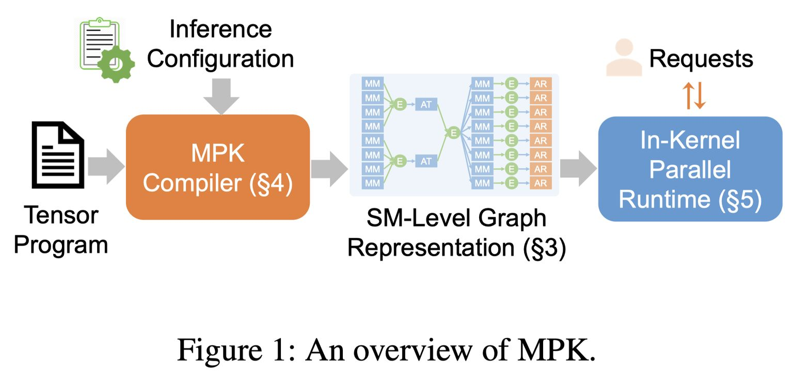

# Mirage Persistent Kernel: A Compiler and Runtime for Mega-Kernelizing Tensor Programs

> Xinhao Cheng, Zhihao Zhang, Yu Zhou, Jianan Ji, Jinchen Jiang, Zepeng Zhao, Ziruo Xiao, Zihao Ye, Yingyi Huang, Ruihang Lai, Hongyi Jin, Bohan Hou, Mengdi Wu, Yixin Dong, Anthony Yip, Zihao Ye, Songting Wang, Wenqin Yang, Xupeng Miao, Tianqi Chen, Zhihao Jia

---

## 一句话总结

MPK 是首个将多 GPU 模型推理自动转化为单个高性能 mega-kernel 的编译器和运行时系统，通过引入 SM 级别的图表示和内核并行运行时，实现了跨算子软件流水线、细粒度计算-通信重叠等此前不可行的优化，在 LLM 推理延迟上最高降低 1.7×。

---

## 摘要翻译

我们引入 Mirage Persistent Kernel (MPK)，这是第一个自动将多 GPU 模型推理转化为单个高性能 mega-kernel 的编译器和运行时系统。MPK 引入了一种 SM 级别的图表示，以单个流式多处理器（SM）的粒度捕获数据依赖，从而实现跨算子软件流水线、细粒度内核重叠以及其他以前不可行的 GPU 优化。MPK 编译器将张量程序降级为高度优化的 SM 级别任务图，并为所有任务生成优化的 CUDA 实现；MPK 内核内并行运行时使用跨 SM 的去中心化调度在单个 mega-kernel 内执行这些任务。这些组件共同提供了端到端的内核融合，只需极少的开发人员工作量，同时保持了现有编程模型的灵活性。我们的评估表明，MPK 显著优于现有的 kernel-per-operator LLM 服务系统，将端到端推理延迟降低了最高 1.7×，将 LLM 推理性能推近硬件极限。MPK 公开发布于 https://github.com/mirage-project/mirage。

---

## 研究动机

### 核心问题

现代 ML 系统通常采用 kernel-per-operator 的执行模式，即每个算子（如矩阵乘法）使用独立的 GPU 内核执行。这种模式存在三个关键限制：

1. **内核屏障限制了跨算子软件流水线**：GPU 在同一 stream 上连续启动内核时会隐式插入内核屏障，强制所有前一个内核的线程完成才能开始下一个内核。这阻止了跨算子的软件流水线，导致依赖算子必须严格顺序执行。虽然 NVIDIA 引入了程序化依赖启动（PDL），但采用 PDL 需要大量工程努力。

2. **阻止细粒度计算-通信重叠**：依赖关系仅以粗粒度的算子粒度捕获，运行时必须在依赖通信或计算启动前等待整个算子完成。例如，当矩阵乘法后跟 AllReduce 时，AllReduce 必须等待整个乘法完成，即使每个 AllReduce 片段仅依赖乘法的子集。

3. **内核启动开销**：每次推理迭代需要启动数百到数千个内核。虽然 CUDA Graph 可以缓解此问题，但 CUDA Graph 是静态的，对控制流、张量形状或数据依赖的任何变化都需要重新实例化或修改。

### 解决思路

一个有前景的方法是将所有计算和通信融合到一个 mega-kernel（也称为持久内核）中。系统启动一个 GPU 内核来执行整个模型，从层间计算到 GPU 间通信，无需中断。但现有 ML 系统（PyTorch、Triton、TVM 等）不支持端到端 mega-kernel 生成，且依赖碎片化的专用库生态系统，使得统一整个推理管线到单个内核变得困难。

---

## 方法（技术细节）

### 1. SM 级别的图表示（tGraph）

MPK 的核心创新是引入 **tGraph**（SM-level task graph），以单个流式多处理器（SM）的粒度表示计算和 GPU 间通信：

- **节点**：表示在单个 SM 上执行的任务（计算或通信）或事件（同步点）
- **任务**：蓝色或橙色矩形，表示在单个 SM 上执行的计算或通信单元
- **事件**：绿色圆圈，表示跨任务的同步
- **结构**：任务和事件交替出现，每个任务只有到触发事件的出边和从依赖事件的入边
- **触发条件**：当任务的所有依赖事件都被激活时，任务就绪；任务完成时通知其触发事件

**优势**：相比传统计算图，tGraph 以更细粒度捕获依赖关系。例如，AllReduce 的每个任务仅依赖对应的 MatMul 任务，而非整个 MatMul 内核，从而实现计算与通信的并行。

**与 CUDA Graph 的比较**：tGraph 可以视为 CUDA Graph 的低级扩展。CUDA Graph 仅在内核级别捕获依赖，而 tGraph 在 SM 级任务和子内核事件级别操作，显式建模算子内和跨算子依赖，支持跨 SM 的细粒度同步。

### 2. MPK 编译器

MPK 编译器将张量程序和推理配置作为输入，自动生成高度优化的 tGraph。主要步骤：

#### 2.1 tGraph 生成

**算子分解**：将输入计算图中的每个算子分解为一组任务，通过划分输出张量使所有任务计算不相交的输出子集，可在不同 SM 上并行执行。MPK 选择最小化从设备内存到共享内存数据加载的划分策略，因为访问设备内存比共享内存或 CUDA/Tensor Core 计算更昂贵。

**依赖分析**：使用事件捕获任务间依赖。对于共享张量的两个算子，枚举所有任务对，仅在 t1 的输出区域与 t2 的输入区域重叠时引入事件。

**事件融合**：两种互补形式：
- **后继集融合（Successor-set fusion）**：合并具有相同消费者任务集的事件
- **前驱集融合（Predecessor-set fusion）**：合并依赖相同生产者任务集的事件

#### 2.2 tGraph 规范化

将输入 tGraph 转换为功能等价的形式，使每个任务最多有一个依赖事件和一个触发事件。通过引入新的事件和空任务来降低每个任务的最大扇入和扇出。在实际评估中，规范化开销始终低于 1%。

#### 2.3 tGraph 线性化

使用 BFS 算法线性化 tGraph，确保同一事件触发的所有任务在最终任务排序中具有连续索引。这样，事件的扇出可以用首尾任务索引紧凑编码，无需存储显式任务列表。每个任务仅记录其依赖和触发事件的索引，每个事件存储激活所需的触发数。

#### 2.4 任务实现生成

MPK 利用编译器超优化技术自动生成每个任务的高性能实现。以线程块级别进行超优化，每个计算任务关联一个参考 PyTorch 实现，利用 Mirage 超优化器自动搜索最优线程块图，生成包含软件流水线、寄存器重用和布局优化的 CUDA 实现。

### 3. 内核内并行运行时

MPK 使用内核内并行运行时，在单个 mega-kernel 内跨所有 SM 执行 tGraph，消除内核启动开销并实现细粒度控制。

**Worker-Scheduler 架构**：
- **Worker**：运行在单个物理 SM 上，维护独立任务队列，执行轻量循环：出队任务→执行→通知触发事件
- **Scheduler**：以 warp 粒度组织，每个 SM 托管 4 个 scheduler warp，维护事件队列，轮询新激活事件并调度任务到 worker
- 分配在内核启动时固定，匹配 GPU 物理 SM 数，避免内核内动态角色切换开销

#### 3.1 事件驱动执行

tGraph 从指定的起始事件开始，scheduler 出队事件后启动所有依赖任务。任务完成后通知触发事件。事件在其所有前提条件完成并集体触发所需次数后被激活，然后被入队到 scheduler 的事件队列。

#### 3.2 混合任务启动

- **JIT（Just-in-time）模式**：仅在依赖事件完全激活后才将任务分配给 worker，适合执行时间数据相关的工作负载（如注意力操作），可适应负载不均衡
- **AOT（Ahead-of-time）模式**：在依赖事件激活前预入队任务，减少 worker-scheduler 通信，降低每任务启动延迟
- **混合策略**：编译器根据算子执行时间是否数据相关分类为 JIT 或 AOT。数据相关的算子（如注意力）标记为 JIT，后续算子保持 JIT 直到遇到全局屏障，之后标记为 AOT。Worker 维护两个队列（JIT 和 AOT），优先处理 JIT 任务。

#### 3.3 运行时优化

**分页共享内存抽象**：将共享内存分为多个固定大小的页，任务按需获取和释放页，实现跨任务的细粒度软件流水线。

**跨任务软件流水线**：每个任务分解为预加载阶段和计算阶段。当当前任务 T1 已发出所有数据传输指令且共享内存页足够时，机会性地重叠 T1 的计算阶段与后续任务 T2 的预加载阶段。

**任务描述预取**：将即将到来的任务描述预取到共享内存中，减少入队/出队延迟并隐藏设备内存访问成本。

### 4. 针对 LLM 推理的扩展

- 支持连续批处理（continuous batching）和分页注意力（paged attention）
- 为不同批量大小生成多个特化 tGraph，运行时根据当前批量大小选择
- 页面分配和请求调度直接在 mega-kernel 内执行，消除 CPU-GPU 同步开销

### 5. MoE 模型优化

**混合工作负载均衡器**：编译时静态分区，运行时根据元张量（包含已激活专家数和每个专家的 token 数）动态细化工作负载分配。

**融合 gather-GEMM**：用异步 token 级拷贝替代基于 TMA 的 gather，直接集成到 GEMM 任务的数据加载阶段，消除独立 gather 内核和额外调度点。

---

## 实验结果

### 实验设置
- **模型**：5 个广泛部署的 LLM（Qwen3-0.6B、Llama-3.2-1B-Instruct、Qwen3-1.7B、Qwen3-8B、Qwen3-30B-A3B）
- **硬件**：3 代 NVIDIA GPU（A100、H100、B200）
- **基线**：PyTorch + torch.compile、vLLM、SGLang
- **精度**：bfloat16
- **方法**：离线批推理，固定提示长度 64，解码 1024 token

### 单 GPU 结果
- MPK 在所有模型和硬件上相比最佳基线系统（SGLang 或 vLLM）提升 **1.0–1.7×**
- 小模型和新一代 GPU 上改进最显著
- 例如，在 A100 上的 Qwen3-8B，MPK 将每 token 解码延迟从 14.5 ms 降低到 12.5 ms，接近理论下限（约 10 ms）
- 相比原生 PyTorch 超过 **10×** 加速

### 多 GPU 结果
- 在 2/4/8 个 H100 GPU 上使用张量并行
- 相比 PyTorch 提高达 **10×** 加速
- 相比 SGLang/vLLM 实现 **1.1–1.4×** 加速（8 GPU）

### MoE 优化结果
- 混合工作负载均衡器在所有批量大小上持续优于纯静态分区
- 融合 gather-GEMM 在 SGLang 实现基础上实现一致加速

### 消融实验
- **跨任务流水线**：任务运行时间降低 1.2–1.3×，甚至优于 cuBLAS 编译内核
- **计算-通信重叠**：每次迭代延迟降低 1.1×

---

## 优势

1. **端到端 mega-kernel 自动生成**：首次实现编译器驱动的自动 mega-kernel 生成，无需手动设计
2. **显著性能提升**：相比高度优化的 kernel-per-operator 系统（SGLang/vLLM）提升 1.0–1.7×，将推理延迟推近硬件极限
3. **易用性**：通过 PyTorch 的 `torch.compile(backend=MPK)` 接口，仅需几行代码变更即可编译 mega-kernel
4. **跨硬件泛化**：在 A100、H100、B200 三代 GPU 上均有效
5. **动态工作负载支持**：支持连续批处理、分页注意力等 LLM 服务需求
6. **SM 级细粒度表示**：tGraph 实现了跨算子软件流水线和细粒度计算-通信重叠等此前不可行的优化
7. **去中心化调度**：避免全局协调开销，实现高效并行
8. **MoE 支持**：混合工作负载均衡器和融合 gather-GEMM 优化动态工作负载
9. **模型无关**：编译器和运行时可支持任意 DNN 架构

---

## 局限

1. **代码规模庞大**：实现包含约 40K 行 C++、84K 行 CUDA 和 10K 行 Python，维护和调试复杂度高
2. **批处理大小特化**：为不同批量大小生成多个特化 tGraph，内存开销随批量大小增加
3. **编译时间**：mega-kernel 生成涉及超优化搜索，可能需要较长时间
4. **仅支持 NVIDIA GPU**：基于 CUDA 和 NVSHMEM，无法直接用于 AMD 或其他 GPU
5. **依赖设备内存同步**：共享内存的分页抽象可能引入额外开销
6. **调度策略限制**：当前使用去中心化调度，全局协调调度的性能权衡未充分探索
7. **tGraph 规范化开销**：虽然评估中低于 1%，但对高度并行（宽）的计算图可能更显著
8. **LLM 服务以外的泛化性未验证**：虽然声称模型无关，但主要评估集中在 LLM 服务场景
9. **编译器可扩展性**：对于非常大的模型或复杂架构，编译器的可扩展性和编译时间可能成为瓶颈

---

## 与 EfficientPaper 相关的研究方向

### 1. 内核融合与 Mega-Kernel 编译
- MPK 展示了从 kernel-per-operator 到 mega-kernel 的范式转变，是内核融合的极致形式
- 与 Mirage（前身）、TASO 等超优化器的工作密切相关
- 相关方向：自动内核融合、编译器优化、张量程序编译

### 2. GPU 调度与执行模型
- MPK 的去中心化 worker-scheduler 架构是 GPU 调度的创新
- 事件驱动执行模型与 CUDA Graph 有对比关系
- 相关方向：GPU 运行时优化、持久内核、任务调度

### 3. 通信-计算重叠
- MPK 实现了细粒度的计算-通信重叠，对分布式训练和推理有重要意义
- 与 NVSHMEM 和 NCCL 等通信库的集成
- 相关方向：集合通信优化、张量并行、流水线并行

### 4. LLM 推理系统
- MPK 在 LLM 推理中实现了接近硬件极限的性能
- 与 SGLang、vLLM 等推理系统的对比
- 相关方向：连续批处理、分页注意力、KV 缓存管理

### 5. MoE 模型优化
- MPK 的混合工作负载均衡器和融合 gather-GEMM 对 MoE 推理有显著优化
- 与 FlashDMoE 等手动 mega-kernel 方案对比
- 相关方向：MoE 负载均衡、动态路由、GPU 资源分配

### 6. 程序依赖启动（PDL）
- NVIDIA PDL 是 MPK 的竞品技术，但 MPK 通过编译器自动实现类似功能
- 相关方向：GPU 同步机制、内核间重叠

---

## 论文信息

- **标题**：Mirage Persistent Kernel: A Compiler and Runtime for Mega-Kernelizing Tensor Programs
- **简称**：MPK
- **发表**：arXiv, 2025 (arXiv:2512.22219v1)
- **作者**：Xinhao Cheng, Zhihao Zhang, Yu Zhou, Jianan Ji, Jinchen Jiang, Zepeng Zhao, Ziruo Xiao, Zihao Ye, Yingyi Huang, Ruihang Lai, Hongyi Jin, Bohan Hou, Mengdi Wu, Yixin Dong, Anthony Yip, Zihao Ye, Songting Wang, Wenqin Yang, Xupeng Miao, Tianqi Chen, Zhihao Jia
- **机构**：Carnegie Mellon University, Tsinghua University, NVIDIA, University of Michigan, Purdue University
- **代码**：https://github.com/mirage-project/mirage
- **关键词**：overlap, deployment, tool
- **基线方法**：2025/MPK-Mirage, 2023/sms

---

> **生成声明**：本 note 由 AI Agent（Hermes Agent）自动生成，基于论文全文的结构化阅读和分析。生成时间：2026年6月4日。
