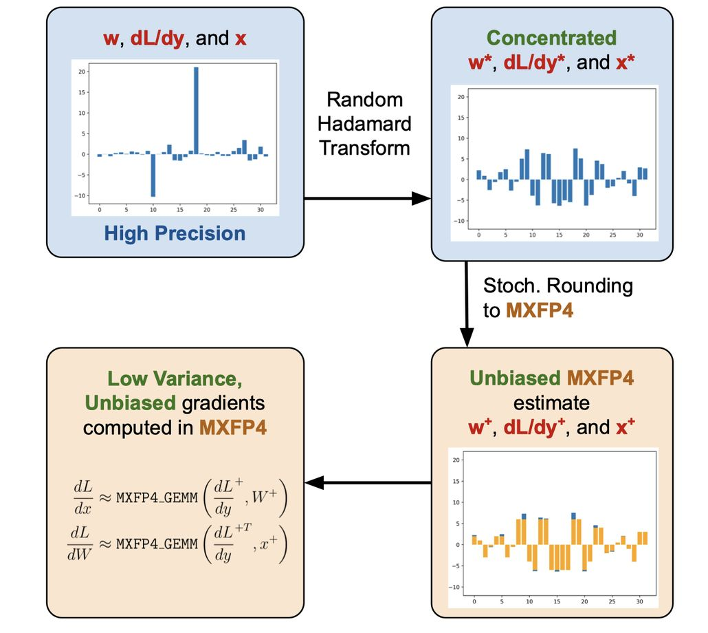

# Training LLMs with MXFP4

> Albert Tseng, Tao Yu, Youngsuk Park
>
> Cornell University, AWS AI

> **注意：本 note 由 AI Agent 自动生成，仅供学习参考。生成时间：2025 年。**

---

## 一句话总结

本文提出首个基于 MXFP4（4-bit Microscaling 浮点）的近无损 LLM 训练方案，通过随机舍入（SR）和随机 Hadamard 变换（RHT）实现无偏低方差梯度估计，使反向传播中超过一半的计算 FLOPs 在 MXFP4 精度下完成，从而在支持硬件上实现超过 1.3×（相对于 FP8）和 1.7×（相对于 BF16）的加速，且模型质量与 BF16 混合精度训练几乎无损。

---

## 摘要翻译

低精度（LP）数据类型（如 MXFP4）可以加速矩阵乘法（GEMM）并降低训练成本。然而，在训练中直接使用 MXFP4 替代 BF16 会显著降低模型质量。本文提出首个近无损的 MXFP4 训练方案，该方案使用的 MXFP4 GEMM 在支持的硬件上比 FP8 快 2×。我们的核心洞察是利用随机舍入（SR）计算无偏梯度估计，从而实现更准确的模型更新。然而，直接对 MXFP4 使用 SR 可能由于块级离群值导致高方差，影响收敛。为此，我们使用随机 Hadamard 变换（RHT）从理论上约束 SR 的方差。我们在最大 6.7B 参数的 GPT 模型上进行训练，发现我们的方法相对于混合精度 BF16 训练仅产生极小的性能下降。我们的方案在 MXFP4 中计算超过 1/2 的训练 FLOPs，使反向传播中实现相对于 FP8 超过 1.3× 和相对于 BF16 超过 1.7× 的加速。

---

## 研究动机

### 背景

现代大语言模型（LLM）参数规模已达数十亿甚至数千亿级别，训练成本极为高昂。例如，训练 Llama 3.1 405B 需要 $3 \times 10^{24}$ 次浮点运算，消耗超过 10000 个 GPU 运行数月。

### 低精度训练的挑战

- **BF16 混合精度**是当前主流方案，能将矩阵乘法成本减半，但进一步降低精度到 4-bit 会导致显著的量化失真和数值不稳定。
- **FP8** 是一种已有的低精度训练方案，但其加速比有限。
- **MXFP4**（Microscaling FP4）是一种 4-bit 浮点格式，通过组共享的缩放因子扩展可表示数值范围，硬件支持下可比 FP8 快 2×。但直接使用 MXFP4 训练会严重损害模型质量。
- 前人工作（如 Xi et al., 2023）使用非随机化的 Hadamard 变换在前向传播中使用 INT4 GEMM，但额外的开销限制了加速效果（仅约 30%）。
- 并发工作（Wang et al., 2025）使用 FP4 训练，但困惑度差距大于 0.5。

### 核心问题

如何在 4-bit 精度下实现近无损的 LLM 训练，同时保持显著的计算加速？

---

## 方法（技术细节）

### 1. 无偏 MXFP4 量化（Algorithm 2）

**问题**：标准 MXFP4 量化算法（Algorithm 1）存在偏差。原因在于 FP4 的最大可表示正常值为 6，而经过共享指数缩放后，最大值可能被截断到 6-8 之间，导致约 3% 的条目被裁剪。

**解决方案**：
1. **缩放因子 3/4**：对输入值乘以 3/4，防止截断
2. **随机舍入（SR）**：使用随机舍入代替最近舍入，产生无偏估计

具体而言：
- 将输入向量 $V$ 的每个元素乘以 3/4
- 使用随机舍入将缩放后的值量化为 FP4
- 结果是输入的 3/4 的无偏估计
- 由于 SR 使用独立噪声，GEMM 输出是 $(3/4)^2 = 9/16$ 的无偏估计
- 最终将高精度累加器输出乘以 16/9 即可得到无偏梯度

**引理 3.1**：Algorithm 2 产生输入的 3/4 的无偏 MXFP4 估计。Algorithm 3 结合 Algorithm 2 产生 $dL/dx$ 和 $dL/dW$ 的无偏估计。

### 2. 随机 Hadamard 变换（RHT）约束方差

**问题**：虽然 SR 产生无偏估计，但 LLM 的激活（x）和权重（W）存在离群值，梯度（$dL/dy$）也较稀疏。MXFP4 量化依赖组级统计（如最大幅度元素），含离群值的块会遭受高量化失真和 SR 方差。

**解决方案**：使用随机 Hadamard 变换（RHT）在量化前集中梯度、激活和权重，从理论上约束 SR 的方差。

**RHT 的数学性质**：
- RHT 执行 $x \leftarrow HSx$，其中 $H$ 是 Hadamard 矩阵，$S$ 是随机符号向量
- Hadamard 矩阵是递归定义的正交矩阵
- RHT 完全可逆：$(HSA)^T(HSB) = A^TB$
- RHT 变换后，向量元素服从次高斯分布，可以约束 GEMM 输出的方差

**定理 3.2**：无 RHT 时，SR GEMM 的方差为 $O(b\Delta^4 \|A\|_\infty \|B\|_\infty)$，其中 $b$ 为向量大小，$\Delta$ 为量化器中相邻可表示值的最大间隔。使用 RHT 后，方差降为 $O(\Delta^4 \|A\| \|B\| \log(2b/\epsilon))$，即从线性依赖变为对数依赖。

### 3. 块级 RHT（Blockwise RHT）

**问题**：
1. RHT 沿 batch 维度混合，在数据并行（如 FSDP/ZeRO-3）设置下需要昂贵的跨 GPU 通信
2. RHT 需要高精度运算，如果比 FP4 矩阵乘法更慢，则没有加速意义

**解决方案**：将 RHT 作为小块上的密集矩阵乘法执行（$g = 64$）：
- 运行时复杂度为 $O((b+m)ng)$
- IO 成本为 $O(bn + nm + bm)$
- 当 $g \leq 256$ 时，该块级 RHT 是内存绑定的（memory bound）
- 作为数据并行的 drop-in 替换方案，无需跨 GPU 通信

### 4. 完整的反向传播流程（Algorithm 3）

Algorithm 3 描述了使用 RHT 的 MXFP4 线性层反向传播：
1. 构造 Hadamard 矩阵 $H$ 和随机符号向量 $S$
2. 对梯度 $dL/dy$、权重 $W$、激活 $x$ 应用块级 RHT 变换
3. 执行 MXFP4 GEMM 计算 $dL/dx$ 和 $dL/dW$
4. 若使用 Algorithm 2（SR），将结果乘以 16/9

**设计原则**：
- 仅在反向传播中使用 MXFP4（前向传播保持 BF16/FP8）
- 反向传播占训练 FLOPs 的超过 1/2，因此仅改变反向传播即可显著加速
- 保持前向传播精度不降低模型的表示能力

---

## 实验结果

### 实验设置

- **模型**：GPT 345M、1.3B、6.7B
- **数据**：GPT2 Wikipedia 数据集
- **框架**：Megatron-LM
- **量化库**：Microsoft microxcaling（位精确模拟）
- **硬件**：AWS P4 和 G6e EC2 实例，NVIDIA A100/H100 GPU
- **前向传播**：BF16 混合精度（部分实验使用 FP8）
- **反向传播**：MXFP4 + RHT + SR
- **RHT 块大小**：$g = 64$
- **训练 token 数**：至少 200 亿

### 核心结果（Table 2）

| 模型 | Token 数 | 反向精度 | 训练损失 | 验证损失 |
|------|---------|---------|---------|---------|
| 345M | 33B | BF16 | 2.58 | 2.49 |
| 345M | 33B | MXFP4 | 2.73 | 2.60 |
| 345M | 33B | MXFP4+RHT | 2.60 | 2.51 |
| 345M | 33B | MXFP4+RHT+SR | 2.60 | 2.51 |
| 1.3B | 42B | BF16 | 2.28 | 2.32 |
| 1.3B | 42B | MXFP4+RHT+SR | 2.29 | 2.32 |
| 1.3B | 210B | BF16 | 2.06 | 2.29 |
| 1.3B | 210B | MXFP4+RHT+SR | 2.07 | 2.29 |
| 6.7B | 21B | BF16 | 2.04 | 2.27 |
| 6.7B | 21B | MXFP4+RHT+SR | 2.08 | 2.27 |

**关键发现**：
- **短训练（20-40B tokens）**：使用 RHT 或 SR 与 MXFP4 均可实现近无损训练
- **长训练（210B tokens）**：无偏梯度估计（SR）是必要的，仅使用 RHT 会有约 0.1 的困惑度差距，而使用 SR（有无 RHT）则无差距
- **纯 MXFP4（无 RHT 无 SR）**：在所有规模上均有显著退化，表明 4-bit 训练必须配合特殊技巧

### RHT 块大小消融（Table 4）

| 反向精度 | g=32 | g=64 | g=128 | g=256 | BF16 |
|---------|------|------|-------|-------|------|
| 验证 PPL | 12.02 | 12.01 | 11.98 | 11.98 | 11.89 |

增大 RHT 块大小可改善性能（减少 SR 方差），但 g=64 已足够。

### 下游任务评估（Table 3）

GPT 6.7B 模型（20B tokens 预训练）在多个下游任务上：
- BF16 和 MXFP4+RHT+SR 表现相似
- 经 Tulu V2 微调后两者表现仍相近
- 说明 MXFP4 训练的模型质量与 BF16 训练相当

### 吞吐量测试（Table 5）

在 NVIDIA A100 上测试 Llama 2 70B 解码器层：
- INT4+RHT 反向传播比 FP16 快约 70%
- 端到端比 FP16 快约 40%，比 INT8 快约 20%
- RHT 增加的端到端开销不到 5%（当 g ≤ 256 时）
- H100 上，RHT 对 7B 规模增加 9.7% 开销，对 70B 规模增加 1.6%

### SR 开销

- Amazon Trainium 芯片上，SR 量化从 FP32 到 BF16 的开销小于 2%
- 假设 FP4 到 BF16 有 4× 吞吐量提升，SR 开销小于 10%

---

## 优势

1. **近无损训练**：在 GPT 345M 到 6.7B 规模上，MXFP4+RHT+SR 方案与 BF16 混合精度训练的验证损失差距小于 0.1，几乎无损
2. **显著加速**：在支持硬件上，反向传播可实现超过 1.3×（FP8）和 1.7×（BF16）的加速
3. **理论保证**：提供了 SR 方差的理论界（定理 3.2），证明 RHT 从线性依赖降为对数依赖
4. **低开销**：RHT 块级实现（g=64）内存绑定，开销极小（端到端 < 5%）
5. **兼容性**：与 FP8 前向传播兼容，可进一步加速
6. **数据并行友好**：块级 RHT 无需跨 GPU 通信，可作为 FSDP/ZeRO-3 的 drop-in 替换
7. **首次方案**：首个实现近无损 MXFP4 训练的方案，填补了 MXFP4 在训练领域的空白

---

## 局限

1. **仅反向传播**：本文仅在反向传播中使用 MXFP4，前向传播仍保持 BF16/FP8
2. **硬件限制**：尚无 MXFP4 专用硬件，目前通过模拟实现，无法实测真正的壁钟时间加速
3. **模型规模**：仅验证到 6.7B 参数，未扩展到百亿/千亿级模型
4. **通用性**：仅在 GPT 架构上验证，未涉及视觉模型或其他架构
5. **量化库依赖**：依赖 Microsoft microxcaling 库进行位精确模拟
6. **训练数据**：仅在 GPT2 Wikipedia 数据集上实验，未在更大规模数据集上验证
7. **与 FP4 前向传播的结合**：未探讨同时使用 MXFP4 进行前向和反向传播的完整方案

---

## 与 EfficientPaper 相关的研究方向

本论文属于 **量化训练**（Quantized Training）和 **高效 LLM 训练**（Efficient LLM Training）领域，与以下研究方向密切相关：

1. **低精度训练**（Low-Precision Training）
   - 与 FP8 训练（Peng et al., 2023）、FP16 混合精度训练（Micikevicius et al., 2018）密切相关
   - 进一步推进到 4-bit 训练领域

2. **随机舍入**（Stochastic Rounding）
   - 与量化中的舍入策略相关（Croci et al., 2022）
   - 在模型更新中的应用（Yu et al., 2024）

3. **Hadamard 变换**（Hadamard Transform）
   - 与 QuIP#（Tseng et al., 2024a）中的 Hadamard 非相干性处理相关
   - 与 INT4 训练中的 Hadamard 变换（Xi et al., 2023）相关

4. **Microscaling 格式**（MX Formats）
   - 与 OCP MX 格式规范（Project, 2023）相关
   - 与 MXFP4 推理（Rouhani et al., 2023; NVIDIA, 2024b）相关

5. **硬件-软件协同设计**（Hardware-Software Co-Design）
   - 与 NVIDIA Blackwell 架构（NVIDIA, 2024a）相关
   - 与 Amazon Trainium 架构相关

6. **LLM 预训练优化**（LLM Pre-training Optimization）
   - 与 Megatron-LM（Shoeybi et al., 2020）相关
   - 与 ZeRO/FSDP 等分布式训练框架相关

7. **Scaling Laws for Precision**（Kumar et al., 2025）
   - 探讨精度与模型性能的关系

8. **并发工作**：Wang et al. (2025) 使用 FP4 训练 LLM，但使用不同的可微梯度估计器和离群值高精度保留方案，困惑度差距大于 0.5

---

## 代码

- **代码仓库**：https://github.com/amazon-science/mxfp4-llm
- **框架**：PyTorch

## 论文链接

- **arXiv**：http://arxiv.org/abs/2502.20586v2
- **会议**：AISTATS 2025
- **关键词**：quantization, efficient_training
