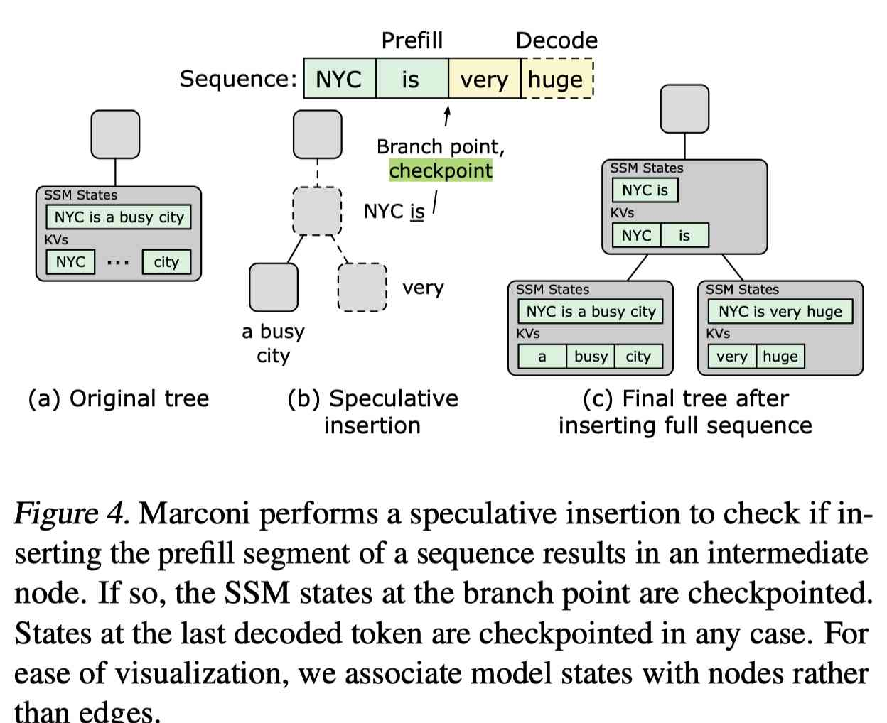

# Marconi: Prefix Caching for the Era of Hybrid LLMs

> Rui Pan, Zhuang Wang, Zhen Jia, Can Karakus, Luca Zancato, Tri Dao, Yida Wang, Ravi Netravali

---

> **⚠️ 生成声明**：本 note 由 AI Agent（Hermes Agent）自动生成，基于论文原文内容整理。生成时间：2026-06-04。内容为中文，所有技术细节均来自论文原文。

---

## 一句话总结

**Marconi 是首个为混合型 LLM（结合 Attention 层与 SSM 层）设计的前缀缓存系统，通过精细的缓存准入策略和 FLOP 感知的淘汰策略，在多种工作负载下实现了最高 34.4 倍的 token 命中率提升和 71.1%（617ms）的 TTFT 降低。**

---

## 摘要翻译

结合 Attention 层语言建模能力与循环层（如状态空间模型）效率的混合模型，在大语言模型服务中对长上下文支持方面取得了显著进展。然而，这些模型的独特特性使得前缀缓存等互补效率优化的使用变得复杂。最显著的是，循环层的原地状态更新不允许回滚缓存条目以处理部分序列重叠，而是要求精确匹配的缓存命中；其结果是每个序列产生大量（大型）缓存条目，其中大部分复用机会有限。我们提出了 Marconi，这是第一个支持混合 LLM 高效前缀缓存的系统。Marconi 的关键是其新颖的准入和淘汰策略，不仅基于最近性，还基于（1）不同命中场景分类下的复用可能性预测，以及（2）命中带来的计算节省与内存占用的相对关系，来更审慎地评估潜在缓存条目。在多样化的工作负载和混合模型中，Marconi 实现了最高 34.4 倍的 token 命中率提升（71.1% 或 617ms 更低的 TTFT），相比最先进的前缀缓存系统。

---

## 研究动机

### 1. 背景：混合 LLM 的兴起

随着大语言模型（LLM）应用场景的扩展，包括聊天机器人、AI 搜索、编程助手等，对更长上下文窗口的需求日益增长。传统的 Transformer 模型虽然通过注意力机制（Attention）实现了强大的语言建模能力，但其二次方计算复杂度和线性增长的 KV 缓存内存占用使其在长上下文服务中效率低下。

状态空间模型（SSM）如 Mamba 通过选择性压缩历史信息为紧凑的循环表示，实现了线性计算复杂度和固定内存占用。但纯 SSM 模型在需要强召回和上下文学习能力的任务上表现不如 Transformer。因此，混合模型（Hybrid LLMs）应运而生，将 SSM 层与少量 Attention 层混合（通常每 6-10 个 SSM 层配 1 个 Attention 层），以兼顾效率与能力。

### 2. 核心问题：前缀缓存在混合模型中的挑战

前缀缓存（Prefix Caching）通过缓存和复用模型内部状态来跳过冗余计算，是提升 LLM 推理效率的重要优化。然而，混合模型的 SSM 层特性使前缀缓存面临两个核心挑战：

**挑战一：SSM 状态的"全有或全无"复用特性**

SSM 层的状态是原地更新的，无法回滚到代表前缀的状态。这意味着：
- 要复用前缀，需要精确匹配所有前缀 token 的 SSM 状态
- 如果未来请求只使用序列的前缀（如 token 1...p，p < q），无法复用代表 1...q 的 SSM 状态
- 为最大化复用机会，需要频繁检查点（如每 256 个 token），但大量检查点条目复用率极低（图 3a 显示 SSM 状态复用率仅 0.4%，比 KV 的 25.0% 低 65.3 倍）

**挑战二：高内存使用**

细粒度检查点导致大量 SSM 状态被缓存，由于 SSM 状态尺寸固定且远大于单个 token 的 KV（10-100 倍），一个 7B 模型的 10K token 序列消耗 17.4 GB 内存（图 3b），导致缓存抖动和低命中率。

---

## 方法（技术细节）

### 整体架构

Marconi 是第一个专门为混合模型设计的前缀缓存系统，支持任意层组成的模型（混合模型、纯 Transformer、纯 SSM）。其核心设计理念是**精细的缓存准入**和**FLOP 感知的淘汰**，以最大化缓存利用率并减少冗余计算。

### 4.1 缓存准入策略（Cache Admission）

Marconi 的核心洞察是：尽管无法预知未来请求，但可以通过潜在前缀复用场景的分类来估计每个 SSM 状态的复用潜力。

**前缀复用场景分类**

通过对多种真实世界数据集和请求轨迹的分析，Marconi 将被复用的前缀 token 组成分为两类：

1. **纯输入（Purely Input）**：前缀是之前输入序列的一部分，如系统提示、指令、few-shot 示例等。这类前缀通常在多个请求间共享。

2. **输入和输出（Input and Output）**：前缀由之前的输入和输出 token 组成，如聊天机器人的对话历史、LLM Agent 的环境交互历史等。对话通常从最后解码的 token 继续，而非中间分支点。

**Radix Tree 数据结构**

Marconi 使用 Radix Tree（基数树）来记录请求历史、识别公共前缀，并将序列映射到其状态。每个边关联所代表 token 的 KV 和之前 token 的 SSM 状态。节点代表序列中的分支点：
- 有多个子节点的节点表示"纯输入"前缀
- 有 ≤1 个子节点的节点可能表示"输入和输出"前缀

**精细准入机制**

- 对于"输入和输出"场景：Marconi 只缓存最后解码 token 的 SSM 状态（因为对话通常从这里继续）
- 对于"纯输入"场景：在预填充每个序列之前，Marconi 执行**推测性插入（Speculative Insertion）**来检查输入 token 是否会创建新的中间节点。如果是，则缓存前缀的状态
- 每个序列最多缓存两个 SSM 状态（分支点和最后解码 token），避免低效缓存条目

**SSM 状态获取方法**

Marconi 支持两种获取 SSM 状态的方法：
1. **分块状态传递**：对于支持分块状态传递的模型（如 Mamba2），可以物化并缓存倒数第二个 chunk 的状态
2. **两遍预填充**：对于不支持分块状态传递的模型（如 Mamba1），进行两遍预填充以获取精确的前缀状态

### 4.2 缓存淘汰策略（Cache Eviction）

Marconi 的另一个关键创新是 FLOP 感知的淘汰策略，解决 KV 和 SSM 状态在内存与计算节省之间的不同权衡。

**FLOP 效率指标**

提出新指标 FLOP 效率：

$$\text{FLOP efficiency} = \frac{\text{Total FLOPs across layers}}{\text{Memory consumption of all states}}$$

- KV 的大小与序列长度线性相关，因此其 FLOP 效率近似恒定
- SSM 状态大小固定，但随序列长度增加，FLOP 效率急剧上升（图 5）
- 7B 模型中，SSM 层的 FLOP 效率为 200L，Attention 层为 L + 8192

**效用分数**

Marconi 引入效用分数 S：

$$S(n) = \text{recency}(n) + \alpha \cdot \text{flop efficiency}(n)$$

其中：
- recency(n)：节点的最近访问时间
- flop efficiency(n)：节点的 FLOP 效率
- α：平衡系数

淘汰时，迭代移除效用分数最低的节点，直到有足够空间容纳新请求的状态。

**α 的自适应调优**

Marconi 通过观察工作负载并回溯设置最佳配置：
1. 启动时 α = 0（使用 LRU）
2. 第一次淘汰后进入引导期，继续使用 LRU 并记录请求级信息
3. 引导期包含 5-15 倍的首次淘汰前请求数
4. 异步执行网格搜索，在 CPU 核心上并行化，通常只需几秒
5. 采用使命中率最大化的 α 值

### 4.3 实现细节

1. **淘汰范围扩展**：所有有 ≤1 个子节点的节点都参与淘汰，不仅限于叶节点
2. **时间戳更新策略**：缓存命中时只更新访问节点的时间戳，不更新祖先节点的时间戳
3. **统一管理**：SSM 状态和 KV 在同一 radix tree 中统一管理，而非分离缓存空间

---

## 实验结果

### 实验设置

- **工作负载**：LMSys（长输出）、ShareGPT（短输出）、SWEBench（Agent 工作负载）
- **模型**：7B 混合模型（4 Attention + 24 SSM + 28 MLP 层），以及 Jamba-1.5-Mini（12B/52B）
- **基线**：vLLM+（扩展的 vLLM）、SGLang+（扩展的 SGLang）
- **硬件**：8× A100-40GB GPU，96 Intel Xeon CPU，1152GB DDR4 RAM
- **精度**：FP16

### 主要结果

| 指标 | vs vLLM+ | vs SGLang+ |
|------|----------|------------|
| Token 命中率提升 | 4.5-34.4× | 19.0-219.7% |
| P95 TTFT 降低 | 36.1-71.1%（103.3-617.0ms） | 17.2-24.7%（13.1-32.5ms） |

**按工作负载分析**：
- LMSys：命中率提升 4.5×，P95 TTFT 降低 36.9%（281.4ms）
- ShareGPT：命中率提升 7.3×，P95 TTFT 降低 73.2%（106.3ms）
- SWEBench：命中率提升 34.4×，P95 TTFT 降低 46.8%（617.0ms）

### FLOP 感知淘汰的精细分析

在 SWEBench 轨迹上：
- Marconi 的 token 命中率为 32.7%，SGLang+ 为 16.4%（提升 99.4%）
- 对于 >7K token 的长序列，Marconi 命中率提升高达 25.5%
- FLOP 节省提升 90.3%
- 对短序列（<7K token）命中率略降（最多 -3.0%），但 TTFT 影响极小（2.1ms）
- P50 TTFT 降低 13.4%（74.2ms），P95 TTFT 降低 22.0%（274.9ms）

### 微基准测试和消融研究

1. **缓存竞争**：在中等竞争下收益最大（51.5-68.3%），高/低竞争下收益较小
2. **层组成变化**：
   - Attention:SSM 比例从 1:2 到 1:8，Marconi 优势从 13.5% 增加到 2.6×
   - 纯 Transformer 时三系统性能相同
3. **SSM 状态维度**：从 16 增加到 128，Marconi 优势从 5.7× 增加到 35.4×
4. **请求到达模式**：会话到达率增加，命中率降低但 Marconi 相对优势增大（1.4× 到 1.6×）

---

## 优势

1. **首创性**：首个专门为混合 LLM 设计的前缀缓存系统，解决了 SSM 状态原地更新带来的缓存难题
2. **显著性能提升**：最高 34.4× 命中率提升，71.1% TTFT 降低，对实际部署有重要价值
3. **智能准入策略**：通过前缀复用场景分类和推测性插入，避免缓存低效条目
4. **FLOP 感知淘汰**：超越传统 LRU，将计算节省与内存占用权衡纳入淘汰决策
5. **自适应调优**：自动调整 α 参数，无需手动配置
6. **广泛适用性**：支持任意层组成的模型（混合、纯 Transformer、纯 SSM）
7. **与未来趋势一致**：在长上下文、高 SSM 层比例、大 SSM 状态维度下表现更优
8. **开源代码**：GitHub 仓库已公开，支持复现和扩展

---

## 局限

1. **首次复用延迟**：对于"纯输入"前缀，Marconi 在第二次出现时才缓存，牺牲了首次复用机会（但对多次共享的前缀影响可忽略）
2. **覆盖范围限制**：每个序列最多缓存两个 SSM 状态，限制了任意前缀的潜在复用
3. **引导期开销**：需要 5-15 倍首次淘汰前的请求数来调优 α，可能影响系统启动阶段性能
4. **仅支持 SSM/Attention 混合模型**：虽然理论上可扩展到其他循环层，但实验仅验证了 Mamba/SSM 架构
5. **未评估下游指标**：由于前缀复用是精确的，未评估 F1 等下游任务指标
6. **硬件依赖**：需要 GPU 和足够的内存来支持大型缓存（实验使用 8× A100-40GB）
7. **SSM 状态检查点开销**：两遍预填充方法会引入额外的预填充开销

---

## 与 EfficientPaper 相关的研究方向

1. **LLM 推理效率优化**：Marconi 通过缓存管理提升推理效率，是 LLM 部署效率研究的重要进展
2. **混合架构设计**：混合 LLM（Attention + SSM）是当前模型架构的主流趋势，Marconi 的缓存策略为其服务化提供关键支持
3. **长上下文处理**：随着上下文窗口扩大，前缀缓存的重要性日益凸显，Marconi 的技术路线对长上下文服务有直接指导意义
4. **缓存管理策略**：FLOP 感知淘汰策略为异构模型状态的缓存管理提供了新思路
5. **Agent 工作负载优化**：SWEBench 上的显著提升表明 Marconi 对 LLM Agent 的高效服务有重要价值
6. **系统级优化**：Marconi 是从系统层面（而非算法层面）提升 LLM 服务效率的典型案例
7. **混合模型推理系统**：未来可将 Marconi 的技术扩展到更多混合模型架构（如 RWKV、RetNet、xLSTM 等）

---

## 参考信息

- **论文链接**：http://arxiv.org/abs/2411.19379v3
- **代码仓库**：https://github.com/ruipeterpan/marconi
- **发表会议**：MLSys 2025
- **关键词**：deployment, prefix caching, hybrid LLM, SSM, attention, cache management, FLOP efficiency
