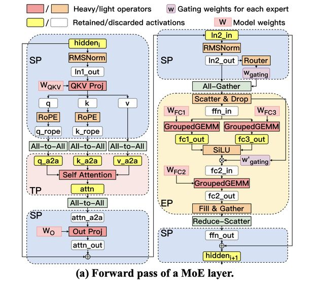

# MegaScale-MoE: Large-Scale Communication-Efficient Training of Mixture-of-Experts Models in Production

> Chao Jin, Ziheng Jiang, Zhihao Bai, Zheng Zhong, Juncai Liu, Xiang Li, Ningxin Zheng, Xi Wang, Cong Xie, Qi Huang, Wen Heng, Yiyuan Ma, Wenlei Bao, Size Zheng, Yanghua Peng, Haibin Lin, Xuanzhe Liu, Xin Jin, Xin Liu

## 一句话总结

MegaScale-MoE 是字节跳动 Seed 团队开发的大规模 MoE 模型训练生产系统，通过定制化通信高效并行策略（SP+EP）、多层级通信-计算重叠（操作符间与操作符内）以及通信压缩技术，在 1,440 个 NVIDIA Hopper GPU 上训练 352B MoE 模型时实现了 1.41M tokens/s 的训练吞吐量，相比 Megatron-LM 提升 **1.88×**。

## Abstract

We present MegaScale-MoE, a production system tailored for the efficient training of large-scale mixture-of-experts (MoE) models. MoE emerges as a promising architecture to scale large language models (LLMs) to unprecedented sizes, thereby enhancing model performance. However, existing MoE training systems experience a degradation in training efficiency, exacerbated by the escalating scale of MoE models and the continuous evolution of hardware. Recognizing the pivotal role of efficient communication in enhancing MoE training, MegaScale-MoE customizes communication-efficient parallelism strategies for attention and FFNs in each MoE layer and adopts a holistic approach to overlap communication with computation at both inter- and intra-operator levels. Additionally, MegaScale-MoE applies communication compression with adjusted communication patterns to lower precision, further improving training efficiency. When training a 352B MoE model on 1,440 NVIDIA Hopper GPUs, MegaScale-MoE achieves a training throughput of 1.41M tokens/s, improving the efficiency by 1.88× compared to Megatron-LM. We share our operational experience in accelerating MoE training and hope that by offering our insights in system design, this work will motivate future research in MoE systems.

## 摘要翻译

我们提出了 MegaScale-MoE，一个专门针对大规模混合专家（MoE）模型高效训练而设计的生产系统。MoE 是一种有前景的架构，可以将大语言模型（LLM）扩展到前所未有的规模，从而提升模型性能。然而，现有的 MoE 训练系统存在训练效率下降的问题，且随着 MoE 模型规模的增大和硬件的持续演进，这一问题愈发严重。认识到高效通信在增强 MoE 训练中的关键作用，MegaScale-MoE 为每层 MoE 中的注意力和 FFN 模块定制了通信高效的并行策略，并采用整体方法在操作符间和操作符内两个层面实现通信与计算的重叠。此外，MegaScale-MoE 应用通信压缩并调整通信模式以降低精度，进一步提高训练效率。在 1,440 个 NVIDIA Hopper GPU 上训练 352B MoE 模型时，MegaScale-MoE 实现了 1.41M tokens/s 的训练吞吐量，相比 Megatron-LM 提升了 1.88 倍。我们分享了在加速 MoE 训练方面的运维经验，希望通过提供系统设计方面的见解，推动未来 MoE 系统的研究。

## 研究动机

### 1. MoE 模型的计算效率优势
MoE 模型通过稀疏激活机制，将输入 token 动态路由到一组选定的专家网络，而非所有参数。这使得模型容量扩展时 FLOPs 仅亚线性增长，显著降低计算成本。工业界已证明 MoE 模型在等效模型质量下，训练成本可降低一个数量级（如 Mixtral、DeepSeek-V2 等）。

### 2. 通信成为核心瓶颈
尽管 MoE 模型计算成本较低，但从系统角度看，**通信成为关键性能瓶颈**：
- 在 NVIDIA Hopper GPU 上训练时，通信在前向传播中占 **43.6%**，在整个训练过程中占 **32%**
- MoE 模型因参数量更大需要更多 GPU 进行模型并行
- 稀疏计算需要额外的 all-to-all 通信（token 分发和聚合），阻碍了计算进行
- 硬件演进加剧了计算-通信不平衡：GPU 计算速度持续提升（如 H100 vs V100），但通信带宽增长相对缓慢

### 3. 现有系统的不足
现有框架（如 Megatron-LM、DeepSpeed-MoE）在 MoE 训练中存在两个核心问题：
1. **TP（张量并行）划分专家维度**，降低 GEMM 效率
2. **TP 通信开销恒定**，随着并行度增大，通信最终超过计算时间
3. 简单地将张量并行扩展到多节点场景，通信开销可能超过 50%

因此，优化通信对于维持和提升 MoE 模型训练的可扩展性至关重要。

## 方法（技术细节）

MegaScale-MoE 从三个关键方面解决 MoE 训练中的通信问题：

### 3.1 通信高效并行策略

#### 3.1.1 核心设计空间分析
论文全面分析了 MoE 训练的并行策略设计空间（排除最外层数据并行）：
- **节点间并行**：采用流水线并行（PP）而非 EP 或 TP，因为 EP 需要逐层跨节点通信，TP 通信开销大
- **节点内并行**：为注意力模块和 FFN 模块分别选择最优策略

#### 3.1.2 注意力模块：序列并行（SP）
采用 DeepSpeed-Ulysses 提出的序列并行（SP）替代张量并行（TP）：
- **通信效率**：SP 的通信量为 `2bsh(n-1)/n × (2+2/m)/n`，而 TP 为 `2bsh(n-1)/n`。在 NVLink 域大小为 8 的 Hopper GPU 上，SP 通信延迟约为 TP 的 **1/4**
- **参数同步**：虽然 SP 需要同步 n× 更多的参数，但由于节点内/节点间带宽不对称和层次化通信操作，实际通信开销差异极小（仅 0.3%-3.1%）
- **内存开销**：在 MoE 训练中，额外内存占用仅 1.2%-5.4%，因为大部分 GPU 内存被专家参数占用
- **优于上下文并行（CP）**：CP 因因果掩码导致负载不均衡，而 SP 保持均衡计算

#### 3.1.3 FFN 模块：专家并行（EP）
采用专家并行（EP）替代张量并行（TP）：
- **通信量**：EP 通信量为 `2k/n × bsh(n-1)/n`，TP 为 `2bsh(n-1)/n`
- **高效通信模式**：当 top-k > n 时，用 all-gather + reduce-scatter 替代 all-to-all（因 all-to-all 效率低于 ring-based 操作）
- **高效算子**：开发了自定义的 scatter/gather 算子（CUDA 实现），而非使用 torch.scatter_add/torch.gather
- **负载均衡**：使用辅助损失和 token dropping，将同一 GPU 上的专家视为一个组进行平衡

### 3.2 通信-计算重叠

#### 3.2.1 操作符间重叠（Inter-operator Overlap）
- **整体调度策略**：实现统一宏模块执行整个 MoE 层的前向和后向传播，灵活重排通信和计算操作符
- **选择性激活重计算（Selective Activation Rematerialization）**：
  - 仅保留计算代价高的激活，重算内存密集型或通信密集型操作产生的激活
  - 将重计算操作与其他计算/通信重叠，避免在关键路径上产生延迟
  - 将权重求和放在 SwiGLU 激活函数后，消除存储 ffn_out 的需要
  - 结果：**减少约 50% 激活内存**，训练速度基本不变（MFU 差异 < 0.5%）

#### 3.2.2 操作符内重叠（Intra-operator Overlap）
针对关键路径上的通信（如 token 分发到专家计算），采用细粒度方法：
- **核心思想**：将通信和计算算子融合，将工作负载分解为 tile，在 tile 级别使用设备内存中的 barrier 实现细粒度通知
- **两类内核**：
  - **与 GEMM 重叠**：A2A+GEMM 和 GEMM+A2A（SP 注意力的 Output/QKV 投影）
    - GEMM 在本地数据上启动，同时通信远程数据
    - 使用 GPU copy engine 进行数据传输，确保所有 SM 全力用于计算
    - 信号机制：远程数据 tile 到达后通知 GEMM 继续计算
    - 使用 swizzling 重排 tile 通信和计算以避免 NVLink 争用
  - **与 GroupedGEMM 重叠**：AG+scatter+GroupedGEMM 和 GroupedGEMM+gather+RS
    - 对 token 排序以最小化每个计算 tile 依赖的源 rank 数量
    - 将本地 scatter 融入内核，按索引映射选择输入数据行
    - 每个专家的 GroupedGEMM 计算分为 tile，每个 tile 仅依赖子集或单个源 rank

- **结果**：在所有六个模型上，MegaScale-MoE 实现了 **1.2-4.7×** 的通信+计算组合时间缩减，训练迭代时间减少 **7.1%-12.9%**

### 3.3 通信压缩

#### 3.3.1 数据并行（DP）通信压缩（BF16 训练）
- 将梯度同步精度从 FP32 降至 BF16，减少 50% 通信开销
- 方法：保留主梯度为 FP32 进行本地累积，累积完成后将梯度转换为 BF16 执行 all-to-all 通信，然后在 FP32 中本地聚合
- 关键设计：使用 all-to-all（非 ring-based reduce）进行 BF16 梯度通信，最终用 FP32 求和，防止 BF16 重复累积的精度损失
- 开发了内存高效的算子，原地将 BF16 梯度写入 FP32 输入缓冲区的一半，避免峰值内存增长

#### 3.3.2 FP8 训练通信压缩
- FP8 训练中通信时间占比增加（计算时间减少）
- 使用 E4M3 格式（4 位指数 + 3 位尾数）
- 将 BF16 TP reduce-scatter 替换为 FP8 all-to-all，反向传播用 FP8 all-gather
- 针对量化误差：前向传播使用 per-token 激活量化，反向传播使用 per-channel 量化（分组大小如 128）

### 3.4 其他工程优化

- **FP8 训练稳定性**：
  - SwiGLU 算子显著扩展数值范围，使用 per-token 量化（1×h）替代 per-tensor 量化
  - 将门控权重乘法移至 FC2 输出后，减少量化误差
- **多精度优化器**：模型参数直接存储在 FP8，主参数保持 FP32，降低内存消耗，减半数据并行 all-gather 通信
- **扩展性分析**：R = comp_time/comm_time ≈ 3/2 × hffn × bandwidth/peak，与专家数、top-k、hidden dimension、并行度无关，仅由专家中间维度、计算峰值和通信带宽决定

## 实验结果

### 6.1 训练性能

**强缩放（Strong Scaling）**：352B MoE 模型在 NVIDIA H800 GPU 上
| 系统 | GPU数 | 吞吐量 | 提升倍数 |
|------|--------|--------|---------|
| Megatron-LM | 1,440 | 746.6k tokens/s | 基准 |
| MegaScale-MoE | 1,440 | 1,407.7k tokens/s | **1.88×** |
| MegaScale-MoE | 240 | 272.9k tokens/s | 1.81× |

- 在 240-1,440 GPU 范围内实现 **1.65-1.88×** 加速
- MFU 从 32.48% 下降到 27.89%（因 batch size 固定，更多 GPU 导致更多 pipeline bubble）

**弱缩放（Weak Scaling）**：
- MegaScale-MoE 实现 **1.74-1.79×** 吞吐量，接近线性扩展
- Megatron-LM 吞吐量下降 2.74%（通信开销增加），MegaScale-MoE 展现近线性可扩展性

**不同 GPU 性能**（Mixtral-8×7B, 32 GPUs）：
- H800、A100、H20 四种 GPU 上，MegaScale-MoE 一致优于 Megatron-LM，MFU 提升最高达 **1.58×**
- MFU 随 GPU 计算能力增加而下降（MoE 模型的内存密集型操作和 GEMM 效率受限）

### 6.2 消融实验

**并行策略对比**（SP+EP vs TP+TP 等）：
- MegaScale-MoE 的 SP+EP 策略在所有 7 个 MoE 模型上一致优于其他组合（TP+TP、SP+TP、TP+EP）
- 相比 TP+TP，MFU 提升 **14.9%-32.9%**
- SP 注意力额外内存开销：1.2%-5.4%，参数同步时间差异仅 0.3%-3.1%

**操作符内通信-计算重叠**：
- 在所有六个模型上实现 **1.2-4.7×** 通信+计算时间缩减
- 训练迭代时间减少 **7.1%-12.9%**

**选择性激活重计算（SAR）**：
- Mixtral-8×7B：激活内存减少 45.5%，总内存减少 21.3%
- Mixtral-8×22B：激活内存减少 57.2%，总内存减少 35%
- 训练 MFU 差异 < 0.5%

**DP 通信压缩**：
- BF16 all-to-all vs FP32 reduce-scatter：训练损失曲线几乎一致
- 梯度通信开销减少 50%

### 6.3 模型收敛
- BF16 和 FP8 精度下均保持稳定收敛和一致的训练损失
- 35B MoE 模型从头训练和 176B MoE 模型从 checkpoint 继续训练均稳定

## 优势

1. **系统性优化**：从并行策略、通信-计算重叠、通信压缩三个层面全方位优化 MoE 训练通信瓶颈
2. **显著性能提升**：相比 Megatron-LM 实现 1.88× 吞吐量提升，节省百万 GPU 小时
3. **生产级部署**：已在字节跳动生产环境部署，支持万亿参数模型和万 GPU 规模训练（10,000+ GPUs，持续数月）
4. **近线性可扩展性**：弱缩放展现近线性扩展，得益于全面的通信重叠
5. **内存高效**：选择性激活重计算减少约 50% 激活内存，不影响训练速度
6. **多精度支持**：BF16 和 FP8 训练均保持稳定收敛
7. **理论分析深入**：对 SP/EP 并行策略的通信量、参数同步开销进行了严格的数学分析
8. **实用性强**：针对实际生产环境（如 top-k > n、多 GPU 带宽不对称等）设计了高效的通信模式

## 局限

1. **手动工程优化**：操作符间重叠采用手动调度（整体 vs. 自动），作者承认需要大量工程投入，自动优化留待未来工作
2. **SP 注意力的额外开销**：参数冗余（1.2%-5.4% 内存开销），虽然可管理，但在极端规模下可能成为瓶颈
3. **无开源代码**：作为生产系统，未提供开源实现，限制了学术界的复现和研究
4. **性能提升依赖硬件**：MFU 随 GPU 计算能力增加而下降（MoE 模型的内存密集型操作和 GEMM 效率受限于内存带宽）
5. **强缩放效率下降**：固定 batch size 下，更多 GPU 导致更多 pipeline bubble，MFU 下降
6. **通信压缩的精度风险**：虽然 BF16 压缩经验证精度损失可忽略，但 FP8 压缩仍需更广泛的验证
7. **模型架构特定**：主要针对 SwiGLU 结构的 MoE 模型，对其他架构的通用性有待验证

## 与 EfficientPaper 相关的研究方向

1. **通信高效训练系统**：MegaScale-MoE 是 EfficientPaper 关注的核心方向之一，其系统级优化（并行策略、通信重叠、通信压缩）为高效训练提供了全面的解决方案
2. **MoE 模型系统优化**：论文深入分析了 MoE 模型的通信瓶颈，提出了 SP+EP 并行策略，与 EfficientPaper 中关于 MoE 训练效率的研究高度相关
3. **通信-计算重叠技术**：操作符间和操作符内的细粒度通信-计算重叠是高效训练系统的核心技术，与 EfficientPaper 中关于 overlap 优化的研究方向一致
4. **低精度训练**：FP8 训练的通信压缩和收敛稳定性分析，与 EfficientPaper 中关于低精度训练效率的研究相关
5. **大规模分布式训练**：MegaScale-MoE 的生产级部署经验（10,000+ GPU、万亿参数），为 EfficientPaper 中关于大规模训练系统设计的研究提供了实践参考
6. **内存优化**：选择性激活重计算等技术，与 EfficientPaper 中关于训练内存效率的研究方向相关

---

> **生成声明**：本 note 由 AI Agent（Hermes Agent）自动生成，基于 arXiv 论文 2505.11432v2 的全文内容。生成时间：2025年6月4日。所有内容用中文撰写，仅供学术参考。
