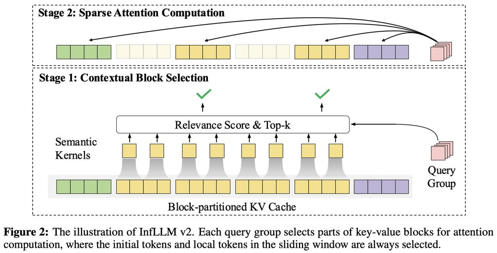

# MiniCPM4: Ultra-Efficient LLMs on End Devices

> MiniCPM Team, Chaojun Xiao, Yuxuan Li, Xu Han, Yuzhuo Bai, Jie Cai, Haotian Chen, Wentong Chen, Xin Cong, Ganqu Cui, Ning Ding, Shengdan Fan, Yewei Fang, Zixuan Fu, Wenyu Guan, Yitong Guan, Junshao Guo, Yufeng Han, Bingxiang He, Yuxiang Huang, Cunliang Kong, Qiuzuo Li, Siyuan Li, Wenhao Li, Yanghao Li, Yishan Li, Zhen Li, Dan Liu, Biyuan Lin, Yankai Lin, Xiang Long, Quanyu Lu, Yaxi Lu, Peiyan Luo, Hongya Lyu, Litu Ou, Yinxu Pan, Zekai Qu, Qundong Shi, Zijun Song, Jiayuan Su, Zhou Su, Ao Sun, Xianghui Sun, Peijun Tang, Fangzheng Wang, Feng Wang, Shuo Wang, Yudong Wang, Yesai Wu, Zhenyu Xiao, Jie Xie, Zihao Xie, Yukun Yan, Jiarui Yuan, Kaihuo Zhang, Lei Zhang, Linyue Zhang, Xueren Zhang, Yudi Zhang, Hengyu Zhao, Weilin Zhao, Weilun Zhao, Yuanqian Zhao, Zhi Zheng, Ge Zhou, Jie Zhou, Wei Zhou, Zihan Zhou, Zixuan Zhou, Zhiyuan Liu, Guoyang Zeng, Chao Jia, Dahai Li, Maosong Sun

---

> **生成声明：** 本 note 由 AI Agent 自动生成，基于 arXiv 论文 PDF 全文（arXiv:2506.07900v1）撰写。内容为中文，涵盖摘要翻译、研究动机、方法、实验结果、优势、局限性及相关研究方向。

---

## 一句话总结

MiniCPM4 是一个专为端侧设备设计的高效大语言模型（8B/0.5B），通过在模型架构（可训练稀疏注意力 InfLLM v2）、训练数据（UltraClean/UltraChat v2）、训练算法（ModelTunnel v2/Chunk-wise Rollout/BitCPM4）和推理系统（CPM.cu/ArkInfer）四个维度的系统性创新，仅用 Qwen3-8B 约 22% 的训练数据即可达到同等性能，并在端侧设备上实现 128K 长序列处理速度提升约 7 倍。

---

## 摘要翻译

本文介绍了 MiniCPM4，一个专门为端侧设备设计的高效大语言模型（LLM）。我们通过在四个关键维度——模型架构、训练数据、训练算法和推理系统——上的系统性创新来实现这一效率。具体而言，在模型架构方面，我们提出了 InfLLM v2，一种可训练的稀疏注意力机制，可加速长上下文处理的预填充和解码阶段。在训练数据方面，我们提出了 UltraClean，一种高效准确的预训练数据过滤与生成策略，以及 UltraChat v2，一种全面的有监督微调数据集。这些数据集使模型仅用 8 万亿训练 token 即可达到令人满意的性能。在训练算法方面，我们提出了 ModelTunnel v2 用于高效预训练策略搜索，并通过引入分块式 rollout 实现负载均衡的强化学习，以及高效的三值 LLM BitCPM 来改进现有的后训练方法。在推理系统方面，我们提出了 CPM.cu，整合了稀疏注意力、模型量化和推测采样，以实现高效的预填充和解码。为满足多样化的端侧需求，MiniCPM4 提供 0.5B 和 8B 两个版本。充分的评估结果表明，MiniCPM4 在多个基准测试中优于同规模的开源模型，突显了其高效性和有效性。值得注意的是，MiniCPM4-8B 在处理长序列时相比 Qwen3-8B 展现出显著的速度提升。通过进一步适配，MiniCPM4 成功驱动了多种应用，包括可信综述生成和基于模型上下文协议的工具使用，充分展示了其广泛的可用性。

---

## 研究动机

### 端侧部署的核心挑战

大语言模型（LLM）作为人工智能的核心驱动力，已在对话系统、复杂推理等任务中展现出令人瞩目的能力。然而，随着模型规模的持续扩展，对计算资源的需求呈指数级增长，导致这些模型主要部署在云端服务器上，通过 API 接口访问。

### 从云到端的必然趋势

从应用角度看，高效模型可以降低部署成本并拓展应用场景，特别是在计算资源受限的端侧设备和移动终端中。从技术发展角度看，随着模型规模不断增长，提高计算效率对于克服有限资源下的性能瓶颈至关重要。因此，**在保持模型能力的同时最小化计算需求的高效模型架构和算法具有重要的理论和实践意义**。

### MiniCPM 团队的延续

MiniCPM 团队一直致力于构建高效的端侧 MiniCPM 模型。在本文中，他们通过模型架构、训练数据、训练算法和推理系统四个维度的系统性创新，进一步提升了模型效率，成功开发出 MiniCPM4——一个能够在边缘芯片上高效计算的 8B LLM。

### 关键发现与动机

- **长序列处理需求**：随着 LLM 在长上下文处理和深度推理方面应用的普及，理解和生成长序列的需求日益关键。
- **数据质量 > 数据数量**：通过 UltraClean 高质量数据过滤策略，仅用 8 万亿 token 即可达到 Qwen3-8B（36 万亿 token）的同等性能。
- **推理效率瓶颈**：端侧设备在计算、存储和功耗方面面临严格约束，需要定制化高效推理框架。

---

## 方法（技术细节）

### 1. 模型架构：InfLLM v2（可训练稀疏注意力）

#### 核心设计

InfLLM v2 是一种可训练的稀疏注意力机制，能够同时加速预填充（prefilling）和解码（decoding）阶段的长上下文处理。其核心思想是：**每个 query token 仅选择最相关的 top-k 个 KV 块进行注意力计算**。

#### 两阶段计算流程

1. **阶段 1：动态上下文块选择**
   - 将 KV Cache 划分为等大小的块（block），每个块包含 m 个 token
   - 引入**语义核（Semantic Kernels）**：将 KV 序列以更细粒度（kernel size p=32, stride s=16）划分，每个核用 mean pooling 计算表示
   - 计算 query token 与每个语义核的相关性分数，再取与块相交的语义核的最大值作为块相关性分数
   - 选择相关性最高的 k 个块

2. **阶段 2：稀疏注意力计算**
   - 基于选定的块，计算 query token 与所有 token 之间的注意力
   - 始终包含初始 token 块和局部滑动窗口块（相关性设为无穷大）

#### 关键设计原则

- **Query 和 KV Token 的不同粒度**：query 用 token 级别，KV 用 block 级别。这使得解码阶段也能加速（避免了 query block 化导致的训练-推理不一致）。
- **可训练上下文选择**：使用无参数的 mean pooling 构建语义核表示，通过优化 token 级别 key 向量间接优化语义核表示。
- **Top-K 块共享**：同一 query 组（GQA）的 query head 共享 top-k 块，减少内存访问。
- **高效 Top-K 实现**：引入粗粒度语义核近似 LSE 值，将计算和内存访问成本降低为原始方法的 s/s_c。

#### 性能优势

- **81% 注意力稀疏度**（128K 上下文，每 token 仅需关注 6K 上下文 token）
- 与全注意力机制相当的长上下文处理能力
- 计算复杂度从 O(l²) 降至 O(l)（阶段 2）
- 不引入额外参数，不影响短文本推理

### 2. 训练数据：UltraClean + UltraChat v2

#### UltraClean：高效预训练数据过滤

- **高效验证策略**：使用预训练的 1B LLM 作为基础，仅需约 110 GPU 小时（对比传统方法的 1200 小时），通过两阶段 annealing 评估候选数据质量
- **分类器训练**：基于验证策略选择高质量种子数据，结合 fastText 分类器（256 维向量，学习率 0.1）进行大规模过滤
- **输出**：UltraFineWeb 数据集，在英文和中文任务上均显著优于 FineWeb 和 FineWeb-edu（英文平均提升 3.61pp，中文平均提升 1.98pp）

#### 推理密集型数据生成

- 从大规模网页语料库中筛选高质量种子数据
- 利用结构化数据编辑与生成机制（教材范式和论坛范式）
- 多轮迭代进化，自增强性质

#### UltraChat v2：高质量 SFT 数据

- 涵盖五个关键能力维度：知识应用、推理、指令遵循、长上下文处理、工具使用
- 采用指令演化、答案多样性进化等策略
- 数学推理数据和代码推理数据的系统性构建

### 3. 训练算法：ModelTunnel v2 + Chunk-wise Rollout + BitCPM4

#### ModelTunnel v2：高效预训练策略搜索

- **改进性能指标**：构建 ScalingBench，建立 ScalingBench loss 与下游任务性能的 sigmoid 函数关系，替代传统语言模型 loss
- **µP vs StepLaw**：在实际训练配置中，µP 框架的超参数搜索与 StepLaw 相当，但搜索成本显著降低（仅需 32 GPU 小时 vs 1M GPU 小时）
- **预训练工程**：
  - 多 token 预测（MTP）：引入密集监督信号，提高数据效率
  - FP8 混合精度训练：使用在线块级 FP8 量化（参数 128×128，激活 128×1），仅在前向传播的激活计算和反向传播的输入梯度中使用 FP8

#### Chunk-wise Rollout：负载均衡的强化学习

- **核心问题**：RL rollout 阶段因长轨迹导致 GPU 利用率低
- **分块 rollout 策略**：限制每次 rollout 的最大输出 token 预算，未完成的轨迹在后续迭代中恢复
- **稳定化技术**：
  - KL loss：保留 KL 惩罚（系数 0.001）确保训练稳定
  - Dual-clip：约束策略更新范围
  - Chunk-level importance sampling：为不同策略版本生成的块独立加权
  - Garble filter：检测并排除损坏文本
- **效果**：Chunk-8k 在 AIME 2024 上达到 34.79（vs Vanilla 的 32.91），同时采样时间减少 55%
- **实验设置**：64 A800 GPU，batch size 64，学习率 3e-6，每个 query 生成 8 个 rollout，最大响应长度 32,768 token

#### BitCPM4：三值 LLM 的量化感知训练

- **两阶段训练框架**：
  1. 使用高精度预训练模型初始化
  2. 仅用学习率衰减阶段 2 倍的 token 进行 QAT
- **效果**：仅用 BitNet-2B 约 10% 的训练 token 即可达到竞争性能
- **0.5B 模型**：在知识任务（MMLU、CMMLU、C-EVAL）上优于 Qwen3-0.6B
- **1B 模型**：与 2B 参数模型表现相当
- **局限**：小模型在数学和代码等挑战性任务上表现较弱

### 4. 推理系统：CPM.cu + ArkInfer

#### CPM.cu：轻量高效 CUDA 推理框架

- **静态内存管理 + 内核融合 + 高效推测采样**
- **FR-Spec（频率排序推测采样）**：根据 token 频率裁剪草稿模型词表，仅使用 top-25% 高频 token，减少 LM Head 计算量达 75%，同时保持验证过程的数学等价性
- **P-GPTQ（前缀感知后训练量化）**：消除初始 token 干扰，通过位置感知校准策略（从第 4 个位置开始）计算 Hessian 矩阵，INT4 量化中 S-P-GPTQ 表现最优
- **SpecMQuant**：推测采样 + 量化的结合，在量化模型中减少 draft token 数量以平衡验证时间
- **InfLLM v2 内核集成**：实现树式草稿验证的稀疏注意力，将注意力掩码压缩为 uint64 bit-packing
- **滑动窗口草稿模型**：减少首个 token 延迟，提高草稿准确性

#### ArkInfer：跨平台部署系统

- **统一架构**：支持 MediaTek、NVIDIA、Qualcomm、Rockchip 等多平台
- **可复用推测和约束解码**：BiTA 算法加速 + Guidance 约束解码
- **可扩展模型 Zoo 前端**：自动化模型转换流水线

---

## 实验结果

### 标准评估

| 模型 | 参数量 | 训练数据 | MMLU | CMMLU | CEval | BBH | GSM8K | MATH500 | MBPP | HumanEval | 平均 |
|------|--------|----------|------|-------|-------|-----|-------|---------|------|-----------|------|
| Qwen3-0.6B | 0.6B | 36T | 42.95 | 42.05 | 45.53 | 28.32 | 61.71 | 50.20 | 47.86 | 40.85 | 44.93 |
| **MiniCPM4-0.5B** | **0.5B** | **1T** | **55.55** | **65.22** | **66.11** | **49.87** | **52.08** | **29.60** | **59.14** | **46.34** | **52.99** |
| Qwen3-8B | 8B | 36T | 77.55 | 77.58 | 80.35 | 69.43 | 93.25 | 83.20 | 77.04 | 85.98 | 80.55 |
| **MiniCPM4-8B** | **8B** | **8T** | **75.83** | **80.62** | **81.36** | **76.73** | **91.51** | **78.60** | **78.99** | **85.37** | **81.13** |

### 关键结论

1. **MiniCPM4-0.5B** 在知识任务上显著优于 Qwen3-0.6B（平均 52.99 vs 44.93），尽管参数更少
2. **MiniCPM4-8B** 在多个基准上达到甚至超过 Qwen3-8B（平均 81.13 vs 80.55），同时仅用 **22% 的训练数据**（8T vs 36T）
3. **MiniCPM4-8B** 超越 Gemma3-12B（76.14）和 Phi4-14B（78.47）

### 长上下文评估

- **128K NIAH 测试**：MiniCPM4-8B 在 128K 上下文窗口中达到 **100% 准确率**
- **稀疏度**：每个 token 仅需关注 6K 上下文 token（128K 上下文，稀疏度仅 5%）
- **上下文外推**：仅在 32K 上下文上训练，但通过 YaRN 可在 4 倍长度上保持 100% 准确率

### 效率评估

- **Jetson AGX Orin（边缘设备）**：
  - 比 Qwen3-8B 解码速度提升约 **7 倍**
  - 比 Llama3-8B 和 GLM4-9B 也有显著加速
- **RTX 4090**：预填充和解码均有显著加速
- **长序列优势**：随着文本长度增加，效率优势更加明显（稀疏注意力的计算量增长远低于密集注意力）

### BitCPM4 评估

| 模型 | 参数 | 精度 | MMLU | CMMLU | CEval | BBH | GSM8K | MATH500 | MBPP | HumanEval | 平均 |
|------|------|------|------|-------|-------|-----|-------|---------|------|-----------|------|
| Qwen3-0.6B | 0.6B | BF16 | 42.95 | 42.05 | 45.53 | 28.32 | 61.71 | 50.20 | 47.86 | 40.85 | 44.93 |
| BitCPM4-0.5B | 0.5B | Ternary | 49.88 | 55.88 | 57.51 | 43.13 | 25.55 | 10.20 | 46.69 | 29.88 | 39.84 |
| BitCPM4-1B | 1B | Ternary | 59.24 | 68.84 | 69.06 | 57.64 | 60.80 | 34.00 | 61.48 | 37.20 | 56.03 |

### 应用评估

#### MiniCPM4-Survey（可信综述生成）

- **Plan-Retrieve-Write 流程**：规划 → 检索 → 撰写
- **多阶段训练**：SFT → 章节级 RL → 全文级 RL
- **性能**：与 OpenAI Deep Research 相当，FactScore 达到 68.73（最高）

#### MiniCPM4-MCP（模型上下文协议工具使用）

- 支持 Airbnb、Amap、GitHub、Slack、Whisper 等 MCP 服务器
- **函数名准确率**：88.3%（GPT-4o 为 80.2%）
- **参数名准确率**：76.1%（GPT-4o 为 70.2%）
- **参数值准确率**：51.2%（GPT-4o 为 49.1%）

---

## 优势

1. **极高的数据效率**：仅用 Qwen3-8B 约 22% 的训练数据（8T vs 36T）即可达到同等甚至更好的性能
2. **显著的推理加速**：在端侧设备上，128K 长序列处理速度比 Qwen3-8B 快约 7 倍
3. **系统性创新**：从架构、数据、算法到推理系统的全方位优化，而非单一技术突破
4. **81% 注意力稀疏度**：在 128K 上下文中每 token 仅关注 6K 上下文 token，同时保持 100% NIAH 准确率
5. **上下文外推能力**：32K 训练可支持 128K 推理
6. **多平台部署**：ArkInfer 支持 MediaTek、NVIDIA、Qualcomm、Rockchip 等多平台
7. **极低比特量化**：BitCPM4 三值模型仅用 10% 的训练 token 即可达到竞争性能
8. **丰富的应用生态**：Survey 生成、MCP 工具使用等实际应用
9. **多 token 预测**：增强训练效率和推测采样接受长度
10. **可训练稀疏注意力**：相比 MoBA 和 NSA，不引入额外参数，不影响短文本推理

---

## 局限性

1. **0.5B 模型在复杂推理任务上表现较弱**：在数学（MATH500: 29.60）和代码（HumanEval: 46.34）任务上与更大模型有差距
2. **极低比特模型的运算符支持不完善**：三值 LLM 的运算符实现仍需进一步优化
3. **未使用知识蒸馏**：虽然效果不差，但蒸馏策略可能进一步提升性能
4. **Chunk-wise rollout 的 trade-off**：chunk size 过小（如 4k）时，虽然采样时间减少，但总训练时间改善有限
5. **数据过滤仍依赖人工启发式**：未来可利用 LLM 构建自监督机制
6. **Qwen3-8B 在部分指标上仍占优**：如 BBH（69.43 vs 76.73）等推理任务
7. **MCP 工具使用中部分参数值准确率较低**：整体参数值准确率仅 51.2%
8. **上下文外推依赖 YaRN**：仅在 32K 上下文训练，需要额外位置编码方法
9. **Survey 生成在覆盖率和新颖性上仍有提升空间**
10. **未开源所有细节**：部分推理系统代码（如 CPM.cu）可能未完全公开

---

## 与 EfficientPaper 相关的研究方向

### 1. 稀疏注意力与长上下文处理

- **InfLLM v2** 是可训练稀疏注意力的重要进展，与 MoBA、NSA、XAttention 等工作形成互补
- 81% 的注意力稀疏度和 5% 的上下文稀疏度为端侧长序列处理提供了实用方案
- **研究方向**：如何进一步提高稀疏度，实现"无限长序列"在端侧的处理

### 2. 高效训练数据构建

- **UltraClean** 的高效验证策略（110 GPU 小时 vs 1200 小时）为数据质量评估提供了实用框架
- **数据质量 > 数据数量** 的原则在 8T token 即可达到 36T 性能的实验中得到验证
- **研究方向**：如何利用 LLM 自动构建更高质量的训练数据，减少人工介入

### 3. 超参数搜索与训练策略优化

- **ModelTunnel v2** 的 ScalingBench + µP 方案为低成本超参数搜索提供了可行路径
- **研究方向**：如何将 ScalingBench 推广到更广泛的模型和任务

### 4. 强化学习与推理增强

- **Chunk-wise Rollout** 解决了 RL 训练中长轨迹导致的 GPU 利用率低问题
- 与 GRPO 的结合，以及 KL 正则化、Dual-clip 等稳定化技术
- **研究方向**：如何在端侧设备上实现高效的 RL 训练

### 5. 极低比特量化

- **BitCPM4** 证明了从高精度模型初始化进行 QAT 的可行性（仅需 10% 的训练 token）
- **研究方向**：如何将 QAT 方法扩展到更大模型，以及优化极低比特模型的运算符实现

### 6. 推理加速与推测采样

- **FR-Spec** 通过频率排序词表压缩将草稿模型计算量减少 75%
- **P-GPTQ** 解决了激活离群值对量化的影响
- **SpecMQuant** 探索了推测采样与量化的结合
- **研究方向**：如何在保持质量的同时进一步减少推理延迟

### 7. 跨平台部署

- **ArkInfer** 提供了统一的跨平台部署架构，支持多芯片、多框架
- **研究方向**：如何扩展支持更多端侧平台，实现真正的"一次部署，处处运行"

### 8. 端侧应用

- **MiniCPM4-Survey**：可信综述生成，Plan-Retrieve-Write 流程
- **MiniCPM4-MCP**：基于 MCP 的工具使用，支持多种 MCP 服务器
- **研究方向**：如何在端侧实现更多复杂应用，如代码执行、多模态理解等

### 9. 多 token 预测

- MTP 引入密集监督信号，提高数据效率，同时增强推测采样接受长度
- **研究方向**：如何优化 MTP 架构，平衡训练效率和模型性能

---

**相关关键词**：`sparse_pruning`, `attention_sparsity`, `structure_design`

**论文链接**：http://arxiv.org/abs/2506.07900v1

**代码仓库**：https://github.com/openbmb/minicpm

**模型权重**：
- MiniCPM4-8B: https://huggingface.co/openbmb/MiniCPM4-8B
- MiniCPM4-0.5B: https://huggingface.co/openbmb/MiniCPM4-0.5B
