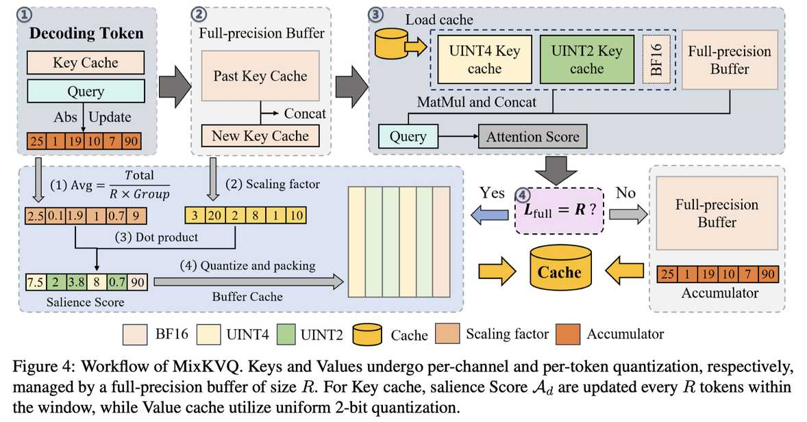

# MixKVQ: Query-Aware Mixed-Precision KV Cache Quantization for Long-Context Reasoning

> Tao Zhang, Ziqian Zeng, Hao Peng, Huiping Zhuang, Cen Chen

> ⚠️ 本 note 由 AI Agent 自动生成，基于 arXiv 论文原文（arXiv:2512.19206v1）的全文阅读与分析。生成日期：2025 年。内容可能存在偏差，请以原文为准。

---

## 一句话总结

MixKVQ 提出了一种**查询感知的混合精度 KV 缓存量化方法**，通过同时考虑 key 通道的内在量化难度和与 query 的动态相关性，在极低位宽（约 2.3–2.7 bit）下实现接近全精度基准的长上下文推理性能。

---

## 摘要翻译

长链式思维（Chain-of-Thought, CoT）推理显著提升了大语言模型（LLM）的能力，但伴随而来的是由大量 Key-Value（KV）缓存带来的显著内存和延迟开销。虽然 KV 缓存量化是一种有前景的压缩技术，但现有的低比特量化方法在复杂推理任务上往往表现出严重的性能下降。固定精度量化难以处理 key 缓存中的异常通道，而当前的混合精度策略无法准确识别需要高精度表示的组成部分。我们发现，有效的低比特 KV 缓存量化策略必须考虑两个因素：key 通道的内在量化难度和其与 query 的相关性。基于这一洞察，我们提出了 MixKVQ，一种即插即用的新方法，引入轻量级的查询感知算法来识别和保留需要更高精度的关键 key 通道，同时对 value 缓存应用 per-token 量化。在复杂推理数据集上的实验表明，我们的方法显著优于现有低比特方法，在大幅降低内存占用的同时，达到了与全精度基准相当的性能。

---

## 研究动机

### KV 缓存的内存瓶颈
自回归 LLM 推理中，KV 缓存的内存占用随序列长度线性增长。例如，Qwen2.5-32B 模型在 batch size=64、序列长度 32768 时需要约 512GB GPU 内存，是模型权重的 8.59 倍。此外，注意力机制在每个解码步骤反复访问 KV 缓存，造成严重的内存带宽瓶颈。

### 现有量化方法的不足
1. **固定精度方法**（如 KIVI、KVQuant）：对整个 KV 缓存使用统一比特宽度，无法适应 key 缓存中存在异常通道的问题，导致低比特（如 2-bit）下性能大幅下降。
2. **现有混合精度方法**（如 KVTuner、RotateKV）：基于量化误差的大小来分配比特宽度，但在严格内存约束下，这种启发式策略会将高比特分配给量化误差大但对注意力计算影响小的通道，而压缩了实际更重要的通道。

### 核心洞察
**key 通道的激活幅度大并不一定重要**——如果对应的 query 激活幅度小，该通道对注意力计算的影响可以忽略不计。因此，有效的量化策略必须同时考虑：
- 通道的**内在量化难度**（由缩放因子 S 反映）
- 通道与 query 的**动态相关性**（由 query 激活强度 I 反映）

---

## 方法（技术细节）

### 整体框架

MixKVQ 对 key 缓存采用 **per-channel 混合精度量化**，对 value 缓存采用 **per-token 统一 2-bit 量化**，并维护一个全精度残差缓冲区（大小为 R）。

### 核心指标：显著性分数（Salience Score）

对 key 缓存的第 d 个通道，定义显著性分数：

**A_d = I_d × S_d**

其中：

- **重要性分数 I_d**（Importance Score）：估计 query 在通道 d 上的平均绝对激活强度
  $$I_d = \frac{1}{L_q} \sum_{i=1}^{L_q} |Q_{i,d}|$$
  反映了该通道对注意力分数的贡献程度。

- **敏感性分数 S_d**（Sensitivity Score）：使用 B-bit 非对称量化的缩放因子
  $$S_d = \frac{\max(k_d) - \min(k_d)}{2^B - 1}$$
  反映了该通道的内在量化难度，缩放因子越大意味着量化误差上界越大。

### 三级混合精度分配

基于显著性分数 A_d，引入两个阈值 τ_BF16 和 τ_UINT4，将 key 缓存的通道分为三级：

| 级别 | 条件 | 比特宽度 | 含义 |
|------|------|----------|------|
| 高精度 | A_d > τ_BF16 | BF16（全精度） | 高度关键通道 |
| 中精度 | τ_UINT4 < A_d ≤ τ_BF16 | UINT4 | 中等关键通道 |
| 低精度 | A_d ≤ τ_UINT4 | UINT2 | 非关键通道 |

阈值通过 Optuna 框架的 TPE 采样器在 [0.1, 2.0] 空间内联合搜索，以最大化 GSM8K 准确率并最小化有效比特宽度。不同模型的最优阈值不同：
- R1-Llama-8B: (1.44, 0.79)，有效位宽 2.7 bit
- R1-Qwen-7B: (0.63, 0.41)，有效位宽 3.4 bit
- R1-Qwen-14B: (1.52, 1.60)，有效位宽 2.3 bit
- R1-Qwen-32B: (1.85, 1.58)，有效位宽 2.3 bit

### 工作流程

1. 新生成的 key/value 先存入全精度残差缓冲区 X_R
2. 当缓冲区达到 R 个 token 时，触发批量量化
3. 对 key 缓存：重新计算显著性分数（每 R 个 token 更新一次），根据阈值将通道分为三级
4. 对 value 缓存：执行统一 2-bit per-token 量化
5. 量化后的数据合并到主缓存中，缓冲区重置

### 关键设计特点

- **即插即用**：无需微调或训练，直接在推理时应用
- **查询感知**：首次在 KV 缓存量化中引入 query 相关的动态信息
- **懒更新策略**：通过残差缓冲区 R 摊销计算开销，同时作为时间稳定窗口
- **高效的在线显著性估计**：维护 query 幅度的运行累加器，避免扫描完整 query 历史
- **与 RoPE 兼容**：在 rotary embedding 变换后计算重要性分数

---

## 实验结果

### 实验设置
- **模型**：DeepSeek-R1-Distill-Llama-8B、DeepSeek-R1-Distill-Qwen-7B/14B/32B
- **GPU**：单张 NVIDIA A800 (80GB)
- **推理参数**：温度 0.6，top-p 0.95
- **统一参数**：组大小 G=32，残差长度 R=128
- **基线方法**：BF16、KVQuant、KIVI、KVTuner、RotateKV

### 主要推理任务结果

| 模型 | 方法 | 位宽 | AIME 2024-2025 | MATH 500 | GPQA-Diamond | LiveCodeBench | 平均 |
|------|------|------|----------------|----------|--------------|---------------|------|
| R1-Llama-8B | BF16 | - | 41.67 | 89.80 | 48.99 | 34.62 | **53.77** |
| | MixKVQ | C2.7 | 40.00 | 88.20 | 47.47 | 31.87 | **51.89** |
| | KIVI | KV2 | 31.67 | 85.80 | 37.37 | 17.58 | 43.11 |
| R1-Qwen-14B | BF16 | - | 61.67 | 93.60 | 58.59 | 45.05 | **64.73** |
| | MixKVQ | C2.3 | 60.00 | 92.40 | 56.57 | 43.41 | **63.10** |
| | KIVI | KV2 | 50.00 | 87.80 | 52.53 | 31.32 | 55.41 |
| R1-Qwen-32B | BF16 | - | 66.67 | 94.80 | 62.63 | 47.25 | **67.84** |
| | MixKVQ | C2.3 | 65.00 | 94.00 | 60.10 | 45.05 | **66.04** |
| | KIVI | KV2 | 51.67 | 89.80 | 54.54 | 39.56 | 58.89 |

**关键发现**：
- MixKVQ 在所有模型和任务上一致优于现有方法
- 在 Qwen-32B 上，MixKVQ（C2.3）平均准确率 66.04%，仅比 BF16（67.84%）低 1.8%，而 KIVI KV2 下降到 58.89%（降 8.95%）
- MixKVQ 在 2-bit 级别实现了接近 4-bit 方法的性能

### 长上下文生成结果（LongBench）

在 Mistral-7B 和 Llama-3.1-8B 上，MixKVQ 将有效位宽降至 2.70 bit，性能与 BF16 基准相当。在 LongBench 的多个子任务（QA、摘要、few-shot、代码）中表现稳健。

### 效率对比

在 Llama2-13B-chat 上的吞吐量测试（基于 ShareGPT 数据集）：
- 相似内存使用下，MixKVQ 支持最高 **2.25×** 更大的 batch size
- 吞吐量提升 **2.63×–2.81×**
- 内存节省超过 79%（从 16-bit 压缩到 3.4-bit）

### 消融实验

| 研究维度 | 结论 |
|----------|------|
| 组大小 G | G=32 时 PPL 最低（7.05），随组大小增大 PPL 略增 |
| 残差长度 R | 32–256 之间无明显单调趋势，足够大的 R 对困难任务有明显帮助 |
| 查询感知组件 | 消去 I_d 后（仅用 S_d），AIME 准确率从 60.00 降至 53.33（Qwen-14B），从 40.00 降至 33.33（Llama-8B） |

---

## 优势

1. **即插即用，无需微调**：直接在推理阶段应用，不需要额外训练或校准数据
2. **查询感知设计**：首次在 KV 缓存量化中同时考虑 query 信息和量化误差，避免了仅基于量化误差分配比特宽度的缺陷
3. **极低位宽下性能优异**：在 2.3–2.7 bit 有效位宽下，实现了接近全精度基准的推理性能
4. **兼容性强**：适用于 GQA 架构，支持 RoPE，可与 KV 缓存驱逐/管理/低秩分解等方法正交组合
5. **效率显著**：计算开销低（通道选择仅占 2.17% 的每层执行时间），同时实现超过 79% 的内存节省和 2.63–2.81× 的吞吐量提升
6. **混合精度策略精细**：三级精度分配（BF16/UINT4/UINT2）比二元方案更灵活
7. **懒更新机制**：通过残差缓冲区 R 摊销计算开销，同时避免在不稳定统计量上过早量化

---

## 局限

1. **计算开销不可忽略**：尽管已采用 GPU 优化策略，但张量变换的计算开销仍然存在，需要与 vLLM 等推理加速器深度集成来进一步优化
2. **未覆盖所有注意力机制**：实验未包含 Multi-Head Latent Attention (MLA)，MLA 与 GQA 有显著差异，MixKVQ 在 MLA 上的适用性未知
3. **延迟分析不完整**：主要关注内存受限的生成阶段，对 prompt 处理阶段的计算瓶颈（特别是多 KV 序列的批量压缩操作）分析不足
4. **模型范围有限**：主要在 DeepSeek-R1-Distill 系列上验证，对其他推理模型的泛化性有待进一步验证
5. **阈值搜索需要校准数据**：阈值 τ_BF16 和 τ_UINT4 需要通过 Optuna 在校准数据（如 GSM8K）上搜索，增加了部署复杂度

---

## 与 EfficientPaper 相关的研究方向

### KV 缓存压缩
- **KV 缓存量化**：MixKVQ 是 KV 缓存量化领域的重要进展，特别是在极端低比特（2-bit 级别）下实现高性能。相关方法包括 KIVI、KVQuant、RotateKV、SKVQ 等。
- **KV 缓存驱逐**：与 MixKVQ 互补，通过丢弃不重要的 KV 条目来减少缓存大小，如 H2O、PyramidKV、CAKE 等。
- **KV 缓存管理**：包括预填充-解码分离、低秩分解、卸载、预取和检索等方法，可与 MixKVQ 正交组合。

### 高效推理
- **模型量化**：MixKVQ 专注于 KV 缓存的量化，而模型权重量化（如 AWQ、GPTQ）是另一个互补方向。
- **长上下文推理**：MixKVQ 特别针对长 CoT 推理场景设计，与长上下文优化技术（如 RoPE 扩展、注意力稀疏化）密切相关。
- **推理服务优化**：MixKVQ 的效率提升（2.63–2.81× 吞吐量）直接关联 LLM 服务系统（如 vLLM）的优化。

### 关键方法对比
- **KIVI**：固定 2-bit/4-bit 分配，不考虑 query 信息
- **KVQuant**：基于量化误差的固定精度方法
- **RotateKV**：基于旋转的异常值处理方法
- **KVTuner**：层级混合精度方法
- **MixKVQ**：通道级 + 查询感知的混合精度方法

MixKVQ 的核心贡献在于将查询感知机制引入 KV 缓存量化，这在现有方法中是一个独特的视角，对后续的高效推理研究具有重要参考价值。
