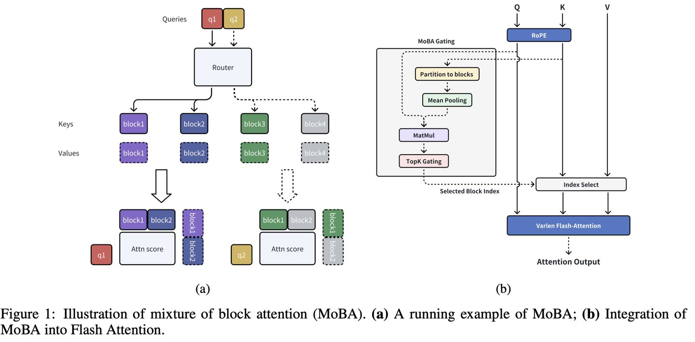

# MoBA: Mixture of Block Attention for Long-Context LLMs

> ⚠️ **声明：本文档由 AI Agent 自动生成，内容基于对论文原文的阅读与理解，仅供学术参考。生成时间：2026-06-04。**

---

## 一句话总结

MoBA（Mixture of Block Attention）将 Mixture of Experts（MoE）的思想应用于 Transformer 注意力机制，通过动态门控机制将上下文划分为多个块并选择性地路由查询令牌到最相关的 KV 块，实现了在保持与全注意力相当性能的同时显著降低计算复杂度，支持百万级上下文长度的高效处理。

---

## 摘要翻译

扩展有效上下文长度对于推动大语言模型（LLM）迈向通用人工智能（AGI）至关重要。然而，传统注意力机制固有的二次计算复杂度带来了巨大的开销。现有方法要么施加强结构化偏置（如 sink 或 window 注意力），这些偏置具有任务特定性；要么将注意力机制彻底修改为线性近似，其在复杂推理任务上的性能仍不充分。

本文提出一种遵循"少结构"（less structure）原则的解决方案，允许模型自主决定关注哪里，而非引入预定义偏置。我们引入了混合块注意力（Mixture of Block Attention, MoBA），这是一种创新方法，将 Mixture of Experts（MoE）原理应用于注意力机制。这种新架构在长上下文任务上表现出优越性能，同时提供了一个关键优势：能够在全注意力和稀疏注意力之间无缝切换，增强效率而不损害性能。MoBA 已被部署用于支持 Kimi 的长上下文请求，展示了在 LLM 高效注意力计算方面的显著进展。

---

## 研究动机

### 核心问题

大语言模型在处理长序列时面临二次计算复杂度的根本瓶颈。标准 Transformer 注意力机制的计算量与序列长度的平方成正比，这严重限制了上下文窗口的扩展。

### 现有方法的局限

1. **静态稀疏注意力**（如滑动窗口注意力、sink 注意力）：虽然可以降低计算量，但引入了强烈的预定义结构偏置，具有任务特定性，可能损害模型的泛化能力。

2. **动态稀疏注意力**（如 Quest、Minference、RetrievalAttention）：在推理时选择 token 子集，可以减少长序列的推理计算，但无法有效降低长上下文模型的训练成本。

3. **线性注意力**（如 Mamba、RWKV、RetNet）：将 softmax 注意力替换为线性近似，降低计算开销，但与现有 Transformer 模型的转换成本高，且在复杂推理任务上的有效性尚不充分。

### 核心研究问题

如何设计一个鲁棒且自适应的注意力架构，在保留原始 Transformer 框架的同时，遵循"少结构"原则，允许模型自主决定关注位置，而不依赖预定义偏置？理想情况下，这种架构应在全注意力和稀疏注意力之间无缝切换，最大化与现有预训练模型的兼容性，实现高效推理和加速训练而不损害性能。

---

## 方法（技术细节）

### 2.1 核心思想：将 MoE 原理应用于注意力机制

MoBA 的核心创新在于将 Mixture of Experts（MoE）的原理从 FFN 层迁移到注意力机制本身。MoE 传统上用于 Transformer 的前馈网络层，MoBA 率先将其应用于长上下文注意力，允许动态选择历史中相关的 KV 块。

### 2.2 MoBA 架构

#### 标准注意力回顾

标准注意力的计算公式为：

$$\text{Attn}(q, K, V) = \text{Softmax}(qK^\top)V$$

其中 $d$ 是单个注意力头的维度。

#### MoBA 注意力计算

MoBA 允许每个查询令牌仅关注键值对的一个子集：

$$\text{MoBA}(q, K, V) = \text{Softmax}(qK[I]^\top)V[I]$$

其中 $I \subseteq [N]$ 是被选中的键值对集合。

#### 块划分与路由策略

1. **块划分**：将长度为 $N$ 的完整上下文划分为 $n$ 个块，每个块包含 $B = N/n$ 个连续令牌。第 $i$ 个块的范围为 $I_i = [(i-1) \times B + 1, i \times B]$。

2. **门控机制**：采用 MoE 的 top-k 门控机制，每个查询令牌选择最相关的 $k$ 个块进行注意力计算：

$$g_i = \begin{cases} 1 & s_i \in \text{Topk}(\{s_j | j \in [n]\}, k) \\ 0 & \text{otherwise} \end{cases}$$

3. **亲和度评分**：查询 $q$ 与第 $i$ 个块的相关性通过内积计算：

$$s_i = \langle q, \text{mean pool}(K[I_i]) \rangle$$

即查询与该块键的均值池化之间的内积。

#### 因果性保证

MoBA 通过两个关键设计保证自回归语言模型的因果性：

1. **不关注未来块**：查询令牌不能路由到未来的块。对于位置 $pos(q)$ 之前的块，设 $s_i = -\infty$，$g_i = 0$。

2. **当前块注意力与因果掩码**：查询令牌必须路由到其所在块，并应用因果掩码（因为块内均值池化可能包含未来令牌信息）。从 MoE 角度看，当前块注意力类似于现代 MoE 架构中的"共享专家"角色。

#### 精细块分割

类似 MoE 中精细专家分割对模型性能的提升，MoBA 在上下文长度维度上进行分割。实验表明，精细粒度的分割可以显著提升 MoBA 性能（1.5B 参数模型下，最粗粒度与最细粒度之间有约 1e-2 的损失差距）。

#### MoBA 与全注意力的混合

MoBA 被设计为全注意力的替代品，不引入新参数，因此可以在两者之间无缝切换：

- **MoBA/全注意力混合训练**：两阶段训练策略，第一阶段用 MoBA 训练大部分 tokens，第二阶段切换到全注意力。实验显示，混合训练策略的性能与全注意力几乎相同，且切换过程中无显著损失尖峰。

- **层间混合策略**：在监督微调（SFT）中，将最后几层 Transformer 从 MoBA 切换为全注意力，可显著降低 SFT 损失（由于 SFT 中的 loss masking 导致稀疏注意力梯度挑战）。

#### 与滑动窗口注意力和 Attention Sink 的关系

- 滑动窗口注意力（SWA）可视为 MoBA 的特例（门控网络始终选择最近的块）。
- Attention Sink 可视为 MoBA 的特例（门控网络始终选择初始和最近的块）。
- MoBA 具有比 SWA 和 Attention Sink 更强的表达能力，可以通过不同的门控网络灵活近似多种静态稀疏注意力架构。

### 2.3 高性能实现

MoBA 的实现融合了 FlashAttention 和 MoE 的优化技术，包含五个主要步骤：

1. 根据门控网络和因果掩码确定查询令牌到 KV 块的分配
2. 根据分配的 KV 块重新排列查询令牌的顺序
3. 对每个 KV 块及其分配的查询令牌计算注意力输出（使用 FlashAttention 优化，支持变长）
4. 将注意力输出重新排列回原始顺序
5. 使用在线 Softmax（即 tiling）合并对应的注意力输出

---

## 实验结果

### 3.1 Scaling Law 实验与消融研究

#### 语言模型损失的可扩展性

- 训练 5 个不同规模的模型（568M ~ 2.1B 参数），遵循 Chinchilla scaling law
- MoBA 和全注意力模型均以 8K 序列长度训练
- MoBA 配置：block size=512，top-3 选择，稀疏度达 81.25%
- **结果**：MoBA 与全注意力的验证损失差异在 1e-3 范围内，表明 MoBA 在稀疏注意力模式下实现了与全注意力相当的 scaling 性能

#### 长上下文可扩展性

- 采用 trailing LM loss（序列末尾 token 的损失）评估长上下文能力
- 序列长度从 8K 增加到 32K，稀疏度达 95.31%
- **结果**：MoBA 的 trailing loss 虽然略高于全注意力，但差距逐渐缩小，表明 MoBA 具有长上下文可扩展性

#### 精细块分割消融

- 1.5B 参数模型，32K 上下文
- 将 32K 划分为 8/16/32/64/128 个块，对应选择 2/4/8/16/32 个块，保持 75% 稀疏度
- **结果**：精细分割（128 块）显著优于粗分割（8 块），差距约 1e-2

### 3.2 MoBA 与全注意力混合训练

- 3 个 1.5B 模型，30B tokens，32K 上下文
- **MoBA/全注意力混合**：第一阶段用 MoBA 训练 90% tokens，第二阶段切换全注意力训练 10% tokens
- **结果**：混合训练策略的 position-wise LM loss 几乎与全注意力相同，切换过程中无显著损失尖峰

#### 层间混合策略（SFT 阶段）

- 将最后若干层从 MoBA 切换为全注意力
- **结果**：随着混合全注意力层数增加（1/3/5/10 层），SFT LM loss 和 trailing loss 显著下降

### 3.3 大规模语言模型评估

- 基于 Llama 3.1 8B 模型，持续预训练到 1M 上下文
- MoBA 配置：block size=4096，top-12，稀疏度达 95.31%（在 1M 上下文下）
- 层间混合：最后 3 层全注意力，其余 29 层 MoBA
- 评估时：MoBA 仅用于 prefill，生成阶段切换到全注意力

#### 关键评估结果（Table 2）

| 基准测试 | MoBA | 全注意力 |
|---------|------|---------|
| AGIEval | 0.5144 | 0.5146 |
| BBH | 0.6573 | 0.6589 |
| CEval | 0.6273 | 0.6165 |
| GSM8K | 0.7278 | 0.7142 |
| HellaSWAG | 0.8262 | 0.8279 |
| MMLU | 0.4903 | 0.4904 |
| MMLU Pro | 0.4295 | 0.4328 |
| HumanEval | 0.6951 | 0.7012 |
| LongBench @32K | 0.4828 | 0.4821 |
| RULER @128K | 0.7818 | 0.7849 |

**结论**：MoBA 在所有评估任务上的性能与全注意力高度可比，即使在最长的 RULER 任务（128K 上下文，稀疏度 62.5%）中，MoBA 得分 0.7818 仅略低于全注意力的 0.7849。

#### Needle in a Haystack 评估

- 1M 上下文长度下进行 Needle in a Haystack 测试
- **结果**：MoBA 在长达 1M tokens 的上下文长度下仍表现出满意的性能

### 3.4 效率与可扩展性

- **1M 模型加速**：MoBA 在所有上下文长度下均优于全注意力（FlashAttention 实现），在 1M tokens prefill 时实现 6.5x 加速
- **固定稀疏度比例缩放**：保持 95.31% 稀疏度（64 个 MoBA 块 + top-k=3），将上下文长度从 32K 扩展到 10M tokens
  - 在 10M tokens 时，MoBA 实现了 16x 的注意力计算时间减少
  - 在短序列（32K-512K）中两者性能相当，随着序列增长，MoBA 的计算优势愈发明显
- **子二次计算复杂度**：MoBA 展现出优于标准 Flash Attention 的效率

---

## 优势

1. **性能与效率的平衡**：在保持与全注意力相当性能的同时，显著降低计算复杂度（1M tokens 时 6.5x 加速，10M tokens 时 16x 加速）。

2. **无缝切换能力**：可以灵活地在全注意力和稀疏注意力之间切换，切换过程中无显著性能损失，便于与现有预训练模型集成。

3. **少结构原则**：不引入预定义偏置，让模型自主决定关注位置，具有更强的泛化能力。

4. **与 MoE 框架的统一**：将 MoE 原理从 FFN 层迁移到注意力机制，实现了理论和实现上的统一。

5. **可扩展至超长上下文**：已验证支持 1M 甚至 10M tokens 的上下文长度，且在长上下文任务上性能优异。

6. **实际部署验证**：已部署到 Kimi 的长上下文请求支持，证明了其在生产环境中的实用性。

7. **无参数增加**：MoBA 不引入新参数或移除现有参数，简化了与全注意力模型的对比和迁移。

8. **兼容性**：作为全注意力的直接替代品，可以与现有预训练模型无缝集成。

---

## 局限

1. **SFT 阶段性能下降**：MoBA 在监督微调（SFT）阶段可能表现不佳，因为 SFT 中的 loss masking 导致稀疏注意力的梯度挑战，需要层间混合策略来缓解。

2. **Trailing Token 性能**：在长上下文 trailing token 的 LM loss 上，MoBA 仍略高于全注意力（虽然差距逐渐缩小）。

3. **块粒度敏感性**：MoBA 性能对块粒度敏感，过粗的块分割会显著影响性能（最粗与最细粒度之间约 1e-2 的损失差距）。

4. **需要精心配置**：block size、top-k 等超参数需要根据上下文长度和稀疏度要求精心调整。

5. **仅用于 prefill**：在实际评估中，MoBA 仅用于 prefill 阶段，生成阶段仍需切换到全注意力，限制了其在 decode 阶段的效率提升。

6. **训练成本**：虽然 MoBA 降低了注意力计算的 FLOPs，但在 10M tokens 级别的上下文中仍需要大量的计算资源和内存（需要张量并行扩展到查询头级别）。

7. **缺乏在复杂推理任务上的全面评估**：论文主要在标准基准上评估，对于复杂推理任务（如长链式思维推理）的评估相对有限。

---

## 与 EfficientPaper 相关的研究方向

### 1. 稀疏注意力机制（sparse_pruning / attention_sparsity）

MoBA 属于动态稀疏注意力的范畴，通过门控机制动态选择最相关的 KV 块。这与 EfficientPaper 中的 `sparse_pruning` 和 `attention_sparsity` 关键词高度相关，可作为稀疏注意力研究的重要参考。

### 2. KV 缓存稀疏化（kv_cache_sparse）

MoBA 的块划分和选择性路由策略直接关联到 KV 缓存的稀疏化。在长上下文场景下，MoBA 通过减少需要访问的 KV 块数量来降低内存和计算开销，这与 `kv_cache_sparse` 研究方向一致。

### 3. 架构设计（structure_design）

MoBA 提出了一种新颖的注意力架构设计，将 MoE 原理迁移到注意力机制，这与 EfficientPaper 中的 `structure_design` 方向高度相关。其"少结构"原则为未来的架构设计提供了新的思路。

### 4. MoE 与注意力机制的融合

MoBA 是将 MoE 原理应用于注意力机制的先驱工作，这一方向可能催生更多将 MoE 与注意力机制结合的研究，如更精细的块分割、更复杂的门控策略等。

### 5. 超长上下文处理

MoBA 展示了处理 1M 甚至 10M tokens 上下文的能力，这为超长上下文模型的设计提供了重要参考。结合位置编码、KV 缓存优化等技术，MoBA 可以进一步提升超长上下文的处理效率。

### 6. 混合注意力架构

MoBA 的混合策略（全注意力与 MoBA 的混合训练、层间混合）为注意力架构的灵活组合提供了范例，可能启发更多关于不同注意力机制混合使用的研究。

---

## 参考信息

- **论文标题**：MoBA: Mixture of Block Attention for Long-Context LLMs
- **作者**：Enzhe Lu, Zhejun Jiang, Jingyuan Liu, Yulun Du, Tao Jiang, Chao Hong 等
- **机构**：Moonshot AI, Tsinghua University, Zhejiang University
- **发表**：NeurIPS 2025
- **代码**：https://github.com/MoonshotAI/MoBA
- **arXiv**：http://arxiv.org/abs/2502.13189v1
- **关键词**：sparse_pruning, attention_sparsity, kv_cache_sparse, structure_design
