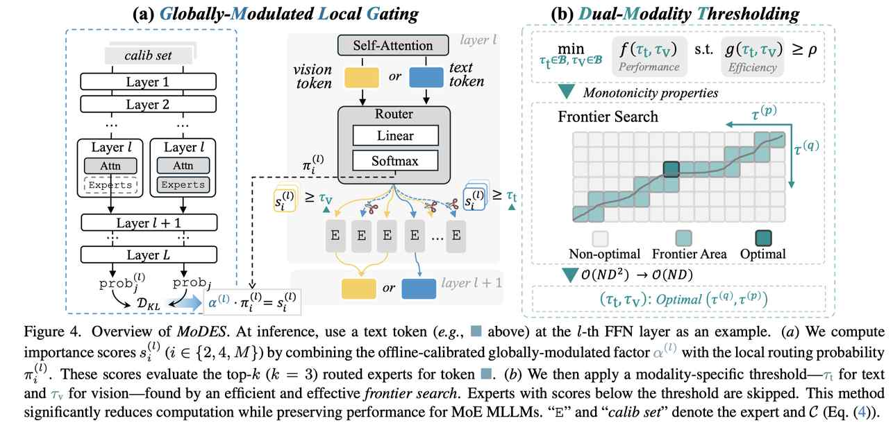

# MoDES: Accelerating Mixture-of-Experts Multimodal Large Language Models via Dynamic Expert Skipping

> Yushi Huang, Zining Wang, Zhihang Yuan, Yifu Ding, Ruihao Gong, Jinyang Guo, Xianglong Liu, Jun Zhang

> **⚠️ 本 note 由 AI Agent 自动生成，仅供参考。生成时间：2025 年。**

## 一句话总结

MoDES 是首个针对多模态大语言模型（MLLM）的无训练动态专家跳过框架，通过全局调制的局部门控（GMLG）和双模态阈值（DMT）机制，在跳过 88% 专家的情况下仍保持 97.33% 的原始性能，同时将预填充速度提升 2.16 倍、解码速度提升 1.26 倍。

## 摘要翻译

混合专家（MoE）多模态大语言模型（MLLM）在视觉-语言任务中表现出色，但计算效率低下。为减少推理开销，已有方法提出根据当前输入 token 跳过冗余专家。然而，我们将这些最初为单模态大语言模型（LLM）设计的方法应用于 MLLM 时，发现性能显著下降。这主要是因为这些方法未能考虑专家在 MoE 各层中的异构贡献，以及不同模态 token 在这些层中的行为差异。基于这些发现，我们提出了 MoDES，首个无训练的自适应专家跳过框架，可实现高效且准确的 MoE MLLM 推理。它引入了全局调制的局部门控（GMLG）机制，将全局层重要性整合到局部路由概率中，以准确估计每个 token 的专家重要性。随后应用双模态阈值（DMT）方法，对每种模态的 token 分别处理，以生成跳过调度。为设置最优阈值，我们引入了一种利用单调性特性的前沿搜索算法，将收敛时间从数天缩短至数小时。在 3 个模型系列、13 个基准上的大量实验表明，MoDES 远超先前方法。例如，当为 Qwen3-VL-MoE-30B-A3B-Instruct 跳过 88% 专家时，性能提升最高达 10.67%（97.33% vs. 86.66%）。此外，MoDES 显著提升了推理速度，预填充时间提升 2.16 倍，解码时间提升 1.26 倍。

## 研究动机

多模态大语言模型（MLLM）已成为视觉-语言任务的主流范式，但随着模型规模增大，推理时面临严重的计算瓶颈。例如，Qwen2-VL（72B 参数）在 2×A100 GPU 上处理 4K token 输入时速度不到 10 tokens/s。

MoE 架构通过稀疏激活部分专家来降低计算成本，但现有 MoE 模型存在**专家利用不充分**的问题——所有 token 都激活相同数量的专家，导致推理效率低下。

已有的专家跳过方法（如 NAEE、MC-MoE、DiEP）专为单模态 LLM 设计，直接应用于 MoE MLLM 会导致**性能严重下降**（跳过 83% 专家时精度下降超过 10%）。

**两个关键洞察：**
1. **全局贡献不平衡**：浅层专家比深层专家对最终输出影响更大。浅层的错误会被后续层放大，导致严重的误差爆炸。现有方法仅考虑层内路由概率，忽略了这一跨层贡献差异。
2. **模态差距**：文本 token 和视觉 token 在 FFN 中的行为显著不同。FFN 对视觉 token 的更新幅度较小（视觉 token 与 FFN 权重更正交），而文本 token 经历更大幅更新。现有方法未考虑这种模态差异。

## 方法（技术细节）

MoDES 是首个针对 MoE MLLM 的无训练动态专家跳过框架，包含两个核心组件和一个高效搜索算法：

### 1. 全局调制的局部门控（Globally-Modulated Local Gating, GMLG）

**核心思想**：将专家的全局层贡献与局部路由概率相结合，计算更准确的专家重要性分数。

**重要性分数公式**：
$$s_i^{(l)} = \alpha^{(l)} \cdot \pi_i^{(l)}$$

其中：
- $\pi_i^{(l)}$ 是局部路由概率（softmax 归一化后的路由 logit）
- $\alpha^{(l)}$ 是全局调制因子，反映第 $l$ 层专家对最终预测的影响

**$\alpha^{(l)}$ 的计算（离线校准）**：
$$\alpha^{(l)} = \frac{1}{N} \sum_{j=1}^{N} D_{KL}\left(\text{prob}_j \| \text{prob}_j^{(l)}\right)$$

通过计算原始模型与跳过第 $l$ 层专家的模型之间输出分布的 KL 散度来量化该层专家的敏感性。该过程在离线校准中完成（使用 1024 个 GQA 样本），推理时无额外开销。

**关键优势**：浅层 $\alpha^{(l)}$ 较大（更重要），深层 $\alpha^{(l)}$ 较小（更可跳过），因此浅层专家被更保守地保留，深层专家被更激进地跳过。

### 2. 双模态阈值（Dual-Modality Thresholding, DMT）

**核心思想**：为文本 token 和视觉 token 分别设置不同的跳过阈值，考虑模态差异。

**跳过规则**：
$$\{\text{Expert}_i^{(l)} | s_i^{(l)} < \tau_t \cdot I_t + \tau_v \cdot I_v\}$$

其中：
- $\tau_t$ 和 $\tau_v$ 分别是文本和视觉模态的阈值
- $I_t$ 和 $I_v$ 是模态指示函数

**实验验证**：视觉 token 可以更激进地跳过专家（因为 FFN 对视觉 token 更新较小，冗余更多），文本 token 需要更保守地保留专家。

### 3. 前沿搜索算法（Frontier Search）

**目标**：在满足目标跳过比例 $\rho$ 的约束下，找到最小化输出分布差异的最优阈值对 $(\tau_t, \tau_v)$。

**问题建模**：
$$\min_{\tau_t \in \mathcal{B}, \tau_v \in \mathcal{B}} f(\tau_t, \tau_v) \quad \text{s.t.} \quad g(\tau_t, \tau_v) \geq \rho$$

其中 $f$ 是平均 KL 散度，$g$ 是跳过比例。

**关键假设（单调性）**：
- $f$ 对各自参数是非递减的（阈值越高 → 跳过越多 → 精度越低）
- $g$ 对各自参数也是非递减的

**算法复杂度**：
- 暴力搜索：$O(ND^2)$（遍历所有阈值对）
- 前沿搜索：$O(ND)$（利用单调性，约 45 倍加速）

**搜索空间**：$\mathcal{B}$ 由 100 个网格点组成（在 (0,1) 区间均匀采样）。

## 实验结果

### 实验设置
- **模型**：3 个 MoE MLLM 系列
  - Kimi-VL-A3B-Instruct（64 个路由专家，k=6）
  - Qwen3-VL-MoE-30B-A3B-Instruct（128 个路由专家，k=8）
  - InternVL-3.5（30B/20B 模型，32-128 个路由专家）
- **基准**：13 个任务（8 个图像理解 + 5 个视频理解）
  - 图像：TextVQA, ChartQA, MMStar, MMBench, MMVet, MME, RealWorldQA, COCO
  - 视频：MVBench, EgoSchema, VideoMME, LongVideoBench, VideoMMMU
- **评测工具**：lmms-eval，MMBench 和 MMVet 使用 DeepSeek-V3.1 评分

### 主要结果

**与基线方法对比（Kimi-VL-A3B-Instruct）：**

| 跳过比例 | MoDES | 最佳基线 | 优势 |
|---------|-------|---------|------|
| 50% | 99.91% | 98.17% (DiEP) | +1.74% |
| 67% | 98.46% | 95.45% (MC-MoE) | +3.01% |
| 83% | 96.25% | 88.32% (MC-MoE) | +7.93% |

**跨模型性能（Qwen3-VL-MoE-30B-A3B-Instruct，跳过 88%）：**

| 方法 | 平均性能 |
|------|---------|
| k=1（基线） | 60.11% |
| NAEE | 80.60% |
| MC-MoE | 86.66% |
| DiEP | 85.30% |
| **MoDES** | **97.33%** |

**跨模型性能（InternVL-3.5-30B-A3B-HF，跳过 88%）：**

| 方法 | 平均性能 |
|------|---------|
| k=1（基线） | 59.63% |
| NAEE | 78.88% |
| MC-MoE | 86.20% |
| DiEP | 83.26% |
| **MoDES** | **97.03%** |

**推理加速：**
- 预填充（prefilling）：~2× 加速（2.04×-2.16×）
- 解码（decoding）：~1.2× 加速（1.19×-1.26×）
- 解码加速较小的原因：解码阶段仅处理文本 token，且 MoE 层的计算减少受限于内存瓶颈

**与量化结合：**
- 2.5-bit 量化 + MoDES 在 Kimi-VL 上保留 >90% 性能
- 1.5-bit 量化 + MoDES 性能下降 17.30%，优于 MC-MoE 的 >20%

**校准和搜索效率：**
- 前沿搜索约 45 倍加速于暴力搜索
- 对 20-30B 参数模型，校准+搜索总耗时 20 分钟至 4 小时（8×H200 GPU）

### 消融实验

**各组件贡献（Kimi-VL-A3B-Instruct，跳过 67%）：**

| 方法 | ChartQA | MME | MMBench | LVB | VMMMU |
|------|---------|-----|---------|-----|-------|
| Thresholding | 85.48 | 2030 | 77.67 | 57.97 | 45.56 |
| + GMLG | 87.64 | 2172 | 79.46 | 60.24 | 46.48 |
| DMT | 87.47 | 2158 | 81.07 | 61.26 | 46.88 |
| DMT + GMLG (MoDES) | **88.24** | **2204** | **82.73** | **62.90** | **48.78** |

- GMLG 对 Thresholding 和 DMT 都有显著提升
- DMT 相比单阈值方法有大幅提升
- 随跳过比例增加，GMLG 和 DMT 的提升更明显

**校准数据选择鲁棒性**：
- 使用 GQA、COCO、VMMMU 三种数据集进行校准和搜索，性能一致
- MoDES 对校准数据选择不敏感

## 优势

1. **首个 MLLM 专用的无训练专家跳过框架**：专门为多模态 MoE 模型设计，填补了该领域的空白
2. **双洞察驱动**：同时考虑层间全局贡献差异和模态差异，比现有方法更准确地识别冗余专家
3. **无训练成本**：离线校准 + 搜索的总成本较低（20 分钟到 4 小时），无需重新训练
4. **显著性能优势**：在高跳过比例（≥80%）下，性能提升 7.93%-10.67%，同时保持 >95% 原始性能
5. **有效推理加速**：预填充 ~2×，解码 ~1.2×
6. **与量化兼容**：与混合精度量化结合时，性能下降显著小于 MC-MoE
7. **高效搜索算法**：前沿搜索 O(ND) 复杂度，比暴力搜索快约 45 倍
8. **跨模型泛化**：在 Kimi-VL、Qwen3-VL、InternVL-3.5 上均表现优异
9. **不敏感于校准数据选择**：使用不同数据集校准，性能基本一致
10. **可发现并移除干扰专家**：在部分基准上，跳过专家后精度反而提升，说明某些专家可能干扰推理

## 局限

1. **依赖离线校准**：虽然校准成本相对较低，但仍需在 GPU 上运行数小时，且需要校准数据
2. **解码加速有限**：解码阶段仅处理文本 token，且受限于内存瓶颈，加速比仅约 1.2×
3. **仅针对 MoE 架构**：方法依赖 MoE 层的路由机制，不适用于非 MoE 架构
4. **需要预定义跳过比例**：需要用户指定目标跳过比例 $\rho$，虽然有搜索算法，但仍需人为设定
5. **依赖超参数**：搜索空间 D=100、校准样本数 N=1024 等超参数可能需要针对不同模型调整
6. **未与其他高效技术联合**：作者提到未来将探索与剪枝和蒸馏等技术结合，但目前未实现
7. **基准范围有限**：仅在 13 个基准上测试，未涉及更广泛的多模态任务

## 与 EfficientPaper 相关的研究方向

### 关键词关联
- **sparse_pruning**：MoDES 的专家跳过可视为一种结构化稀疏剪枝方法
- **structured_sparsity**：跳过整个专家网络实现结构化稀疏，减少计算量

### 相关研究方向
1. **MoE 量化与剪枝**：MoDES 可与 MC-MoE 等量化方法结合，进一步压缩模型
2. **多模态高效推理**：MoDES 为多模态模型的高效推理提供了新范式
3. **动态稀疏激活**：不同于静态剪枝，MoDES 根据输入动态决定跳过哪些专家
4. **层间重要性分析**：MoDES 的全局调制机制揭示了 MoE 层间重要性差异
5. **模态感知高效计算**：DMT 方法展示了模态差异在高效推理中的重要性
6. **无训练模型压缩**：MoDES 无需重新训练，属于无训练高效方法
7. **自适应推理加速**：根据输入动态调整计算量，与投机解码（Speculative Decoding）等技术有相似之处
8. **多模态 MoE 架构优化**：为 MoE MLLM 的架构设计提供参考（浅层应更关键）

### 与 EfficientPaper 现有论文的关系
- **DiEP**（2025）：同为 MoE 压缩方法，MoDES 在多模态场景下显著优于 DiEP
- **MC-MoE**（2024）：MoDES 与 MC-MoE 的量化策略兼容，且性能更优
- **NAEE**（2024）：MoDES 解决了 NAEE 在 MLLM 上的性能下降问题
- **MoE-Llava**（2024）：MoDES 可应用于类似 MoE MLLM 架构的模型
- **Switch Transformers**（2022）：MoDES 基于 MoE 路由机制，是其高效化的延续
