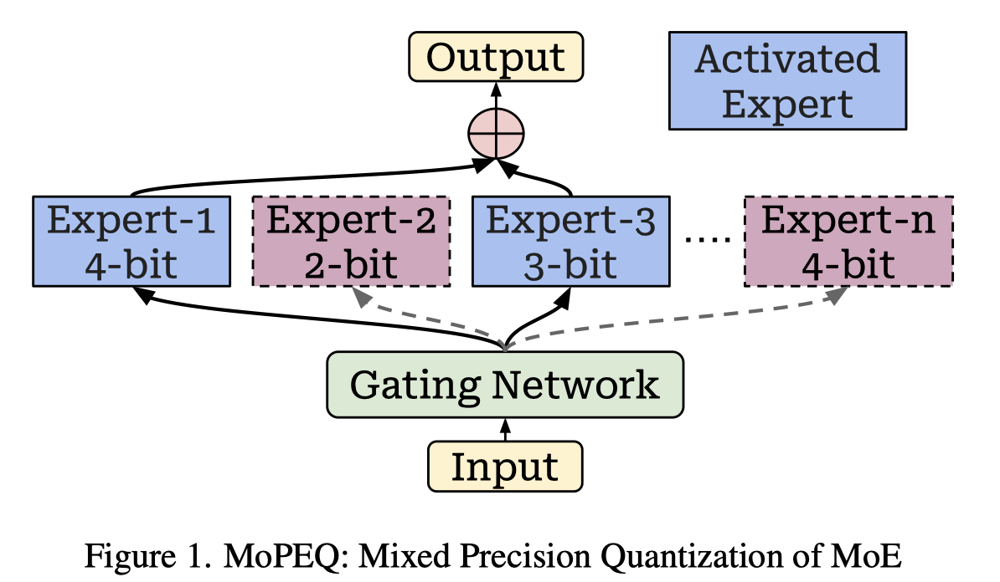

# MoPEQ: Mixture of Mixed Precision Quantized Experts

> Krishna Teja Chitty-Venkata, Jie Ye, Murali Emani

> **⚠️ 本文由 AI Agent 自动生成，基于 arXiv:2509.02512v1 论文全文阅读。生成时间：2025 年。内容仅供参考，请以原文为准。**

## 一句话总结

MoPEQ 提出了一种基于 Hessian 迹近似的逐专家混合精度量化方法，通过 K-means 聚类将相似重要性的专家分组并分配不同位宽（2/3/4 bit），在不依赖校准数据集的情况下，实现 VLM-MoE 模型约 1.5× 内存压缩且精度损失在 5% 以内。

## 摘要翻译

大型语言和视觉模型采用专家混合（MoE）架构时，因其巨大的计算和内存需求而面临严峻的部署挑战。混合精度量化根据层敏感度和模型中的重要性，为不同层分配不同的精度。在这项工作中，我们提出了一种训练后量化（PTQ）算法 MoPEQ，为每个专家分配最优位宽。我们的方法通过使用 Hessian 迹近似分析每个专家的敏感度来平衡准确性和模型大小，而不是依赖专家的激活频率。这种逐专家粒度的方法将相似的专家聚类，以维持模型性能同时降低内存需求。在 VLMEvalKit 基准数据集上使用最新的 VLM 模型（DeepSeek-VL2 -tiny, -small, -base 和 MolmoE 模型）的实验结果表明，我们的混合精度量化 MoE 在内存占用方面取得了显著改进，同时保持了与均匀精度基线方法相当的准确性。我们还进行了全面研究，分析了专家激活频率和使用 Hessian 迹近似在逐层和模型全局专家精度分配（2、3 和 4 位）中的影响，以提供对 VLM-MoE 混合精度量化的深入理解。

## 研究动机

1. **MoE 模型的部署困难**：MoE 架构（如 DeepSeek-VL2、MolmoE-1B）参数量大，内存和计算需求高，部署面临巨大挑战。

2. **现有量化方法的局限**：
   - 均匀量化对所有专家一视同仁，压缩效率低，可能导致精度显著下降。
   - 现有混合精度方法多基于专家激活频率（如 MC-MoE），但激活频率不能准确反映专家对模型的重要性。例如，DeepSeek-V2 使用负载均衡损失，使得所有专家的激活频率相对均匀，激活频率无法有效区分专家重要性。
   - 低激活频率的专家不一定不重要；如果该专家在推理时被使用且对量化敏感，量化误差会在整个网络中传播。

3. **VLM-MoE 混合精度量化的空白**：据作者所知，这是首个针对 VLM-MoE 的混合精度量化工作，现有研究主要集中在纯 LLM 空间。

## 方法（技术细节）

### 3.1 专家敏感度评估：Hessian 迹近似

**核心思想**：不依赖校准数据集，通过 Hessian 迹近似（Hessian trace approximation）来估计每个专家的量化敏感度。

**数学基础**：
- Hessian 矩阵 $H_{ij} = \frac{\partial^2 L}{\partial \theta_i \partial \theta_j}$，描述损失函数的二阶性质。
- 完整计算 Hessian 的空间复杂度为 $O(d^2)$，时间复杂度为 $O(d^3)$，对大型模型不可行。

**Hutchinson 算法**（Algorithm 1）：
- 使用随机采样向量 $v \sim N(0,1)$ 估计 Hessian 迹：$\text{Tr}(H) \approx \frac{1}{m} \sum_{i=1}^m T[i]$
- 以 Frobenius 范数 $L = \|W\|_F$ 作为代理损失函数（smooth and differentiable，与 Hessian 谱性质强相关）
- 计算一阶梯度 $g_1 = \nabla_W L$
- 通过 Hessian-向量积（HVP）避免显式计算 Hessian：$\text{HVP} = \nabla_W(g_1^\top v)$
- 每个样本的迹估计：$T[i] = \sum(v \odot \text{HVP})$
- 最终 Hessian 迹为所有样本的平均值

**关键特点**：
- **数据无关（Data-free）**：不需要校准数据集，避免了激活频率方法的偏差问题。
- 每个专家的 Hessian 迹为其 Gate、Up 和 Down 三个层的 Hessian 之和。

### 3.2 专家重要性综合度量

将激活频率（AF）和 Hessian 灵敏度（H）结合，归一化后计算专家的综合重要性：

$$I_i = \left(\frac{AF_i - \min_j AF_j}{\max_j AF_j - \min_j AF_j}\right) \cdot \left(\frac{H_i - \min_j H_j}{\max_j H_j - \min_j H_j}\right)$$

**发现**：
- MolmoE-1B 中，只有少数专家持续表现出高重要性（不均衡利用）。
- DeepSeek-VL2-Tiny 和 Base 模型在中间层比首尾层更重要。

### 3.3 专家聚类与位宽分配（MoPEQ 算法）

**核心算法（Algorithm 2）**：
1. 定义位宽列表 $P = \{2, 3, 4\}$
2. 从所有专家中提取重要性值 $V = \{I(l) | l \in L\}$
3. 应用 K-means 聚类，将专家分成 $C = |P|$ 个簇
4. 对每个簇计算均值重要性 $\mu_c = \frac{1}{|L_c|} \sum_{i \in L_c} V_i$
5. 按均值重要性降序排列簇，最高位宽分配给最簇重要性的簇，逐级递减

**两种精度分配策略**：
- **逐层分配（Layer-wise）**：在每个 MoE 层内部独立聚类和分配精度，关注层内专家的相对重要性。
- **模型全局分配（Model-wise）**：将整个模型的所有专家作为一个实体进行聚类和分配，从全局视角考虑效率，优先保证最重要层的精度。

### 3.4 实验设置

- **量化框架**：AutoRound，使用 SignRound 作为量化函数。
- **量化搜索空间**：2、3、4 位混合精度分配。
- **评估基准**：VLMEvalKit，包括 MME、TextVQA、AI2D、DocVQA、MMMU、InfoVQA、RealWorldQA、ScienceQA。
- **模型**：MolmoE-1B（7.2B 参数，16 层，64 专家/层，8 激活专家）、DeepSeek-VL2-Tiny（3B）、DeepSeek-VL2-Small（16B）、DeepSeek-VL2-Base（27B）。
- **基线**：均匀量化（16-bit、8-bit、4-bit）、激活频率方法、逐层分配方法。

## 实验结果

### 关键发现

1. **Hessian 灵敏度 vs 激活频率**：
   - DeepSeek-VL2-Base 在 9 个任务中 7 个任务上，灵敏度方法优于激活频率方法。
   - 敏感度方法在激活频率均匀分布的模型（如 DeepSeek-VL2）上优势尤为明显。
   - 混合度量（归一化频率 × 灵敏度）方法在 MolmoE-1B 的 MME 感知任务中超过均匀 4-bit 量化（1338 vs 1300），同时使用更少参数。

2. **逐层 vs 模型全局**：
   - 模型全局分配在 63 个场景中优于逐层分配（63 vs 42）。
   - DeepSeek-VL2-Small 模型：27 个组合中 22 个场景模型全局分配更优。
   - 模型全局分配更能从全局视角优化效率，避免层间不均衡。

3. **内存压缩效果**：
   - 模型大小约降低 1.5×，同时精度损失在 5% 以内。
   - 例如 MolmoE-1B 的混合精度模型仅 2.77-2.79 GB（原始 13.45 GB），DeepSeek-VL2-Base 降至 10.485 GB。

4. **典型数值**（MolmoE-1B 模型）：
   - 均匀 4-bit：DocVQA 75.937，MME-Perception 1300.088
   - MoPEQ（Hessian 灵敏度，模型全局）：DocVQA 75.495，MME-Perception 1338.090
   - MoPEQ（混合，模型全局）：DocVQA 72.668，MME-Perception 1245.821

## 优势

1. **数据无关**：基于 Hessian 迹近似，无需校准数据集，避免了激活频率方法的数据偏差问题。
2. **逐专家粒度**：精细到每个专家的敏感度分析，而非粗粒度的逐层或逐模型分析。
3. **显著内存压缩**：约 1.5× 模型压缩，精度损失在 5% 以内。
4. **通用性强**：算法设计为即插即用，可集成到任何支持给定模型量化的量化框架中。
5. **理论基础扎实**：基于 Hessian 二阶信息的敏感度评估，比激活频率更准确地反映专家的重要性。
6. **模型全局 vs 逐层策略**：模型全局分配策略在大多数场景下优于逐层分配，显示了全局优化的价值。
7. **硬件潜在优势**：MoPEQ 对高频激活的专家分配较低精度，减少 CPU-GPU 间的数据传输和计算时间，提升推理效率。

## 局限

1. **缺乏硬件性能评估**：由于现有推理框架（如 vLLM）对 VLM-MoE 的混合精度量化支持有限，论文未包含实际硬件性能测试。
2. **量化范围受限**：仅对 MoE 层内的专家进行混合精度量化，其他层采用均匀量化，未实现全模型混合精度。
3. **位宽范围有限**：搜索空间仅限于 2、3、4 位，未探索更低位宽（如 1-bit）或更高位宽的权衡。
4. **模型泛化性**：仅在 4 个 VLM-MoE 模型上验证，未在更多模型或任务上验证泛化能力。
5. **K-means 聚类依赖**：位宽分配依赖 K-means 聚类，聚类参数（如簇数）的选择对结果有影响。
6. **仅限于 PTQ**：方法为训练后量化，未考虑量化感知训练（QAT）的可能收益。
7. **Hessian 迹近似的精度**：使用 Frobenius 范数作为代理损失，其与真实量化损失的相关性可能在某些情况下不完美。

## 与 EfficientPaper 相关的研究方向

1. **模型压缩与量化**：MoPEQ 是混合精度量化的重要进展，属于模型压缩领域的核心方向，直接关联 EfficientPaper 中的量化研究方向。
2. **MoE 模型优化**：MoE 架构的专家选择和压缩是当前高效 AI 的热点，MoPEQ 的逐专家粒度优化方法可启发后续的 MoE 效率研究。
3. **Hessian 感知方法**：基于 Hessian 的敏感度评估方法（如 HAWQ 系列）在模型压缩中有广泛应用，MoPEQ 的无数据 Hessian 迹近似方法可推广到其他压缩任务。
4. **Vision-Language Model 高效推理**：VLM-MoE 的高效推理（特别是内存受限场景下的模型部署）是当前重要的研究方向。
5. **硬件-软件协同设计**：论文提到未来将集成混合精度量化到 vLLM 并提供硬件性能评估，这与 EfficientPaper 中关注的推理效率优化相关。
6. **负载均衡与专家利用**：DeepSeek-V2 的负载均衡机制对量化的影响，以及如何在均匀激活和非均匀激活场景下进行有效量化，是值得深入研究的方向。
