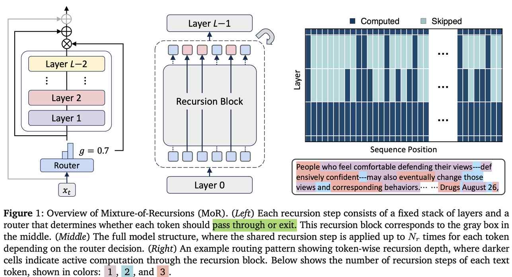

# Mixture-of-Recursions: Learning Dynamic Recursive Depths for Adaptive Token-Level Computation

> Sangmin Bae, Yujin Kim, Reza Bayat, Sungnyun Kim, Jiyoun Ha, Tal Schuster, Adam Fisch, Hrayr Harutyunyan, Ziwei Ji, Aaron Courville, Se-Young Yun

## 一句话总结

MoR 提出了一种统一的递归 Transformer 框架，通过轻量级路由器为每个 token 动态分配不同的递归深度，同时实现参数共享、自适应计算和高效 KV 缓存，在同等训练计算量下显著降低了模型参数和验证困惑度。

## 摘要翻译

扩展语言模型能释放令人惊叹的能力，但随之而来的计算和内存需求使得训练和部署变得昂贵。现有的效率优化工作通常只针对参数共享或自适应计算中的一个方向，而如何同时实现两者仍是一个开放问题。本文介绍了 Mixture-of-Recursions（MoR），一个在单一递归 Transformer 内统合两个效率轴的框架。MoR 通过在递归步骤间复用共享层来实现参数效率，同时轻量级路由器通过为每个 token 动态分配不同的递归深度来实现自适应 token 级思考。这使得 MoR 能够将二次注意力计算集中在给定递归深度下仍然活跃的 token 之间，并通过选择性地缓存它们的 KV 对进一步提高内存访问效率。除了核心机制外，还提出了 KV 共享变体，复用第一次递归的 KV 对，专门用于降低预填充延迟和内存占用。在 135M 到 1.7B 参数的模型规模上，MoR 形成了新的 Pareto 前沿：在相同的训练 FLOPs 和更小的模型规模下，显著降低了验证困惑度并提高了少样本准确率，同时提供了比基线更高的吞吐量。

## 研究动机

- **效率双重需求**：大规模语言模型的训练和部署面临参数效率（参数共享）和计算效率（自适应计算）的双重挑战。
- **现有方法的不足**：递归 Transformer 虽然通过参数共享减少了参数量，但大多数方法采用固定的递归深度，无法为不同 token 分配不同的计算资源。
- **参数共享与自适应计算的统一缺失**：已有工作分别从参数共享（如 Universal Transformer、ALBERT）和自适应计算（如 early-exiting、MoD）两个方向进行优化，但缺乏一个统一的框架同时实现两者。
- **KV 缓存瓶颈**：传统递归模型中每个深度使用不同的 KV 缓存，缓存大小无法减少，导致推理时高检索延迟成为严重瓶颈。

## 方法（技术细节）

### 核心架构：Mixture-of-Recursions (MoR)

MoR 的核心思想是在递归 Transformer 的基础上，通过轻量级路由器动态分配每个 token 的递归深度，实现参数共享、自适应计算和高效 KV 缓存的统一。

### 1. 参数共享策略

- **Cycle 策略**：递归块循环复用。例如 L=9 层、N_r=3 次递归时，权重共享为 [(0,1,2), (0,1,2), (0,1,2)]。
- **Sequence 策略**：每个递归块连续复用同一层后再切换到下一层，如 [(0,0,0), (1,1,1), (2,2,2)]。
- **Middle-Cycle/Middle-Sequence**：保留第一层和最后一层的独立参数，仅在中间层共享权重。
- **实验结论**：Middle-Cycle 是最有效的参数共享策略，在各模型规模和计算预算下均表现最佳。

### 2. 路由策略：Expert-choice vs. Token-choice

#### Expert-choice 路由
- 每个递归深度成为一个"专家"，选择 top-k token 通过。
- 路由分数：$g_r^t = \mathcal{G}(\theta_r^T \mathcal{H}_r^t)$，其中 $\mathcal{G}$ 为 sigmoid 或 tanh 激活函数。
- 采用分层过滤：仅在递归步骤 r 被选中的 token 才能在 r+1 步重新评估。
- **优势**：保证完美的负载平衡，静态计算预算。
- **问题**：违反因果性（训练时需要未来 token 信息），需要辅助路由器或辅助损失来解决信息泄露。
- **最佳配置**：辅助损失 + sigmoid 激活 + 线性路由器。

#### Token-choice 路由
- 每个 token 从开始就确定其完整的递归序列，通过单次路由决策分配递归深度。
- 路由函数：$g_t = \mathcal{G}(\theta_r^T \mathcal{H}_1^t)$，使用 top-1 门控分配到专家。
- **优势**：无信息泄露，保持自回归特性。
- **问题**：存在负载不平衡，需要平衡损失或无损算法。
- **最佳配置**：softmax 激活 + MLP 路由器 + 平衡损失（显著降低 MaxVio）。

### 3. KV 缓存策略

#### Recursion-wise KV 缓存
- 仅缓存当前递归步骤中被路由的 token 的 KV 对。
- 注意力仅限于当前步骤的本地缓存 token。
- KV 内存和 IO 减少到约 $(N_r+1)/(2N_r)$，注意力 FLOPs 减少到 $(k/N_{ctx})^2$。

#### Recursive KV 共享
- 在第一次递归步骤缓存所有 token 的 KV 对，后续步骤复用。
- 所有 token 可访问完整的上下文，无需重新计算。
- 显著减少预填充时间和内存，但注意力 FLOPs 仅减少 $k/N_{ctx}$，KV IO 仍较高。

### 4. 连续深度分批（Continuous Depth-wise Batching）

- 利用递归架构的参数共享特性，将不同递归深度的 token 分组到同一 batch。
- 消除计算气泡（等待其他样本完成的空闲期），显著提高推理吞吐量。
- MoR 的 early-exiting 机制进一步消除计算气泡。

## 实验结果

### 主要结果（等 FLOPs 条件下）
- **MoR (Expert, Cache, M-Cyc, Nr=2)**：167M 参数，16.5e18 FLOPs，NLL 2.7511，Few-shot 43.1%
- **Vanilla Transformer**：315M 参数，16.5e18 FLOPs，NLL 2.7824，Few-shot 42.3%
- MoR 用近 50% 更少的参数，获得了更低的验证损失和更高的少样本准确率。

### 主要结果（等 tokens 条件下）
- **MoR (Nr=2)**：仅用 12.3e18 FLOPs（比 Vanilla 少 25%），在 20B tokens 上训练。
- 训练时间减少 19%，峰值内存减少 25%。

### IsoFLOP 分析（135M~1.7B）
- MoR 在所有模型规模和计算预算下持续优于递归基线。
- 在 >360M 参数时，MoR 不仅匹配而且经常超过 Vanilla Transformer。
- 在低和中等计算预算下表现尤为突出。

### 推理吞吐量
- MoR 在两种 batch 配置下均优于 Vanilla 基线。
- MoR-4 在 B=Max 时实现高达 2.06× 加速。
- 递归深度增加带来更多的 token 提前退出和 KV 缓存减少，进一步提升吞吐量。

### 消融研究
- **参数共享策略**：Middle-Cycle 在 135M 和 360M 规模下均实现最低验证损失。
- **路由策略**：Expert-choice 路由（辅助损失 + sigmoid + 线性）显著优于 token-choice 路由。
- **KV 缓存策略**：KV 共享在 Expert-choice 下导致性能下降，但在 token-choice 下可提升性能（通过额外上下文信息补偿较弱的路由决策）。

### 计算最优缩放分析
- MoR 的最优缩放路径斜率更大（更接近零），表明 MoR 从增加参数中获益更多（更不依赖数据量）。
- 最优策略是分配资源到增加模型容量（使用更大模型、更短训练）。

### 测试时缩放分析
- MoR 通过更深的递归实现测试时缩放。
- 递归深度增加不仅提供额外计算，还使每步能够专门精炼特定深度的 token 表示。
- 支持 MoR 在推理时分配更多递归步骤可提高生成质量的观点。

### 路由分析
- 递归深度分配反映 token 的语义重要性。
- 内容丰富的 token（如 "People"、"Drugs"）获得 3 次递归。
- 功能词（如 "and"、"---"）仅获得 2 次递归。
- 中等重要性词仅获得 1 次递归。

## 优势

1. **统一框架**：首次将参数共享、自适应 token 级计算和高效 KV 缓存统合在一个架构中。
2. **参数效率**：通过递归权重共享，模型参数仅为 Vanilla Transformer 的 1/3（Nr=3），但性能接近或超过。
3. **自适应计算**：轻量级路由器动态分配递归深度，将计算集中在最需要的 token 上。
4. **高效 KV 缓存**：递归式 KV 缓存策略显著减少 KV 内存和 IO，提高推理吞吐量。
5. **连续深度分批**：利用递归架构的参数共享特性，消除计算气泡，显著提高推理吞吐量。
6. **测试时缩放**：支持在推理时分配更多递归步骤以提高生成质量。
7. **潜在推理能力**：MoR 框架天然支持潜在推理，通过自适应确定每个 token 的必要递归深度。
8. **可扩展性**：在 135M~1.7B 参数范围内表现出良好的可扩展性。

## 局限

1. **模型规模有限**：实验仅限于最大 1.7B 参数模型，未来需要在更大规模（>3B）上验证。
2. **自适应容量控制**：Expert-choice 路由在训练后难以调整 top-k 值，限制了推理时的灵活容量分配。
3. **路由策略局限**：Token-choice 路由存在负载不平衡问题，难以在异构专家间保持均匀分配。
4. **KV 共享的性能权衡**：递归 KV 共享虽然减少了内存，但在 Expert-choice 路由下导致显著性能下降。
5. **缺乏推理任务验证**：未在实际推理数据集上验证 MoR 的潜在推理能力。
6. **计算最优缩放行为**：MoR 倾向于使用更大模型和更短训练，可能限制了其在数据效率方面的表现。
7. **与稀疏算法的集成**：虽然提出了与稀疏算法的兼容性，但未进行实际验证。
8. **多模态扩展**：递归块本质上是模态无关的，但未在视觉、语音等领域进行实验验证。

## 与 EfficientPaper 相关的研究方向

1. **结构设计（structure_design）**：MoR 提出了一种新的递归 Transformer 架构，通过动态递归深度实现参数效率和计算效率的统一，为高效的结构设计提供了新范式。
2. **注意力稀疏性（attention_sparsity）**：MoR 通过递归式 KV 缓存和自适应 token 级路由，实现了注意力计算的稀疏化，与注意力稀疏性研究方向密切相关。
3. **参数共享与自适应计算的统一**：MoR 将参数共享和自适应计算统合在一个框架中，为未来的高效模型设计提供了重要参考。
4. **递归 Transformer 的发展**：MoR 在递归 Transformer 的基础上进行了改进，为递归 Transformer 的进一步发展提供了新的研究方向。
5. **测试时缩放**：MoR 支持在推理时分配更多递归步骤以提高生成质量，与测试时缩放研究方向密切相关。
6. **潜在推理**：MoR 框架天然支持潜在推理，通过自适应确定每个 token 的必要递归深度，为潜在推理研究提供了新思路。
7. **高效推理**：MoR 通过连续深度分批和递归式 KV 缓存显著提高了推理吞吐量，为高效推理研究提供了重要参考。
8. **模型压缩与量化**：MoR 通过参数共享减少了模型参数，与模型压缩和量化研究方向密切相关。

---

> ⚠️ **生成声明**：本 note 由 AI Agent 自动生成，基于论文全文（arXiv:2507.10524v1）的完整内容。生成时间：2025 年。note 内容仅供参考，建议结合原始论文进行验证。
