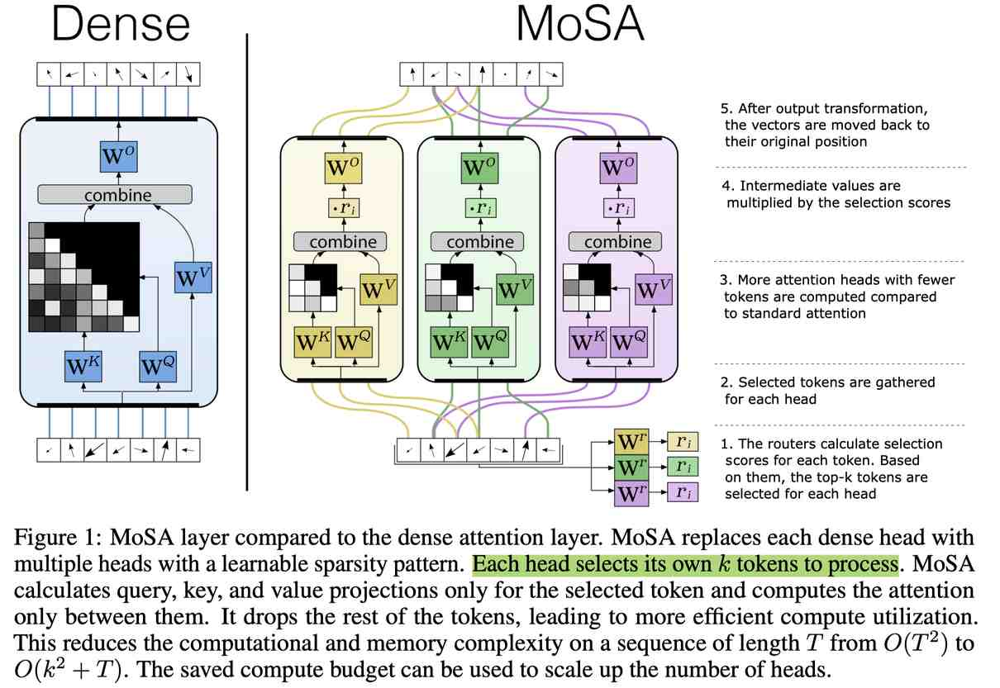

# Mixture of Sparse Attention: Content-Based Learnable Sparse Attention via Expert-Choice Routing

> **本文由 AI Agent 自动生成，仅供参考。生成时间：2025年。**

## 一句话总结

MoSA 提出了一种基于专家选择路由（Expert-Choice Routing）的可学习稀疏注意力机制，通过每个注意力头动态选择少量关键 token，将注意力复杂度从 O(T²) 降至 O(k²+T)，在等 FLOP 设定下相比密集注意力基线最高实现 27% 的困惑度提升。

## 摘要翻译

近年来大语言模型（LLM）的发展突显了自注意力机制的二次计算开销问题。尽管研究者已付出大量努力，次二次复杂度的注意力方法在实践中仍表现欠佳。我们假设，动态的、基于内容的可学习稀疏性能够带来更高效的注意力机制。本文提出**混合稀疏注意力（Mixture of Sparse Attention, MoSA）**，一种受混合专家（MoE）和专家选择路由（Expert-Choice Routing）启发的新方法。MoSA 为每个注意力头动态选择 token，允许任意稀疏注意力模式。通过从长度为 T 的序列中选择 k 个 token，MoSA 将每个注意力头的计算复杂度从 O(T²) 降低到 O(k²+T)。这使得在相同计算预算下可以使用更多的注意力头，从而实现更高的专业化程度。实验表明，在测试的稀疏注意力变体中，MoSA 是唯一能够超越密集基线的方法，有时在相同计算预算下可获得高达 27% 的困惑度改善。MoSA 还能减少资源使用：尽管仅使用 PyTorch 实现而未优化 CUDA 内核，困惑度匹配的 MoSA 模型在训练时同时具备更快的时钟速度、更低的内存占用，以及显著更小的 KV 缓存。

## 研究动机

1. **自注意力的二次开销瓶颈**：Transformer 的自注意力机制在序列长度 T 上具有 O(T²) 的计算和内存复杂度。随着模型规模和上下文窗口不断增长，训练和部署成本急剧上升，KV 缓存的内存占用成为推理瓶颈。
2. **现有稀疏注意力方法的局限**：
   - **静态稀疏注意力**（如 Sparse Transformer、Longformer、BigBird）：使用固定的手工定义模式（如块稀疏、步幅注意力），不依赖数据内容，强制将多个 token 压缩为单一表示，损失细粒度信息。
   - **线性注意力**：通过去除非线性性改变运算顺序来降低注意力成本，但实际性能远不及二次注意力。
   - **状态空间模型（SSM）**：将整个过去压缩为固定大小的表示，存在信息损失问题，性能仍不如全注意力。
   - **内容动态稀疏注意力**（如 Routing Transformer）：使用在线 K-means 聚类 token，但由于 K-means 收敛速度极慢，未能展示显著性能提升。
3. **MoE 在注意力中的应用**：现有将 MoE 应用于注意力的工作（如 MoA、SwitchHead）主要关注减少可物化密集注意力矩阵的数量，而非使注意力矩阵本身稀疏。MoSA 提出了不同的方案：通过为每个头选择少量 token 来实现注意力矩阵的稀疏化。
4. **核心假设**：动态的、基于内容的可学习稀疏性可以比静态稀疏注意力产生更高效的注意力机制，因为它可以独立地为每个头选择相关 token，避免信息压缩损失。

## 方法（技术细节）

### 2.1 核心思想

MoSA 受 MoE 的专家选择路由（Expert-Choice Routing）启发：将每个注意力头视为一个"专家"，让每个头自己选择要处理的 token 子集（而非传统 MoE 中 token 选择专家）。这确保了完美的负载均衡，无需复杂的正则化技术。

### 2.2 MoSA 的具体实现

**路由机制**：每个 MoSA 头增加一个路由权重矩阵 $W_r \in \mathbb{R}^h$。给定输入序列 $X \in \mathbb{R}^{T \times h}$，路由器计算每个 token 的选择分数：

$$r = \sigma(X W_r) \in \mathbb{R}^T$$

其中 $\sigma$ 为非竞争性 sigmoid 函数（使用 $\sigma$-MoE 的设计）。

**Top-K 选择**：使用专家选择路由，从 T 个 token 中选出 k 个：

$$r_{topk}, I = \text{TopK}(r, k)$$

其中 $I \in \{0, \ldots, T-1\}^k$ 为所选 token 的索引。

**稀疏注意力计算**：仅对选出的 k 个 token 计算 query、key、value：

$$X_s = (X_{I_1}, X_{I_2}, \ldots, X_{I_k}) \in \mathbb{R}^{k \times h}$$

$$Q = X_s W_Q, \quad K = X_s W_K, \quad V = X_s W_V$$

因果掩码也需要适应：$M_{i,j} = 0 \Leftrightarrow I_i \geq I_j$，否则为 $-\infty$。

$$A = \text{Attention}(Q, K, V, M)$$

**输出与路由权重**：注意力输出乘以路由权重 $r$，然后变换回原始序列位置：

$$X_o = \text{diag}(r) A W_o \in \mathbb{R}^{k \times h}$$

$$Y_j = \begin{cases} X_{o_i} & \text{if } j = I_i \text{ for some } i \in \{1, \ldots, k\} \\ 0 & \text{otherwise} \end{cases}$$

路由权重的引入确保 token 的贡献与路由器输出成正比，且路由器可通过梯度下降学习。

**复杂度降低**：每个 MoSA 头将计算从 O(T²) 降至 O(k²+T)，其中 2hT 为路由评分开销，h'k 为输出缩放开销。当 k << T 时，节省显著。

### 2.3 混合架构（Hybridization）

MoSA 与 4 个密集注意力头组合使用（通过实验验证 4 个是最佳数量）：
- 密集头保证训练稳定性（纯 MoSA 模型因路由与注意力同时学习的不稳定性而性能下降）
- MoSA 头处理稀疏的全局依赖关系
- 密集头处理局部上下文

### 2.4 位置编码

使用旋转位置编码（RoPE），但需要适配以反映 token 在原始序列中的位置（而非选出的子集中的位置）。

### 2.5 与 Routing Transformer 的关键区别

| 方面 | MoSA | Routing Transformer |
|------|------|---------------------|
| 选择机制 | 通过可学习路由函数直接优化 | 在线 K-means 聚类（收敛慢） |
| Q/K 变换 | Q 和 K 独立投影 | 需要 W_Q = W_K |
| 投影计算 | 仅对选出的 token 计算 Q/K/V/O | 需要计算所有 token 的 Q/K/V/O |
| 头专业化 | 每个头有独立的权重 | 所有簇共享相同的变换 |
| 负载均衡 | 专家选择路由天然保证完美均衡 | 需要额外机制 |

### 2.6 与 MoA、SwitchHead 等的关系

- **MoA（Mixture-of-Attention Heads）**：为每个 token 选择 k 个查询变换，共享单一 K/V 投影（类似 MQA）。MoSA 选择 token（而非查询变换），且每个头有独立的 Q/K/V/O 投影。
- **SwitchHead**：减少注意力头数量，通过 MoE 补偿。与 MoSA 正交，可结合使用。
- **MoD（Mixture-of-Depths）**：选择输入是否通过整个 transformer 块。MoSA 为每个头选择 token，以分布式方式处理句子。

## 实验结果

### 实验设置

- **数据集**：C4，训练 100k 批次，批次大小 B=64，序列长度 T=1024（约 6.5B token）
- **分词器**：SentencePiece，词汇量 8000
- **优化器**：Adam，学习率 0.00025，梯度裁剪 0.25，4k 步线性预热
- **模型规模**：Tiny（28M）、Small（113M）、Medium（210M）、Large（516M）
- **基准方法**：Dense（密集注意力）、Fixed（固定稀疏注意力）、Routing（Routing Transformer）

### 3.2 主要结果（IsoFLOP 设定）

| 模型规模 | Dense PPL | MoSA 最佳 PPL | Fixed 最佳 PPL | Routing 最佳 PPL |
|---------|-----------|--------------|---------------|-----------------|
| Tiny (28M) | 22.46 | 16.39 (**-27.0%**) | 23.28 (+3.7%) | 23.33 (+3.9%) |
| Small (113M) | 16.01 | 12.85 (**-19.7%**) | 16.51 (+3.1%) | 16.43 (+2.6%) |
| Medium (210M) | 13.95 | 11.06 (**-20.7%**) | 14.35 (+2.9%) | 14.21 (+1.9%) |
| Large (516M) | 12.20 | 10.58 (**-13.3%**) | 12.40 (+1.6%) | 12.24 (+0.3%) |

- MoSA 是**唯一**能超越密集基线的稀疏注意力方法
- 固定稀疏注意力和 Routing Attention 在所有稀疏度下均劣于密集基线
- MoSA 困惑度随稀疏度增加单调下降，在 ρ ≈ 64 附近达到最优，之后开始下降（"U"形曲线）
- MoSA 在某些配置下甚至在**参数匹配**设定下也更高效：Medium 模型 ρ=8（442M 参数，PPL 12.16）优于 Large 密集基线（516M 参数，PPL 12.20）

### 3.3 资源优化（困惑度匹配设定）

| 模型 | Dense Heads | MoSA Heads | PPL | 时钟速度提升 | 内存节省 | KV Cache 缩减 |
|------|------------|------------|-----|------------|---------|-------------|
| Tiny | 9 → 4 | 0 → 17 | 22.46 → 22.40 | -7.3% | -10.0% | **-51.1%** |
| Small | 9 → 4 | 0 → 14 | 16.02 → 16.01 | -2.1% | -3.1% | **-52.2%** |
| Medium | 9 → 4 | 0 → 12 | 13.94 → 13.76 | -4.4% | -1.6% | **-52.2%** |
| Large | 16 → 4 | 0 → 16 | 12.20 → 12.16 | -12.9% | -9.2% | **-69.5%** |

- MoSA 在困惑度匹配的同时，同时实现了更快的时钟速度、更低的内存消耗
- KV 缓存大幅缩减（超过 50%），对 LLM 推理具有重要实用价值
- 仅使用 PyTorch 实现，未优化 CUDA 内核，预计专用内核可带来更大收益

### 3.4 长序列实验

- 将序列长度从 1024 扩展到 8192，k 保持为 64（ρ 从 16 增至 128）
- 与局部注意力（local attention）结合（长序列场景的标准做法）
- MoSA 在所有序列长度下均显著优于其他稀疏方法
- 在 T=8192 时，60 个 MoSA 头的 FLOP 仅为 4 个 Routing Transformer 头的 22.99%，但性能更优

### 3.5 下游任务（零样本）

- 评测任务：LAMBADA、WinoGrande、BLiMP、HellaSwag、PIQA、AI2ARC
- MoSA 在 Tiny/Small/Medium 规模下通常优于其他模型
- BLiMP 例外：由于大多数样本极短（<10 token），MoSA 头的选择与训练分布不匹配
- Large 规模下 Dense 基线表现更好（MoE 架构的专家过专业化问题）

## 优势

1. **唯一能超越密集基线的稀疏注意力**：在 IsoFLOP 设定下，MoSA 是唯一能持续优于密集注意力的方法
2. **显著的性能提升**：最高可达 27% 的困惑度改善（Tiny 模型）
3. **多维度效率提升**：在困惑度匹配设定下，同时降低时钟时间、内存和 KV 缓存
4. **KV 缓存大幅缩减**：超过 50% 的 KV 缓存缩减，对 LLM 推理部署至关重要
5. **无 CUDA 优化的纯 PyTorch 实现**：已经展示出效率增益，专用内核将带来更大提升
6. **长序列优势**：在长序列（最高 8192 token）场景下保持优于其他稀疏方法
7. **可扩展性**：在 28M 到 516M 的多种规模下均有效
8. **天然负载均衡**：专家选择路由保证完美负载均衡，无需额外正则化
9. **灵活的头专业化**：每个头可以学习独立的稀疏模式和权重，实现高度专业化

## 局限

1. **非自回归特性**：由于使用 top-k 选择，MoSA 本质上是非自回归的，需要适配才能直接应用于自回归场景（如推理时的逐 token 生成）。目前采用训练时的非自回归选择，推理时的自回归适配需要进一步研究。
2. **困惑度提升不总是转化为下游任务提升**：
   - 短序列场景下性能下降（如 BLiMP 数据集中大多数样本 <10 token）
   - MoE 架构的专家过专业化问题影响下游任务
3. **依赖混合架构**：纯 MoSA（无密集头）性能不如密集基线，混合架构（4 个密集头）是必要的，增加了设计复杂度
4. **训练稳定性**：路由与注意力权重需联合学习，早期训练阶段存在不稳定性，可能陷入恶性循环
5. **超参数敏感性**：稀疏度 ρ 的选择影响性能，过高稀疏度（如 ρ=256）会导致每个头仅选 4 个 token，不足以捕获复杂关系
6. **实验规模有限**：最大模型仅 516M，序列长度仅至 8192，未验证在大规模模型和超长序列上的效果
7. **纯 PyTorch 实现**：未优化的内核实现，预期专用 CUDA 内核可带来更大效率提升

## 与 EfficientPaper 相关的研究方向

1. **结构设计（Structure Design）**：MoSA 通过动态稀疏注意力和专家选择路由，在 Transformer 架构层面实现了计算效率的提升，属于高效模型结构设计的前沿方向
2. **稀疏注意力机制**：MoSA 与固定稀疏注意力、Routing Transformer、Native Sparse Attention 等工作共同构成稀疏注意力的研究方向，展示了内容动态稀疏的优势
3. **混合专家（MoE）与注意力机制的结合**：MoSA 将 MoE 的专家选择路由引入注意力层，开辟了 MoE 在注意力机制中的新应用方向
4. **KV 缓存优化**：MoSA 的 KV 缓存缩减与 ScissorHands、SnapKV、PyramidKV 等后训练稀疏注意力方法互补，可作为训练阶段的 KV 缓存优化方案
5. **长序列建模**：MoSA 在长序列场景下的优势与 Longformer、BigBird、StreamingLLM 等工作相关，为超长上下文窗口的高效注意力提供了新方案
6. **等效计算预算下的模型质量提升**：MoSA 的 IsoFLOP 研究方法论对理解稀疏注意力的效率-性能权衡具有重要参考价值
7. **多模态扩展**：论文提到将 MoSA 应用于视觉 Transformer（Vision Transformer）的潜力，可能在多模态高效架构中发挥作用
8. **与 MQA/GQA/SwitchHead 的结合**：MoSA 可与这些方法正交结合，进一步提升效率

---

*参考文献*：Piękos P, Csordás R, Schmidhuber J. Mixture of Sparse Attention: Content-Based Learnable Sparse Attention via Expert-Choice Routing. arXiv:2505.00315, 2025.
*代码*：https://github.com/piotrpiekos/MoSA
*关键词*：structure_design
