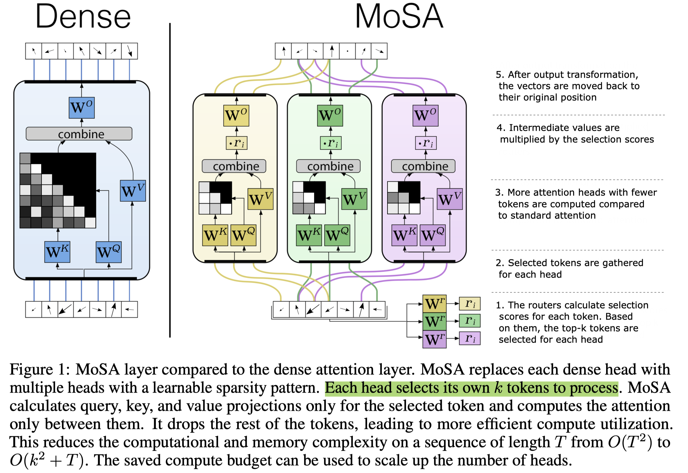

# Mixture of Sparse Attention: Content-Based Learnable Sparse Attention via Expert-Choice Routing

## Abstract

Recent advances in large language models highlighted the excessive quadratic
cost of self-attention. Despite the significant research efforts, subquadratic
attention methods still suffer from inferior performance in practice. We
hypothesize that dynamic, learned content-based sparsity can lead to more
efficient attention mechanisms. We present Mixture of Sparse Attention (MoSA),
a novel approach inspired by Mixture of Experts (MoE) with expert choice
routing. MoSA dynamically selects tokens for each attention head, allowing
arbitrary sparse attention patterns. By selecting $k$ tokens from a sequence of
length $T$, MoSA reduces the computational complexity of each attention head
from $O(T^2)$ to $O(k^2 + T)$. This enables using more heads within the same
computational budget, allowing higher specialization. We show that among the
tested sparse attention variants, MoSA is the only one that can outperform the
dense baseline, sometimes with up to 27% better perplexity for an identical
compute budget. MoSA can also reduce the resource usage compared to dense
self-attention. Despite using torch implementation without an optimized kernel,
perplexity-matched MoSA models are simultaneously faster in wall-clock time,
require less memory for training, and drastically reduce the size of the
KV-cache compared to the dense transformer baselines.
