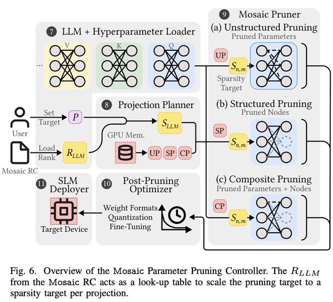

# Mosaic: Composite Projection Pruning for Resource-efficient LLMs

> **⚠️ 本文由 AI Agent 自动生成（Hermes Agent，Nous Research），生成时间：2026-06-04。内容基于 arXiv 论文全文（2504.06323v1）的自动阅读和分析。如有偏差，请以原文为准。**

---

## 一句话总结

Mosaic 提出了一种名为 **组合投影剪枝（Composite Projection Pruning）** 的新型 LLM 压缩方法，通过在投影（projection）粒度上进行非均匀剪枝，并协同结合非结构化剪枝（保留精度）和结构化剪枝（减小模型体积），实现了 7.19× 更快的模型生产速度、最高 84.2% 更低的困惑度、31.4% 更高的准确率，以及最高 67% 更快的推理速度和 68% 更低的 GPU 显存占用。

---

## 摘要翻译

大语言模型（LLM）的大量计算和内存需求限制了它们在各类硬件上的部署。剪枝等压缩方法可以减小模型规模，从而降低资源需求。当前最先进的剪枝方法基于粗粒度方法，这些方法耗时且本质上会移除关键模型参数，对剪枝后的模型质量产生不利影响。本文提出了 **投影剪枝（Projection Pruning）**，一种用于 LLM 的新型细粒度剪枝方法。此外，LLM 投影剪枝通过一种新方法得到增强，称为 **组合投影剪枝（Composite Projection Pruning）**——将保留精度的非结构化剪枝与减小模型体积的结构化剪枝协同结合。我们开发了 **Mosaic** 系统，用于使用组合投影剪枝创建和部署剪枝后的 LLM。Mosaic 在多种硬件平台、LLM 和数据集上使用多种性能和质量指标进行评估。Mosaic 生成模型的速度比现有方法快 7.19×。Mosaic 模型在困惑度上比粗粒度剪枝低 84.2%，准确率高 31.4%。Mosaic 模型的推理速度最高快 67%，GPU 显存使用量最高低 68%。

---

## 研究动机

### 核心问题
LLM 参数量从数十亿到数千亿不等，部署到边缘/移动设备等资源受限环境极为困难。GPT-3（175B 参数）需要超过 350 GB 存储和 5 个 80 GB A100 GPU 才能部署。

### 现有方法的局限
1. **非结构化剪枝（Unstructured Pruning）**：将参数置零保留精度，但模型大小不变，需要专用硬件加速库（如 NVIDIA CUTLASS），50% 稀疏度下仅能获得 1.24× 加速
2. **结构化剪枝（Structured Pruning）**：移除整组参数减小模型体积和延迟，但对模型质量影响较大，高稀疏度下模型质量快速下降
3. **现有方法均为粗粒度剪枝（Uniform/Global Pruning）**：对每一层均匀剪枝，无法区分不同组件的重要性，导致关键参数被移除

### 关键发现
- **非均匀剪枝优于均匀剪枝**：在相同准确率损失下，非均匀剪枝可比均匀剪枝多移除 25% 的参数
- **投影是 LLM 最小的功能单元**：每个解码器 Transformer 层包含 7 个投影（Query、Key、Value、Output、Gate、Up、Down），对投影进行细粒度控制可以实现更优的剪枝效果

---

## 方法（技术细节）

### 1. 投影剪枝（Projection Pruning）

**核心思想**：将剪枝粒度从层级别细化到投影级别，为每个投影计算独立的剪枝目标。

**从层剪枝到投影剪枝的扩展**：
- 层剪枝：每层有不同的剪枝比例 $p_n$，但层内所有投影相同
- 投影剪枝：每个投影有独立的剪枝比例 $p_{n,m}$，其中 $n$ 为层索引，$m$ 为投影索引
- LLaMa-7B 有 32 层 × 7 个投影 = 224 个剪枝目标（vs 层剪枝的 32 个）

**投影离群值分布（Projection Outlier Distribution, POD）**：
- 继承自层离群值分布（LOD）概念，但应用到投影级别
- 权重度量计算：$\omega_{n,m} = \|A_n\|_2 \cdot |\theta_{n,m}|$（激活的 L2 范数 × 投影权重幅度）
- 投影离群值判定：$\text{IsProjectionOutlier}(\theta_{n,m}^i) = \omega_{n,m}^i > \alpha \cdot \omega_{n,m}$
- 离群值越多的投影越重要，被剪枝越少

### 2. 组合投影剪枝（Composite Projection Pruning）

**创新点**：首次在 LLM 上同时结合非结构化剪枝和结构化剪枝，并应用于投影粒度。

- **非结构化剪枝**：将参数权重置零，保留模型质量，但模型大小不变
- **结构化剪枝**：移除注意力头和前馈通道，减小模型体积和推理延迟
- **组合方式**：先对投影进行非结构化剪枝，然后同时移除最低幅度的注意力头和前馈头进行结构化剪枝
- 与 CNN 中的组合剪枝不同，LLM 层包含多种不同类型和维度的投影

### 3. Mosaic 系统架构

系统由两个顺序执行的模块组成：

**参数排序控制器（Parameter Ranking Controller, RC）**：
1. **样本加载器**：加载 128 个校准样本（~1 KB）
2. **LLM 分析器**：在 GPU 上对每个样本进行推理
3. **激活处理器**：捕获每个投影的激活值并传输到 CPU
4. **排序预处理器**：计算每个投影的权重度量（Equation 5）
5. **Mosaic 参数排序器**：计算每个投影的 POD，识别离群值
6. **排序后处理器**：将所有投影排序归一化为全局排序 $R_{LLM}$

**参数剪枝控制器（Parameter Pruning Controller, PC）**：
7. **LLM + 超参数加载器**：加载模型和全局排序
8. **投影规划器**：根据全局排序和剪枝目标生成每个投影的稀疏度目标
9. **Mosaic 剪枝器**：根据目标平台 GPU 内存选择剪枝类别：
   - (a) 非结构化投影剪枝（适合云端 GPU）
   - (b) 结构化投影剪枝（适合边缘设备/无 GPU）
   - (c) 组合投影剪枝（适合移动/旧代 GPU）
10. **剪枝后优化器**：支持 LoRA 微调、量化等进一步优化
11. **SLM 部署器**：部署剪枝后的模型

### 4. 实现细节
- Python 3.8.10, PyTorch 2.3.0, Transformers 4.43.1, CUDA 11.7
- 使用 SparseGPT 作为底层剪枝引擎
- 全局排序 $R_{LLM}$ 只需计算一次，可复用于不同剪枝级别

---

## 实验结果

### 实验设置
- **5 个硬件平台**：从 2× A100 云端到 Raspberry Pi 5 边缘设备
- **5 个 LLM**：LLaMa-3.1-8B, LLaMa-3-8B, LLaMa-2-13B, LLaMa-7B, Vicuna-7B v1.5
- **11 个数据集**：7 个常识推理任务（准确率）、2 个困惑度数据集（WikiText-2, PTB）、校准数据集 C4、微调数据集 Alpaca

### E1: 投影剪枝性能
- 投影剪枝在所有模型、数据集和稀疏度上均实现最低困惑度
- 80% 稀疏度下：比全局剪枝低 18.9%-84.2%（WikiText-2），16.8%-82.1%（PTB）
- 准确率提升：LLaMa-2-13B 在 80% 稀疏度下准确率提升 31.4%，LLaMa-3.1-8B 提升 13.2%
- 典型数据（LLaMa-3.1-8B, 80% 稀疏度）：
  - Global: 准确率 37.29, Layer: 38.79, **Projection: 42.89**

### E2: 投影剪枝控制
- 投影剪枝可为每个投影设定不同剪枝目标（57.4%-87.5%），而非均匀的 80%
- 在 attention block 中：Key 投影冗余最多，Output 投影最关键
- 在 feed-forward block 中：Gate 投影冗余较多，Down 投影最关键
- WikiText-2 困惑度：Global 221, Layer 182, **Projection 82**
- 比均匀剪枝低 63%（WikiText-2）

### E3: 组合投影剪枝性能
- **推理延迟**：80% 稀疏度下，组合剪枝比非结构化剪枝快 30%-67%
- **GPU 显存**：降低 60%-68%
- **模型质量**：比结构化剪枝困惑度低最高 36×
- **低显存平台**：在 RTX 3080（10GB）上，从 420s 降到 14s；在 Raspberry Pi 5 上，从无法运行到 110s

### E4: 微调性能
- 使用 LoRA 对 80% 剪枝后的 LLaMa-3.1-8B 进行微调
- 投影剪枝达到与全局/层剪枝相同准确率的速度快 7.5×
- 训练损失：Global 1.76, Layer 1.72, **Projection 1.53**
- 微调后（80% 稀疏度，LLaMa-3.1-8B）：
  - Global: PPL 220.53→41.96 (↓81.0%), 准确率 37.29→43.33
  - Layer: PPL 181.79→37.08 (↓79.6%), 准确率 38.79→44.46
  - **Projection: PPL 82.08→27.54 (↓66.4%), 准确率 42.89→50.01**

### E5: 端到端开销
- Mosaic 生成部署就绪模型的端到端时间比现有方法快最高 7.19×
- LLaMa-3.1-8B: 比全局和层剪枝快 4.8×
- LLaMa-2-13B: 比层剪枝快 2.67×，比全局剪枝快 7.19×

### 与量化的对比（Table XIII）
- GPTQ 8-bit：准确率 68.26，加速 0.48×，压缩 1.74×
- Mosaic 20%：准确率 69.02，加速 1.32×，压缩 1.24×
- Mosaic 60%：准确率 60.86，加速 1.36×，压缩 2.33×
- Mosaic 不依赖自定义 CUDA 内核，可在无专用硬件的平台上运行

---

## 优势

1. **细粒度非均匀剪枝**：在投影级别进行剪枝，比层级别更精确，避免移除关键参数
2. **组合剪枝兼顾质量与效率**：同时获得非结构化剪枝的质量优势和结构化剪枝的性能优势
3. **跨平台适用性**：支持从云端 GPU 到 Raspberry Pi 的 5 种硬件平台，无需专用硬件加速
4. **高效率生产**：端到端时间比现有方法快 7.19×，全局排序可复用
5. **与微调高度兼容**：投影剪枝后的模型可更快、更好地通过 LoRA 微调恢复质量
6. **无需自定义 CUDA 内核**：与 GPTQ 等量化方法不同，不需要特殊加速库
7. **可灵活选择剪枝类别**：根据目标平台资源自动选择非结构化、结构化或组合剪枝

---

## 局限

1. **高稀疏度下组合剪枝质量下降**：组合投影剪枝在高稀疏度（>40%）时困惑度仍显著高于非结构化剪枝（例如 80% 时 WikiText-2 困惑度 938 vs 27.24）
2. **依赖校准数据**：需要 128 个校准样本来计算激活值和权重度量
3. **一次性剪枝（One-shot）**：使用 SparseGPT 进行一次性剪枝，不涉及迭代训练
4. **仅评估 LLM（无多模态）**：仅在纯语言模型上验证，未扩展到视觉-语言模型
5. **缺乏与知识蒸馏的对比**：未与 Minitron 等知识蒸馏方法进行直接比较
6. **未提供代码**：论文未提供开源代码实现
7. **校准样本大小敏感性**：虽然研究表明 128 个样本是平衡点，但在不同场景下可能需要调优
8. **与量化方法未进行联合评估**：虽然提到了量化，但未深入探讨剪枝与量化的协同效果

---

## 与 EfficientPaper 相关的研究方向

1. **稀疏剪枝（Sparse Pruning）**：Mosaic 是稀疏剪枝的重要进展，特别是投影级别的非均匀剪枝
2. **结构化稀疏性（Structured Sparsity）**：组合投影剪枝将结构化与非结构化剪枝结合，是结构化稀疏性的创新应用
3. **LLM 压缩与部署**：Mosaic 直接解决 LLM 在边缘设备的部署问题，与 EfficientPaper 的核心主题高度契合
4. **非均匀剪枝策略**：投影级别的非均匀剪枝可推广到其他模型架构
5. **剪枝 + 微调协同**：Mosaic 展示了投影剪枝后微调效率的显著提升，对高效微调研究有启示
6. **跨硬件适配**：Mosaic 的多平台评估（从 A100 到 Raspberry Pi）展示了 LLM 部署的通用性
7. **与量化方法的协同**：Mosaic 可与量化方法结合，进一步压缩模型
8. **LLM 压缩方法比较**：Mosaic 的实验提供了非结构化、结构化和组合剪枝的系统比较，可作为后续研究的基线
