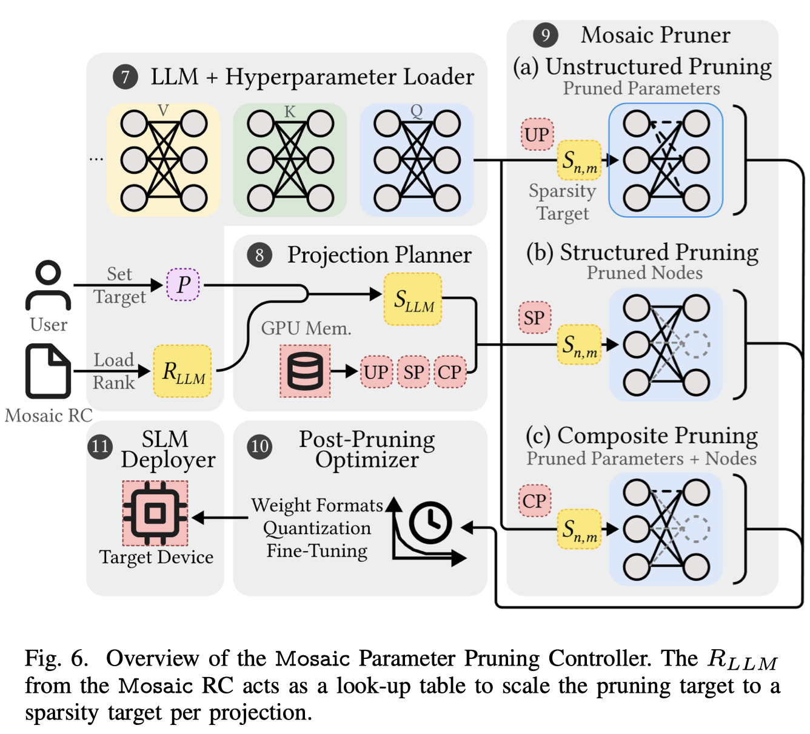

# Mosaic: Composite Projection Pruning for Resource-efficient LLMs

## Abstract

Extensive compute and memory requirements limit the deployment of large
language models (LLMs) on any hardware. Compression methods, such as pruning,
can reduce model size, which in turn reduces resource requirements.
State-of-the-art pruning is based on coarse-grained methods. They are
time-consuming and inherently remove critical model parameters, adversely
impacting the quality of the pruned model. This paper introduces projection
pruning, a novel fine-grained method for pruning LLMs. In addition, LLM
projection pruning is enhanced by a new approach we refer to as composite
projection pruning - the synergistic combination of unstructured pruning that
retains accuracy and structured pruning that reduces model size. We develop
Mosaic, a novel system to create and deploy pruned LLMs using composite
projection pruning. Mosaic is evaluated using a range of performance and
quality metrics on multiple hardware platforms, LLMs, and datasets. Mosaic is
7.19x faster in producing models than existing approaches. Mosaic models
achieve up to 84.2% lower perplexity and 31.4% higher accuracy than models
obtained from coarse-grained pruning. Up to 67% faster inference and 68% lower
GPU memory use is noted for Mosaic models.

Uniform Pruning -> Non-uniform Pruning

不仅每一层稀疏度不同，每层中的每个Linear Projection也不同。