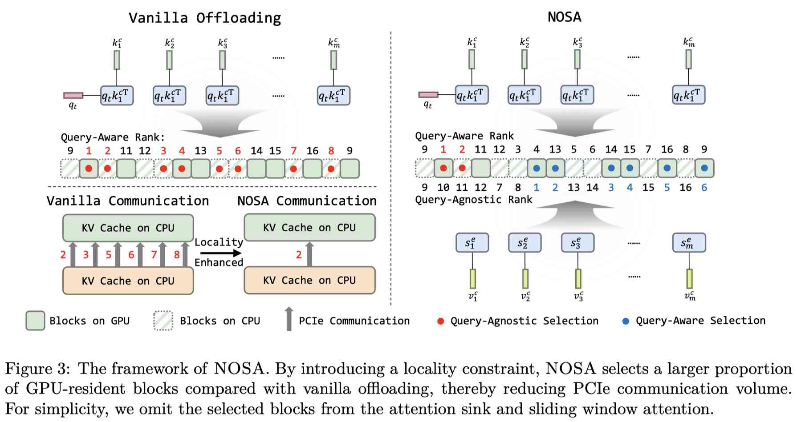

# NOSA: Native and Offloadable Sparse Attention

> Yuxiang Huang, Chaojun Xiao, Xu Han, Zhiyuan Liu
> Tsinghua University

> ⚠️ **注意：本 note 由 AI Agent 自动生成（Hermes Agent），仅供学术参考，内容可能存在偏差。生成时间：2025年10月。**

## 一句话总结

NOSA 提出了一种原生支持 KV cache 卸载的可训练稀疏注意力机制，通过将 token 选择分解为 query-aware 和 query-agnostic 两部分，显式引入局部性约束以提高 CPU-GPU 之间的缓存命中率，在保持近乎无损性能的同时实现了最高 2.3 倍的解码吞吐量提升。

## 摘要翻译

可训练稀疏注意力（Trainable Sparse Attention）已成为解决 LLM 长上下文处理中解码效率瓶颈的有前景方案，能够显著减少内存访问量，同时对任务性能的影响极小。然而，现有稀疏注意力方法尚未解决一个关键限制：KV cache 的大小未被缩减，这在大规模批量推理中限制了 GPU 上的批处理大小并抑制了解码吞吐量。

本文发现，可训练稀疏注意力在相邻解码步骤的 token 选择中自然表现出强局部性，从而使得 KV cache 卸载能够在不改变底层注意力计算的情况下实现。然而，仅靠这种固有局部性不足以实现高效卸载，因为 CPU-GPU 之间选中 KV 对的传输仍然主导整体解码成本。

基于此洞察，本文提出 NOSA，一种原生支持 KV cache 卸载的可训练稀疏注意力框架。NOSA 通过将 token 选择分解为 query-aware 和 query-agnostic 两个组件，引入显式局部性约束，在保持与训练时相同注意力计算的同时，减少 KV 传输量。作者预训练了一个 1B 参数模型并进行了广泛的基准测试，结果表明 NOSA 在保持近乎无损性能的同时，相比 vanilla 可训练稀疏注意力基线（InfLLM-V2），实现了最高 2.3 倍的解码吞吐量提升。

## 研究动机

1. **长上下文解码瓶颈**：随着 LLM 应用从长输入编码扩展到长输出解码，解码过程受限于内存 I/O，成为 LLM 推理的主要瓶颈。输入序列长度增加导致内存访问 O(n) 级增长，降低解码吞吐量。

2. **可训练稀疏注意力的局限**：可训练稀疏注意力方法（如 NSA、MoBA、InfLLM-V2）虽然能减少计算和内存访问，但 KV cache 大小未被缩减。这意味着 KV cache 仍需完整存储，限制了 GPU 上的最大批处理大小，降低了计算利用率。

3. **现有卸载方案的缺陷**：传统卸载方法依赖手工设计的训练无关块稀疏模式，由于训练和推理稀疏模式的不匹配，常导致性能下降。

4. **局部性洞察**：作者发现可训练稀疏注意力在连续解码步骤中自然表现出强局部性（约 80% 的重叠率），这为 KV cache 卸载提供了可能。但约 80% 的重叠率仍不够，因为 PCIe 通信（~30 GB/s）相对于 HBM（~2 TB/s）的带宽差异导致传输成为瓶颈。

因此，NOSA 的核心目标是：在训练时显式引入局部性约束，使稀疏注意力模式原生支持高效卸载。

## 方法（技术细节）

### 整体框架

NOSA 基于 InfLLM-V2 的块稀疏注意力模式，将 token 选择分为两部分：
- **Query-aware 选择**：基于当前 query 与 KV 的相似度选择 token，保留模型的检索能力
- **Query-agnostic 选择**：基于 token 本身的重要性分数选择 token，保证局部性

### 局部性约束（Theorem 1）

NOSA 设定总选择预算 k = kq + ke（kq 为 query-aware 数量，ke 为 query-agnostic 数量），通过定理证明：
$$\forall t \in \{2, ..., n\}, \gamma(t) \geq \frac{k_e}{k}$$

其中 $\gamma(t)$ 是相邻解码步骤之间的 token 选择重叠率。由于 query-agnostic 选择具有驱逐特性（一旦 token 被驱逐则不会再被选中），这部分 token 在连续步骤间保持不变，从而保证了局部性的下界。

### Token 选择过程

1. 首先进行 query-aware 选择，基于 $s^q_{tj} = q_t k_j^\top$ 选择 top-kq 个 token
2. 将这些位置设为无穷大，然后基于 query-agnostic 重要性分数 $s^e_j$ 选择 top-ke 个 token
3. 最终选择的 token 集合为两者的并集

### ED-DMA（Exp-Delayed Dynamic Mask Attention）

NOSA 采用 ED-DMA 作为 eviction head 的实现，这是关键设计点：
- 重要性分数计算：$s^e_j = \tau(v_j W_1) W_2$，其中 $W_1 \in \mathbb{R}^{d_{head} \times n_{head}}$, $W_2 \in \mathbb{R}^{n_{head} \times 1}$
- 移除原始 DMA 中的 exp 操作，将指数运算延迟到注意力计算阶段
- 这一设计对数值精度敏感，实验表明 ED-DMA 比其他变体（Retaining Head、DMA、S-DMA）在 RULER 基准上表现最佳（平均 59.6% vs 55-56%）

### 注意力计算

$$a_j = \frac{m_j + \exp(b_j) \exp(q_t k_j^\top) v_j}{\sum_l (m_l + \exp(b_l) \exp(q_t k_l^\top))}$$

其中 $b_j = s^e_{c, \lfloor j/n_b \rfloor}$ 是基于块的重要性偏置，$m_j \in \{0, -\infty\}$ 是注意力掩码。

### 推理系统设计

1. **内存布局**：采用 $(N_{num}, H, n_b, d_{head})$ 布局，确保 CPU-GPU 传输时的连续内存访问
2. **自定义 Triton 内核**：利用 UVA（统一虚拟地址）实现 CPU-GPU 间并行块传输，双向带宽超过 20 GB/s（PCIe 总带宽 31.5 GB/s）
3. **C++ 内存管理器**：维护逻辑块位置到物理块索引的映射表，相比 Python 实现快 35 倍以上

## 实验结果

### 模型配置
- 1B 参数模型，Llama-2 架构
- 预训练阶段：8K 全注意力 → 16K 长上下文连续预训练（NOSA）→ SFT
- 选择预算：k=4096（64 attention sink + 1024 sliding window + kq=1024 + ke=3072）

### 任务性能

**短上下文基准**（Table 3）：
- NOSA vs InfLLM-V2 平均准确率：28.25% vs 28.45%（差异极小）
- 在 MMLU、MMLU Pro、GSM8K、MATH、MBPP 等任务上几乎无损

**长上下文基准**（Table 4）：
- LongBench 平均分：NOSA 29.95 vs InfLLM-V2 30.03（差异约 0.1%）
- 在多个任务上表现接近，个别任务甚至略有提升

**RULER 基准**（Table 5）：
- NOSA 平均 59.00 vs InfLLM-V2 60.09（约 1% 下降）
- 在部分任务上略有波动，但整体保持无损

### 解码吞吐量（Table 6）

- **最大吞吐量提升**：2.3×（相比 InfLLM-V2 without offloading）
- 在大 batch size 和长序列下效果最显著
- 例如 SeqLen=16K, M=21.00GB: NOSA 500.76 tok/s vs InfLLM-V2 240.77 tok/s（无卸载）vs InfLLM-V2 440.66 tok/s（vanilla 卸载）
- 相比 vanilla 卸载，NOSA 还有约 13.6% 的吞吐量提升

### 局部性分析

- NOSA 平均缓存命中率：94.4% vs InfLLM-V2 的 88.9%
- 约 5.5% 的提升（相当于缓存未命中率降低近 2 倍）

### 消融实验

**Eviction Head 消融**（Table 2）：
- ED-DMA（59.6%）> Retaining（55.8%）> S-DMA（55.5%）> DMA（54.7%）
- 仅将 exp 操作从偏置计算移到注意力计算就带来了约 5% 的准确率提升

## 优势

1. **原生支持卸载**：NOSA 在训练时显式引入局部性约束，使得 KV cache 卸载成为注意力机制的原生特性，而非后处理步骤
2. **近乎无损的性能**：在短上下文和长上下文任务上，NOSA 与 InfLLM-V2 的性能差异极小（<1%），说明局部性约束不会损害模型能力
3. **显著的吞吐量提升**：最高 2.3 倍的解码吞吐量提升，尤其在大 batch size 和长序列场景下效果显著
4. **理论保证**：通过定理证明了局部性的下界（$\gamma(t) \geq k_e/k$），为设计提供了理论基础
5. **系统层面优化**：精心设计的通信内核和 C++ 内存管理器，确保了推理系统的高效性
6. **与现有方法的兼容性**：基于 InfLLM-V2 构建，可以复用现有的稀疏注意力框架

## 局限

1. **仅在 1B 参数模型上验证**：当前实验仅在 1B 参数模型上进行，需要在更大规模模型上验证可扩展性
2. **训练时需要额外开销**：引入 eviction head 和局部性约束增加了训练复杂度
3. **仅支持特定的卸载配置**：实验基于 NVIDIA A800-80GB GPU + PCIe 4.0，在其他硬件配置下的表现未知
4. **消融实验有限**：在不同 kq/ke 比例、不同模型规模下的系统性消融实验不足
5. **论文仍在进行中（Working in Progress）**：作者明确表示正在开发最终版本，计划进行更多实验和优化
6. **与 NSA、MoBA 等方法的对比不足**：主要对比 InfLLM-V2，与其他可训练稀疏注意力方法的直接比较有限

## 与 EfficientPaper 相关的研究方向

1. **可训练稀疏注意力**：NOSA 属于 attention_sparsity 关键词，与 NSA（Native Sparse Attention）、MoBA（Mixture of Block Attention）、InfLLM-V2、DSA（DeepSeek Sparse Attention）等方法密切相关
2. **KV cache 优化**：NOSA 的 KV cache 卸载与 Quest、InfLLM、ShadowKV、MagicPig 等 KV cache 优化方法构成互补关系
3. **推理效率**：NOSA 的吞吐量提升与 LLM 推理效率优化直接相关，与 PagedAttention、SGLang 等系统级优化有交叉
4. **长上下文处理**：NOSA 专注于长上下文场景的解码效率，与长上下文 LLM 推理的其他方法（如 StreamingLLM、LM-Infinite、DuoAttention）构成研究谱系
5. **卸载系统**：NOSA 的卸载设计与 FlexGen、PowerInfer 等参数卸载方法在系统层面有参考价值
6. **Baseline 关联**：NOSA 的 baseline 为 InfLLM-V2（2025/InfLLM-V2），属于同一研究方向的改进工作
7. **SparseServe**：NOSA 的系统实现与 SparseServe（Zhou et al., 2025）在并行稀疏注意力的云服务中有相似之处，但 NOSA 更强调从训练端到推理端的端到端优化
