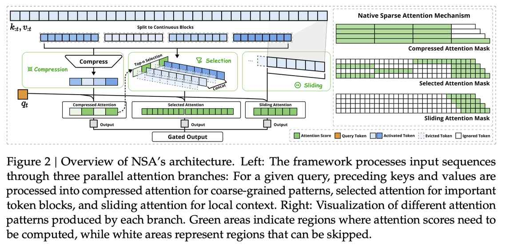

# Native Sparse Attention: Hardware-Aligned and Natively Trainable Sparse Attention

> ⚠️ **注意：本 note 由 AI Agent 自动生成，仅供参考，内容可能存在不准确之处。**
> 生成时间：2025年

---

## 一句话总结

NSA（Native Sparse Attention）是一种面向硬件对齐且可原生训练的稀疏注意力机制，通过动态分层稀疏策略（粗粒度 token 压缩 + 细粒度 token 选择 + 滑动窗口）实现长上下文高效建模，在 64k 序列上达到 Full Attention 11.6× 解码加速，同时保持甚至超越全注意力模型的性能。

---

## 摘要翻译

长上下文建模对下一代语言模型至关重要，但标准注意力机制的高计算成本带来了重大挑战。稀疏注意力为提高效率同时保持模型能力提供了一个有前景的方向。我们提出 NSA（Natively Trainable Sparse Attention），一种将算法创新与硬件对齐优化相结合的稀疏注意力机制，实现高效的长上下文建模。NSA 采用动态分层稀疏策略，结合粗粒度 token 压缩与细粒度 token 选择，同时保持全局上下文感知和局部精度。

该方法通过两项关键创新推进了稀疏注意力设计：（1）通过算术强度平衡的算法设计实现显著加速，并针对现代硬件进行了实现优化；（2）实现端到端训练，在不牺牲模型性能的情况下减少预训练计算量。实验表明，使用 NSA 预训练的模型在通用基准测试、长上下文任务和基于指令的推理方面保持或超越全注意力模型。同时，NSA 在 64k 长度序列的解码、前向传播和反向传播中均实现了对全注意力的显著加速，验证了其在整个模型生命周期中的效率。

---

## 研究动机

### 长上下文建模的计算瓶颈

随着 LLM 应用场景的扩展（深度推理、仓库级代码生成、多轮自主代理系统），长上下文建模成为关键能力。然而，标准注意力机制的计算复杂度随序列长度增长而急剧增加，在 64k 上下文解码时，注意力计算占总延迟的 70–80%。

### 现有稀疏注意力方法的两大局限

**1. 高效推理的幻觉（The Illusion of Efficient Inference）**
- **阶段性限制（Phase-Restricted Sparsity）**：H2O 在解码时应用稀疏性，但预填充阶段仍需高计算；MInference 仅关注预填充阶段稀疏。这些方法无法在所有推理阶段实现加速。
- **与先进注意力架构的不兼容性**：Quest 等方法在 GQA/MQA 架构下，由于多个查询头共享 KV 缓存，虽然能减少计算操作，但内存访问量仍然很高（散列访问模式与高效内存访问设计冲突）。

**2. 可训练稀疏的神话（The Myth of Trainable Sparsity）**
- **性能退化**：后置稀疏迫使模型偏离预训练优化轨迹。Top 20% 的注意力只能覆盖 70% 的总注意力分数，导致预训练模型中的检索头在推理时易被剪枝。
- **非可训练组件**：ClusterKV（k-means 聚类）和 MagicPIG（SimHash 选择）等方法中的离散操作在计算图中产生不连续性，阻止梯度流过 token 选择过程。
- **低效的反向传播**：HashAttention 等方法的 token 粒度选择策略导致从 KV 缓存加载大量单独 token，非连续内存访问阻碍了 FlashAttention 等高效技术的适配。

---

## 方法（技术细节）

### 整体框架

NSA 通过将原始的 key-value 对 $(k_{:t}, v_{:t})$ 替换为更紧凑、信息更密集的表示 key-value 对 $(\tilde{K}_t, \tilde{V}_t)$ 来利用注意力的自然稀疏模式。最终输出为三条路径的加权融合：

$$o_t^* = \sum_{c \in C} g_c^t \cdot \text{Attn}(q_t, \tilde{K}_c^t, \tilde{V}_c^t)$$

其中 $C = \{cmp, slc, win\}$ 分别代表压缩（Compression）、选择（Selection）和滑动窗口（Sliding Window）三条路径，$g_c^t \in [0, 1]$ 是通过 MLP + sigmoid 激活得到的门控分数。

### 三大核心组件

#### 1. Token Compression（粗粒度压缩）

通过可学习的 MLP 将连续的 key/value 块聚合为块级表示，捕获粗粒度语义信息：

$$\tilde{K}_t^{cmp} = f_K^{cmp}(k_{:t}) = \left\{ \varphi(k_{id+1:id+l}) \mid 1 \leq i \leq \left\lfloor \frac{t-l}{d} \right\rfloor \right\}$$

- $l$：块长度，$d$：相邻块的滑动步长（通常 $d < l$ 以缓解信息碎片化）
- $\varphi$：带块内位置编码的可学习 MLP
- 压缩表示捕获更粗粒度的高阶语义信息，降低注意力计算负担

#### 2. Token Selection（细粒度选择）

**块级选择策略**：以连续块为单位选择 key/value，基于两个关键因素：
- 硬件效率：现代 GPU 对连续块访问的吞吐量远高于随机索引读取；块级计算可最大化 Tensor Core 利用率。
- 注意力分数的空间连续性：相邻 key 倾向于共享相似的重要性水平。

**重要性分数计算**：利用压缩 token 的注意力计算产生的中间注意力分数来推导选择块的重要性分数：

$$p_t^{cmp} = \text{Softmax}\left(q_t^T \tilde{K}_t^{cmp}\right)$$

对于 GQA/MQA 架构，使用组内共享的重要性分数确保一致的块选择：

$$p_t^{slc\prime} = \sum_{h=1}^H p_t^{slc,(h)}$$

**Top-$n$ 块选择**：保留重要性分数最高的 $n$ 个块中的 token，选择索引集为：

$$I_t = \{i \mid \text{rank}(p_t^{slc\prime}[i]) \leq n\}$$

#### 3. Sliding Window（滑动窗口）

引入专用滑动窗口分支显式处理局部上下文（最近 $w$ 个 token），将注意力计算的不同信息源隔离到独立分支中，通过学习的门控机制聚合。

**关键设计**：为三个分支提供独立的 key 和 value，防止跨分支的梯度干扰和捷径学习，同时引入最小额外开销。

### 硬件优化的 Kernel 设计

基于 Triton 实现硬件对齐的稀疏注意力内核，关键特性：

1. **Group-Centric Data Loading**：为每个内循环加载 GQA 组中所有头的查询 $Q \in \mathbb{R}[h, d_k]$ 和共享稀疏 key/value 块索引 $I_t$。
2. **Shared KV Fetching**：在内循环中顺序加载由 $I_t$ 索引的连续 key/value 块到 SRAM，最小化内存加载。
3. **Outer Loop on Grid**：由于内循环长度（与选定块数 $n$ 成正比）在不同查询块间几乎相同，将查询/输出循环放入 Triton 的网格调度器以简化和优化内核。

该设计通过（1）消除冗余 KV 传输（组级共享）和（2）平衡 GPU 流处理器间的计算负载，实现接近最优的算术强度。

### 超参数设置

| 参数 | 值 |
|---|---|
| 压缩块大小 $l$ | 32 |
| 滑动步长 $d$ | 16 |
| 选择块大小 $l'$ | 64 |
| 选择块数 $n$ | 16（含 1 个初始块 + 2 个局部块） |
| 滑动窗口大小 $w$ | 512 |

---

## 实验结果

### 预训练配置

- 模型：27B 总参数（3B 活跃参数），GQA + MoE 结构
- 30 层，隐藏维度 2560，GQA 组数 4，64 个注意力头
- 预训练：270B tokens（8k 长度），续训 + SFT（32k 长度，YaRN 扩展）
- 训练损失曲线：NSA 持续优于全注意力模型（见 Figure 4）

### 通用基准测试（Table 1）

在 9 个基准测试中，NSA 在 7 个指标上优于全注意力：
- 知识：MMLU（0.565 vs 0.567），MMLU-PRO（0.286 vs 0.279），CMMLU（0.587 vs 0.576）
- 推理：BBH（0.521 vs 0.497），GSM8K（0.520 vs 0.486），MATH（0.264 vs 0.263），DROP（0.545 vs 0.503）
- 代码：MBPP（0.466 vs 0.482），HumanEval（0.348 vs 0.335）
- 平均分：0.456 vs 0.443

### 长上下文评估

**Needle-in-a-Haystack（64k 上下文）**：NSA 在所有位置实现完美检索准确率（Figure 5）。

**LongBench（Table 2）**：NSA 平均分 0.469，超越所有基线：
- 超越全注意力 +0.032，超越 Exact-Top +0.046
- 在多跳 QA 任务中表现突出（HPQ: +0.087，2Wiki: +0.051）
- 代码理解（LCC: +0.069），段落检索（PassR-en: +0.075）

### 链式推理评估（Table 3）

使用 DeepSeek-R1 知识蒸馏 + 32k 数学推理链 SFT，在 AIME 24 基准上：
- 8k 上下文：NSA-R 0.121 vs Full Attention-R 0.046（+0.075）
- 16k 上下文：NSA-R 0.146 vs Full Attention-R 0.092（+0.054）

### 效率分析

**训练速度**（Triton 实现 vs FlashAttention-2）：
- 前向传播：64k 上下文加速 9.0×
- 反向传播：64k 上下文加速 6.0×

**解码速度**（内存访问量等价 token 数）：
- 64k 上下文：加速 11.6×
- 8k → 16k → 32k → 64k 加速比分别为 2.1×, 3.8×, 6.3×, 9.0×（前向）和 1.1×, 2.0×, 3.4×, 6.0×（反向）

---

## 优势

1. **端到端可训练**：NSA 是首个原生支持端到端训练的稀疏注意力机制，从预训练阶段即引入稀疏性，使模型能够学习最优的稀疏模式。
2. **硬件对齐设计**：通过算术强度平衡的算法设计和基于 Triton 的专用内核，将理论计算减少转化为实际速度提升。
3. **分层稀疏策略**：压缩（全局上下文）+ 选择（关键细节）+ 滑动窗口（局部上下文）的三层架构有效平衡全局感知与局部精度。
4. **GQA/MQA 兼容**：组内共享重要性分数确保一致的块选择，与现代高效注意力架构兼容。
5. **全面性能超越**：在通用基准、长上下文任务和链式推理三个维度上均保持或超越全注意力性能，同时实现显著加速。
6. **训练和推理全加速**：覆盖训练前向/反向传播和推理解码的全生命周期加速。

---

## 局限

1. **超参数敏感**：压缩块大小 $l$、选择块数 $n$、滑动窗口大小 $w$ 等超参数需要针对不同场景调优，论文仅报告了单一配置的结果。
2. **代码开源缺失**：论文未提供开源代码（代码 URL 为空），可复现性受限。
3. **模型规模限制**：实验仅在 27B 参数（3B 活跃）模型上进行，未验证在更大规模模型（如 70B+）上的表现。
4. **稀疏比例固定**：所有基线方法使用固定稀疏比例（2560 token），未探讨自适应稀疏比例策略。
5. **通用性验证不足**：实验主要在英文和中文数据上进行，未验证在多语言、多模态等场景下的表现。
6. **GQA/MQA 依赖**：内核设计主要针对 GQA/MQA 架构优化，对 MHA 架构的适用性未充分讨论。
7. **长上下文扩展性**：虽然在 64k 上下文上表现良好，但未验证更长上下文（128k+）的性能。

---

## 与 EfficientPaper 相关的研究方向

### 相关关键词
- `attention_sparsity`：NSA 的核心关注点
- `kv_cache_sparse`：通过稀疏选择减少 KV 缓存访问
- `structure_design`：分层稀疏注意力的架构设计

### 研究方向

1. **稀疏注意力与训练感知设计**：NSA 强调了训练时稀疏性的重要性，未来可探索更多训练感知的稀疏策略，使模型在训练阶段即学习最优的稀疏模式。

2. **硬件对齐的算法优化**：NSA 的算术强度平衡设计和 Triton 内核实现展示了硬件感知算法设计的重要性，这与 EfficientPaper 中关注的"高效实现"方向高度一致。

3. **分层稀疏架构**：NSA 的压缩 + 选择 + 滑动窗口三层架构为稀疏注意力设计提供了新范式，可进一步探索自适应的分层策略和更细粒度的层次结构。

4. **与 MoE 架构的协同优化**：NSA 在 MoE + GQA 架构上的成功表明，稀疏注意力与稀疏专家混合架构的协同设计是提升 LLM 效率的重要方向。

5. **长上下文推理能力**：NSA 在 AIME 数学推理上的优异表现表明，稀疏注意力可以增强长链推理能力，这与 EfficientPaper 中"推理效率"的研究方向相关。

6. **端到端可训练稀疏机制**：NSA 的可训练稀疏设计为从预训练到推理的全流程效率优化提供了参考，未来可探索更灵活的可训练稀疏策略。

---

*本 note 由 AI Agent 自动生成，内容基于论文原文，仅供参考。*
