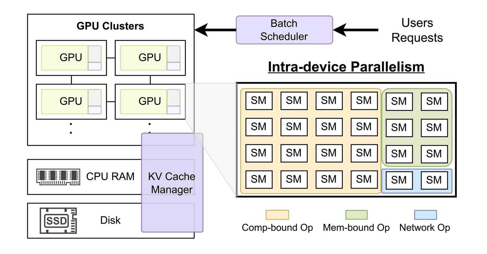
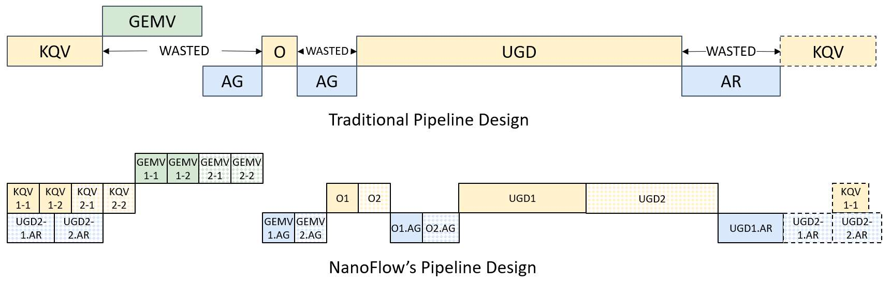
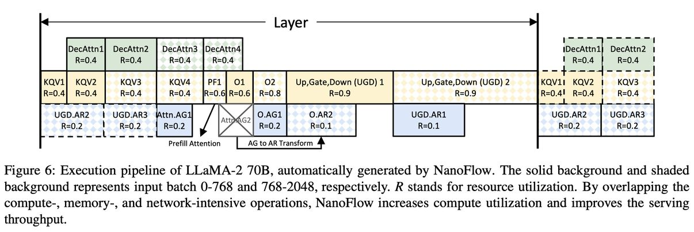

# NanoFlow: Towards Optimal Large Language Model Serving Throughput

> Kan Zhu, Yufei Gao, Yilong Zhao, Liangyu Zhao, Gefei Zuo, Yile Gu, Dedong Xie, Tian Tang, Qinyu Xu, Zihao Ye, Keisuke Kamahori, Chien-Yu Lin, Ziren Wang, Stephanie Wang, Arvind Krishnamurthy, Baris Kasikci

---

> ⚠️ **注意：本 note 由 AI Agent 自动生成，仅供研究参考，内容可能存在偏差或遗漏。生成时间：2025 年。**

---

## 一句话总结

NanoFlow 通过**设备内并行（intra-device parallelism）**技术，将 LLM 推理中不同资源瓶颈的操作（计算、内存、网络）拆分为更细粒度的 **nano-batch**，使这些操作可以在单个 GPU 内同时执行，从而将 LLM 推理吞吐量提升至现有最优系统的 **1.91 倍**，达到理论最优吞吐量的 **50%–72%**。

---

## 摘要翻译

大型语言模型（LLM）导致了对行星级服务系统的巨大需求，数万块 GPU 持续为数亿用户提供服务。因此，吞吐量已成为决定服务系统性能的关键指标。由于模型规模大、自注意力机制内存密集，LLM 服务通常被认为受限于内存带宽。然而，通过详细分析，本文发现尽管 LLM 中存在内存密集型组件，但在大多数常见工作负载和 LLM 下，端到端 LLM 服务实际上是**计算受限（compute-bound）**的。不幸的是，大多数现有服务引擎未能达到最优计算利用率，因为 LLM 服务中异构操作（计算、内存、网络）在设备内是**顺序执行**的。

我们提出了 NanoFlow，一种新颖的服务框架，利用**设备内并行性**，在单个设备内重叠使用异构资源。NanoFlow 将输入拆分为更小的 nano-batch，并复制操作以独立处理每个部分，从而实现重叠。NanoFlow 自动识别 nano-batch 的数量、大小、顺序和 GPU 资源分配，以最小化执行时间，同时考虑并发操作的干扰。我们在多个流行模型（如 LLaMA-2-70B、Mixtral 8×7B、LLaMA-3-8B 等）上评估了 NanoFlow 的端到端服务吞吐量。在实际工作负载下，NanoFlow 相比最先进的服务系统提供了 **1.91 倍的吞吐量提升**，在流行模型上实现了最优吞吐量的 **50%–72%**。

---

## 研究动机

1. **LLM 推理的资源矛盾**：LLM 推理通常被认为受限于内存带宽（因为需要加载巨大的模型权重和 KV-cache），但本文通过详细分析发现，现代 LLM 推理实际上是**计算受限**的，尤其在使用 GQA（Grouped Query Attention）和大模型时，计算操作（GEMM）的耗时远超内存和网络操作。

2. **现有系统的效率瓶颈**：现有的 LLM 服务系统（如 vLLM、DeepSpeed-FastGen、TensorRT-LLM）在单个 GPU 上**顺序执行**计算、内存和网络操作，导致大量"流水线气泡"（pipeline bubbles）。每个操作单独看利用率约 80%，但端到端计算利用率仅约 40%。

3. **理论最优与实际的差距**：在 LLaMA-2-70B 上，理论最优吞吐量为 1857 tokens/s/GPU，但 vLLM、DeepSpeed-FastGen、TensorRT-LLM 分别只达到最优的 22.0%、22.9%、37.8%。

---

## 方法（技术细节）

### 核心思想：设备内并行（Intra-device Parallelism）

NanoFlow 的核心洞察是：**既然现代 LLM 推理是计算受限的，那么可以通过将输入拆分为更小的 nano-batch，复制操作以独立处理每个 nano-batch，使不同资源瓶颈的操作（计算、内存、网络）在单个 GPU 内同时执行。**

具体而言，NanoFlow 将原始的 batch（如 2048 个 token）拆分为多个 nano-batch（如 0–768 和 768–2048），每个 nano-batch 对应一个 nano-operation。不同 nano-batch 之间没有数据依赖，因此计算密集型操作和内存密集型操作可以**并行执行**，从而最大化计算利用率。

### 1. 自动化流水线搜索（Auto-search）

NanoFlow 使用**混合整数线性规划（MILP）**自动构建设备内流水线，分为两个阶段：

#### 阶段一：流水线结构搜索（Pipeline Structure Search）
- **目标**：消除计算操作中的流水线气泡，最小化执行时间
- **输入**：dense batch size、操作依赖关系、无干扰内核性能
- **输出**：每个 nano-operation 的数量、batch size 和执行顺序
- **约束**：
  - 每个操作至少拆分为 2 个 nano-operation
  - batch size 从 128 到 dense batch size，以 128 为步长
  - 不同资源瓶颈的操作才能重叠（计算操作与内存/网络操作重叠）
  - 支持网络操作的等价变换（如 AG ↔ AR）
- 约 10 分钟即可找到可行解

#### 阶段二：流水线精炼（Refining the Pipeline）
- 在阶段一的结构基础上，考虑**内核干扰（kernel interference）**
- 为每个 nano-operation 分配 GPU 资源利用率 R（0–1.0）
- 使用干扰性能映射表（Table 3）将 R 映射到实际性能 P
- 例如：将 GEMM 性能从 1.0 降到 0.8（R=0.8），可以换得 GEMV 性能 0.3（P=0.3）
- 最终使并发内核的 R 之和不超过 1.0

### 2. 内核性能分析与干扰建模

- 对 GEMM（计算密集）、GEMV（内存密集）和网络内核进行性能分析
- 通过配对干扰分析建立 R→P 映射表
- 敏感性分析表明 R→P 映射在不同 GEMM shape 下保持一致（标准差 < 5%）

### 3. 运行时系统（Runtime）

#### 请求调度（Request Scheduling）
- 优先处理未完成的 decode 请求
- 按 token 粒度 chunked prefill，精确填充到最佳 dense batch size
- 使用常量 dense batch size 降低尾延迟（99th 百分位延迟仅为平均延迟的 1.07×）
- **异步调度**：在当前迭代结束前就开始为下一迭代形成 batch，利用平均 decode 长度远大于 100 的特性，额外一个 decode token 的开销 < 1%

#### KV-cache 管理
- **同时卸载**：在每层 Transformer 的 KQV 生成后，立即将 KV 向量卸载到 CPU 内存（设备主机拷贝在 FFN 的计算密集操作期间执行，几乎不消耗 GPU 资源）
- 使用 LRU 策略管理 CPU 内存和 SSD 的分层缓存
- 支持 PagedAttention，使用 scatter 技术实现 7–10× 更高的 host-to-device 带宽

---

## 实验结果

### 硬件与基线
- **硬件**：8× NVIDIA A100 80GB SXM GPU（NVLink 互联）
- **模型**：LLaMA-2-70B（主要评估）、LLaMA-3-70B、LLaMA-3-8B、Qwen2-72B、Deepseek-67B、Mixtral 8×7B
- **基线**：vLLM、DeepSpeed-FastGen、TensorRT-LLM
- **数据集**：Splitwise、LMSYS-Chat-1M、ShareGPT

### 吞吐量
- **LLaMA-2-70B**：NanoFlow 达到最优吞吐量的 **68.5%**
  - 恒定长度输入/输出：平均 **2.62×** vLLM、**2.78×** DeepSpeed-FastGen、**1.73×** TensorRT-LLM
  - 数据集输入/输出：平均 **4.18×** vLLM、**3.45×** DeepSpeed-FastGen、**1.91×** TensorRT-LLM
- **其他模型**：达到最优吞吐量的 **50%–78.5%**，平均 **2.66×** vLLM

### 延迟
- 在低请求率下，NanoFlow 延迟与最优基线 TensorRT-LLM 相当（略高，因为 NanoFlow 使用较大的 dense batch size）
- 在高请求率下，NanoFlow 可支持比 TensorRT-LLM 高 **1.64×** 的请求率（在 200ms SLO 约束内）
- 尾延迟良好：99th 百分位延迟仅为平均延迟的 **1.07×**

### 消融实验
- 仅使用 nano-batch（不重叠）会导致性能下降 **13.2%**
- 重叠网络操作带来 **1.07×** 加速，重叠内存操作带来 **1.17×** 加速
- KV-cache 卸载引入约 **3%** 的性能损失，但可减少多轮对话 **3.02×** 的计算

### 资源利用率
- NanoFlow 实现了 **68.5%** 的平均计算利用率
- 相比非重叠基线，NanoFlow 可同时利用计算、内存和网络资源

---

## 优势

1. **系统性分析**：首次严格证明现代 LLM 推理是计算受限而非内存受限的，为设备内并行提供了理论基础
2. **自动化搜索**：通过 MILP 自动搜索最优的 nano-batch 管线，无需手动调优，且搜索时间约 10 分钟
3. **通用性**：适用于不同架构（Dense、MoE）和不同规模（8B、70B）的模型，自动适应模型变化
4. **显著提升**：相比 SOTA 系统提升 **1.91×**（平均），理论最优的 50%–72%
5. **低延迟开销**：利用异步调度和常量 dense batch size 保持良好的延迟特性（尾延迟仅 1.07× 平均延迟）
6. **与现有技术兼容**：可轻松集成新的内核实现（如量化、PagedAttention 等），只需重新分析性能和干扰

---

## 局限

1. **需要 GPU 资源分析**：auto-search 依赖于内核性能分析，当硬件或模型发生变化时需要重新搜索（虽然搜索时间较短）
2. **计算利用率仍有提升空间**：由于内核干扰，NanoFlow 仅达到 68.5% 的最优吞吐量，仍有 30%+ 的差距
3. **单 GPU 内存带宽未充分利用**：NanoFlow 的核心假设是计算受限，在内存带宽更受限的场景（如长 decode 短 prefill）下可能优势减小
4. **内存和网络干扰建模简化**：目前仅使用 pairwise（计算-内存、计算-网络）干扰分析，未考虑三者同时重叠的情况
5. **依赖 NVIDIA GPU**：实现基于 CUDA，不直接支持其他硬件平台
6. **大规模部署复杂性**：需要配合控制平面进行自动扩缩容和负载均衡，实际部署的复杂度较高
7. **不支持非 NVIDIA GPU 或自定义加速器**：虽提及对不同硬件的理论分析（Table 1），但实现仍局限于 NVIDIA GPU

---

## 与 EfficientPaper 相关的研究方向

### 关键词：overlap（重叠）、intra-device parallelism（设备内并行）

1. **LLM 推理系统优化**：NanoFlow 属于 LLM 服务系统领域，与 vLLM、SGLang、DeepSpeed-FastGen、TensorRT-LLM 等同属一类，但其操作级并行的思路是独特的。

2. **操作级并行（Operation-level Parallelism）**：与 Rammer、Unity、ASPEN、Welder 等工作相关，但 NanoFlow 针对 LLM 推理的异构资源瓶颈（计算、内存、网络）进行了专门设计。

3. **自动化调度与搜索**：NanoFlow 的两阶段 MILP 搜索方法与其他自动并行化工作（如 Alpa）类似，但专注于设备内而非设备间的流水线。

4. **推理吞吐量优化**：与 PagedAttention（内存管理）、chunked prefill（Sarathi-Serve）、phase splitting（DistServe、Splitwise）等优化互补。

5. **KV-cache 管理**：NanoFlow 的 KV-cache 卸载与 Quest（query-aware sparsity）、FlexGen 等工作相关，提供了一种异步卸载策略。

6. **推理效率（Efficient Inference）**：属于 EfficientPaper 关注的高效推理方向，特别是通过系统层面（而非模型层面）的优化提升吞吐量。

### 与其他论文的关联

| 相关论文 | 关系 |
|---------|------|
| 2023/PagedAttention | NanoFlow 依赖 PagedAttention 进行 KV-cache 管理 |
| SGLang | NanoFlow 在讨论中提及 SGLang，作为现有系统之一 |
| vLLM | 主要基线，NanoFlow 实现了显著的吞吐量提升 |
| TensorRT-LLM | 主要基线，NanoFlow 在高负载下表现更优 |
| Splitwise | 数据集来源之一，NanoFlow 评估中使用 |
| Sarathi-Serve | NanoFlow 使用了 chunked prefill 的思路 |

---

