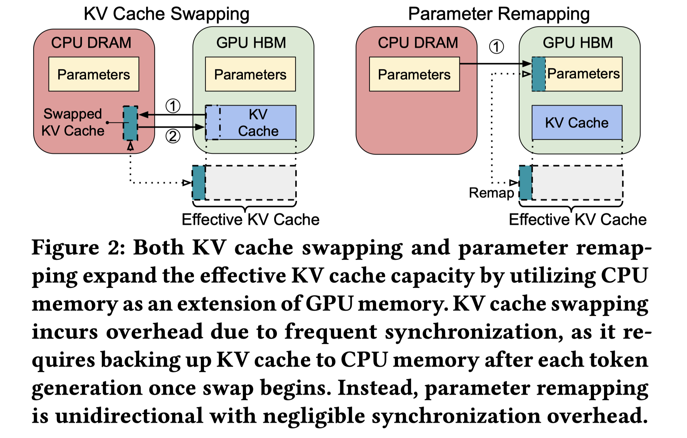

# Oneiros: KV Cache Optimization through Parameter Remapping for Multi-tenant LLM Serving

> Ruihao Li, Shagnik Pal, Vineeth Narayan Pullu, Prasoon Sinha, Jeeho Ryoo, Lizy K. John, Neeraja J. Yadwadkar

## Abstract

KV cache accelerates LLM inference by avoiding redundant computation, at the expense of memory. To support larger KV caches, prior work extends GPU memory with CPU memory via CPU-offloading. This involves swapping KV cache between GPU and CPU memory. However, because the cache updates dynamically, such swapping incurs high CPU memory traffic. We make a key observation that model parameters remain constant during runtime, unlike the dynamically updated KV cache. Building on this, we introduce Oneiros, which avoids KV cache swapping by remapping, and thereby repurposing, the memory allocated to model parameters for KV cache. This parameter remapping is especially beneficial in multi-tenant environments, where the memory used for the parameters of the inactive models can be more aggressively reclaimed. Exploiting the high CPU-GPU bandwidth offered by the modern hardware, such as the NVIDIA Grace Hopper Superchip, we show that Oneiros significantly outperforms state-of-the-art solutions, achieving a reduction of 44.8%-82.5% in tail time-between-token latency, 20.7%-99.3% in tail time-to-first-token latency, and 6.6%-86.7% higher throughput compared to vLLM. Source code of Oneiros is available at https://github.com/UT-SysML/Oneiros/.

- Offloading： 把一部分计算和kv cache offload到cpu
- KV cache swapping：把一部分暂时用不到的kv swap到cpu中；双向的传输，CPU<->GPU,带宽有损失
- parameter remapping：把一部分model paramters 放到cpu中，kv 就可以有更大的空间；单向的传输CPU->GPU，带宽高