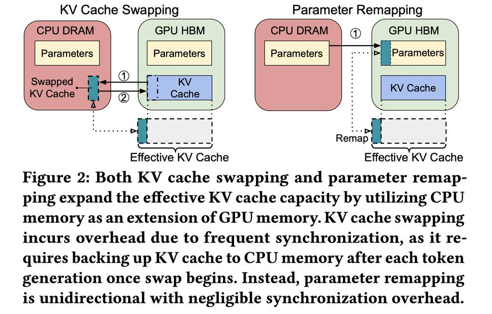

# Oneiros: KV Cache Optimization through Parameter Remapping for Multi-tenant LLM Serving

> Ruihao Li, Shagnik Pal, Vineeth Narayan Pullu, Prasoon Sinha, Jeeho Ryoo, Lizy K. John, Neeraja J. Yadwadkar
>
> SoCC 2025 | [arXiv](http://arxiv.org/abs/2507.11507v2) | [Code](https://github.com/UT-SysML/Oneiros)

---

## 一句话总结

Oneiros 通过将模型参数内存动态重映射为 KV cache，避免了传统 KV cache 双向交换的开销，在多租户 LLM 推理服务中实现了尾延迟降低 44.8%-99.3%、吞吐量提升 6.6%-86.7% 的显著性能改进。

---

## 摘要翻译

KV cache 通过避免冗余计算来加速 LLM 推理，但以内存为代价。为了支持更大的 KV cache，先前工作通过 CPU offloading 用 CPU 内存扩展 GPU 内存，这涉及在 GPU 和 CPU 内存之间交换 KV cache。然而，由于 cache 是动态更新的，这种交换会带来高 CPU 内存流量。作者做出一个关键观察：模型参数在运行时保持不变，不同于动态更新的 KV cache。基于此，作者引入 Oneiros，通过重映射（remapping）模型参数的内存来为 KV cache 提供空间，从而避免 KV cache 交换。这种参数重映射在多租户环境中尤其有利，因为非活跃模型的参数内存可以被更积极地回收。利用现代硬件（如 NVIDIA Grace Hopper Superchip）提供的高 CPU-GPU 带宽，Oneiros 显著优于现有解决方案：与 vLLM 相比，尾延迟（time-between-token）降低 44.8%-82.5%，首 token 延迟（time-to-first-token）降低 20.7%-99.3%，吞吐量提高 6.6%-86.7%。

---

## 研究动机

### 核心问题

LLM 的内存需求增长速度远超 GPU 内存容量，使内存成为高效推理服务的关键瓶颈。KV cache 是解决推理延迟的关键机制，但其大小与序列长度和 batch size 线性增长，当 KV cache 超出 GPU 内存容量时，系统必须重新计算 KV cache，导致延迟大幅增加。

### 现有方案的局限

1. **CPU Offloading（方案 1）**：将注意力计算卸载到 CPU，允许 KV cache 存储在 CPU 内存中。但在高带宽硬件（如 GH200）上，CPU 并行度不足成为瓶颈，而非 CPU-GPU 带宽。论文实测显示，在 GH200 上参数加载比 CPU 计算更快，因此参数重映射比 CPU offloading 更适合高带宽硬件。

2. **KV Cache Swapping（方案 2）**：将部分 KV cache 交换到 CPU 内存，释放 GPU 空间给活跃 KV cache。但 KV cache 在每次 token 生成后都会更新，需要频繁的双向数据传输（CPU ↔ GPU），引入同步开销。实测显示，当读写比为 1:1 时，CPU-GPU 带宽从 ~427 GB/s 下降到 ~366 GB/s，降幅约 15%。

### 关键洞察

模型参数在推理运行时是不变的（immutable），而 KV cache 是动态更新的。因此，可以将模型参数内存重映射为 KV cache，实现**单向数据传输（CPU → GPU）**，避免双向交换的同步开销。在多租户场景中，非活跃模型的参数内存可以被更积极地回收，为活跃模型的 KV cache 提供更多空间。

---

## 方法（技术细节）

### 整体架构

Oneiros 由三个核心组件构成：

1. **Metadata Store（元数据存储）**：维护模型信息（活跃/非活跃模型）和内存利用信息（KV cache 使用量、可用空闲内存）。

2. **Remapping Controller（重映射控制器）**：动态将非活跃模型参数内存重新分配为 KV cache。当 KV cache 需求超过可用 GPU 内存时，回收部分参数内存；当 KV cache 使用减少时，恢复参数存储。

3. **Async Transfer Engine（异步传输引擎）**：管理参数加载，将 CPU-GPU 数据传输与 GPU 计算同步。利用 LLM 层的确定性执行顺序，将传输与计算重叠（pipeline）。

### 关键设计决策

#### 1. 何时重映射（When to Remap）

- **触发条件**：当 KV cache 容量耗尽时触发。
- **停止条件**：在非高峰期（KV cache 空间充足时），通过 **Dynamic Reversion** 机制将重映射的内存恢复为参数存储。
- **重要性**：及时停止重映射至关重要，延迟停止可使延迟增加高达 49%（实验验证）。

#### 2. 重映射哪些模型（Which Models to Remap）

- **时间共享（Temporal Sharing）**：优先重映射调度策略中优先级最低的非活跃模型。使用 **MRU（Most Recently Used）** 策略，将最不期望被重用的模型的参数进行重映射。
- **空间共享（Spatial Sharing）**：所有模型都视为活跃模型，需对每个模型进行参数重映射。
- **公平性保证**：设置最大重映射阈值，确保任何模型永远不会被完全重映射，避免饥饿问题。

#### 3. 重映射多少层（How Many Layers to Remap）

**核心约束**：参数加载时间不能成为性能瓶颈，需要满足 $T_T \times N \leq T_{compute}$，其中 $T_T$ 是单层参数加载时间，$N$ 是重映射层数，$T_{compute}$ 是 GPU 计算时间。

- **动态调整**：由于请求到达率动态变化，GPU 计算时间也会变化，因此需要动态调整重映射百分比。
- **时间共享 vs 空间共享**：非活跃模型的 prefill 阶段计算时间更长（更密集），因此可以重映射更多层。
- **实验验证**：使用静态重映射百分比会导致次优资源利用（在低负载时 CPU-GPU 带宽成为瓶颈）。

#### 4. 重映射哪些层（Which Layers to Target）

**核心思想**：利用 LLM 推理的**循环执行特性**（autoregressive nature），选择均匀间隔的层进行重映射。

**均匀间隔选择策略（Uniform-Interval Layer Selection）**：
- 被重映射的层均匀分布在模型各层中，共享一个 GPU 内存区域。
- 在任意时刻，某些层参数在 GPU 内存中，其他层在 CPU 内存中。
- 当需要不在 GPU 内存中的层时，将其参数加载到共享区域，替换之前的层。

**理论证明**（最优性）：
- 对于 n 层模型，重映射 α 层，需要在 n-α 层的 GPU 内存中调度 n 层。
- 在循环执行模型中，最大化最小间隔的配置是均匀分布（等角间隔）。
- 使用双缓冲（double buffering），将传输层数从 α+1 增加到 α+2，减少数据依赖。
- 对于 α≥9 的 40 层模型，使用 m=α+2 可提供更好性能。

### 工作流

1. Scheduler 选择活跃模型。
2. Memory Allocator 更新参数和 KV cache 内存使用。
3. Remapping Controller 判断是否需要重映射（KV cache 容量是否足够）。
4. 如果需要，更新内存使用记录并触发 Async Transfer Engine。
5. GPU 执行 LLM 推理，参数加载与计算重叠。
6. 在请求完成、KV cache 空间释放时，停止重映射并恢复参数存储。

### 实现细节

- 集成到 **vLLM v0.7.3**，使用 CUDA 12.4、PyTorch 2.5.1。
- 添加约 3000 行 Python 代码和 300 行 C++/CUDA 代码。
- **GPU 内存管理**：采用 vAttention 设计，为 KV cache 预留足够虚拟内存空间，按需映射物理内存页。参数张量释放后，KV cache 引擎可立即复用空闲物理内存。
- **异步传输**：Remapping Controller 与 Transfer Engine 协调，指定要重映射的模型和层。当重映射启用时，传输引擎启动异步参数传输，覆盖已完成执行的层的 GPU 张量内存。
- **内存屏障同步**：在启动依赖重映射参数的 kernel 前，GPU 执行内存屏障同步检查。

---

## 实验结果

### 实验设置

- **平台**：NVIDIA GH200 Grace Hopper Superchip（H200 GPU，96GB HBM3 内存，72 个 Arm Neoverse V2 核心，224GB LPDDR5X 内存，900 GB/s NVLink 互连）
- **模型**：OPT-13b、OPT-30b、Llama-2-13b、Llama-3-8b
- **模型组合**：
  - C1: OPT-13b (35%), Llama-2-13b (35%), Llama-3-8b (20%)
  - C2: OPT-30b (65%), OPT-6.7b (15%)
- **数据集**：ShareGPT、Alpaca、合成数据集（不同长度）
- **Trace**：Azure coding LLM 推理 trace（突发查询模式）
- **基线**：vLLM、Pie（KV cache 交换方法）
- **指标**：P99 TBT（time-between-token）、P99 TTFT（time-to-first-token）、吞吐量（tokens/s）

### 核心结果

#### 1. 时间共享 GPU 场景（Temporal GPU Sharing）

| 指标 | Oneiros vs vLLM |
|------|----------------|
| P99 TBT 延迟 | 降低 44.8%-82.5% |
| P99 TTFT 延迟 | 降低 20.7%-99.3% |
| 吞吐量 | 提高 6.6%-86.7% |

- **C1 模型组合**：平均 P99 TBT 降低 54.4%，P99 TTFT 降低 96.7%，吞吐量提高 39.9%。
- **C2 模型组合**：平均 P99 TBT 降低 44.8%，P99 TTFT 降低 74.8%，吞吐量提高 45.3%。
- **不同到达率**：吞吐量平均提高 86.7%，TBT 尾延迟降低 82.5%，TTFT 尾延迟降低 99.3%。
- **不同输入长度**：吞吐量平均提高 65.6%，TBT 尾延迟降低 57.1%，TTFT 尾延迟降低 98.1%。
- **模型选择策略**：MRU 策略比 LRU 策略最多降低 22.0% 尾延迟（通过推迟传输成本）。

#### 2. 空间共享 GPU 场景（Spatial GPU Sharing）

| 共享方式 | P99 TBT 降低 | P99 TTFT 降低 | 吞吐量提高 |
|---------|-------------|-------------|-----------|
| 非严格物理隔离（MPS） | 65.5% | 20.7% | 6.6% |
| 严格物理隔离（MIG） | 57.4% | 34.8% | 7.9% |

#### 3. 与 KV Cache 交换对比（vs Pie）

| 指标 | Oneiros vs Pie |
|------|---------------|
| P99 TBT 延迟 | 降低 35.0% |
| P99 TTFT 延迟 | 降低 93.6% |
| 吞吐量 | 提高 47.1% |

- 原因：避免了 KV cache 备份到 CPU 内存的开销，更高效利用 CPU-GPU 带宽。
- 额外优势：在时间共享场景中，非活跃模型可能没有 KV cache，KV cache 交换方法无法回收内存，而 Oneiros 可以回收参数内存。

#### 4. 层选择策略有效性

- **m=α+2（双缓冲）** 性能最佳，比 m=α+1 提高 12.7% 吞吐量。
- 动态方案（小 α 时用 α+1，大 α 时用 α+2）性能接近最优。

#### 5. 何时重映射（Ablation）

- **Dynamic Reversion（动态恢复）**：在非高峰期（RPS=1.0）将 P50 延迟降低 49%。
- **重映射百分比上限（Capping）**：在 10 RPS 时，上限策略将 P99 延迟降低 58%，P50 降低 44%，同时保持低平均延迟。

---

## 优势

1. **单向数据传输**：避免了 KV cache 双向交换的同步开销，CPU-GPU 带宽利用率更高（无 15% 带宽下降）。
2. **与调度器无关**：可集成到任何 LLM 推理服务系统（vLLM 等），支持时间/空间/混合共享策略。
3. **无缝集成**：无需修改 CUDA kernel，与 Pod-Attention、LServe 等高级 kernel 兼容。
4. **理论保证**：层选择策略有理论证明的最优性（均匀间隔选择最大化最小传输时间）。
5. **动态适应**：Remapping Controller 在运行时根据负载动态调整重映射百分比和策略。
6. **多租户友好**：特别适合多 agent 工作流和模型频繁空闲的场景，能积极回收非活跃模型内存。
7. **硬件兼容性**：可部署在低带宽系统（如 PCIe GPU），通过自适应减少重映射层数。
8. **可扩展性**：与 CPU offloading（如 NEO、FlexInfer）可组合使用，形成互补。

---

## 局限

1. **硬件依赖**：在高 CPU-GPU 带宽硬件（如 GH200）上效果最佳，低带宽系统性能提升有限（尽管可通过自适应减少重映射层数来缓解）。
2. **单 GPU 评估**：仅在单 GPU 上评估，未涉及多 GPU 分布式推理场景。
3. **模型参数假设**：假设所有层相同（参数大小一致），对于异构层（如 Jenga）的模型需额外适配（可用整数线性规划解决）。
4. **重映射百分比限制**：无法完全重映射所有参数（需保留部分层在 GPU 中以支持冷启动和 prefill 阶段），实际可重映射的比例受限。
5. **吞吐量与延迟权衡**：过于激进的重映射会增加 CPU-GPU 数据传输开销，虽然降低尾延迟，但可能增加平均延迟（需通过上限策略平衡）。
6. **数据依赖限制**：参数加载必须在层执行完成前完成，对于大模型（α≥9）需使用双缓冲（m=α+2），增加设计复杂度。

---

## 与 EfficientPaper 相关的研究方向

### KV Cache 管理与优化
- 本文专注于通过参数重映射扩展 KV cache 容量，是 KV cache 管理领域的前沿工作。
- 与 PagedAttention（vLLM）、InfiniGen、CacheGen、Keyformer 等 KV cache 优化方法形成互补。
- 可与 KV cache 压缩、稀疏注意力等技术组合使用，进一步提升效率。

### 多租户 LLM 推理服务
- Oneiros 是首个支持动态参数重映射的多租户 LLM 推理系统。
- 与 Prism、Llumnix、MuxServe 等多租户服务系统形成对比，提供新的内存管理策略。
- 适用于多 agent 工作流（多模型协作）、云生产环境（模型频繁空闲）。

### GPU 内存管理
- 参数重映射是一种新的 GPU 内存管理策略，不同于传统的 CPU offloading 和 KV cache 交换。
- 与 DeepSpeed、FlexGen、vAttention 等内存优化方法形成对比。
- 可扩展到异构内存（HBM + LPDDR5X）的场景。

### CPU-GPU 数据传输优化
- 本文利用现代硬件的高 CPU-GPU 带宽（GH200: 900 GB/s），通过单向传输避免双向交换的带宽下降。
- 可与 FlexInfer、NEO 等 CPU offloading 方法组合使用，形成更高效的内存管理方案。

### 系统级 LLM 优化
- Oneiros 作为调度器无关的内存引擎，可与 Pod-Attention、LServe 等高级 kernel 兼容。
- 提供了从系统层面优化 LLM 推理服务的思路，包括层选择、动态重映射、双缓冲等设计。

---

> **生成声明**：本文 note 由 AI Agent 自动生成，基于对论文全文的阅读和理解。内容仅供参考，如有错误请以原文为准。
