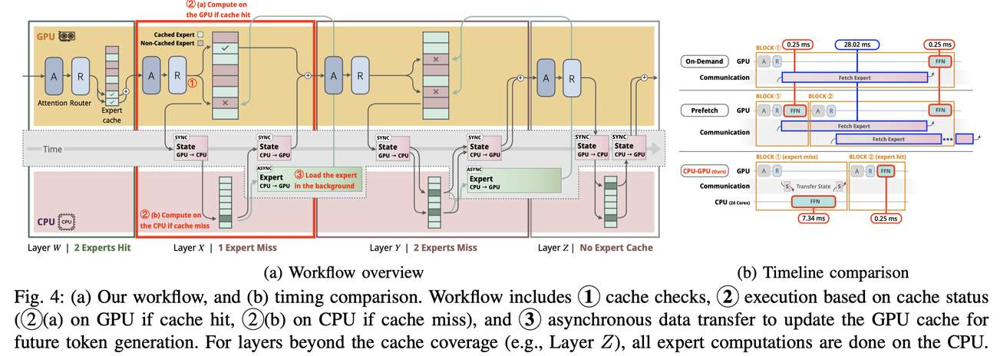

# Efficient CPU-GPU Collaborative Inference for MoE-based LLMs on Memory-Limited Systems

> En-Ming Huang, Li-Shang Lin, Chun-Yi Lee

> ⚠️ **本 note 由 AI Agent 自动生成**（基于论文全文提取与分析），仅供学习参考。

---

## 一句话总结

本文提出了一种面向内存受限消费级硬件的 **CPU-GPU 协同推理框架**，通过 GPU 专家缓存 + CPU 多线程并行 + 异步权重传输，在无需修改模型或离线分析的前提下，实现 MoE 大模型单请求推理吞吐量的显著提升（最高 4.4 倍加速）。

---

## 摘要翻译

大语言模型（LLM）在各种任务中取得了令人瞩目的成果，但其高计算需求对部署构成了挑战，尤其是在消费级硬件上。混合专家（MoE）模型通过选择性激活参数子集，提供了一种高效的解决方案，降低了计算需求。尽管如此，最先进的 MoE 模型仍需要超出典型消费级 GPU 容量的大量内存。传统的将模型权重在 CPU 和 GPU 之间传输的卸载方法会引入延迟，限制推理性能。本文提出了一种新颖的 CPU-GPU 协同推理框架，该框架在 GPU 上引入专家缓存机制以减少数据传输需求，并通过缓存命中实现更快的推理。当缓存未命中时，计算被卸载到 CPU，借助 CPU 多线程优化高效处理。评估结果表明，该框架在消费级系统的单请求推理场景中实现了性能提升，凸显了 CPU-GPU 协同最大化硬件利用率的潜力。代码开源：https://github.com/elsa-lab/MoE-CPU-GPU-Collaborative-Inference

---

## 研究动机

1. **MoE 模型内存瓶颈**：MoE 模型（如 Mixtral 8x7B，88GB 权重）虽然计算稀疏，但总参数量远超消费级 GPU 显存（如 RTX 4090 仅 24GB）。
2. **传统卸载方法的局限**：现有方法（如 DeepSpeed Inference、Huggingface Accelerate）采用按需权重传输，引入显著通信延迟（PCIe 传输约 28ms），吞吐量受限于数据传输时间。
3. **预取方法的不足**：预取方法（如 Pre-gated MoE、AdapMoE）需要修改路由器结构或离线分析，且由于传输开销远大于计算时间，计算-通信重叠效果有限。
4. **CPU 计算能力被忽视**：作者观察到 CPU 通过多线程（OpenMP）具有显著并行计算能力，在 2 个以上核心时可超越 GPU 卸载方式的吞吐量（如 Mixtral 8x7B，CPU 2 线程 25.5ms vs GPU 0.3ms + 28ms 传输）。
5. **专家复用模式**：分析发现 MoE 模型中存在显著的专家复用模式——连续层模式（约 44%）和连续 token 模式（40%~60%），可用于 GPU 缓存优化。

---

## 方法（技术细节）

### 框架整体设计

本文提出了一个 **CPU-GPU 协同推理框架**，核心思想是将 GPU 显存作为专家权重缓存，CPU 作为计算后备：

1. **GPU 内存分区**：GPU 显存被分为两部分：
   - **固定组件**：自注意力层、归一化层、路由器网络、KV 缓存（约 5GB）
   - **专家缓存**：剩余显存用于存储专家权重

2. **N-index、M-way 组相联缓存结构**：
   - 缓存覆盖 MoE 模型的第 0 到 N-1 层
   - 每层可缓存 M 个专家权重
   - 专家槽位数 S = available GPU memory / per-expert size
   - 例如 RTX 4090（24GB）可存储约 56 个 Mixtral 8x7B 专家（每专家 340MB），配置 4-way 缓存可覆盖 14 层

3. **推理工作流程（三步）**：
   - **缓存检查**：每层推理时检查所需专家是否在 GPU 缓存中
   - **按状态执行**：
     - **缓存命中**：直接在 GPU 上计算，避免通信开销
     - **缓存未命中**：将中间状态（注意力输出）传输到 CPU，由 CPU 多线程计算专家
   - **异步数据传输**：未命中的专家权重在后台异步传输回 GPU，为后续 token 生成更新缓存

4. **异步传输优化**：利用 NVIDIA 双拷贝引擎（dual-copy engine），通过两个独立 CUDA 流实现并发数据传输，避免中间状态传输与权重传输的串行瓶颈。

### 缓存驱逐策略

- 采用 **LRU（最近最少使用）** 策略
- 基于连续 token 模式（Consecutive Tokens Pattern）：最近被选中的专家很可能在后续 token 中再次被使用
- 对比实验表明 LRU 优于随机策略（命中率提升 5%~15%）和 FIFO（相近但 LRU 略优）

### 关键技术特性

- **无需模型修改**：不改变路由器结构，不需自定义预取层
- **无需离线分析**：不依赖数据集特征分析或专家流行度统计
- **即插即用**：支持任何 MoE 架构（Mixtral 8x7B、Phi-3.5-MoE 等）
- **自适应缓存配置**：根据 CPU 核心数动态调整缓存策略（少核心 → 多索引少路，多核心 → 少索引多路）

---

## 实验结果

### 实验设置

- **硬件**：AMD Ryzen Threadripper 7960X（24 核 CPU）+ NVIDIA RTX 4090（24GB GPU）
- **模型**：
  - Mixtral 8x7B：46.7B 参数，88GB，32 层，每层 8 专家（top-2），每专家 340MB
  - Phi3.5-MoE：41.9B 参数，79GB，32 层，每层 16 专家（top-2），每专家 152MB
- **对比方法**：On-demand Fetching、Pre-gated MoE、Fiddler、CPU-only

### 主要结果

| 指标 | Mixtral 8x7B | Phi3.5-MoE |
|------|-------------|------------|
| 最高吞吐量 | **4.8 tokens/s** | **10.4 tokens/s** |
| 最大加速比 | 4.4× vs 预取方法 | 4.3× vs 预取方法 |
| vs Fiddler | ~1.6× | ~1.6× |
| vs CPU-only 提升 | 15%~35% | 50%~250% |

### 缓存配置与性能关系

- **少核心（1~4）**：CPU 计算时间占主导，多索引少路配置更优（覆盖更多层）
- **多核心（8~24）**：通信开销成为瓶颈，少索引多路配置更优（提高命中率）

### 能耗分析

- **功耗**：CPU 功耗随核心数增加（每核心约 2~4W），但总能耗显著降低
- **每 token 能耗**：24 核时，Mixtral 8x7B 仅需预取方法的 29.9%，Phi3.5-MoE 仅需 27.8%
- **优势**：虽然 CPU 功率更高，但生成时间大幅缩短，整体能效显著提升

---

## 优势

1. **无模型修改**：不需要修改路由器结构或添加自定义预取层，兼容性极强
2. **无离线分析**：不依赖数据集特征或专家流行度分析，即插即用
3. **显著加速**：单请求场景下最高 4.4 倍加速，吞吐量大幅提升
4. **能效优化**：每 token 能耗降低约 70%，适合资源受限场景
5. **灵活适配**：支持不同 CPU 核心数（1~24）的硬件配置，可根据硬件资源动态调整缓存策略
6. **专家复用洞察**：首次系统分析并利用了连续 token 模式的专家复用规律（40%~60% 重复率）
7. **异步传输**：利用 NVIDIA 双拷贝引擎实现并发传输，有效隐藏通信延迟
8. **开源实现**：代码公开，便于复现和集成

---

## 局限

1. **单请求场景**：框架主要针对单请求（per-request）推理场景，多请求并发场景下的表现有待进一步验证
2. **缓存容量有限**：GPU 显存限制了缓存覆盖的层数（如 RTX 4090 仅覆盖 Mixtral 8x7B 的 14/32 层），超出缓存范围的层全部在 CPU 上计算
3. **CPU 依赖**：性能高度依赖 CPU 核心数，少核心（1~2）配置下优势有限
4. **PCIe 带宽瓶颈**：框架仍依赖 PCIe 传输，高端 GPU（如 H100）可能有不同表现
5. **仅测试两个模型**：实验仅在 Mixtral 8x7B 和 Phi3.5-MoE 上验证，对其他 MoE 架构的泛化性需进一步确认
6. **Pre-gated MoE 对比为估算**：由于 Pre-gated MoE 不支持新模型，其性能为假设完美计算-通信重叠的估算值
7. **功耗增加**：CPU 多核并行虽然缩短了生成时间，但 CPU 功率随核心数增加

---

## 与 EfficientPaper 相关的研究方向

1. **MoE 模型高效推理**：本文属于 MoE 模型部署优化方向，核心关注内存受限场景下的推理加速
2. **异构计算协同**：CPU-GPU 协同计算在 LLM 推理中的应用，与模型并行、流水线并行等方向相关
3. **模型卸载与缓存策略**：专家权重的缓存与驱逐策略（LRU vs FIFO vs 随机），与 KV 缓存优化、模型量化等研究互补
4. **消费级硬件部署**：面向非数据中心场景的 LLM 部署，与边缘计算、设备端推理等方向相关
5. **内存受限 LLM 优化**：与模型压缩、量化、剪枝等内存优化技术有潜在结合空间
6. **单请求低延迟推理**：与投机解码（Speculative Decoding）、异步推理等方向可进一步结合

---

## 关键数据

- **论文标题**：Efficient CPU-GPU Collaborative Inference for MoE-based LLMs on Memory-Limited Systems
- **作者**：En-Ming Huang, Li-Shang Lin, Chun-Yi Lee（台湾大学、清华大学）
- **发表**：ASP-DAC 2026（Asia and South Pacific Design Automation Conference）
- **arXiv**：http://arxiv.org/abs/2512.16473v1
- **代码**：https://github.com/elsa-lab/MoE-CPU-GPU-Collaborative-Inference
- **关键词**：deployment, CPU-GPU optimization, LLM Inference, MoE
- **硬件环境**：AMD Ryzen Threadripper 7960X（24 核）+ NVIDIA RTX 4090（24GB）
