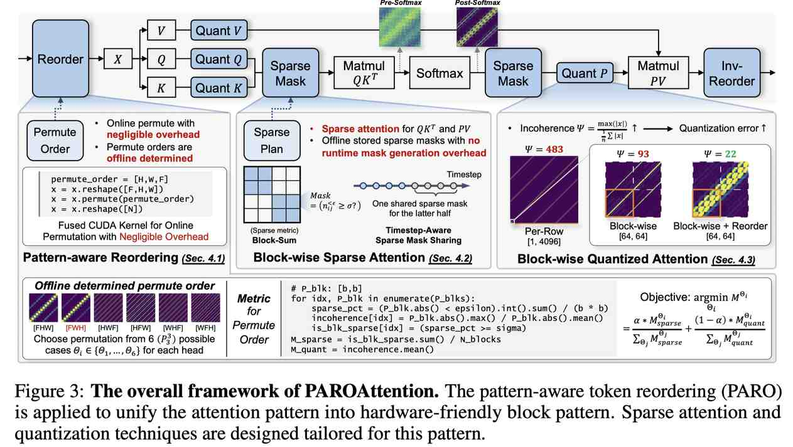

# PAROAttention: Pattern-Aware ReOrdering for Efficient Sparse and Quantized Attention in Visual Generation Models

> Tianchen Zhao, Ke Hong, Xinhao Yang, Xuefeng Xiao, Huixia Li, Feng Ling, Ruiqi Xie, Siqi Chen, Hongyu Zhu, Yichong Zhang, Yu Wang



> ⚠️ **本文档由 AI Agent 自动生成**，生成时间：2026-06-04。内容基于 arXiv:2506.16054v1 全文提取与分析。

## 一句话总结

PAROAttention 通过**模式感知的 token 重排序（PARO）**将视觉生成模型中多样化、分散的注意力模式统一为硬件友好的块状模式，从而在低密度（20%-30%）和低比特（INT8/INT4）条件下实现 **1.9×–2.7×** 的端到端延迟加速，同时保持与全精度基线几乎一致的生成质量。

## 摘要翻译

在视觉生成中，注意力机制的二次复杂度导致高内存和计算开销，特别是在高分辨率图像或多帧视频生成所需的较长 token 序列中。为解决这一问题，先前研究探索了稀疏化和量化等技术。然而，这些技术在低密度和低位宽条件下面临重大挑战。通过系统分析，我们识别出核心困难源于视觉注意力模式的分散和不规则特性。因此，我们提出了一种替代策略：**"重组"注意力模式**以缓解这些挑战。受视觉特征提取的局部聚合性质启发，我们设计了新颖的 **模式感知 token 重排序（PARO）**技术，将多样化的注意力模式统一为硬件友好的块状模式。这种统一显著简化和增强了稀疏化和量化。我们的方法 **PAROAttention** 在视频和图像生成中实现了无损指标，与全精度（FP）基线结果几乎相同，同时在显著更低的密度（20%-30%）和位宽（INT8/INT4）下运行，实现了 **1.9×–2.7×** 的端到端延迟加速。

## 研究动机

### 核心问题
扩散变压器（Diffusion Transformer）在视觉生成中面临严峻的效率挑战。以 CogVideoX 为例，生成一段 49 帧 6 秒 720P 视频涉及约 17K token 长度，注意力计算占总延迟的大部分，是主要瓶颈。

### 现有方法的不足
- **稀疏注意力**：现有方法（如 DiTFastAttn、MInference、SparseVideoGen、SpargeAttn）针对特定注意力模式设计稀疏掩码，但视觉注意力模式高度多样且动态变化（包括块状、多对角线、块内对角线等类型），难以设计统一的结构化稀疏模式。在低密度（< 50%）下，质量明显退化。
- **量化技术**：现有方法（如 SageAttn、SageAttnV2）主要关注 QK 量化，而 PV 计算的量化仍停留在 FP8/FP16 水平。视觉注意力的对角线结构导致数据组内存在大量"离群值"，增加量化误差。

### 关键洞察
通过系统分析，作者发现视觉注意力模式多样性的根源在于：3D 物理空间被展平为 1D token 序列时，不同维度的局部聚合（如沿 F、H、W 维度的相邻像素关系）形成了不同的注意力模式（多对角线、块状等）。这些模式本质上是**同一局部聚合性质在不同维度上的表现**，可以通过 token 重排序来统一。

## 方法（技术细节）

### 1. Pattern-Aware Token Reordering (PARO)

**核心思想**：通过改变 token 的排列顺序，将多样化的注意力模式统一为硬件友好的块状模式。

**具体实现**：
- 对于 3D 视频生成，token 沿 [F, H, W] 三个维度排列，共有 6 种可能的排列（$P_3^3 = 6$）。
- 对于每个注意力头，选择最优排列顺序，使得注意力模式呈现均匀的块状分布。
- 排列顺序**离线确定**，跨不同时间步和提示保持一致，避免运行时开销。

**选择最优排列的指标**：
- **稀疏度指标 $M_{sparse}$**：衡量块内稀疏比例。将注意力矩阵 P 划分为 $k \times k$ 子矩阵（块大小为 $b \times b$），计算每个块中绝大多数值（超过 $\sigma$ 阈值）小于 $\epsilon$ 的比例。
- **量化难度指标 $M_{quant}$**：衡量块内数据分布的"不一致性"（incoherence），即最大值与平均绝对值之比 $\Psi$。
- 最终指标 $M = \alpha \cdot M_{sparse} + (1-\alpha) \cdot M_{quant}$，选择使 $M$ 最小的排列顺序。

**开销极小**：
- 排列操作与前序 kernel（如 LayerNorm）融合，仅需调整输出写回地址，开销不到前序 kernel 的 1%。
- 融合 RoPE 运算时，排列开销仅 0.03%。

### 2. Block-wise Sparse Attention（块状稀疏注意力）

在 PARO 重排序后，注意力模式被统一为块状结构，可采用静态稀疏方案：

- **静态 vs 动态**：选择静态方案，因为：
  - 动态方案基于 QK 嵌入预测稀疏掩码，但 pre-softmax 注意力图缺乏可区分的稀疏模式。
  - 静态方案可访问信息更丰富的 post-softmax 注意力模式。
  - 静态方案避免了运行时掩码预测开销。

- **时间步感知的稀疏掩码共享**：
  - 跨不同提示的注意力模式相似度极高（余弦相似度 ≥ 0.99）。
  - 跨时间步相似度较低，采用时间步级别稀疏掩码。
  - 仅对前半段时间步使用不同掩码，后半段复用通用掩码（注意力模式在后期趋于稳定）。
  - 使用预取机制，每次仅加载当前块的掩码，内存成本从 GB 降至 KB 级。
  - 掩码存储为二进制位掩码，每个头仅需 9.2 KB。

- **块对齐稀疏粒度**：稀疏化粒度与 FlashAttention 块大小对齐（64×64），整个块可直接跳过，无需额外分支逻辑。

- **高效离线掩码生成**：仅需 1-2 个提示即可确定排列顺序和生成稀疏掩码，耗时约分钟级。

### 3. Block-wise Quantized Attention（块状量化注意力）

- **块对齐量化分组**：量化分组与 FlashAttention 块大小对齐（64×64）。简单的逐行量化方案（per-row）与 FlashAttention 的块处理范式不兼容，且引入高不一致性（$\bar{\Psi} = 93$）。

- **Token 重排序降低不一致性**：重排序将相似注意力值聚集到局部块中，显著降低不一致性（从 200-1200 降至 12-20），从而减少量化误差。

- **整数量化优势**：
  - INT8 比 FP8 提供更多尾数位（等效 7 位 vs 2 位），能更精确表示细微数值差异。
  - 整数格式更适合低位宽（如 INT4），FP4 仅有 1-2 位尾数。
  - 支持非 GPU 硬件平台（如专用加速器），INT8 矩阵乘法可能更节省资源。

- **同时量化 QK 和 PV**：PAROAttn 支持 QK 和 PV 均使用 INT8/INT4，而 SageAttn 仅量化 QK（PV 用 FP16），SageAttnV2 仅量化 QK（PV 用 FP8）。

### 4. 整体框架

```
输入 X → PARO 重排序 → QK Matmul (可量化为 INT8/INT4)
     → Softmax → 稀疏化 (块对齐, 静态掩码)
     → PV Matmul (可量化为 INT8/INT4) → 输出 O
```

重排序和稀疏化在 FlashAttention 框架中高效实现，基于 SageAttnV2 kernel 进行定制化扩展。

## 实验结果

### 实验设置
- **视频生成**：CogVideoX-5B（720P 6 秒，30 采样步）和 Wan-2.1 14B（720P 10 秒，30 采样步）
- **图像生成**：Flux.1.Dev（1024 分辨率，30 采样步）
- **评估指标**：
  - 质量指标：CLIPSIM、VQA、FlowScore（视频）；CLIPScore、ImageReward（图像）
  - 相对差异指标：PSNR、SSIM、CosSim、FVD-FP16、FID-FP16
- **硬件**：NVIDIA A100（稀疏化）、NVIDIA RTX 4090（量化）
- **基线方法**：DiTFastAttn、MInference、SpargeAttn、SparseVideoGen（稀疏）；RTN、SageAttn、SageAttnV2（量化）

### CogVideoX 视频生成主要结果（Tab. 1）

| 方法 | 密度 | PSNR↑ | SSIM↑ | CosSim↑ | VQA↑ |
|------|------|-------|-------|---------|------|
| FP16 Full Attn. | 100% | ∞ | 1.000 | 1.000 | 92.53 |
| DiTFastAttn (0.5) | 50% | 15.40 | 0.603 | 0.920 | 90.43 |
| MInference (0.5) | 50% | 16.54 | 0.696 | 0.945 | 86.02 |
| SpargeAttn (0.5) | 50% | 16.80 | 0.683 | 0.938 | 87.72 |
| SparseVideoGen (0.5) | 50% | 18.50 | 0.755 | 0.960 | 90.14 |
| **PAROAttn (0.5)** | **50%** | **29.14** | **0.936** | **0.997** | **92.56** |
| SpargeAttn (0.3) | 30% | 15.22 | 0.642 | 0.912 | 86.74 |
| SparseVideoGen (0.3) | 30% | 17.73 | 0.725 | 0.954 | 89.54 |
| **PAROAttn (0.3)** | **30%** | **22.89** | **0.829** | **0.984** | **92.66** |
| **PAROAttn (0.2)** | **20%** | **19.39** | **0.744** | **0.962** | **92.42** |

**关键发现**：
1. PAROAttn 在 50% 密度下 PSNR 达到 29.14，远超所有基线（最高 18.50），与 FP16 几乎无差异。
2. PAROAttn 在 30% 密度下的性能仍优于基线方法在 50% 密度下的表现。
3. PAROAttn 在 20% 密度下仍保持与基线 50% 相当的质量。

### 量化结果（CogVideoX）

| 方法 | 量化配置 | PSNR↑ | CosSim↑ | VQA↑ |
|------|---------|-------|---------|------|
| SageAttn | QK INT8, PV FP16 | 29.58 | 0.997 | 92.24 |
| SageAttnV2 | QK INT4, PV FP8 | 24.46 | 0.979 | 88.79 |
| **PAROAttn (INT8)** | QK INT8, PV INT8 | **29.01** | **0.996** | **92.57** |
| **PAROAttn (INT4)** | QK INT4, PV INT4 | **24.16** | **0.985** | **89.24** |

**关键发现**：PAROAttn 能将 PV 也量化为 INT8/INT4，而性能与仅量化 QK 的基线相当。INT8 量化优于 FP8（更多尾数位），INT4 量化虽有退化但仍可用。

### 稀疏+量化联合加速

| 方法 | 配置 | PSNR↑ | 加速比 |
|------|------|-------|--------|
| PAROAttn (0.3+INT8) | 30% + QK, PV INT8 | 21.49 | 5.72× |
| PAROAttn (0.5+INT4) | 50% + QK, PV INT4 | 24.34 | 9.28× |

### 硬件加速效率

- **PAROAttn 运行时开销极低**（< 1%），而 SpargeAttn 为 6-9%，SparseVideoGen 为 10-15%。
- **PAROAttn 接近理论加速上限**：50% 密度下 1.73× 加速（理论 2×），30% 密度下 2.71× 加速（理论 3.33×）。
- **PARO 可增强动态稀疏方法**：将 PARO 与 SpargeAttn 结合，30% 密度即可达到 SpargeAttn 50% 的性能，同时加速从 1.67× 提升到 2.22×。

### 图像生成结果（Flux，Tab. 2）

- PAROAttn 在 50% 密度下 CLIPScore 0.259、ImageReward 1.04，与 FP16 Full Attn.（0.258, 1.02）几乎一致。
- 图像生成中稀疏化更具挑战性（token 长度较短），基线方法在 50% 密度下已引入明显伪影。
- PAROAttn 在低密度和量化组合下仍能有效保持视觉质量和内容。

### 消融实验（Tab. 3）

- 移除 token 重排序：稀疏化 PSNR 从 29.14 降至 26.25，量化 PSNR 从 30.17 降至 29.00。
- 移除时间步共享：几乎无影响（PSNR 从 29.14 降至 29.09）。
- 将块级量化改为逐行量化：PSNR 从 30.17 降至 27.50，显著退化。
- 结论：token 重排序是最关键的组件，块级量化分组也至关重要。

### Wan-2.1 模型验证

在 Wan-2.1 14B 模型上，PAROAttn 同样显著优于 SparseVideoGen（PAROAttn 0.3 密度超越 SparseVideoGen 0.5 密度）。注意 SpargeAttn 在 Wan-2.1 上出现 NaN 问题，无法提供结果。

## 优势

1. **创新性方法论**：首次提出通过 token 重排序来统一视觉注意力模式，而非为不同模式设计专用稀疏/量化方案。这一思路简单而有效。
2. **几乎无损的性能**：在低密度（20%-30%）和低位宽（INT8/INT4）条件下，PAROAttn 生成结果与 FP16 全精度基线几乎一致，质量指标（VQA、CLIPSIM）甚至更优。
3. **显著的加速效果**：端到端延迟加速 1.9×–2.7×（单技术），联合使用时可达 ~10×。
4. **极低的运行时开销**：< 1%，通过 kernel 融合和预取技术实现。
5. **通用性**：PARO 重排序与动态稀疏方法兼容（可增强 SpargeAttn 等），适用于视频和图像生成。
6. **离线处理简单**：仅需 1-2 个提示即可确定排列顺序和生成掩码，耗时分钟级。
7. **全面的量化支持**：同时量化 QK 和 PV 为 INT8/INT4，突破了 SageAttn 系列仅量化 QK 的局限。
8. **硬件友好**：块对齐设计与 FlashAttention 兼容，CUDA 实现简洁高效。
9. **丰富的消融实验**：对各组件贡献进行了详尽分析，提供了坚实的方法论支撑。
10. **广泛的应用前景**：作者讨论了 PARO 在模型训练、多模态模型、非 GPU 硬件等场景的潜在应用。

## 局限

1. **排列空间受限**：当前仅考虑 6 种排列（$P_3^3 = 6$），属于排列的一个受限子集。更高级的 token 重排序技术可能进一步提升性能。
2. **稀疏度量简单**：使用简单的块求和阈值（block sum thresholding），可能不如更复杂的度量有效。
3. **静态掩码的局限**：虽然静态方案避免了运行时开销，但可能无法充分适应动态变化的注意力模式（如前 30% 时间步的快速变化）。
4. **适用范围**：主要针对视觉生成模型（DiT），对语言模型等其他 Transformer 应用的适用性尚未验证。
5. **与训练无关**：当前为后训练压缩方法，未探索在训练阶段利用 token 重排序的可能性。
6. **仅支持 3D/2D 视觉**：重排序方案依赖于视觉 token 的空间结构，对于非空间结构的序列（如纯文本）不适用。
7. **运行时仍需掩码加载**：虽然开销极低（0.33%），但静态掩码需要 GPU 内存（约 1GB），通过预取机制降低但未完全消除。
8. **与 SparseVideoGen 的 skip 策略对比**：SparseVideoGen 在前 30% 时间步跳过稀疏化，而 PAROAttn 无需此策略但比较时需考虑此因素。
9. **代码未开源**：代码仓库 URL 为空，限制了社区复现。

## 与 EfficientPaper 相关的研究方向

### 1. 注意力机制优化
- **稀疏注意力**：PAROAttention 属于视觉注意力稀疏化方向，与 DiTFastAttn、SparseVideoGen、SpargeAttn 等方法直接相关。
- **注意力量化**：PAROAttention 将注意力量化扩展到 INT8/INT4，与 SageAttn、SageAttnV2 等方法互补。
- **注意力压缩与加速**：该方向是 EfficientPaper 的核心关注点之一，PAROAttention 提供了从"适应模式"到"重组模式"的新视角。

### 2. Token 重排序与序列优化
- **Token 重排序/置换**：PARO 是这一方向的创新应用，可用于优化注意力模式和计算效率。
- **Token 裁剪/合并**：与视频 token 减少、token 路由等方法（如 FrameFusion、R2R）互补。

### 3. 生成模型效率
- **视频生成加速**：PAROAttention 主要应用于 CogVideoX、Wan 等视频生成模型，是视频扩散模型加速的重要进展。
- **图像生成加速**：PAROAttention 也适用于 Flux 等图像生成模型。
- **扩散模型量化**：与 VidIT-Q、MixDQ 等扩散模型量化方法相关，但聚焦于注意力机制。

### 4. 高效推理与部署
- **CUDA kernel 优化**：PAROAttention 的 CUDA kernel 设计（基于 SageAttnV2）展示了高效注意力计算的实践方案。
- **低比特推理**：INT8/INT4 量化支持端侧和加速器部署。
- **静态 vs 动态稀疏**：PAROAttention 的静态方案与动态方案的对比分析为方法选择提供了参考。

### 5. 相关论文
- **DiTFastAttn**（2024）：基于窗口的注意力压缩，PAROAttention 与之在稀疏化方法上形成对比。
- **SparseVideoGen**（2025）：时空稀疏注意力，PAROAttention 在低密度下显著优于其。
- **SageAttn/SageAttnV2**（2024/2025）：注意力量化基线，PAROAttention 将 PV 量化扩展到 INT8/INT4。
- **SpargeAttn**（2025）：动态稀疏注意力，PARO 可与其结合使用。
- **SVG2**（2025）：语义感知排列，与 PARO 的 token 重排序思路有共通之处。
- **FPSAttention**（2025）：FP8 和稀疏化协同设计，与 PAROAttention 的稀疏+量化联合方案互补。

## 论文信息

- **发表**：NeurIPS 2025
- **作者**：Tianchen Zhao, Ke Hong, Xinhao Yang, Xuefeng Xiao, Huixia Li, Feng Ling, Ruiqi Xie, Siqi Chen, Hongyu Zhu, Yichong Zhang, Yu Wang
- **机构**：清华大学、字节跳动 Seed
- **关键词**：sparse_pruning, attention_sparsity
- **arXiv**：http://arxiv.org/abs/2506.16054v1
- **代码**：未公开
- **基线**：2025/SVG (SparseVideoGen)
