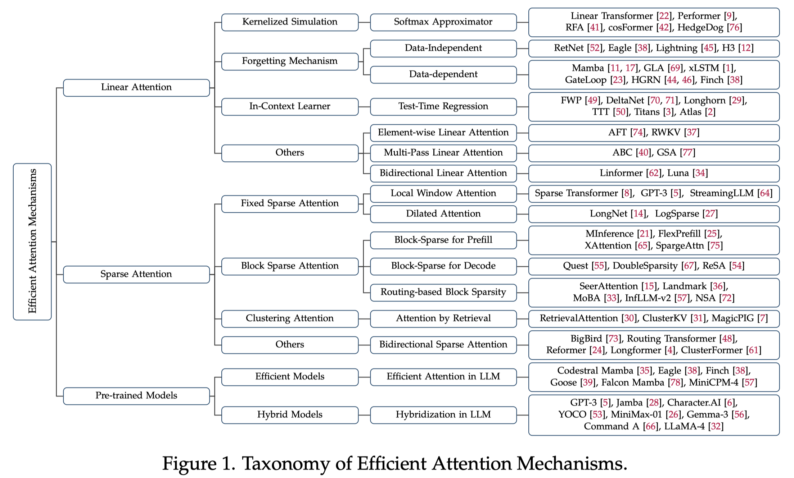

# Efficient Attention Mechanisms for Large Language Models: A Survey

> Yutao Sun, Zhenyu Li, Yike Zhang, Tengyu Pan, Bowen Dong, Yuyi Guo, Jianyong Wang

## Abstract

Transformer-based architectures have become the prevailing backbone of large language models. However, the quadratic time and memory complexity of self-attention remains a fundamental obstacle to efficient long-context modeling. To address this limitation, recent research has introduced two principal categories of efficient attention mechanisms. Linear attention methods achieve linear complexity through kernel approximations, recurrent formulations, or fastweight dynamics, thereby enabling scalable inference with reduced computational overhead. Sparse attention techniques, in contrast, limit attention computation to selected subsets of tokens based on fixed patterns, block-wise routing, or clustering strategies, enhancing efficiency while preserving contextual coverage. This survey provides a systematic and comprehensive overview of these developments, integrating both algorithmic innovations and hardware-level considerations. In addition, we analyze the incorporation of efficient attention into largescale pre-trained language models, including both architectures built entirely on efficient attention and hybrid designs that combine local and global components. By aligning theoretical foundations with practical deployment strategies, this work aims to serve as a foundational reference for advancing the design of scalable and efficient language models.
