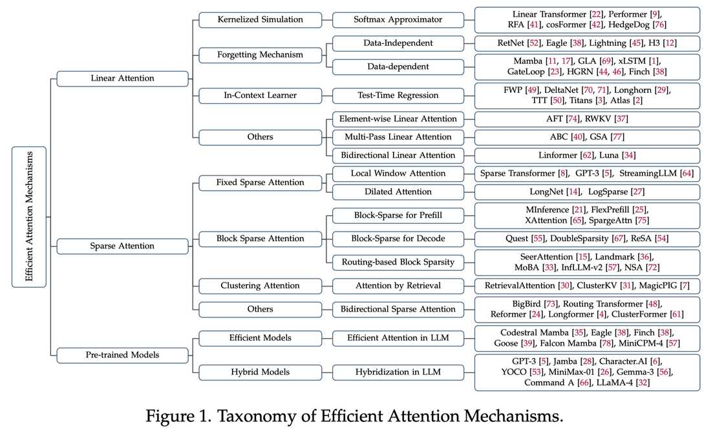

# Efficient Attention Mechanisms for Large Language Models: A Survey

> Yutao Sun, Zhenyu Li, Yike Zhang, Tengyu Pan, Bowen Dong, Yuyi Guo, Jianyong Wang

## 一句话总结

本文系统性地综述了大语言模型中高效注意力机制的两大方向——**线性注意力**（通过核近似、循环公式、快速权重动态实现线性复杂度）和**稀疏注意力**（通过固定模式、块路由、聚类策略限制注意力计算范围），并分析了这些机制在预训练 LLM 中的集成方式（纯高效架构和混合设计），为构建可扩展、高效的语言模型提供统一框架参考。

---

## 摘要翻译

Transformer 架构已成为大语言模型的主流骨干。然而，自注意力机制的二次时间/内存复杂度仍是高效长上下文建模的根本障碍。为解决此问题，近期研究引入了两大类高效注意力机制：

1. **线性注意力方法**：通过核近似、循环公式或快速权重动态实现线性复杂度，以降低计算开销实现可扩展推理。
2. **稀疏注意力技术**：将注意力计算限制在选定的 token 子集（基于固定模式、块路由或聚类策略），在保持上下文覆盖的同时提高效率。

本综述系统性地概述了这些发展，整合了算法创新与硬件层面的考虑。此外，分析了高效注意力在大规模预训练语言模型中的集成，包括完全基于高效注意力的架构以及混合局部/全局组件的设计。通过将理论基础与实际部署策略对齐，本工作旨在为推进可扩展、高效语言模型的设计提供基础参考。

---

## 研究动机

- **核心问题**：标准自注意力机制的 $O(L^2)$ 时间和内存复杂度随序列长度增长急剧膨胀，成为长上下文建模的主要瓶颈。
- **研究目标**：为高效注意力机制提供系统性综述，覆盖算法原理与系统级实现两方面，帮助研究者理解如何设计可扩展的高效语言模型。
- **研究范围**：本文分类讨论了线性注意力（三大范式）、稀疏注意力（三种模式），以及这些机制在预训练 LLM 中的集成方式（纯高效架构和混合设计）。

---

## 方法（技术细节）

### 一、线性注意力（Linear Attention）

线性注意力通过将 $O(L^2)$ 的 softmax 注意力重新参数化为线性操作，实现 $O(L)$ 复杂度。分为三大范式：

#### 1. 核化线性注意力（Kernelized Linear Attention）

核心思想：用特征映射 $\phi(\cdot)$ 近似 softmax 核，将注意力重写为 $\phi(Q)(\phi(K)^T V) / \phi(Q)(\phi(K)^T 1)$，复杂度从 $O(L^2 d)$ 降至 $O(Ld^2)$。

- **Linear Transformer**：使用 $\phi(x) = \text{ELU}(x) + 1$ 作为固定正特征映射
- **Performer**：引入 FAVOR+ 随机特征方案，无偏近似 softmax 核，使用正交随机特征减少方差
- **RFA（Random Feature Attention）**：基于随机傅里叶特征，使用三角激活函数近似 softmax，并添加门控机制（RFA-Gate）实现近期偏好
- **cosFormer**：使用余弦函数近似 softmax，利用 $\cos(a+b) = \cos a \cos b - \sin a \sin b$ 分解为线性注意力形式
- **HedgeDog**：使用尖锐核 $\phi(x) = \exp(Wx + b)$，改善注意力熵和单调性

#### 2. 带遗忘机制的线性注意力（Linear Attention with Forgetting Mechanism）

通过引入位置感知的循环状态和衰减因子，实现线性复杂度的长序列建模。

**数据无关衰减（Data-Independent Decay）**：
- **RetNet（保留网络）**：引入保留机制，使用固定衰减系数 $\gamma \in (0,1)$，状态更新为 $S_t = \gamma S_{t-1} + k_t^T v_t$，输出为 $o_t = q_t \cdot S_t$。支持并行（矩阵形式）和递推（O(1) 内存更新）两种计算模式。
- **Eagle（RWKV-5）**：改进 RWKV 设计，使用外积记忆，衰减因子参数化为 $\gamma = \exp(-\exp(w))$
- **Lightning Attention**：固定标量衰减 per head，优化硬件效率，实现长度无关的计算速度
- **H3**：将 SSM 引入线性注意力，使用数据无关的指数衰减，但需显式状态扩展，限制了表达能力

**数据相关衰减（Data-Dependent Decay）**：
一般形式为 $S_t = G_t S_{t-1} + k_t^T v_t$，其中 $G_t$ 由当前输入决定，使遗忘因子随输入内容动态变化。

- **Mamba**：递推状态空间模型，状态衰减率随输入动态变化，$G_t$ 为 0 到 1 的分组向量，作为动态遗忘门。Mamba2 可在语言建模任务上超越同等或更大规模的 Transformer。
- **GLA（门控线性注意力）**：将可学习的逐元素遗忘门嵌入线性注意力层，修改保留递推。
- **xLSTM**：用指数变换的线性门信号替代标准 sigmoid 遗忘门
- **GateLoop**：基于保留机制的头级门控
- **HGRN / HGRN2**：门控递推线性 RNN，HGRN2 添加状态扩展（等价于线性注意力中的 key-value 外积）
- **Finch（RWKV-6）**：在 Eagle 上添加数据相关门控

#### 3. 线性注意力作为上下文学习器（Linear Attention as In-Context Learners）

将线性注意力视为在线学习过程，通过快速权重更新和元学习视角增强上下文学习能力。

- **FWP（Fast Weight Programmers）**：建立线性注意力与快速权重编程器的形式等价
- **DeltaNet / Gated DeltaNet**：使用经典 delta 规则 $S_t = S_{t-1}(1 - \beta_t k_t k_t^T) + \beta_t k_t v_t^T$，在线优化 key-value 映射
- **TTT（Test-Time Training）**：推广元学习目标，支持 TTT-Linear 和 TTT-MLP，使用批次更新解决训练并行性
- **Titans**：引入动量 $M_t = (1-\alpha_t)M_{t-1} + S_t$，使记忆逐步积累信息，使用指数移动平均增强稳定性

**学习目标**：定义隐式学习目标 $L_t(S) = \frac{1}{2}\|f_S(k_t) - v_t\|^2$，通过在线梯度更新优化上下文记忆。

#### 4. 其他设计

- **逐元素线性注意力（Element-wise）**：如 AFT、RWKV，状态大小为 $R^d$（非 $R^{d \times d}$），推理优势强但状态表达受限
- **多遍线性注意力（Multi-Pass）**：如 ABC、GSA，通过多遍线性注意力增强表达能力，但带来额外计算开销
- **双向线性注意力**：如 Linformer、Luna，通过全局 token 池保持常数长度，但不适合因果设置

#### 5. 硬件实现

线性注意力有三种表示形式：
- **并行表示**：$O(N^2)$ 复杂度，适合训练但不高效
- **循环表示**：$O(N)$ 复杂度，常数内存，但训练时内存开销大
- **分块循环表示**：结合并行与循环优势，训练和预fill 阶段常用，通过分块内并行和分块间递推实现高效计算

核心优化库：FLA（Triton 实现）、CUDA、TileLang

---

### 二、稀疏注意力（Sparse Attention）

稀疏注意力通过限制注意力计算到选定的 token 子集，实现亚线性或线性复杂度。

#### 1. 固定模式稀疏注意力（Fixed-pattern Sparse Attention）

- **局部窗口注意力**：
  - **Sparse Transformer**：局部窗口 + 列注意力，$O(\sqrt{N})$ 复杂度
  - **GPT-3**：类似 Sparse Transformer 的稀疏模式
  - **StreamingLLM**：保留 sink token + 滑动窗口 token，支持无限长度流式推理；支持块级稀疏以提升硬件效率

- **膨胀注意力（Dilated Attention）**：
  - **LongNet**：指数膨胀的注意力窗口，复杂度 $O(N)$，多段不同膨胀率和窗口大小组合
  - **LogSparse**：每个位置只关注 $O(\log N)$ 个 token

#### 2. 块稀疏注意力（Block Sparse Attention）

将输入序列分为 $b$ 大小的块，通过块级掩码 $M$ 选择关键块进行计算。

**用于预填充（Prefill）**：
- **MInference**：观察到三种注意力模式（Streaming、Vertical-Slash、Block-Sparse），离线确定每个头的最优模式，动态构建稀疏索引
- **FlexPrefill**：上下文感知稀疏注意力，实时调整注意力模式和计算预算
- **XAttention**：使用反对角线评分预测块重要性，高效识别和剪枝非关键块
- **SpargeAttn**：双阶段在线过滤，第一阶段快速预测注意力图跳过矩阵乘法，第二阶段 softmax 感知过滤

**用于解码（Decode）**：
- **Quest**：维护每个块的逐元素 Min/Max Key，近似注意力分数的上界，选择 Top-K 块
- **DoubleSparsity**：离线计算 $QK^T$ 的异常通道，使用近似分数选择 Top-K token
- **ReSA**：结合免训练块稀疏估计和 GQA 共享，提出校正阶段控制 KV cache 累积误差

**基于路由的块稀疏注意力**：
- **SeerAttention**：在预训练 LLM 上通过自蒸馏训练门控网络，使用 2D 最大池化获取块重要性分数
- **Landmark**：使用特殊 landmark token 表示每个块
- **MoBA（混合块注意力）**：将 MoE 的 Top-K 机制作为门控，$s_i = <q, P_{mean}(K_i)>$，Top-K 块选择不可微
- **NSA（原生稀疏注意力）**：三分支设计（压缩、选择、滑动窗口），可微压缩分支学习块选择分数
- **InfLLM-v2**：类似 MoBA，使用小粒度内核（带重叠）提高 Top-K 块选择精度

**系统级设计**：
- 块大小 $b \geq 64$ 避免内存访问不一致
- K/V 头数 $\geq 16$ 对齐 GPU tensor core 的分组矩阵乘法指令
- 查询组内共享选定块以减少内存访问

#### 3. 聚类注意力（Clustering Attention）

- **RetrievalAttention**：使用近似最近邻搜索（ANNS）选择关键 K 簇，引入注意力感知向量搜索算法
- **ClusterKV**：基于语义聚类选择 token，使用 K-means 算法按 key 向量余弦相似度聚类，按 $q\mu_i^T$ 排名选择
- **MagicPIG**：利用 LSH 采样近似注意力，将存储和计算卸载到 CPU，引入 Oracle Top-K 采样

#### 4. 双向稀疏注意力

- **BigBird**：块级随机注意力 + 局部窗口
- **Longformer**：静态全局-局部混合注意力
- **Reformer**：LSH 分配相似 token 到同一桶
- **Routing Transformer**：在线 k-means 聚类
- **ClusterFormer**：可微聚类模块与下游目标联合训练

---

### 三、预训练 LLM 中的高效注意力

#### 1. 纯高效注意力架构

- **RWKV 系列**：Eagle（RWKV-5）引入矩阵值状态，Finch（RWKV-6）和 Goose（RWKV-7）引入动态递推和 Delta 规则
- **Mamba 系列**：Falcon Mamba（纯 Mamba 7B）在通用语言基准上与 Transformer 竞争；Codestral Mamba 支持 256k token 上下文
- **MiniCPM-4**：使用 InfLLM-v2 块稀疏注意力，通过 LogSumExp 近似实现高效 Top-K 选择

#### 2. 混合高效注意力架构

- **稀疏混合**：GPT-3 交替密集和局部带状稀疏注意力层
- **线性-全局混合**：Jamba（每 8 层 Mamba 插入 1 层 Transformer）、MiniMax-01（每 8 层插入全注意力）
- **局部-全局混合**：Gemma-3、Command A、LLaMA-4-Maverick，交替局部和全局注意力层（每 4-6 层全局），Gemma-3 使用不同 RoPE 基础频率（局部 10K、全局 1M）
- **高级混合**：Character.AI 使用 KV 共享机制；YOCO 和 Phi-4-mini-flash 采用双解码器架构（自解码器 + 交叉解码器），单层全局 KV cache

---

## 实验结果

本文作为综述论文，不涉及原始实验，但对现有工作进行了全面对比分析：

- **线性注意力**：数据相关衰减模型（如 Mamba2）通常匹配或超越 Transformer 性能
- **稀疏注意力**：块稀疏方法（如 MInference、SeerAttention）可显著加速推理，降低内存占用
- **混合架构**：混合设计（如 Jamba、MiniMax-01、LLaMA-4）在效率和性能之间取得平衡
- **规模验证**：多个模型（Eagle、Falcon Mamba、MiniCPM-4）已扩展到多十亿参数规模

---

## 优势

1. **系统性与全面性**：覆盖了线性注意力和稀疏注意力的几乎所有主流方法，从算法原理到硬件实现
2. **统一分类框架**：将线性注意力分为三大范式（核化、遗忘机制、上下文学习器），稀疏注意力分为三种模式（固定模式、块稀疏、聚类），清晰的分类便于理解和应用
3. **算法与硬件对齐**：不仅讨论算法创新，还深入分析了硬件实现（并行/循环/分块循环表示，FlashAttention 集成，GPU 优化）
4. **实际部署视角**：通过分析预训练 LLM 中的集成方式（纯高效架构和混合设计），将理论与实践结合
5. **覆盖最新进展**：包含 2024-2025 年最新工作（如 MoBA、NSA、InfLLM-v2、LLaMA-4 等），时效性强
6. **表格与图示清晰**：提供了统一的更新规则对比表和架构图，便于快速理解

---

## 局限

1. **缺乏原始实验**：作为综述论文，没有独立的实验验证，依赖现有工作的报告结果
2. **混合模型的理论基础不足**：指出混合模型的组合、交互效应和优化动态尚不清楚，这是未来研究的方向
3. **稀疏注意力的精度-效率权衡**：完全训练的稀疏模型通常不如密集模型，后训练稀疏近似因缺乏端到端训练而受限
4. **对长序列稀疏策略的分析有限**：固定 Top-K 方案在更长序列上可能退化，稀疏预算与上下文长度的关系尚未充分理解
5. **硬件实现细节有限**：虽然讨论了硬件对齐，但具体的 kernel 级优化和实际部署的开销分析不够深入
6. **部分方法的评估不充分**：某些方法（如 Landmark Attention）未在大规模预训练模型上实验

---

## 与 EfficientPaper 相关的研究方向

1. **注意力机制的效率优化**：线性注意力和稀疏注意力是降低 LLM 计算成本的核心方向，直接对应 EfficientPaper 的高效 AI 主题
2. **长上下文建模**：如何在保持性能的同时处理超长序列，是当前研究热点（如 Mamba、GLA、MoBA、NSA）
3. **混合架构设计**：将高效注意力与标准 Transformer 交替使用（如 Jamba、MiniMax-01、LLaMA-4），平衡效率与性能
4. **硬件感知设计**：线性注意力的并行/循环/分块循环表示，稀疏注意力的块大小选择，与 FlashAttention 的集成，体现了算法与硬件协同优化的趋势
5. **状态空间模型（SSM）**：Mamba 系列和 xLSTM 等将 SSM 与线性注意力联系起来，是高效序列建模的前沿方向
6. **测试时学习（TTT）**：将元学习原理引入注意力机制，使模型在推理时能从上下文中学习，是未来高效 LLM 的重要方向
7. **稀疏注意力的训练感知方法**：MoBA、NSA、InfLLM-v2 等将稀疏注意力集成到预训练阶段，代表了从后训练近似到原生可训练稀疏的转变
8. **KV Cache 优化**：稀疏注意力和混合架构中的 KV cache 管理（如 Character.AI 的 KV 共享、YOCO 的单层全局 KV cache）是推理效率的关键

---

> **生成声明**：本 note 由 AI Agent（Hermes Agent）基于论文全文自动生成。生成时间：2025年6月4日。使用 /Users/xiandong/miniconda3/bin/python + PyMuPDF 提取文本，内容基于论文原文。所有内容均为中文。note 版本：v1.0。
