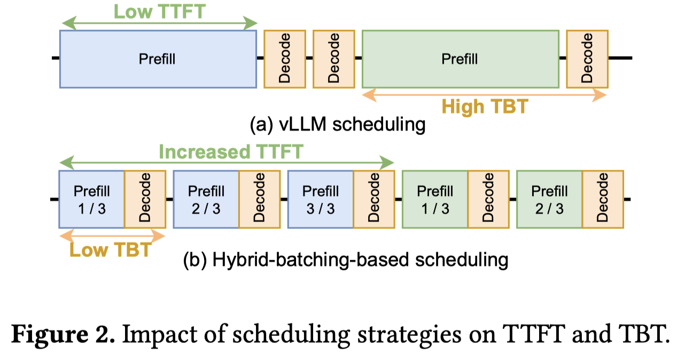

# POD-Attention: Unlocking Full Prefill-Decode Overlap for Faster LLM Inference

> 本文由 AI Agent（Hermes Agent）自动生成，基于 arXiv 论文全文阅读。生成时间：2026-06-04。

---

## 一句话总结

POD-Attention 是首个针对混合批处理（hybrid batching）场景的 GPU 注意力计算内核，通过 SM 感知的 CTA 调度策略将预填充（prefill）和解码（decode）注意力计算融合到同一内核中，同时利用 GPU 的计算和显存带宽资源，实现注意力计算最高 59%（平均 28%）的加速，端到端吞吐量提升最高 22%。

---

## 摘要翻译

每个 LLM 推理请求都经历两个阶段：计算密集型的预填充（prefill）和内存带宽密集型的解码（decode）。为了提高 GPU 利用率，最近的系统采用混合批处理（hybrid batching），将不同请求的预填充和解码阶段合并到同一批次中。这种方法优化了线性操作，但对注意力计算仍然效率低下，因为现有的注意力内核独立地为预填充和解码阶段优化执行。

本文提出 POD-Attention——首个高效计算混合批处理中注意力的 GPU 内核。POD-Attention 旨在通过精心分配 GPU 资源，使预填充和解码操作在同一个多处理器上并发执行，从而最大化计算和内存带宽的利用率。POD-Attention 将注意力计算加速最高 59%（平均 28%），相比独立优化的预填充和解码注意力内核，实现了更高的吞吐量和更低的延迟 LLM 推理。

---

## 研究动机

### LLM 推理的资源利用挑战

LLM 推理过程中，每个请求经历两个截然不同的阶段：

1. **预填充阶段（Prefill）**：高度并行，计算密集型，处理用户输入的所有 token。
2. **解码阶段（Decode）**：内存带宽密集型，逐个自回归生成输出 token。

理想系统需要同时最大化计算和内存带宽的利用，但由于预填充和解码在同一请求中交替出现，实现这一点非常困难。

### 混合批处理（Hybrid Batching）的兴起

Sarathi-Serve 等系统采用混合批处理策略，将长提示（prompt）分割为多个小块（chunk），每个迭代处理一个预填充块和多个解码 token。这种方法避免了生成停顿（generation stalls），但带来了一个关键问题：**注意力计算在混合批处理中仍使用独立优化的内核**。

### 现有方法的不足

- 当上下文长度增加时，注意力计算占比超过 60%（16K 上下文时），成为性能瓶颈。
- 独立优化的预填充和解码内核导致 GPU 资源利用不均衡：预填充内核的内存带宽利用率低于 5%，解码内核的计算利用率低于 10%。
- 预填充和解码内核在混合批处理中紧密相邻执行，导致同一资源的需求交替剧烈波动。

---

## 方法（技术细节）

### 核心思想：CTA-级并行融合

POD-Attention 选择在 CTA（Cooperative Thread Array）级别进行并行融合，而非更细粒度的 warp 级或 intra-thread 级，原因在于：

1. **独立性**：不同 CTA 可以独立开始和完成，避免互相影响。
2. **同步隔离**：同步屏障仅影响其所在 CTA，不影响其他计算部分。
3. **编程简单性**：比 warp 级融合更容易实现。

### SM 感知的 CTA 调度（SM-aware CTA Scheduling）

这是 POD-Attention 的核心创新。每个 CTA 在被调度到 SM（Streaming Multiprocessor）**之后**才决定执行预填充还是解码操作，通过运行时绑定（runtime operation binding）实现。

具体机制：

1. **SM ID 读取**：CTA 的 leader 线程通过内联汇编读取硬件 SM ID 寄存器（`%smid`）。
2. **票号分配**：通过原子操作（`atomicAdd`）获取票号，根据预填充/解码的比例决定执行哪个操作。
3. **CTA ID 分配**：获取对应操作的 CTA ID，若超过该操作的最大 CTA 数则切换操作。
4. **共享内存通信**：将分配结果写入共享内存，所有线程通过同步屏障获取。

两种调度策略：
- **50:50 策略**：后续 CTA 交替执行预填充和解码。
- **按比例分配（Proportional）**：根据预填充和解码 CTA 的总比例分配，通常性能更好（最高 14% 优势）。

### 性能优化

#### 1. Tile 尺寸优化
- **解码使用最小 tile 尺寸**（QSL 维度为 16），这是 CUTLASS 支持的 A100 tensor 操作最小尺寸。
- 将解码的计算利用率降至约 10%，释放 tensor core 资源给预填充。
- 预填充仍使用较大 tile 尺寸以充分利用 tensor core。

#### 2. 并发 CTA 数量
- 支持每 SM 2 个 CTA（预填充主导）和 4 个 CTA（其他情况）两种配置。
- 更多 CTA = 更多调度机会，但每个 CTA 资源更少。
- POD-Attention 在运行时自动选择最优配置。

#### 3. 虚拟解码 CTA（Virtual Decode CTAs）
- 将解码 CTA 拆分为虚拟 CTA，每个虚拟 CTA 仅包含一个 warp。
- 这样解码的共享内存使用量与预填充相近，避免解码过度分配共享内存。

#### 4. 限制预填充分割数
- 在融合内核中，过多的 KV 维度分割会导致预填充和解码 CTA 之间的内存带宽竞争。
- 限制分割数最多填满两个完整 wave（实验确定），平衡并行度和带宽竞争。

### 实现细节

- 基于 FlashAttention v2.6.1 构建。
- 将预填充和解码内核转换为通用设备函数，移除对 CUDA 提供的 CTA ID（blockIdx）的引用。
- 构建包装内核，根据计算的 CTA ID 调用对应函数。
- 共享内存使用量在内核启动时固定，手动调优预填充和解码的共享内存使用。
- 实现虚拟 CTA 时，将解码函数中的 CTA 级同步屏障替换为 warp 级同步屏障。

---

## 实验结果

### 评估环境

| 模型 | GPU | Q Heads | KV Heads | Layers |
|------|-----|---------|----------|--------|
| Yi-6B | 1×A100 | 32 | 4 | 32 |
| Llama-2-7B | 2×A100 | 32 | 32 | 32 |
| Llama-3-8B | 2×A100 | 32 | 8 | 32 |

### 注意力计算加速

- **最高加速 59%，平均 28%**（相比 FA_Serial）。
- 在 25% 的情况下，性能接近理论峰值（差距 <10%），表明近乎完美的重叠。
- 从不劣于串行执行（其他方法在某些情况下会变慢）。
- 能耗降低最高 35%（平均 20.5%）。

### 与基线对比

| 方法 | 中位加速 | 最大加速 | 是否可能变慢 |
|------|---------|---------|-------------|
| FA_Streams | 有限 | ~20%（有量化时） | 是（同步开销） |
| FA_HFuse | 11% | — | 是（最高 -13%） |
| FI_Batched | 短上下文好 | — | 是（高上下文最高 -40%） |
| **POD-Attention** | **28%** | **59%** | **否** |

### 端到端推理性能

#### 离线推理吞吐量

- Sarathi+POD vs Sarathi：提升 19%~22%。
- Sarathi+POD vs vLLM：提升 12%~27%。

#### 在线推理延迟

| 指标 | 改善效果 |
|------|---------|
| TTFT (P50) | Sarathi+POD 降低最高 4.3× vs Sarathi |
| TTFT (P99) | 最高降低 4.3× |
| TBT (P99) | 降低 10%~20% vs Sarathi |
| 请求延迟 (P99) | 降低最高 42% vs vLLM |
| 停顿率 | 200ms SLO 从 99.95% 降至 3.17%（vLLM → Sarathi+POD） |

### 消融实验

- **CTA 数量**：预填充主导时 2 CTA/SM 更好，解码主导时 4 CTA/SM 更好。
- **调度策略**：按比例分配比 50:50 最高好 14%。
- **限制预填充分割**：在长上下文场景中，限制分割数使 POD-Attention 相对 FA_Serial 的加速翻倍。
- **工作负载敏感性**：P:D 比率在 12~18 之间时收益最大，因为混合批处理最多。

---

## 优势

1. **首个混合批处理注意力内核**：开创性地将预填充和解码注意力融合到单一内核。
2. **不依赖专用硬件**：基于现有 FlashAttention 内核构建，无需 Hopper 架构等新特性。
3. **SM 感知调度**：通过运行时 CTA 绑定，无需预知硬件调度器行为即可保证 SM 级共存。
4. **通用性好**：在所有测试模型和配置上都优于串行执行，从不产生性能退化。
5. **降低能耗**：注意力计算能耗降低最高 35%。
6. **显著降低尾延迟**：TTFT、TBT、请求延迟等关键指标均显著改善。
7. **与 Sarathi-Serve 无缝集成**：可直接嵌入现有推理系统。

---

## 局限

1. **基于 FlashAttention v2.6.1**：论文发表时 FA-3（基于 Hopper 架构）正在开发中，POD-Attention 未支持 Hopper 架构的异步 tensor core、TMA 等新特性。
2. **仅限 NVIDIA GPU**：依赖 NVIDIA GPU 的硬件寄存器（`%smid`）和 CTA 调度器，无法直接迁移到 AMD 或其他 GPU。
3. **需要两个 GPU 的实验**：某些实验（如 Llama-2-7B 和 Llama-3-8B 的离线推理）需要 2 个 A100 GPU，单 GPU 部分结果可能不完整。
4. **对小上下文长度场景改善有限**：当上下文长度较短时，注意力计算占比小，收益有限。
5. **配置和调优复杂**：需要根据工作负载特性（P:D 比率、上下文长度、批处理大小）选择最优的 CTA 配置、调度策略和 tile 尺寸。
6. **与 NanoFlow 等方案互补而非替代**：NanoFlow 适合小上下文场景（通过操作级拆分），POD-Attention 适合长上下文场景，两者针对不同场景。
7. **对批处理大小和上下文长度的敏感性**：在纯预填充或纯解码主导的工作负载中收益有限（P:D 比率 <12 或 >18）。

---

## 与 EfficientPaper 相关的研究方向

1. **Attention 优化**：与 FlashAttention、FlashInfer、FlashDecoding 等注意力优化内核属于同一研究方向，POD-Attention 的融合思路可扩展到更多注意力变体（如多头注意力、多查询注意力等）。

2. **LLM 推理系统优化**：与 Sarathi-Serve、vLLM、Orca、DeepSpeed-FastGen 等推理系统优化方向紧密相关，POD-Attention 可作为这些系统中的注意力后端。

3. **GPU 内核融合**：与 HFuse、ISPA、Elastic Kernels 等 GPU 内核融合技术相关，POD-Attention 的 SM 感知 CTA 调度策略是一种通用的 GPU 资源管理技术。

4. **混合批处理调度**：与 Sarathi-Serve 的 chunked-prefill 策略互补，POD-Attention 解决了混合批处理中注意力计算的效率问题。

5. **硬件协同设计**：POD-Attention 对 Hopper 架构（FA-3）的扩展是未来方向，与 NVIDIA 新架构的适配可进一步提升性能。

6. **能耗优化**：POD-Attention 在降低能耗方面也有显著效果（最高 35%），可与绿色 AI、节能推理等研究方向结合。

7. **长上下文 LLM 服务**：随着上下文长度不断增加（16K+），POD-Attention 的价值愈发显著，与长上下文优化研究（如分块注意力、稀疏注意力）密切相关。

---

## 参考信息

- **论文链接**：http://arxiv.org/abs/2410.18038v2
- **代码仓库**：https://github.com/microsoft/vattention/tree/main/pod_attn
- **发表会议**：ASPLOS 2025
- **作者**：Aditya K Kamath, Ramya Prabhu, Jayashree Mohan, Simon Peter, Ramachandran Ramjee, Ashish Panwar
- **机构**：University of Washington, Microsoft Research
