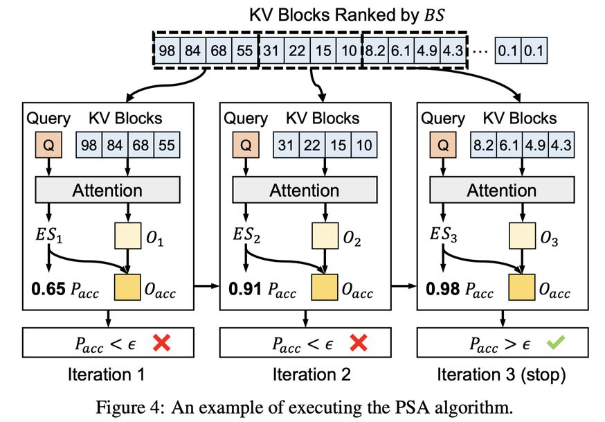

# Progressive Sparse Attention: Algorithm and System Co-design for Efficient Attention in LLM Serving

> **本文由 AI Agent 自动生成，基于论文全文阅读，仅供学习参考。生成时间：2025年6月**

---

## 一句话总结

PSA 提出了一种基于阈值的渐进式稀疏注意力机制，替代传统 top-k 选择策略，通过算法-系统协同设计在 LLM 长上下文推理中同时实现高精度和高效 KV cache 压缩，KV cache 用量减少最高 2.4×，吞吐量提升最高 2.0×。

---

## 摘要翻译

处理长上下文已成为现代大语言模型（LLM）的关键能力。然而，由于键值（KV）缓存的高内存开销，服务长上下文 LLM 带来了显著的推理成本。现有工作利用动态稀疏注意力算法（DSAes）来缓解 KV 缓存开销，但这些算法依赖于 top-k KV 缓存选择，导致精度与效率之间的权衡——较大的 k 提高精度但降低效率，较小的 k 提高效率但损害精度。

为克服这一权衡，本文提出了 PSA（渐进式稀疏注意力机制），将算法创新与系统协同设计相结合，以在 LLM 服务中实现高推理精度和改进的效率。PSA 算法根据不同的 token 和层的真实注意力权重分布，自适应地调整其 KV 缓存预算，而非依赖固定的预算 k。这在最小化 KV 缓存使用量的同时实现了高精度。

为进一步提升执行效率，PSA 引入了流水线迭代方案，减少 PSA 计算期间的 CPU-GPU 交错和同步开销。此外，PSA 实现了统一的 GPU 内存管理，通过考虑不同模型层之间不均匀的内存需求来优化 PSA 的内存利用。

大量实验结果表明，与最先进的 DSAes 和无稀疏注意力系统相比，PSA 分别将注意力计算的 KV 缓存使用量减少了最高 2.4× 和 8.8×，端到端服务吞吐量提升了最高 1.4× 和 2.0×。

---

## 研究动机

### 1. 长上下文 LLM 服务的内存瓶颈

长上下文 LLM（如 DeepSeek、Gemini、Llama、LWM）的推理成本极高，主要原因在于 KV 缓存随序列长度线性增长，常常超过模型权重本身的大小。例如，Llama-3.1 8B 在 128K 上下文长度下，单个请求的 KV 缓存需要约 62 GB，而模型权重仅 16 GB。这导致 GPU 内存受限，推理批大小小，吞吐量低。

### 2. 现有动态稀疏注意力算法的困境

现有 DSAes（如 ArkVale、InfLLM、Quest）采用 top-k 选择策略，为每个查询 token 分配固定的 KV 缓存预算。但论文通过实验发现：

- **不同 token 的注意力稀疏性差异显著**：在 GovReport 的 L32 层，20% 的查询 token 需要少于 50 个 KV block，而另 20% 需要超过 100 个。
- **不同层的注意力稀疏性也不同**：在 QMSum 的 L9 层，80% 的查询 token 需要少于 50 个 KV block，而在 L14 层这一比例降至 40%。

固定 top-k 无法满足所有 token 的精度要求：小 k 导致精度不足，大 k 导致过度选择，浪费效率。

### 3. 系统层面的效率问题

即便算法层面解决了 top-k 困境，实际 LLM 服务系统中还面临：
- CPU-GPU 交错导致的低 GPU 利用率
- 频繁同步带来的开销
- 现有系统按层分配等量 GPU 内存，无法适应 PSA 的不均匀内存需求

---

## 方法（技术细节）

### 整体架构（系统概览）

PSA 系统由三个核心组件组成：

1. **批处理控制器（Batch Controller）**：以先来先服务（FCFS）方式将请求分组为批次，确保批次所需的 KV block 能装入 GPU 内存。
2. **模型执行器（Model Executor）**：执行模型前向计算，将标准注意力计算替换为渐进式注意力机制。使用 cuboid-mean 方法构建 KV block 元数据（也可集成其他方法）。
3. **KV 缓存管理器（KV Cache Manager）**：维护 GPU 和主机内存之间的层级 KV block 存储，使用 LRU 策略进行缓存淘汰。

### 核心算法：渐进式稀疏注意力（Progressive Sparse Attention）

**核心思想**：使用基于阈值的选择方案替代 top-k 选择。阈值定义为每个查询 token 每层的最小累积注意力权重（如 95%），由服务提供者配置。

**算法流程（Algorithm 1）**：

1. 给定查询向量 q 和 KV block 索引 B，获取这些 block 的元数据 B_meta
2. 计算每个 block 的重要性得分 CS = q · B_meta（类似现有 DSAes）
3. 按重要性得分排序所有 KV block（而非选择 top-k）
4. 从最不重要的 block 开始，逐个计算注意力：
   - 加载 KV block
   - 计算部分注意力输出 O 和注意力分数 AS
   - 将 O 合并到累积输出 Oacc 中（加权平均）
   - 更新累积注意力分数 ASacc
   - 记录当前最小 block 级注意力分数 ASmin
   - 用 ASmin 估算剩余 block 的总注意力分数 AStotal = ASacc + ASmin × N_left
   - 计算累积注意力权重比例 Pacc = ASacc / AStotal
   - 当 Pacc > 阈值 ε 时，停止计算并返回 Oacc

**关键优势**：
- 每个 token 和层的 KV block 预算自适应调整
- 精度有保障：达到阈值即停止，避免精度损失
- 效率最大化：最小化 KV cache 使用量

**批处理支持**：对于多个请求的批处理，每个迭代结束时检查所有查询 token 的累积注意力权重，已完成的 token 移除，继续处理剩余 token，直到所有 token 完成。

### 流水线迭代执行（Pipelined Iteration Execution）

PSA 的多迭代计算模式面临两个性能问题：
1. CPU 数据准备和 GPU 计算的交错导致 GPU 利用率低
2. 频繁的 CPU-GPU 同步开销

**解决方案**：

1. **并行数据加载与计算**：将数据准备和注意力计算分配给不同线程，使用独立的 CUDA stream 实现流水线执行，数据传输和 kernel 执行重叠。
2. **验证 GPU kernel**：在 GPU 上直接更新和检查累积注意力权重，消除权重传输的必要。当达到阈值时，使用 zero-copy 技术写入 pinned host memory 中的信号变量，异步通知 CPU 终止注意力过程。

### 统一内存管理（Unified Memory Management）

现有 LLM 服务系统（如 vLLM）按层分配等量 GPU 内存。但 PSA 中不同层的注意力权重偏斜度差异显著——低偏斜度的层访问更多 KV block，导致缓存命中率低。

**解决方案**：
- 将所有层的 GPU 内存合并为统一的 KV block 池
- 所有层的 KV block 分配、释放和加载操作统一由 KV cache manager 处理
- 使用 LRU 策略进行缓存淘汰（利用连续解码 token 的语义相似性）

### 实现细节

- 基于 vLLM 实现，约 6000 行代码
- 与 FlashAttention 兼容：在 on-chip memory 中聚合每个 block 内 token 的注意力权重，然后写回 HBM
- 调度策略：请求只需一个迭代所需的 KV block 能装入 GPU 内存即可调度

---

## 实验结果

### 实验设置

- **硬件**：Nvidia A100 40GB GPU，AMD EPYC 7J13 CPU，128 GB DRAM，PCIe Gen 4
- **模型**：LWM-Text-7B（1M 上下文窗口，MHA）和 Llama-3.1-8B（128K 上下文窗口，GQA）
- **数据集**：LongBench 上的 8 个数据集（HotpotQA、2WikiMultihopQA、MultifieldQA、Qasper、GovReport、QMSum、MultiNews、SAMSum）
- **基线**：vLLM（全 KV cache）、vLLM-sparse（集成 ArkVale 的块级 DSA）、InfiniGen（token 级 DSA）

### KV cache 缩减

在确保平均请求精度 ≥ 98% 的条件下：

- **vs vLLM-sparse**：PSA 将 KV cache ratio 平均减少 **2.1×**（LWM-Text-7B）和 **2.4×**（Llama-3.1-8B）
  - 原因：vLLM-sparse 为所有请求分配相同的 KV cache 预算，导致短序列和注意力分布偏斜的请求过度选择
- **vs InfiniGen**：PSA 在 LWM-Text-7B 上平均减少 **1.8×**
  - 原因：InfiniGen 使用统一的最小注意力分数阈值，无法适应不同请求的注意力分数范围差异；且其权重矩阵压缩和层间预取导致精度下降

### 服务吞吐量

在 SLO（服务等级目标）约束下：

- **vs vLLM**：
  - 严格 SLO：PSA 吞吐量提升 **1.5×**（LWM-Text-7B）和 **1.3×**（Llama-3.1-8B）
  - 宽松 SLO：提升最高 **2.0×**（LWM-Text-7B）和 **1.5×**（Llama-3.1-8B）
- **vs vLLM-sparse**：
  - 严格 SLO：PSA 吞吐量提升最高 **1.3×**（LWM-Text-7B）和 **1.2×**（Llama-3.1-8B）
  - 宽松 SLO：提升最高 **1.4×** 和 **1.3×**

---

## 优势

1. **自适应 KV cache 预算**：突破 top-k 限制，根据实际注意力权重分布动态调整每个 token 和层的 KV block 预算，实现精度与效率的最优平衡。
2. **系统-算法协同设计**：不仅提出算法创新（渐进式注意力），还针对实际部署的系统优化（流水线迭代、统一内存管理），确保端到端性能提升。
3. **广泛的兼容性**：在 vLLM 框架上实现，支持 MHA 和 GQA 两种主流注意力机制，可与 FlashAttention 集成。
4. **显著的性能提升**：KV cache 减少最高 2.4×（vs DSAes）和 8.8×（vs 无稀疏注意力），吞吐量提升最高 1.4×（vs DSAes）和 2.0×（vs 无稀疏注意力）。
5. **保持高精度**：在 98% 精度要求下，KV cache 使用量大幅减少，证明了方法的实用性。
6. **开源实现**：代码在 GitHub 上发布（https://github.com/ASISys/PSAttention），便于复现和集成。

---

## 局限

1. **块级粒度限制**：PSA 在块级粒度上进行 KV block 选择，虽然在精度与性能开销之间取得了平衡，但相比 token 级选择，粒度较粗，可能遗漏一些重要的 token。
2. **阈值配置依赖**：累积注意力权重阈值 ε（如 95%）需要由服务提供者配置，不同应用场景可能需要不同的阈值，增加了配置复杂度。
3. **缓存淘汰策略简单**：当前使用 LRU 策略进行 KV cache 淘汰，虽然利用了连续 token 的语义相似性，但未设计更复杂的淘汰策略。
4. **仅关注解码阶段**：PSA 主要针对解码阶段（decoding phase）进行优化，未考虑预填充阶段（prefill phase）的加速。
5. **实验规模有限**：仅在两个模型（LWM-Text-7B、Llama-3.1-8B）和一个 GPU（A100 40GB）上进行了实验，未在更大规模模型或多 GPU 环境中验证。
6. **与 FlashAttention 的兼容性开销**：为了兼容 FlashAttention，需要在 on-chip memory 中聚合注意力权重并写回 HBM，可能带来额外开销。

---

## 与 EfficientPaper 相关的研究方向

1. **KV cache 管理与压缩**：PSA 属于动态稀疏注意力范畴，与 H2O、StreamingLLM、SnapKV、FastGen、Scissorhands 等静态稀疏注意力方法以及 ArkVale、InfLLM、Quest 等动态稀疏注意力方法密切相关。
2. **LLM 推理系统优化**：PSA 与 vLLM、FlexGen、DeepSpeed Inference 等推理系统设计相关，特别是内存管理和请求调度策略。
3. **注意力机制高效化**：PSA 与 FlashAttention、Minference、SeerAttention、Native Sparse Attention (NSA) 等注意力加速方法互补，可结合使用以进一步提升效率。
4. **Token 级 vs 块级稀疏注意力**：PSA 选择块级粒度，与 InfiniGen、TokenSelect、RetrievalAttention、MagicPig 等 token 级方法形成对比，粒度选择对性能有重要影响。
5. **Prefill 阶段优化**：PSA 聚焦于解码阶段，与 GemFilter、Minference、SeerAttention 等预填充阶段优化方法互补，共同实现端到端加速。
6. **模型参数卸载**：PSA 通过 KV cache 卸载到主机内存来节省 GPU 内存，与 PowerInfer、Lina、FlexGen 等模型参数卸载方法形成对照，适用于在线 LLM 服务场景。
7. **LLM 长上下文处理**：PSA 针对长上下文 LLM 服务的 KV cache 瓶颈，与长上下文 LLM（如 LWM、Gemini、Llama）的架构和训练方法相关，是长上下文 LLM 生态系统的重要组成部分。
