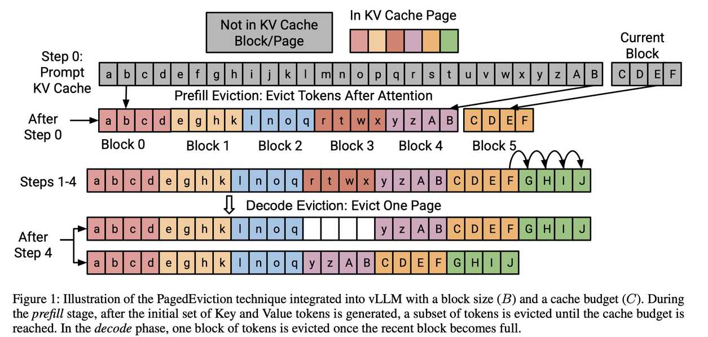

# PagedEviction: Structured Block-wise KV Cache Pruning for Efficient Large Language Model Inference

> Krishna Teja Chitty-Venkata, Jie Ye, Xian-He Sun, Anthony Kougkas, Murali Emani, Venkatram Vishwanath, Bogdan Nicolae
>
> **ArXiv**: [2509.04377v1](http://arxiv.org/abs/2509.04377v1) | **Year**: 2025 | **Keywords**: kv_cache_sparse | **Baseline**: [Quest](../2024/Quest/note.md)

---

> ⚠️ **声明**：本 note 由 AI Agent 自动生成，基于论文全文阅读和中文翻译整理。内容仅供参考，如有疏漏请以原文为准。生成时间：2025 年。

---

## 一句话总结

PagedEviction 是一种专为 vLLM PagedAttention 设计的结构化块级 KV Cache 淘汰算法，通过基于 Key/Value L2 范数比值的 token 重要性估计，在预填充和解码阶段分别进行 token 级和 block 级淘汰，无需修改 CUDA 注意力内核即可在长上下文任务中实现更好的内存效率和推理精度。

---

## 摘要翻译

KV 缓存通过存储先前处理的 token 的注意力状态，显著提高了大语言模型（LLM）推理效率，实现了后续 token 的更快生成。然而，随着序列长度增加，KV 缓存很快成为主要的内存瓶颈。为解决这一问题，本文提出了 PagedEviction，一种新颖的细粒度结构化 KV 缓存剪枝策略，增强了 vLLM PagedAttention 的内存效率。与现有依赖基于注意力的 token 重要性或跨不同 vLLM 页面淘汰 token 的方法不同，PagedEviction 引入了一种高效的块级淘汰算法，专门为分页内存布局定制。该方法与 PagedAttention 无缝集成，无需修改其 CUDA 注意力内核。作者在 Llama-3.1-8B-Instruct、Llama-3.2-1B-Instruct 和 Llama-3.2-3B-Instruct 模型上，使用 LongBench 基准测试套件进行了评估，证明了在长上下文任务中实现了更好的内存使用和优于基线的准确度。

---

## 研究动机

1. **KV 缓存内存瓶颈**：LLM 推理中 KV 缓存随序列长度线性增长，对于数万 token 的序列，KV 缓存消耗的 GPU 内存可能超过模型本身，严重限制了推理吞吐量。
2. **现有方法的局限**：
   - **依赖注意力分数**：如 H2O 等方法需要获取注意力权重（Q×Kᵀ），但 FlashAttention 在推理过程中不返回注意力分数，导致需要修改 CUDA 内核或引入额外内存开销。
   - **不考虑分页结构**：现有压缩方法不考虑 vLLM 的块结构，在淘汰 token 时跨不同页面操作，导致块碎片化，破坏了 PagedAttention 设计的内存布局。
   - **逐 token 频繁淘汰**：如 StreamingLLM、H2O 等在每个解码步骤都执行淘汰，导致高频更新 KV 缓存表，增加延迟和吞吐量开销。
3. **核心挑战**：需要一种既兼容 vLLM 分页内存结构，又不依赖注意力分数，且能高效进行块级淘汰的方法。

---

## 方法（技术细节）

### 4.1 Token 重要性评估

PagedEviction 使用一种**无需注意力分数的代理重要性指标**，基于 Key 和 Value 张量的 L2 范数比值：

$$S_i = \frac{\|V_i\|_2}{\|K_i\|_2}$$

- **原理**：先前研究（Devoto et al., 2024）发现 Key 张量的 L2 范数与累积注意力分数成反比。因此，Value 的 L2 范数与 Key 的 L2 范数之比可以作为 token 重要性的有效代理指标。
- **优势**：直接从 KV 缓存中计算，无需存储注意力权重，与 FlashAttention 兼容，无需修改 CUDA 内核。
- **块级评分**：对于 block 模式，将块内所有 token 的评分取平均值作为块重要性分数：

$$S_j = \frac{1}{B} \sum_{i \in \text{block } j} \frac{\|V_i\|_2}{\|K_i\|_2}$$

### 4.2 预填充阶段（Prefill Phase）

- **流程**：在 prefill 阶段，所有 prompt token 通过一次前向传播处理，生成初始 KV 缓存。
- **淘汰时机**：在 Key 和 Value 状态被划分为不同 page **之前**进行 token 级淘汰（而非之后），避免跨块的内存重排和移动。
- **淘汰策略**：计算每个 token 的重要性分数 $S_i$，淘汰分数最低的 $E = L - C$ 个 token（$L$ 为输入长度，$C$ 为缓存预算）。
- **效果**：在解码开始前压缩 KV 缓存，减少内存使用，同时保留重要的 KV 状态。

### 4.3 解码阶段（Decode Phase）

- **淘汰触发**：仅在当前块（最近的 block）被新生成的 token 填满时（即序列长度 $L$ 是块大小 $B$ 的整数倍）触发淘汰。
- **淘汰粒度**：**块级淘汰**——评估所有现有缓存页面的重要性，淘汰得分最低的整个页面/块。
- **块表更新**：淘汰后更新 vLLM 内部的 KV 缓存块表。
- **优势**：
  - 避免频繁的逐 token 淘汰操作，减少每步开销。
  - 保持块大小一致，与 vLLM 的 PagedAttention 完全兼容。
  - 一次淘汰整个块，最大化空间利用率。
  - 与 FlashAttention 兼容，无需修改内核。

### 4.4 算法流程概要

1. **Prefill**：前向传播 → 计算 token 重要性 → 淘汰不重要 token → 划分为 page
2. **Decode**：逐 token 生成 → 当前块满时 → 计算各块重要性 → 淘汰最不重要的整块 → 更新块表

---

## 实验结果

### 实验设置

- **模型**：Llama-3.2-1B-Instruct、Llama-3.2-3B-Instruct、Llama-3.1-8B-Instruct
- **数据集**：LongBench（HotpotQA、Qasper、GovReport、MultiNews、MultiFieldQA）
- **缓存预算**：256、512、1024、2048、4096 token
- **页大小**：16（vLLM 最优设置）
- **基线方法**：Full Cache（无淘汰）、StreamingLLM、Inverse Key L2-Norm、KeyDiff
- **硬件**：NVIDIA A100 40GB GPU
- **吞吐量测试**：输入 1024 token，输出 8192 token，64 并发请求

### 准确度（LongBench）

| 模型 | 数据集 | 缓存预算 1024 | 关键结果 |
|------|--------|---------------|----------|
| LLaMA-3.2-1B | GovReport | 1024 | ROUGE ~24.5，比 StreamingLLM（~21）和 KeyDiff（~21.2）高 15–20% |
| LLaMA-3.2-1B | GovReport | 4096 | ROUGE ~29.5，接近 Full Cache（~30） |
| LLaMA-3.2-3B | MultiNews | 1024 | ROUGE ~23.6，比 Inverse Key L2-Norm（~22.5）高 ~1.1 |
| LLaMA-3.2-3B | MultiNews | 4096 | ROUGE ~24.5，接近 Full Cache |

- **总体表现**：在所有模型和数据集上，PagedEviction 在紧缩预算下表现最优，尤其在 256–1024 token 预算下。
- **精度下降**：相比 Full Cache，PagedEviction 的精度下降约 3–5%（ROUGE 指标）。

### 吞吐量和延迟

| 指标 | 结果 |
|------|------|
| LLaMA-1B 吞吐量 | ~3020 tokens/sec（预算 1024），比 Full Cache（~2200）提升 37%，比 Inverse Key L2-Norm（~2170）提升 39% |
| 延迟降低 | 1B: 12%，3B: 10%，8B: 11%（相比 Full Cache） |
| 延迟缩放 | 随模型规模亚线性增长 |

### 消融实验（不同页大小）

- 页大小 8、16、32 均进行测试
- PagedEviction 在页大小 16 和 32 时表现最佳
- 吞吐量相比 Full Cache 最高提升 3.1×
- 精度下降不超过 3–5%
- KeyDiff 和 Inverse Key L2-Norm 在某些设置下精度下降达 20%

---

## 优势

1. **无需修改 CUDA 内核**：与 PagedAttention 无缝集成，兼容 FlashAttention，可直接部署到 vLLM。
2. **结构化块级淘汰**：保持块对齐，避免内存碎片化，最大化内存利用率。
3. **双阶段淘汰策略**：Prefill 阶段进行 token 级精细淘汰，Decode 阶段进行块级粗粒度淘汰，兼顾精度和效率。
4. **高效的 token 重要性估计**：基于 Key/Value L2 范数比值，无需存储注意力分数，计算开销低。
5. **低频淘汰**：仅在新块填满时触发淘汰，减少每步操作开销。
6. **高吞吐量和低延迟**：吞吐量提升 37%，延迟降低 10–12%，在不同模型规模下表现稳健。
7. **紧缩预算下表现优异**：在 256–1024 token 预算下仍能保持较好精度，优于 StreamingLLM、Inverse Key L2-Norm、KeyDiff 等方法。

---

## 局限

1. **精度下降**：相比 Full Cache，精度下降约 3–5%，在某些任务上可能更明显。
2. **块级粒度限制**：块级淘汰可能导致不够精细的剪枝，部分情况下不如 token 级淘汰灵活。
3. **未与 Quest 等基于注意力分数的方法比较**：实验中仅与无注意力分数的基线比较，未与 Quest 等强基线对比。
4. **仅在 LongBench 上评估**：实验范围有限，未在更多任务或更大规模模型上验证。
5. **依赖静态 KV 信息**：重要性估计仅基于 Key/Value 的 L2 范数，可能不如基于注意力分数的方法精确。
6. **未提供开源代码**：代码 URL 为空，复现可能需要额外工作。
7. **仅验证了 vLLM 框架**：未在其他推理框架（如 TensorRT-LLM）上验证兼容性。

---

## 与 EfficientPaper 相关的研究方向

### 1. KV Cache 稀疏化（kv_cache_sparse）
PagedEviction 属于 KV Cache 稀疏化方法，通过淘汰不重要的 token 来减少缓存大小。这是 EfficientPaper 中的重要研究方向，与以下方法密切相关：
- **Quest**（2024）：基于注意力分数的 KV 缓存稀疏化方法（本论文的 baseline）
- **H2O**（2023）：基于累积注意力分数的 token 淘汰方法
- **StreamingLLM**（2023）：滑动窗口 + 注意力sink方法
- **KeyDiff**（2025）：基于 Key 相似度的淘汰方法

### 2. PagedAttention 与内存管理
PagedEviction 与 vLLM 的 PagedAttention 紧密结合，涉及以下方向：
- **PagedAttention**（2023）：分页内存管理的基础工作
- **KV Cache 量化**（如 QAQ、KVQuant、KIVI）：可与 PagedEviction 互补
- **KV Cache 合并**（如 MiniCache、CaM）：可与块级淘汰结合

### 3. LLM 推理加速
PagedEviction 提升了推理吞吐量和降低了延迟，与以下方向相关：
- **PyramidInfer**：层间动态 KV 缓存大小调整
- **AdaKV**：自适应 KV 缓存预算分配
- **SnapKV**：基于重要性评分的 KV 缓存压缩

### 4. 潜在研究方向
- 将 PagedEviction 与 KV Cache 量化结合（如 Q+PagedEviction）
- 将块级淘汰策略扩展到更大模型（如 70B+）和更长上下文（如 100K+ token）
- 探索动态块大小和自适应预算分配
- 与层间预算分配方法（PyramidInfer）结合
- 在其他推理框架（如 TensorRT-LLM）上验证兼容性

---

## 论文结构

| 章节 | 内容 |
|------|------|
| §1 Introduction | 背景、现有方法局限、PagedEviction 高层目标 |
| §2 Background | Self-Attention、KV Cache、KV Cache Eviction、PagedAttention |
| §3 Challenges | 四大局限（内存组织、块感知、注意力依赖、逐步淘汰）及解决方案 |
| §4 PagedEviction | Token 重要性、Prefill 阶段、Decode 阶段（含算法伪代码） |
| §5 Evaluation | 实验设置、基线方法、LongBench 结果、吞吐量/延迟、消融实验 |
| §6 Conclusion | 总结贡献 |
| Appendix | StreamingLLM 图示、非结构化淘汰图示、相关工作综述（压缩、合并、预算分配、量化） |

---

## 参考方法对比

| 方法 | 类型 | 是否依赖注意力分数 | 是否结构化 | 兼容 vLLM | 本论文结果 |
|------|------|-------------------|-----------|-----------|-----------|
| Full Cache | 无淘汰 | 否 | - | 是 | 基准 |
| StreamingLLM | token 级淘汰 | 否 | 是 | 是 | 精度低 15-20% |
| Inverse Key L2-Norm | token 级淘汰 | 否 | 否 | 是 | 吞吐量低 39% |
| KeyDiff | token 级淘汰 | 否 | 否 | 是 | 精度低 15-20% |
| **PagedEviction** | **块级淘汰** | **否** | **是** | **是** | **最优** |
