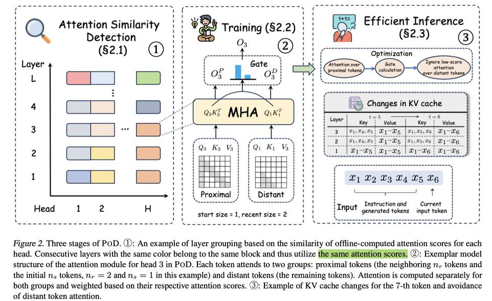

# PoD: Compressing KV Cache for Long-Context LLM Inference with Inter-Layer Attention Similarity

> **⚠️ 本 note 由 AI Agent（Hermes Agent）自动生成，基于 arXiv 论文全文提取与分析。生成时间：2026-06-04。内容仅供参考，如有疏漏请以原文为准。**

---

## 一句话总结

POD 通过在相似层之间共享远距离 token 的注意力分数，实现 35% 的 KV Cache 压缩而不损失模型性能，为长上下文 LLM 推理提供了一种不丢弃任何 token 的高效压缩方案。

---

## 摘要翻译

大语言模型（LLM）日益增长的上下文窗口大小（如 GPT 和 LLaMA 系列）提高了其处理复杂长文本任务的能力，但代价是推理效率的下降，尤其体现在内存和计算复杂度方面。现有方法（包括选择性 token 保留和基于窗口的注意力机制）虽然提高了效率，但存在丢弃未来文本生成所需重要 token 的风险。本文提出了一种在不丢失 token 的前提下增强 LLM 效率的方法，通过降低不重要 token 的内存和计算负载（而非直接丢弃它们）来实现。我们解决了两个挑战：1）研究上下文中重要 token 的分布，发现上下文中的近期 token 比远距离 token 更重要；2）通过跨层共享注意力分数来优化远距离 token 的资源分配。实验表明，该方法可以在不牺牲性能的情况下节省 35% 的 KV Cache。

---

## 研究动机

长上下文 LLM 推理面临两大效率瓶颈：

1. **注意力计算的二次复杂度**：基于 Transformer 的 LLM，其注意力模块的计算复杂度随上下文窗口大小呈二次增长。
2. **KV Cache 的线性内存增长**：KV Cache 作为一种缓存机制，其内存占用与上下文窗口大小线性相关。

现有方法存在明显缺陷：
- **基于窗口的方法**（如 StreamingLLM、LM-Infinite）仅保留最近的 token 和初始 token，但会丢弃窗口外的重要信息。
- **基于 token 选择的方法**（如 H2O）根据注意力分数动态选择重要 token，但存在不可逆丢弃关键 token 的风险。
- **基于层共享的方法**（如 CLA）虽然减少了 KV Cache，但性能下降严重（表 4 中 CLA 性能下降 31.4%）。

作者的核心动机是：**不重要 token 应该分配更少的资源，而不是被完全丢弃**。

---

## 方法（技术细节）

### 两个关键观察

- **观察 1（位置重要性）**：上下文中的近端 token（初始 token + 近期 token）比远距离 token 更重要。实验表明，即使仅关注 256 个近端 token，80% 的情况下模型的下一个 token 预测与关注所有 token 时完全一致。
- **观察 2（层间注意力相似性）**：连续层之间的注意力分数高度相似，这一现象在小模型中已被观察到，本文将其扩展到现代 LLM。

### POD（Proximal tokens over Distant tokens）三阶段方法

#### 阶段一：离线跨层注意力共享探索（§2.1）

- 输入 N 个样本，收集每个样本最后 q 个 token 的注意力分数。
- 使用 Jensen-Shannon (JS) 散度衡量层间注意力相似度。
- 采用**贪心自底向上算法**，将连续相似层（相似度 ≥ δ，其中 δ=0.5）合并为 head-wise 的 block。
- 每个 block 内的层共享远距离 token 的注意力分数。

#### 阶段二：轻量级训练适配（§2.2）

- **关键区分**：将 token 分为两组：
  - **近端 token（Proximal tokens）**：包括 ns 个初始 token（考虑"attention sink"现象）和 nr 个最近 token。
  - **远距离 token（Distant tokens）**：其余的 token。
- 对于每层中的 token，注意力计算分为两部分：
  - 近端 token 使用当前层的 Q/K/V。
  - 远距离 token 使用当前 block 中**最低层**的 K/V（共享注意力分数）。
- 使用**无参数的门控机制**（gating）加权融合两部分注意力输出：
  $$g_{ℓ,i} = \frac{\sum \exp a^P_{ℓ,i}}{\sum \exp a^P_{ℓ,i} + \sum \exp a^D_{ℓ,i}}$$
  $$o_{ℓ,i} = g_{ℓ,i} \cdot o^P_{ℓ,i} + (1 - g_{ℓ,i}) \cdot o^D_{ℓ,i}$$
- 后训练数据：从 Dolma 采样 5B tokens，序列长度 32K。
- 训练参数：batch size 4M tokens，学习率 1e-5，cosine scheduler，RoPE base 扩展到 16M+。
- 技术栈：HuggingFace + DeepSpeed（ZeRO-3 + Ulysses 序列并行）+ PyTorch FlexAttention。

#### 阶段三：高效推理（§2.3）

- **KV Cache 内存优化**：block 内的远距离 token 的 key 状态只在最低层保留一份，其他层不再缓存。因此 KV Cache 大小显著减少（理论节省 35%）。
- **远距离 token 计算优化**：对于 block 内非最低层，可以预评估门控值 g_{ℓ,i}。如果 g_{ℓ,i} ≥ τ（τ=0.7），则跳过远距离 token 的注意力计算，进一步节省 25% 的计算量（仅 5% 性能损失）。

---

## 实验结果

### 实验设置

- **模型**：LLaMA3-8B → LLaMA3-8B-32K（5B tokens 后训练）→ POD（ns=16, nr=4080, δ=0.5）
- **基准方法**：包括 Token 选择类（SnapKV、PyramidKV、Quest）、Token 驱逐类（WA、StreamingLLM、LM-Infinite、H2O）、层共享类（CLA）
- **评估基准**：Needle in a Haystack、LongBench（英文版，14 数据集）、LEval（20 子任务）、InfiniteBench（32K/64K/128K）

### 核心结果

| 方法 | KV Cache 节省 | 性能下降 |
|------|-------------|---------|
| SnapKV | 87.5% | 4.3% |
| PyramidKV | 93.6% | 3.4% |
| StreamingLLM | 87.5% | 8.0% |
| H2O | 87.5% | 7.4% |
| CLA | 50.0% | **31.4%** |
| **POD** | **35.0%** | **2.8%** |
| **POD+SnapKV** | **91.9%** | **3.1%** |

- **LongBench**（表 1）：POD（window=16+4080+28K）平均得分 27.18，优于所有 token 驱逐方法（StreamingLLM 24.57, H2O 24.60），也显著优于 CLA（14.70）。
- **LEval**：POD 平均得分 43.59，优于 H2O（37.15）和 StreamingLLM（37.12）。
- **InfiniteBench**（表 3）：POD 在 32K/64K/128K 三种上下文长度下均优于 baselines，平均得分 40.56（vs CLA 36.93）。
- **Needle in a Haystack**（图 3）：POD 几乎能定位所有 needle，而 StreamingLLM 和 H2O 在 needle 超出窗口时失败。
- **内存优化**（表 2）：POD 在不同输入长度下最大 batch size 提升超过 30%。
- **计算优化**：τ=0.7 时，计算节省 25%，性能损失仅 5%。
- **扩展性**：在 LLaMA3.1-8B（128K）上验证了方法的通用性，POD 对更长上下文更鲁棒。

### 案例研究（图 5）

- 答案在窗口内：所有方法均正确。
- 答案在开头：StreamingLLM 和 POD 正确，H2O 因长序列干扰失败。
- 答案在中间：StreamingLLM 失败，H2O 和 POD 正确。
- Needle in a Haystack：仅 POD 能正确回答。

---

## 优势

1. **不丢弃 token**：与 Token 驱逐方法（StreamingLLM、H2O）不同，POD 保留所有 token 信息，仅减少不重要 token 的资源分配，避免了不可逆信息丢失。
2. **性能损失极小**：仅 2.8% 的性能下降（35% KV Cache 节省），远优于 CLA 的 31.4%。
3. **可组合性**：POD 与 token 选择方法（SnapKV）正交且可组合，POD+SnapKV 实现 91.9% KV Cache 节省且仅 3.1% 性能下降。
4. **轻量级后训练**：仅需 5B tokens 的后训练，无需重新预训练。
5. **计算优化**：通过门控机制可以跳过远距离 token 的注意力计算，进一步降低推理成本。
6. **跨上下文长度鲁棒性**：在 32K 到 128K 的不同上下文长度下均表现良好，且优于 token 选择方法（后者在长上下文下性能下降明显）。
7. **适用性广**：可用于 prefilling 和 decoding 两个阶段。

---

## 局限

1. **需要后训练**：虽然仅需 5B tokens，但仍需额外的后训练过程，不能直接应用于已有模型（zero-shot 场景不适用）。
2. **KV Cache 节省率有限**：35% 的 KV Cache 节省率相对 token 选择方法（87.5%~93.6%）仍然较低，虽然可以与 token 选择方法组合提升。
3. **层分组依赖超参数**：δ 和 τ 的选择需要根据具体模型和任务调整，不同的超参数设置会影响性能和效率的平衡。
4. **head-wise 分组可能增加复杂度**：每个注意力头的分组可能不同，增加了实现和优化的复杂度。
5. **开源代码缺失**：论文提到计划开源但尚未提供代码。
6. **仅在 8B 模型上验证**：实验主要基于 LLaMA3-8B 系列，更大模型（如 70B）的通用性有待验证。
7. **推理速度提升未量化**：虽然展示了 KV Cache 内存节省和 batch size 提升，但未直接报告推理延迟（latency）的改善。
8. **性能与效率的权衡**：在 128K 长上下文下，POD+SnapKV 的性能（38.39）低于 POD（40.56），表明在极长上下文中与 token 选择方法的组合可能并非最优。

---

## 与 EfficientPaper 相关的研究方向

1. **KV Cache 压缩**（本论文核心关键词：`kv_cache_sparse`）：POD 是 KV Cache 压缩领域的重要进展，属于层间注意力共享范式，与 CLA、LCKV、MiniCache 等方法属于同一研究方向。
2. **层间冗余利用**：POD 利用了 Transformer 层间注意力的相似性，这一思路可扩展到其他维度的冗余利用（如 value 状态共享、hidden states 压缩）。
3. **长上下文推理优化**：与 StreamingLLM、H2O、SnapKV、PyramidKV、Quest 等方法共同构成了长上下文 LLM 推理优化的研究图谱。
4. **模型效率与性能平衡**：POD 在效率和性能之间取得了良好的平衡，为后续研究提供了参考框架。
5. **正交性与组合性**：POD 与 token 选择方法正交，表明不同维度的压缩技术可以组合使用，这一思路对 EfficientPaper 的 baseline 方法图谱具有重要参考价值。
6. **后训练适配**：POD 的轻量级后训练方案（5B tokens）为资源受限场景下的模型适配提供了可行路径。

---

> **免责声明**：本 note 由 AI Agent 自动提取和分析论文内容生成，旨在辅助研究者快速了解论文核心贡献。内容可能存在疏漏或理解偏差，请以原文为准。
