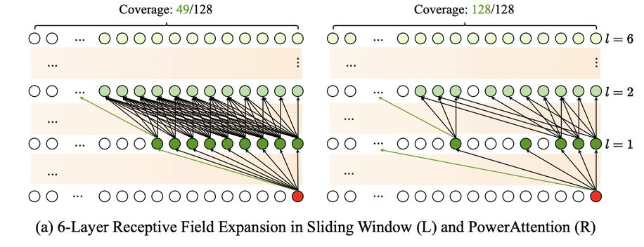

# PowerAttention: Exponentially Scaling of Receptive Fields for Effective Sparse Attention



> **⚠️ 生成声明**：本文 note 由 AI Agent 自动生成，基于 arXiv 论文全文（arXiv:2503.03588v1）的文本提取与分析。生成时间为 2025 年 6 月 4 日。

---

## 一句话总结

PowerAttention 通过在 2 的幂次距离上构建注意力连接，实现了 d 层 LLM 中感受野的指数级扩展（每层可关注 2^d 个 token），在保持与滑动窗口注意力相当的时间复杂度的同时，显著优于现有静态稀疏注意力方法。

---

## 摘要翻译

大语言模型（LLM）在处理长上下文时，注意力机制的二次复杂度成为效率瓶颈。稀疏注意力方法提供了一种有前景的解决方案，但现有方法往往存在有效上下文不完整和/或需要复杂实现流水线的问题。我们从感受野的角度对自回归 LLM 的稀疏注意力进行了全面分析，识别出现有方法在扩展感受野方面的不足，并提出了 PowerAttention——一种通过理论分析实现有效且完整上下文扩展的新型稀疏注意力设计。PowerAttention 在 d 层 LLM 中实现了感受野的指数级增长，使每个输出 token 能够关注 2^d 个 token，确保感受野的完整性和连续性。实验表明，PowerAttention 比现有静态稀疏注意力方法提升 5%~40%，尤其在需要长程依赖的任务（如 Passkey Retrieval 和 RULER）上表现突出，同时保持与滑动窗口注意力相当的时间复杂度。效率评估进一步显示，PowerAttention 在预填充和解码阶段相比动态稀疏注意力和全注意力均有显著加速（128K 上下文下加速 3.0 倍），使其成为处理 LLM 长序列的高效且用户友好的解决方案。

---

## 研究动机

随着 LLM 应用场景的扩展（长链推理、复杂环境中的 Agent、长文档问答等），处理长上下文的需求日益增长。然而，Transformer 注意力机制的二次计算复杂度 O(N²) 构成了显著的效率瓶颈。

现有稀疏注意力方法分为两类：

1. **静态稀疏注意力**（如滑动窗口注意力）：预定义注意力掩码，在训练和推理中一致使用。虽然效率高，但感受野扩展受限——滑动窗口的线性增长意味着需要 O(N) 层才能覆盖完整序列。
2. **动态稀疏注意力**（如 MInference）：根据输入内容动态预测注意力模式。虽然性能更好，但引入了额外的实现和计算复杂性（预填充阶段需要 O(N) 的扫描开销）。

作者指出，**现有方法主要依赖直觉启发式和实验结果，缺乏理论分析来解释其有效性**。特别是：
- 部分位置的 token 信息无法被最终输出检索到
- 现有模式在逐层扩展感受野时效率低下（如滑动窗口的线性增长）

这些不足促使作者从理论角度重新审视稀疏注意力设计，寻找一种能同时实现快速感受野扩展和完整 token 覆盖的方案。

---

## 方法（技术细节）

### 3.1 问题建模：将稀疏注意力建模为 DAG

作者将稀疏注意力掩码建模为有向无环图（DAG）的邻接矩阵，其中节点表示 token 位置，边表示注意力连接。每个 token 只能关注它之前的 token（因果约束）。

关键概念——**模型感受野**：在多层 LLM 中，token x 的感受野不仅仅是其直接关注的 token，而是 DAG 中从 x 可达的所有节点。通过层间信息传播（每层的输出聚合了来自前一层的信息并传递给下一层），感受野可以跨越多层扩展。

问题形式化为：**在固定最大出度约束下，找到 DAG 中能最大化 l 步内节点可达性的边集**（l 为模型层数）。

### 3.2 现有方法的局限性分析

| 方法 | 感受野扩展方式 | 到达距离 N 所需层数 | 覆盖完整性 |
|------|--------------|-------------------|-----------|
| 滑动窗口（Sliding Window） | 线性扩展 | O(N) | 完整 |
| 步长斜线（Stride Slash） | O(√N) 层 | O(√N) | 完整 |
| 膨胀注意力（Dilated） | - | - | **不完整**（距离为 2^k+1 的 token 不可达） |
| LongNet | O(log N) 层 | O(log N) | **不完整**（某些位置不可达） |

### 3.3 PowerAttention 的核心设计

PowerAttention 的核心思想：**将每个 token 连接到索引差值为 2 的幂次的 token**，即在 2^0, 2^1, 2^2, ..., 2^k 的距离上建立注意力连接。

**关键性质**（附录 B 有严格证明）：
1. **每个节点的出度 ≤ log n**（保证效率）
2. **从任意节点 i 到任意前驱节点 j 的最短路径 ≤ log n**（保证快速扩展）
3. **感受野的指数级增长**：在 d 层 LLM 中，每个输出 token 可以关注 2^d 个 token

**直觉解释**：对于距离 d 的 token，其二进制表示中 1 的个数就是从当前 token 到达该 token 的最少层数。由于 d < n，二进制表示最多有 log n 位，因此最多需要 log n 层。

**实现极其简洁**（Algorithm 1）：
```python
# 构建 PowerAttention 掩码
mask_power = (blk_qk & (blk_qk - 1)) == 0  # 2 的幂次检测
# 组合掩码
mask = causal & (mask_window | mask_power | mask_sink)
```

PowerAttention 包含三个组件：
1. **Sink tokens**：序列开头的初始 token
2. **滑动窗口**（5 个 block）
3. **Power-of-2 间隔的 slash tokens**（4 个额外 block）

**计算复杂度**：O(N log N)，与滑动窗口注意力的线性复杂度 O(N) 相当。

---

## 实验结果

### 基础模型与设置
- **基础模型**：Qwen2-7B（32K 上下文长度）
- **训练**：在 SlimPajama 上继续预训练 1B tokens，然后在 ChatQA 2 上微调
- **实现**：256-token 块对齐 GPU 计算核心的内存访问模式
- **稀疏性**：所有方法保持 0.94 的稀疏率
- **硬件**：NVIDIA A800 GPU

### 语言建模（PG19 数据集）

| 方法 | 4K | 8K | 16K | 32K |
|------|-----|-----|------|------|
| 全注意力（Vanilla） | 9.77 | 9.72 | 9.60 | 9.42 |
| 滑动窗口 | 9.94 | 9.99 | 9.99 | 9.97 |
| 膨胀注意力 | 10.74 | 10.72 | 10.64 | 10.58 |
| 步长斜线 | 10.01 | 10.11 | 10.07 | 10.03 |
| LongNet | 10.14 | 10.28 | 10.30 | 10.31 |
| **PowerAttention** | **10.03** | **10.08** | **10.05** | **10.00** |

PowerAttention 在语言建模上与滑动窗口和步长斜线表现相当，均优于膨胀注意力和 LongNet。

### Passkey Retrieval（检索任务）

- 滑动窗口在 12K 之前表现良好，但在 16K 和 32K 上显著退化
- 膨胀注意力在所有长度上仅能捕获约 50% 的输入
- LongNet 因感受野间隙在特定位置失败
- **步长斜线和 PowerAttention 在 32K 上下文内实现全序列覆盖**
- 在 64K 扩展上下文中，**PowerAttention 的指数级感受野增长优于步长斜线的二次方法**

### RULER 基准测试

使用混合架构（每 7 层保留 2 层全注意力，其余层使用稀疏注意力）：

| 方法 | 4K | 8K | 16K | 32K |
|------|-----|-----|------|------|
| 全注意力（Vanilla） | 91.77 | 86.34 | 84.27 | 79.24 |
| 滑动窗口 | 72.20 | 58.17 | 49.40 | 34.91 |
| 步长斜线 | 71.70 | 61.53 | 54.55 | 45.07 |
| 膨胀注意力 | 70.29 | 63.55 | 54.57 | 45.37 |
| LongNet | 70.76 | 60.15 | 51.66 | 39.41 |
| **PowerAttention** | **72.40** | **64.93** | **60.59** | **50.74** |

**PowerAttention 在所有长度上均获得最高分数**，比其他静态稀疏注意力方法高 5%~40%。

### 效率评估（128K 上下文）

| 比较项 | PowerAttention vs 全注意力 | PowerAttention vs MInference |
|-------|--------------------------|---------------------------|
| 预填充加速 | **3.0×** | **1.3×** |
| 解码阶段 | 仅需 58% 时间 | 仅需 80% 时间 |
| 内核开销（128K） | **21.6×** 更快 | **5.3×** 更快 |

PowerAttention 的 O(N log N) 复杂度使其增长速率接近滑动窗口的线性复杂度。

### 信息流探测分析

通过线性分类器探测 LLM 内部信息流：
1. **层间信息流在 LLM 中天然存在**：即使使用全注意力，注意力头仍表现出空间局部性
2. **PowerAttention 有效增强了信息流机制**：训练后，信息流边界更清晰，最终 token 分类准确率从 56% 提升到 100%
3. 滑动窗口训练后信息流反而退化（0.48 → 0.37），暴露了其感受野受限的根本问题

---

## 优势

1. **理论基础扎实**：将稀疏注意力建模为 DAG，提供严谨的数学证明（附录 B），而非仅依赖直觉启发
2. **指数级感受野扩展**：d 层即可覆盖 2^d 个 token，远超滑动窗口的线性扩展
3. **完整的 token 覆盖**：与膨胀注意力和 LongNet 不同，PowerAttention 不会产生"盲区"
4. **极简实现**：核心掩码构建仅需一行代码 `(blk_qk & (blk_qk - 1)) == 0`，无需复杂流水线
5. **高效计算**：O(N log N) 时间复杂度，接近滑动窗口的 O(N)，远优于全注意力的 O(N²)
6. **广泛的适用性**：可作为滑动窗口的直接替代方案，无需架构变更
7. **预训练适配**：结合 continue pre-training 和 fine-tuning，信息流机制显著增强

---

## 局限

1. **依赖预训练**：PowerAttention 的优势在 post-training 后才显著体现，原始模型的信息流利用不充分
2. **稀疏注意力的固有局限**：即使 PowerAttention 表现最优，与全注意力在 RULER 基准上仍有约 30% 的性能差距（尤其在 32K 上下文下）
3. **仅适用于静态稀疏模式**：未考虑动态稀疏注意力的混合使用（如 MInference 在预填充阶段的动态模式）
4. **实验规模有限**：仅在 Qwen2-7B 上验证，未在更大模型（如 70B+）上测试
5. **混合架构的权衡**：RULER 评估中使用了"每 7 层保留 2 层全注意力"的混合架构，这可能掩盖了纯 PowerAttention 的实际性能
6. **训练数据的特定性**：在 SlimPajama 和 ChatQA 2 上训练，可能对其他领域（如代码、数学）的泛化性不足
7. **代码尚未开源**：prototxt 中 code URL 为空，缺乏可复现性
8. **64K+ 长度评估有限**：虽然在 64K 上展示了优势，但更长上下文（128K+）的评估仅涉及效率，未涉及准确性

---

## 与 EfficientPaper 相关的研究方向

PowerAttention 与 EfficientPaper 的核心关注点高度契合：

1. **注意力机制效率优化**：PowerAttention 直接针对 LLM 注意力的计算复杂度问题，通过稀疏化实现加速，与 EfficientPaper 中的高效注意力研究方向一致
2. **静态稀疏注意力设计**：作为静态稀疏注意力的新方法，可与 StreamingLLM、MInference、LongNet 等方法进行对比
3. **长上下文处理**：PowerAttention 专注于超长序列（32K-128K）的高效处理，与 EfficientPaper 中的长上下文优化方向相关
4. **混合架构**：PowerAttention 使用混合架构（部分全注意力+部分稀疏注意力），与 Jamba、StripedHyena 等混合模型的研究方向交叉
5. **KV-Cache 优化**：PowerAttention 的稀疏注意力模式可与 KV-Cache 压缩（如 H2O、SnapKV）结合，进一步降低内存占用
6. **理论分析框架**：将注意力模式建模为 DAG 的理论框架，可为其他稀疏注意力方法的设计提供参考
7. **LLM 推理加速**：PowerAttention 在解码阶段的显著加速（5.3×-21.6×），对 LLM 部署的推理优化有重要价值
8. **与 state-space model（SSM）的互补**：PowerAttention 可与 Mamba 等 SSM 模型结合，利用稀疏注意力补充 SSM 在长程依赖上的不足
