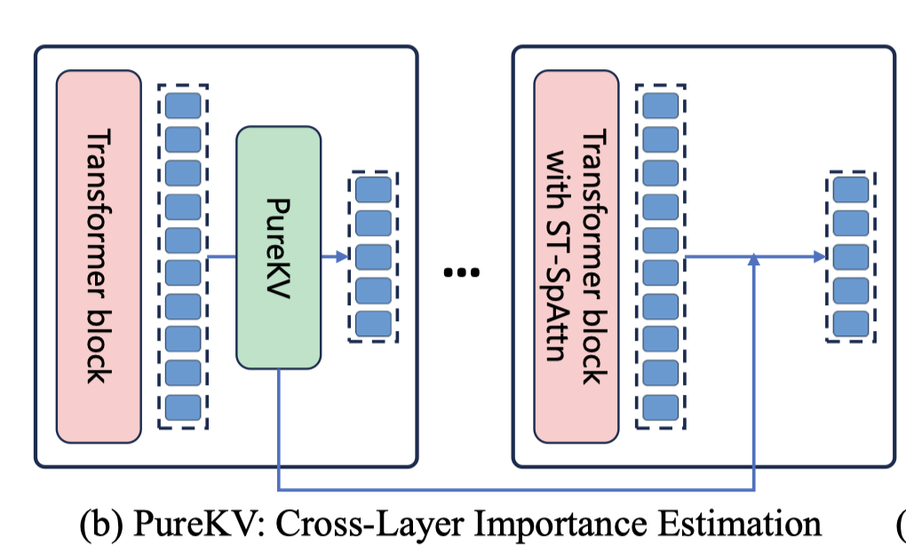

# PureKV: Plug-and-Play KV Cache Optimization with Spatial-Temporal Sparse Attention for Vision-Language Large Models

> Zhonghua Jiang, Kunxi Li, Yiyun Zhou, Sihao Liu, Zhaode Wang, Chengfei lv, Shengyu Zhang

> ⚠️ **注意：本 note 由 AI Agent 自动生成，仅供参考，内容可能存在不准确之处。**
> 生成时间：2025年

---

## 一句话总结

PureKV 是一种即插即用的 KV 缓存优化框架，通过跨层重要性估计和时空稀疏注意力（ST-SpAttn）联合优化稀疏注意力与 KV 缓存压缩，在 VideoLLaMA2 和 Qwen2.5-VL 上实现 5.0× KV 缓存压缩和 3.16× 预填充加速，且性能损失可忽略不计。

---

## 摘要翻译

视觉语言大模型（VLLMs）在处理高分辨率输入时面临显著的效率挑战。注意力机制的二次复杂度和自回归生成，以及不断增长的 KV 缓存大小，严重阻碍了预填充和解码阶段。近期的尝试试图通过识别和修剪不重要的 token 的 KV 缓存来压缩 KV 缓存，但这些方法通常依赖注意力分数来估计 token 重要性，使其与 FlashAttention 和 Sparse Attention 等高效注意力机制不兼容，因为后者不会显式计算注意力矩阵。此外，现有方法忽略了稀疏注意力在加速预填充阶段的同时如何改变 KV 缓存的信息结构，从而损害下游 KV 缓存压缩策略的有效性。为解决这一问题，我们提出 PureKV，一个用于稀疏注意力和 KV 缓存压缩联合优化的即插即用框架。我们首先引入了一种与高效注意力加速器完全兼容的 KV 缓存压缩策略。该方法利用低层注意力分数估计高层 KV 缓存的重要性，实现主动修剪而不牺牲准确性。此外，我们设计了一个专为视频 KV 缓存压缩算法量身定制的时空稀疏注意力（ST-SpAttn）模块。该模块结合空间和时间注意力稀疏性，通过净化 KV 缓存中的空间噪声和时间冗余来提高 KV 缓存优化算法的压缩效率。同时，ST-SpAttn 也加速了 VLLMs 的预填充阶段。在 VLLMs（VideoLLaMA2、Qwen2.5-VL）上的大量实验表明，PureKV 实现了 5.0× KV 缓存压缩和 3.16× 预填充加速，且质量退化可忽略不计。

---

## 研究动机

### VLLMs 的推理效率瓶颈

视觉语言大模型（VLLMs）如 LLaVA、VideoLLaMA2、Qwen2.5-VL 在视频理解、视觉问答、多模态内容生成等任务上表现突出。然而，高分辨率视觉输入导致处理的视觉 token 数量剧增，带来了严重的内存占用和计算效率挑战。自回归解码中，KV 缓存随序列长度线性增长，注意力计算复杂度为二次方，这是推理阶段的核心瓶颈。

### 现有 KV 缓存压缩方法的局限

**1. 基于注意力分数的方法与高效注意力机制不兼容**
- H2O、SnapKV 等方法依赖每层的注意力分数来评估 token 重要性，需要显式计算注意力矩阵
- FlashAttention、Sparse Attention 等高效注意力机制不暴露或计算显式注意力矩阵
- 这种依赖关系使得传统注意力分数方法与高效注意力机制天然不兼容

**2. 窗口方法缺乏动态语义保留能力**
- StreamingLLM 等滑动窗口方法保留初始 token 和最近窗口，避免了分数计算，但缺乏动态保留语义关键 token 的能力
- 容易过早淘汰重要信息，导致模型性能下降

**3. 稀疏注意力改变 KV 缓存的信息结构**
- 现有稀疏注意力机制在加速预填充的同时，会改变 KV 缓存的信息结构
- 因果注意力导致第 i 层位置 j 的 KV 缓存聚合了第 i-1 层前 j+1 个 token 的信息，使得重要和不重要信息逐渐混杂
- 这种信息纠缠严重影响了高层 KV 缓存重要性估计的准确性
- 现有 KV 缓存压缩策略未考虑这种结构变化

---

## 方法（技术细节）

### 整体框架

PureKV 是一个即插即用的 KV 缓存优化框架，包含两个核心组件：

1. **轻量级 KV 缓存重要性估计器**（Cross-Layer Importance Estimation, CLIE）：利用低层注意力分数估计高层 KV 缓存重要性，与高效注意力机制完全兼容
2. **时空稀疏注意力**（Spatial-Temporal Sparse Attention, ST-SpAttn）：结合空间和时间稀疏性净化 KV 缓存，同时加速预填充阶段

### 1. 轻量级 KV 缓存重要性估计器（CLIE）

#### 核心思想

传统方法在每层计算注意力分数来评估 token 重要性，但这与 FlashAttention 和 Sparse Attention 不兼容。PureKV 利用低层注意力分数来估计高层 KV 缓存重要性，使高层可以使用高效注意力机制。

#### 低层注意力分数计算

对于长度为 l 的输入序列，低层保留最近窗口大小 w，同时在非最近片段中保留最重要的 h 个 KV 缓存。

计算注意力分数矩阵：

$$A_{low} = \text{softmax}\left(\frac{QK^T}{\sqrt{d_k}}\right)$$

#### 消除偏置的累积注意力分数

现有方法（如 H2O、SnapKV）依赖累积注意力分数来识别重要 token，但由于注意力矩阵的下三角结构，这种方法天然偏向早期 token。PureKV 计算最近窗口内 token 对非最近片段的累积注意力分数：

$$C_{low} = \sum_{i=l-w}^{i<l} A_{i,j}, \quad 0 \leq j < l-w$$

#### 结合 V 向量 L2 范数的重要性评分

之前的工作主要依赖注意力相关指标评估 KV 缓存重要性，忽略了 V 向量对输出的影响。研究表明，在固定注意力权重条件下，V 向量的大小也显著影响注意力机制的输出结果。

PureKV 将累积注意力分数与对应 V 向量的 L2 范数加权：

$$S_{low} = C_{low} \odot \|V_{0:l-w}^{low}\|$$

其中 $S_{low}$ 是非最近片段 token 的最终重要性分数，保留最近 w 个 token 并选择非最近片段中最重要的 h 个 token。

#### 跨层重要性估计

对于高层，PureKV 复用低层的累积注意力分数 $C_{low}$，并计算高层 V 向量的 L2 范数来估计 KV 缓存重要性：

$$\hat{S}_{high} = C_{low} \odot \|V_{0:l-w}^{high}\|$$

这一跨层重要性估计使得无需在高层计算注意力分数，即可准确选择 KV 缓存，从而与 FlashAttention 和其他高性能注意力后端完全兼容。

#### 统计验证

使用 Spearman 秩相关系数验证跨层重要性估计的有效性。实验表明，在大多数层中 Spearman 相关系数超过 0.4，且相关性统计显著（p < 0.05），为跨层重要性估计策略提供了强有力的实证支持。

### 2. 时空稀疏注意力（ST-SpAttn）

#### 问题：密集聚焦导致的信息纠缠

因果注意力导致高层 KV 缓存中重要和不重要信息逐渐混杂，这严重影响了高层 KV 缓存重要性估计的准确性。

#### 设计目标

设计结构化的稀疏模式，净化 KV 缓存中的空间噪声和时间冗余，同时加速预填充阶段。

#### 空间稀疏注意力

保留两种交互关系：
1. **每个 token 与第一帧之间的注意力**：捕获远程视觉一致性
2. **当前帧内的帧内注意力**：保留局部空间上下文

这种设计有效抑制了背景噪声和不相关的视觉干扰。

#### 时间稀疏注意力

保留两种交互关系：
1. **每个 token 与前一帧对应 token 之间的注意力**：增强时间连贯性
2. **与第一帧的注意力连接**：保持全局上下文锚定

这种设计减少了来自高度相似连续帧的冗余信息。

#### 双路径设计的优势

- 生成更干净、更结构化的 KV 缓存
- 减少噪声，同时保留关键时空依赖
- 净化后的 KV 缓存显著提高了后续压缩策略的准确性和鲁棒性
- 同时加速 VLLMs 的预填充阶段

### 与现有 KV 压缩算法的集成

PureKV 可以无缝集成到现有的 KV 缓存压缩算法中。实验表明，将 PureKV 的 CLIE 和 ST-SpAttn 机制集成到 H2O、SnapKV、StreamingLLM、FastV 等方法中，均能显著提升性能，证明了其通用性和鲁棒性。

---

## 实验结果

### 实验设置

- **模型**：VideoLLaMA2、Qwen2.5-VL-7B
- **基准**：MVBench（多模态视频理解基准，包含 14 个视频理解任务）
- **评估指标**：ROUGE
- **对比方法**：H2O、SnapKV、StreamingLLM（文本场景）、FastV、LOOK-M（视觉任务）
- **硬件**：NVIDIA A100 40GB

### 主要结果

#### Qwen2.5-VL-7B（MVBench）

| 预算 | H2O | SnapKV | StreamingLLM | FastV | LOOK-M | PureKV |
|------|------|--------|--------------|-------|--------|--------|
| 20% | 0.4695 | 0.4808 | 0.4941 | 0.5154 | 0.0610 | **0.5429** |
| 10% | 0.4234 | 0.4505 | 0.4801 | 0.5072 | 0.0389 | **0.5360** |

#### VideoLLaMA2（MVBench）

| 预算 | H2O | SnapKV | StreamingLLM | FastV | PureKV |
|------|------|--------|--------------|-------|--------|
| 20% | 0.3084 | 0.4811 | 0.5274 | 0.5068 | **0.6189** |
| 10% | 0.2449 | 0.3500 | 0.4451 | 0.3193 | **0.5047** |

PureKV 在两种 VLLM 上均显著优于所有基线方法。在 20% 预算下，Qwen2.5-VL 上 PureKV（0.5429）相比全缓存（0.5136）甚至有轻微提升，而其他方法均有性能下降。

### 推理速度（VideoLLaMA2）

| 方法 | 预算 | 预填充延迟 | 解码延迟 |
|------|------|-----------|---------|
| Full Cache | 100% | 0.1190 ms/token | 36.73 ms/token |
| PureKV | 50% | 0.0366 ms/token | 31.87 ms/token |
| PureKV | 20% | 0.0376 ms/token | 28.32 ms/token |
| PureKV | 5% | 0.0355 ms/token | 27.92 ms/token |

PureKV 在 20% 预算下实现约 3.16× 预填充加速和约 1.3× 解码加速，且 5% 极端预算下仍保持稳定性能。

### 消融实验

在 Qwen2.5-VL 和 VideoLLaMA2 上的消融实验（Action Sequence 任务）：

| CLIE | ST-SpAttn | V 加权 | Qwen2.5-VL | VideoLLaMA2 |
|------|-----------|--------|-----------|------------|
| ✘ | ✘ | ✔ | 0.7307 | 0.6985 |
| ✔ | ✘ | ✔ | 0.7311 | 0.7020 |
| ✔ | ✔ | ✘ | 0.7212 | 0.6936 |
| ✔ | ✔ | ✔ | **0.7490** | **0.7588** |

三个组件均有贡献，完整 PureKV 性能最佳。

### 超参数分析

- **CLIE 层索引**：设为 0 时性能显著下降（初始层缺乏足够上下文信息）；设为 2 时性能最佳
- **ST-SpAttn 层索引**：高层激活效果更好，但不会无限增长

### 与现有 KV 压缩算法的集成

将 PureKV 的 CLIE 和 ST-SpAttn 机制集成到 H2O、SnapKV、StreamingLLM、FastV 等现有方法中，均能显著提升性能（如 H2O+PureKV 从 0.3084 提升至 0.4950，SnapKV+PureKV 从 0.4811 提升至 0.5680）。

### 音频视频 LLM 中的应用

在 AVSD 数据集上的实验表明，PureKV 显著优于所有基线方法（0.4265 vs H2O 0.3527、SnapKV 0.4249、StreamingLLM 0.4249、FastV 0.4224）。

---

## 优势

1. **即插即用框架**：PureKV 可无缝集成到现有 KV 缓存压缩算法中（H2O、SnapKV、StreamingLLM、FastV），显著提升其性能，无需大量修改。
2. **与高效注意力机制兼容**：通过跨层重要性估计，PureKV 不需要在高层计算注意力分数，与 FlashAttention、Sparse Attention 等高效注意力机制完全兼容。
3. **V 向量感知的重要性估计**：结合累积注意力分数和 V 向量的 L2 范数，获得更准确、更鲁棒的 KV 缓存重要性评分。
4. **时空双路径稀疏**：ST-SpAttn 同时净化空间噪声和时间冗余，使 KV 缓存信息结构更清晰，提高后续压缩策略的有效性。
5. **高压缩率与低性能损失**：5.0× KV 缓存压缩和 3.16× 预填充加速，且质量退化可忽略不计。
6. **跨架构泛化**：在 VideoLLaMA2 和 Qwen2.5-VL 两种不同架构上均表现优异，且在音频视频 LLM（AVSD 数据集）上也有效。
7. **鲁棒的低预算性能**：即使仅保留 10% KV 缓存，PureKV 仍保持稳定性能，而其他方法在低预算下性能显著下降。
8. **消融实验验证组件贡献**：CLIE、ST-SpAttn、V 加权三个组件均有独立贡献，完整组合效果最佳。

---

## 局限

1. **代码开源缺失**：论文未提供开源代码（代码 URL 为空），可复现性受限。
2. **模型规模限制**：实验仅在 VideoLLaMA2 和 Qwen2.5-VL-7B 上进行，未验证在更大规模模型（如 70B+）上的表现。
3. **基准限制**：主要在 MVBench 视频理解基准上评估，未涵盖文本生成、多模态对话等更广泛的场景。
4. **超参数调优**：CLIE 层索引、ST-SpAttn 层索引、窗口大小 w、保留 token 数 h 等超参数需要针对不同场景调优，论文仅报告了单一配置的结果。
5. **稀疏注意力模式设计**：ST-SpAttn 仅考虑空间和时间两个维度的稀疏性，未探索更细粒度的稀疏模式（如注意力头级别、特征通道级别等）。
6. **实际硬件加速验证**：虽然理论分析表明与 FlashAttention 兼容，但论文未提供详细的端到端硬件加速实验数据。
7. **长序列扩展性**：实验主要在较短的视频序列上进行，未验证在超长视频（如数分钟）上的表现。
8. **通用性验证不足**：实验主要在英文和中文数据上进行，未验证在多语言、多模态等更广泛场景下的表现。

---

## 与 EfficientPaper 相关的研究方向

### 相关关键词
- `kv_cache_sparse`：KV 缓存稀疏压缩是 PureKV 的核心关注点

### 相关 baseline 方法
- `2023/H2O`：基于注意力分数的 KV 缓存压缩
- `2024/SnapKV`：基于注意力分数的 KV 缓存压缩
- `2024/streaming-llm`：滑动窗口 KV 缓存管理

### 研究方向

1. **KV 缓存压缩与高效注意力的协同优化**：PureKV 展示了如何将 KV 缓存压缩与高效注意力机制（FlashAttention、Sparse Attention）协同设计，使两者不再相互制约。未来可探索更多协同优化策略。

2. **跨层重要性估计**：PureKV 利用低层注意力分数估计高层 KV 缓存重要性，这一思路可扩展到更多层间信息传递机制，如利用浅层特征预测深层 token 重要性。

3. **时空稀疏注意力设计**：ST-SpAttn 在视频理解中有效抑制了空间噪声和时间冗余，未来可探索更细粒度的时空稀疏模式，以及在更长视频序列上的稀疏策略。

4. **即插即用的 KV 缓存优化框架**：PureKV 的即插即用特性使其能无缝集成到现有 KV 缓存压缩算法中，这一设计理念可扩展到更多场景，如 KV 缓存量化、KV 缓存蒸馏等。

5. **多模态 KV 缓存管理**：PureKV 在音频视频 LLM 上的实验表明，其方法可扩展到多模态场景。未来可探索更通用的多模态 KV 缓存管理策略。

6. **低预算 KV 缓存压缩的鲁棒性**：PureKV 在 10% 极端预算下仍保持稳定性能，这一特性对于资源受限的部署场景（如边缘设备、移动端）具有重要意义。

7. **V 向量感知的重要性估计**：PureKV 引入 V 向量 L2 范数来加权注意力分数，这一设计思路可扩展到更多注意力机制中，提高 token 重要性估计的准确性。

---

*本 note 由 AI Agent 自动生成，内容基于论文原文，仅供参考。*
