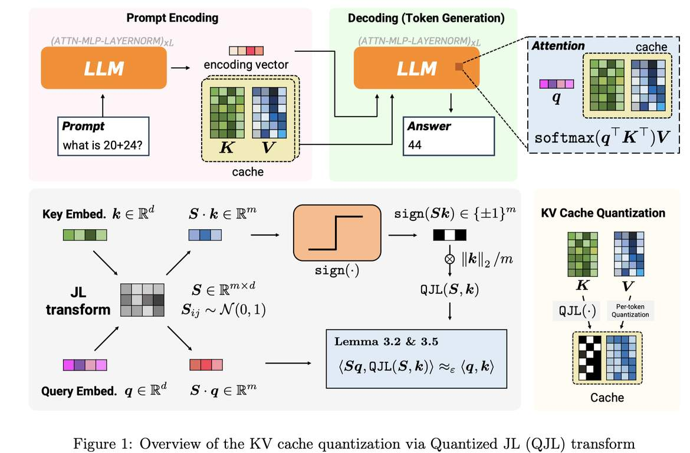

# QJL: 1-Bit Quantized JL Transform for KV Cache Quantization with Zero Overhead

> Amir Zandieh, Majid Daliri, Insu Han



> **注意：本笔记由 AI Agent 自动生成，仅供学习参考。生成时间：2025年。**

---

## 一句话总结

QJL 提出了一种基于 Johnson-Lindenstrauss (JL) 变换与 1-bit 符号量化的 KV Cache 压缩方法，在零额外存储开销下实现 3-bit 量化，将 KV Cache 内存占用降低 5 倍以上，同时保持模型精度并加速推理。

---

## 摘要翻译

服务大语言模型（LLM）需要大量内存，因为 KV Cache 中的 Key-Value 嵌入随序列长度增长。量化是压缩 KV Cache 的有效方法，但传统量化方法存在显著的内存开销——每个数据块需要以全精度存储量化常量（至少一个零点和一个缩放因子）。根据块大小，这些开销为每个量化数字增加 1 或 2 位。

我们提出 QJL，一种新的量化方法，包含 Johnson-Lindenstrauss (JL) 变换和符号位量化。与现有方法不同，QJL 通过消除存储量化常量的需求来消除内存开销。我们提出了一种非对称的内积估计器，证明对一个向量应用 QJL、对另一个向量应用标准 JL 变换（不量化），可以得到无偏且失真最小的内积估计器。我们开发了高效的 QJL sketch 和内积估计器的实现，包含轻量级 CUDA 内核。将 QJL 应用于各种 LLM 和 NLP 任务，仅使用 3-bit 量化 KV Cache 时，内存使用量减少超过 5 倍，同时不损失精度，并获得更快的运行速度。

---

## 研究动机

1. **KV Cache 内存瓶颈**：LLM 推理时需要缓存所有历史 token 的 Key-Value 嵌入，随序列长度线性增长，成为内存和速度瓶颈。
2. **传统量化方法的开销**：现有 KV Cache 量化方法（如 KIVI、KVQuant）需要为每个数据块存储量化常量（零点、缩放因子），这些常量以全精度存储，导致每个量化数字额外增加 1-2 位的开销。
3. **数据依赖性**：现有方法需要针对输入数据调整和分组，增加了计算和存储复杂度。
4. **长上下文需求**：随着 LLM 上下文长度不断增加（如 128K），KV Cache 压缩变得越来越重要。

---

## 方法（技术细节）

### 核心思想

QJL 将 **Johnson-Lindenstrauss (JL) 变换**与**1-bit 符号量化**结合，实现零开销的 KV Cache 量化。

### 1. JL 变换基础

- 给定向量 k ∈ ℝ^d，应用随机高斯投影矩阵 S ∈ ℝ^{m×d}（元素为 i.i.d. N(0,1)）。
- 投影后的向量 Sk 的内积是原始向量内积的无偏低失真估计。

### 2. QJL 变换（1-bit 量化）

定义 QJL 映射函数 H_S: ℝ^d → {−1, +1}^m：

```
H_S(k) = sign(Sk)
```

即对 JL 变换结果取符号位，每个元素仅需 1 bit 存储。

### 3. 非对称内积估计器

对于查询向量 q 和键向量 k，内积估计器定义为：

```
ProdQJL(q, k) = (√(π/2) / m) · ‖k‖₂ · ⟨Sq, H_S(k)⟩
```

关键点：
- **非对称性**：对 k 应用 QJL（符号量化），对 q 仅应用 JL 变换（不量化）。
- **无偏性**（Lemma 3.2）：E_S[ProdQJL(q, k)] = ⟨q, k⟩，即估计器是无偏的。
- **低失真**（Lemma 3.5）：失真界与标准 JL 变换相当，常数甚至更小。

### 4. Attention Score 的保证

**Theorem 3.6**：对于有界范数的 query 和 key 嵌入，若 m ≥ 2r²ε⁻² log n，则算法计算的 Attention Score 满足：

```
|Scorê(i) - Score(i)| ≤ 3ε · Score(i)
```

关键特性：每个 key token 仅需 m ≈ ε⁻² log n 位，与嵌入维度无关，仅对数增长于序列长度。

### 5. QJL Key Cache 量化算法

1. 生成随机 JL 矩阵 S ∈ ℝ^{m×d}，并用 QR 分解正交化其行（Orthogonalized JL）。
2. 对每个 key 向量 k_i：计算 ̃k_i = sign(Sk_i)，存储 ̃k_i 和范数 ν_i = ‖k_i‖₂。
3. 估计 Attention Score 时：计算 ProdQJL(q_n, k_j) 作为内积估计。

### 6. Value Cache 量化

Value Cache 使用标准的 token-wise 量化方法，与 KIVI 等先前工作一致，简单有效。

### 7. 异常值处理

- 观察到深层 key 嵌入存在固定通道的异常值（outlier channels）。
- 在 prompt 阶段识别异常值通道。
- 对异常值和正常值分别使用独立的 QJL 量化器，异常值使用更低压缩率（更多位）。
- 这可以减少 key 嵌入范数，从而降低最终失真。

### 8. 正交化 JL 变换

对 JL 矩阵 S 的行进行 QR 分解正交化，几乎总是提升 QJL 的性能，与随机傅里叶特征和局部敏感哈希等应用中的发现一致。

---

## 实验结果

### 实验环境
- 单张 A100 GPU（80GB 显存）
- PyTorch + 自定义 CUDA 内核
- 基线模型：longchat-7b-v1.5-32k（基于 Llama-2 微调，7B 参数，16384 上下文长度）

### 1. LongBench 长上下文问答任务（Table 1）

| 方法 | Bits | NarrativeQA | Qasper | MultiQA-en | MultifQA-zh | HotpotQA | 2WikiMultiQA |
|------|------|------------|--------|------------|-------------|----------|-------------|
| FP16 | 16 | 20.79 | 29.42 | 42.83 | 34.33 | 33.05 | 24.14 |
| KIVI | 3 | 20.96 | 29.01 | 40.93 | 34.75 | 32.79 | 23.01 |
| KVQuant | 4.3 | 20.14 | 28.77 | 44.22 | 34.44 | 34.06 | 23.05 |
| **QJL** | **3** | **21.83** | **29.44** | 41.52 | 34.42 | **35.62** | **23.60** |

**QJL 在 3-bit 量化下，在 NarrativeQA、Qasper、2WikiMultiQA 上取得最高 F1 分数。**

### 2. LM-eval 常规长度任务（Table 2）

| 模型 | 方法 | Bits | Lambada | HellaSwag | PIQA | MathQA | MMLU |
|------|------|------|---------|-----------|------|--------|------|
| Llama-2-7B | FP16 | 16 | 73.90 | 57.18 | 78.07 | 28.11 | 41.85 |
| Llama-2-7B | KIVI | 3 | 73.88 | 57.13 | 78.07 | 28.11 | 41.81 |
| Llama-2-7B | QJL | 3 | 73.88 | 57.14 | 78.07 | 28.17 | 41.78 |
| Llama-3-8B | BF16 | 16 | 75.59 | 60.17 | 79.65 | 40.64 | 62.09 |
| Llama-3-8B | QJL | 3 | **75.61** | 60.13 | **79.87** | 40.60 | **62.12** |

**QJL 在 Llama-3-8B 上性能与基线相当甚至略优。**

### 3. 运行时性能

- QJL 在 prompt 编码和解码阶段与基线速度相当，甚至更快。
- KVQuant 在编码和解码阶段显著慢于其他方法。
- QJL 是唯一支持 Llama-3 的方法（支持 GQA 和 BF16 数据类型）。
- Llama-3 上的生成速度与精确方法相同，同时内存使用量减少至少 5 倍。

---

## 优势

1. **零额外存储开销**：QJL 不需要存储量化常量（零点、缩放因子），彻底消除了传统量化的存储开销问题。
2. **理论保证**：提供了严格的数学证明——无偏估计器（Lemma 3.2）和低失真界（Lemma 3.5），最终 Attention Score 失真界为 (1±3ε)。
3. **数据无关（Data-oblivious）**：不依赖特定输入数据，无需调优，可实时应用。
4. **极低比特率**：仅需 3-bit 即可实现 5 倍以上内存压缩，且精度无损。
5. **高效 GPU 实现**：提供轻量级 CUDA 内核，支持多种数据类型（FP16、BF16、FP32）。
6. **支持 GQA**：支持分组查询注意力（Grouped Query Attention），兼容 Llama-3 等最新模型。
7. **内存与速度双收益**：在减少 5 倍内存的同时，解码速度不降反升。
8. **异常值处理**：通过识别和单独处理深层异常值通道，进一步提升量化精度。

---

## 局限

1. **随机矩阵存储**：需要在内存中存储随机投影矩阵 S ∈ ℝ^{m×d}，虽然该矩阵在推理前生成，但对于高维嵌入可能占用一定内存。
2. **仅针对 KV Cache**：主要关注 Key Cache 的量化，Value Cache 仍使用标准量化方法，未进一步优化。
3. **生成阶段的计算**：虽然 QJL 量化是高效的，但生成阶段仍需对所有缓存的量化 key 进行内积计算，O(nd) 复杂度未根本改变。
4. **嵌入范数约束**：Theorem 3.6 假设 query 和 key 嵌入有界范数，实际中可能需要额外的归一化处理。
5. **Outlier 识别依赖 prompt 阶段**：需要在 prompt 阶段识别异常值通道，这可能增加预处理时间。
6. **实验模型有限**：主要在 Llama-2 和 Llama-3 上验证，对更大规模模型（如 70B）的验证尚不充分。
7. **与权重量化方法的结合**：论文未探讨 QJL 与权重量化（如 AWQ、GPTQ）的结合效果。
8. **CUDA 内核仍为 PyTorch 包装**：作者提到计划将所有实现迁移到 CUDA 以进一步加速，当前仍有 PyTorch 包装层的开销。

---

## 与 EfficientPaper 相关的研究方向

1. **KV Cache 量化**：QJL 属于 KV Cache 压缩领域，与 KIVI（2-bit 非对称量化）和 KVQuant（per-channel 量化）形成互补。EfficientPaper 可以将 QJL 与这些方法进行横向对比。
2. **随机投影与 Sketching**：QJL 利用 Johnson-Lindenstrauss 变换实现无偏内积估计，这是一种经典的降维技术，与随机傅里叶特征（RFF）和局部敏感哈希（LSH）有理论联系。
3. **低比特推理**：QJL 实现了 1-bit 量化（符号位），属于极端低比特量化的范畴，与 GPT3.8bit、AWQ 等权重量化方法互补。
4. **长上下文效率**：QJL 在长序列（31500 tokens）上表现优异，与 LongBench 等长上下文基准测试高度相关，对解决 LLM 长上下文推理效率问题有重要价值。
5. **Attention 机制优化**：QJL 通过量化 KV Cache 加速 Attention 计算，与 PagedAttention（vLLM）、FlashAttention 等系统级优化方向互补。
6. **数据无关量化**：QJL 的 data-oblivious 特性使其区别于 KIVI 等需要 per-channel/per-token 分组的方法，可能与新的量化范式（如统一量化）相关。
7. **数学理论与工程结合**：QJL 有严格的数学证明（无偏性、失真界），同时有高效的 CUDA 实现，是理论与工程结合的优秀案例，可作为 EfficientPaper 中"理论可解释的高效方法"的典型代表。
