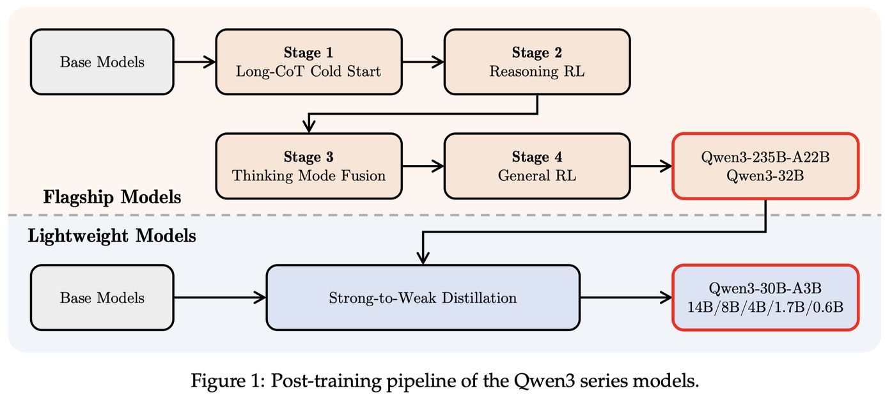

# Qwen3 Technical Report

> An Yang, Anfeng Li, Baosong Yang, Beichen Zhang, Binyuan Hui, Bo Zheng, Bowen Yu, Chang Gao, Chengen Huang, Chenxu Lv, Chujie Zheng, Dayiheng Liu, Fan Zhou, Fei Huang, Feng Hu, Hao Ge, Haoran Wei, Huan Lin, Jialong Tang, Jian Yang, Jianhong Tu, Jianwei Zhang, Jianxin Yang, Jiaxi Yang, Jing Zhou, Jingren Zhou, Junyang Lin, Kai Dang, Keqin Bao, Kexin Yang, Le Yu, Lianghao Deng, Mei Li, Mingfeng Xue, Mingze Li, Pei Zhang, Peng Wang, Qin Zhu, Rui Men, Ruize Gao, Shixuan Liu, Shuang Luo, Tianhao Li, Tianyi Tang, Wenbiao Yin, Xingzhang Ren, Xinyu Wang, Xinyu Zhang, Xuancheng Ren, Yang Fan, Yang Su, Yichang Zhang, Yinger Zhang, Yu Wan, Yuqiong Liu, Zekun Wang, Zeyu Cui, Zhenru Zhang, Zhipeng Zhou, Zihan Qiu

> ⚠️ **注意：本 note 由 AI Agent 自动生成，仅供参考，内容可能存在不准确之处。**
> 生成时间：2025年

---

## 一句话总结

Qwen3 是 Qwen 系列的最新版本，将思考模式（thinking mode）与非思考模式（non-thinking mode）统一到单一模型中，支持 0.6B–235B 参数规模（Dense + MoE），在 36 万亿 token 上预训练并覆盖 119 种语言，通过四阶段后训练（Long-CoT 冷启动、推理 RL、思考模式融合、通用 RL）和强到弱蒸馏（Strong-to-Weak Distillation）实现开源 LLM 的 SOTA 性能。

---

## 摘要翻译

本文提出 Qwen3，Qwen 模型家族的最新版本。Qwen3 包含一系列大语言模型（LLMs），旨在提升性能、效率和多语言能力。Qwen3 系列包括 Dense 和 MoE（混合专家）两种架构，参数规模从 0.6B 到 235B。Qwen3 的一个关键创新是将思考模式（用于复杂的多步推理）和非思考模式（用于快速的上下文驱动响应）整合到统一框架中，消除了在不同模型之间切换的需要（如 GPT-4o 等聊天优化模型和 QwQ-32B 等专用推理模型），并支持基于用户查询或聊天模板的动态模式切换。同时，Qwen3 引入了思考预算（thinking budget）机制，允许用户在推理过程中自适应地分配计算资源，从而根据任务复杂度平衡延迟和性能。此外，通过利用旗舰模型的知识，Qwen3 显著降低了构建较小规模模型所需的计算资源，同时确保其高度竞争力的性能。经验评估表明，Qwen3 在包括代码生成、数学推理、智能体任务等在内的多种基准测试中达到了 SOTA 结果，与更大的 MoE 模型和闭源模型竞争。与前代 Qwen2.5 相比，Qwen3 将多语言支持从 29 种语言扩展到 119 种语言和方言，通过改进的跨语言理解和生成能力增强了全球可访问性。为了促进可重复性和社区驱动的研发，所有 Qwen3 模型均以 Apache 2.0 协议开源。

---

## 研究动机

### 大语言模型的发展趋势

近年来，大型基础模型（如 GPT-4o、Claude 3.7、Gemini 2.5、DeepSeek-V3、Llama-4、Qwen2.5 等）在 AGI/ASI 追求中取得了显著进展。这些模型在数万亿 token 的数据上训练，有效将人类知识和能力蒸馏到参数中。同时，通过强化学习优化的推理模型（如 o3、DeepSeek-R1）展示了基础模型在推理时缩放（inference-time scaling）方面的潜力。

### 现有模型的局限

1. **推理模式与聊天模式分离**：大多数 SOTA 模型需要在不同的模型之间切换——聊天优化模型（如 GPT-4o）和专用推理模型（如 QwQ-32B）分别处理不同类型的任务，增加了部署复杂性
2. **计算资源分配不灵活**：缺乏根据任务复杂度动态调整推理深度的能力
3. **多语言覆盖不足**：前代 Qwen2.5 仅支持 29 种语言，无法满足全球化需求
4. **开源模型性能差距**：开源模型与闭源模型之间仍存在性能差距

### Qwen3 的目标

Qwen3 旨在通过统一思考/非思考模式、引入思考预算机制、扩展多语言支持、以及通过强到弱蒸馏降低小模型构建成本，来解决上述问题。

---

## 方法（技术细节）

### 1. 模型架构

Qwen3 包含 6 个 Dense 模型和 2 个 MoE 模型：

**Dense 模型**：
- Qwen3-0.6B、Qwen3-1.7B、Qwen3-4B、Qwen3-8B、Qwen3-14B、Qwen3-32B
- 使用 GQA（分组查询注意力）、SwiGLU、RoPE（旋转位置编码）、RMSNorm（预归一化）
- 移除了 Qwen2 中的 QKV-bias，引入 QK-Norm 以确保训练稳定性
- 上下文长度：0.6B/1.7B 为 32K，其余为 128K

**MoE 模型**：
- Qwen3-30B-A3B（30B 总参数，3B 激活参数）和 Qwen3-235B-A22B（235B 总参数，22B 激活参数）
- 128 个专家，每个 token 激活 8 个专家
- 去除了共享专家（与 Qwen2.5-MoE 不同）
- 采用全局批处理负载均衡损失（global-batch load balancing loss）鼓励专家专业化

**分词器**：使用 Qwen 的 BBPE（字节级字节对编码）分词器，词汇表大小 151,669。

### 2. 预训练

#### 预训练数据
- 总量：36 万亿 token，覆盖 119 种语言和方言
- 数据增强策略：
  - 使用 Qwen2.5-VL 从大量 PDF 文档中提取文本，再用 Qwen2.5 优化质量
  - 使用 Qwen2.5-Math 合成数学内容
  - 使用 Qwen2.5-Coder 合成代码相关数据
- 多语言数据标注系统：对 30 万亿 token 在多个维度（教育价值、领域、安全等）进行标注
- 与前代相比，token 数翻倍，语言覆盖从 29 种扩展到 119 种

#### 三阶段预训练策略

1. **通用阶段（S1）**：训练 30 万亿 token，序列长度 4,096 token，建立通用知识和语言能力
2. **推理阶段（S2）**：增加 STEM、代码、推理、合成数据比例，训练约 5T token，序列长度 4,096 token，加速学习率衰减
3. **长上下文阶段**：收集高质量长上下文语料，序列长度扩展到 32,768 token（75% 长度 16K-32K，25% 长度 4K-16K），使用 ABF 将 RoPE 基础频率从 10,000 提高到 1,000,000，引入 YARN 和 Dual Chunk Attention (DCA) 实现推理时 4 倍序列长度扩展

### 3. 后训练（Post-training）

后训练分为四个阶段（旗舰模型），目标是：
1. **思考控制**：整合思考和非思考模式
2. **强到弱蒸馏**：优化轻量级模型

#### 阶段 1：Long-CoT 冷启动（Long-CoT Cold Start）

- 数据集涵盖数学、代码、逻辑推理、STEM 问题，每个问题配有验证过的参考答案或代码测试用例
- 两阶段过滤：
  - **查询过滤**：使用 Qwen2.5-72B-Instruct 识别不易验证的查询（多子问题、一般文本生成、模型可直接回答无需 CoT 推理的查询）
  - **响应过滤**：使用 QwQ-32B 生成 N 个候选响应，过滤掉：错误最终答案、大量重复、明显猜测、思考与总结内容不一致、不当语言混合、与验证集过于相似
- 目标：在模型中注入基础推理模式，而非过度强调即时推理性能
- 训练样本数和训练步数尽量少，为后续 RL 阶段留出空间

#### 阶段 2：推理 RL（Reasoning RL）

- 使用 GRPO（Group Relative Policy Optimization）算法
- 查询-验证器对满足四个条件：未在冷启动中使用、对冷启动模型可学习、尽可能困难、覆盖广泛子领域
- 共收集 3,995 个查询-验证器对
- 使用大批量和每个查询多次 rollout，配合 off-policy 训练提高样本效率
- 通过控制模型熵（增加或保持稳定）平衡探索与利用
- 实例：Qwen3-235B-A22B 的 AIME'24 分数从 70.1 提升到 85.1（170 步 RL 训练）

#### 阶段 3：思考模式融合（Thinking Mode Fusion）

**目标**：将非思考能力整合到已具备思考能力的模型中，实现动态模式切换。

**SFT 数据构造**：
- 思考数据：使用阶段 2 模型在阶段 1 查询上进行拒绝采样生成
- 非思考数据：覆盖编码、数学、指令遵循、多语言、创意写作、问答、角色扮演等任务，使用自动生成的检查表评估响应质量，增加翻译任务比例以增强低资源语言性能

**聊天模板设计**：
- 通过 `/think` 和 `/no think` 标志在用户查询或系统消息中切换模式
- 非思考模式样本保留空的 `<think>` 块（保持内部格式一致性）
- 默认为思考模式，添加部分无 `/think` 标志的思考模式训练样本
- 多轮对话中随机插入多个标志，模型响应遵循最后一个标志

**思考预算（Thinking Budget）**：
- 模型学会同时响应两种模式后，自然发展出基于不完整思考生成响应的能力
- 当思考长度达到用户定义阈值时，自动停止思考并插入停止指令，基于累积推理生成最终响应
- 该能力是思考模式融合的自然涌现结果，非显式训练

#### 阶段 4：通用 RL（General RL）

- 覆盖 20+ 个任务，每个任务有定制化评分标准
- 核心能力增强：
  - **指令遵循**：确保模型准确解释和遵循用户指令
  - **格式遵循**：正确响应 `/think` 和 `/no think` 标志，使用 `<think>`/`</think>` 分隔思考和响应
  - **偏好对齐**：提高 helpfulness、engagement 和风格
  - **智能体能力**：训练模型通过指定接口调用工具，支持完整的多轮交互和真实环境执行反馈
  - **特殊场景能力**：如 RAG 任务，最小化幻觉风险

- 三种奖励信号：
  1. **基于规则的奖励**：用于推理 RL 和通用任务（如指令遵循、格式遵循）
  2. **基于模型的奖励（有参考答案）**：使用 Qwen2.5-72B-Instruct 根据参考答案评分
  3. **基于模型的奖励（无参考答案）**：使用人类偏好数据训练奖励模型

#### 强到弱蒸馏（Strong-to-Weak Distillation）

- 适用于 5 个 Dense 模型（0.6B、1.7B、4B、8B、14B）和 1 个 MoE 模型（30B-A3B）
- 两阶段：
  1. **Off-policy 蒸馏**：使用教师模型在 `/think` 和 `/no think` 模式下的输出进行蒸馏
  2. **On-policy 蒸馏**：学生模型生成 on-policy 序列，教师模型（Qwen3-32B 或 Qwen3-235B-A22B）对齐 logits，最小化 KL 散度
- 效果：Pass@1 显著提升，Pass@64 也有改善，仅需约 1/10 的 GPU 时间（对比四阶段训练）

---

## 实验结果

### 预训练模型评估

在 15 个基准测试上评估，覆盖通用任务、数学与 STEM、代码、多语言：

**Qwen3-235B-A22B-Base**：
- 与 DeepSeek-V3-Base（671B 总参数、37B 激活参数）相比，在 14/15 基准上超越，仅使用约 1/3 总参数和 2/3 激活参数
- 与 Llama-4-Maverick（402B）相比，在大多数基准上更优
- MoE 架构：仅用 1/5 激活参数即可达到 Dense 模型相当性能；相比 Qwen2.5-MoE，以不到 1/2 激活参数和更少总参数超越

**Qwen3-32B-Base**：
- 以不到 Qwen2.5-72B 一半参数在 10/15 基准上超越
- 显著超越 Gemma-3-27B 和 Qwen2.5-32B

**小模型（8B/4B/1.7B/0.6B）**：
- 所有模型在几乎所有基准上保持强性能
- Qwen3-8B/4B/1.7B-Base 在超过一半基准上超越更大参数的 Qwen2.5-14B/7B/3B-Base

### 后训练模型评估

#### 旗舰模型 Qwen3-235B-A22B

**思考模式**：
- 与 OpenAI-o1、DeepSeek-R1、Grok-3-Beta (Think)、Gemini2.5-Pro 对比
- 以仅 60% 激活参数和 35% 总参数在 17/23 基准上超越 DeepSeek-R1
- 关键分数：AIME'24 85.7、AIME'25 81.5、LiveCodeBench v5 70.7、CodeForces 2056（98.2% 分位）、BFCL v3 70.8
- 与闭源模型竞争力强

**非思考模式**：
- 在 18/23 基准上超越 GPT-4o-2024-11-20
- 同时超越 DeepSeek-V3、LLaMA-4-Maverick、Qwen2.5-72B-Instruct

#### Qwen3-32B

- 思考模式：在 17/23 基准上超越 QwQ-32B，与 OpenAI-o3-mini (medium) 竞争
- 非思考模式：在几乎所有基准上超越所有基线

#### 轻量级模型

- Qwen3-30B-A3B 以不到 1/10 激活参数达到 QwQ-32B 相当性能
- 所有边缘模型（8B/4B/1.7B/0.6B）在思考和非思考模式下均超越基线

### 关键发现

1. **思考预算有效**：增加思考 token 预算带来一致的性能提升
2. **On-policy 蒸馏优于 RL**：以约 1/10 GPU 时间达到更好的 Pass@1 和 Pass@64
3. **思考模式融合有效**：融合后模型自然获得基于不完整思考生成响应的能力
4. **长上下文能力**：RULER 基准上，非思考模式优于 Qwen2.5 同规模模型；思考模式有轻微退化

---

## 优势

1. **统一思考/非思考模式**：单一模型支持两种模式，用户无需在不同模型间切换
2. **思考预算机制**：允许用户根据任务复杂度自适应分配计算资源，平衡延迟与性能
3. **强到弱蒸馏**：显著降低小模型构建成本（仅需 1/10 GPU 时间），同时保持高性能
4. **全系列模型覆盖**：从 0.6B 到 235B 的 Dense 和 MoE 模型，覆盖各种部署场景
5. **广泛的多语言支持**：从 29 种扩展到 119 种语言和方言
6. **开源**：所有模型以 Apache 2.0 协议开源
7. **SOTA 性能**：在代码生成、数学推理、智能体任务等多项基准上达到领先水平
8. **高效推理**：MoE 架构显著降低推理成本（235B 总参数仅 22B 激活）
9. **涌现能力**：思考预算等能力是训练过程的自然涌现，无需额外显式训练

---

## 局限

1. **长上下文思考模式退化**：在思考模式下，长上下文任务（如 RULER 基准）性能略有下降，可能因思考内容干扰检索过程
2. **通用 RL 与专业能力的权衡**：Thinking Mode Fusion 和 General RL 阶段可能导致 AIME'24 和 LiveCodeBench 等高难度任务的思考模式性能下降
3. **32K 输出限制**：目前最大输出长度为 32K token，进一步扩展可能带来性能提升（作者列为未来工作）
4. **评测范围限制**：某些基准（如 GPQA-Diamond）的评分可能存在不确定性
5. **部署复杂度**：思考预算机制需要用户理解并合理设置阈值
6. **模型规模差异**：小模型（如 0.6B）在某些任务上性能仍有限
7. **闭源模型差距**：在 GPQA-Diamond、LiveBench 等通用任务上与 Gemini2.5-Pro 仍有差距

---

## 与 EfficientPaper 相关的研究方向

### 结构设计（Structure Design）
- **MoE 架构优化**：Qwen3 的细粒度专家分割、128 专家 8 激活的设计、全局批处理负载均衡损失
- **移除共享专家**：Qwen3-MoE 去除共享专家的架构创新

### 推理效率（Inference Efficiency）
- **思考预算机制**：动态分配推理计算资源，根据任务复杂度调整思考深度
- **思考/非思考模式切换**：减少部署多个模型的需求，提升系统效率
- **MoE 激活效率**：235B 总参数仅 22B 激活，显著降低推理成本

### 蒸馏与压缩（Distillation & Compression）
- **强到弱蒸馏**：通过大模型 logits 对齐显著提升小模型性能，仅需 1/10 GPU 时间
- **Off-policy + On-policy 蒸馏**：两阶段蒸馏策略的有效性
- **思考模式蒸馏**：在蒸馏过程中同时保留思考和非思考能力

### 训练效率（Training Efficiency）
- **多阶段预训练策略**：三阶段渐进式训练（通用→推理→长上下文）
- **数据工程**：36 万亿 token 数据的标注、过滤、混合优化
- **Scaling Laws**：为不同阶段和架构预测最优超参数

### 多语言与跨语言（Multilingual）
- **119 种语言支持**：从 29 种扩展到 119 种语言和方言
- **多语言数据标注系统**：实例级数据混合优化
- **低资源语言增强**：通过翻译任务增加低资源语言的训练数据

### 强化学习与对齐（RL & Alignment）
- **GRPO 算法**：推理 RL 阶段使用的核心算法
- **多类型奖励信号**：规则奖励、有参考答案的模型奖励、无参考答案的模型奖励
- **通用 RL**：覆盖 20+ 任务，包括智能体能力、RAG 能力等
