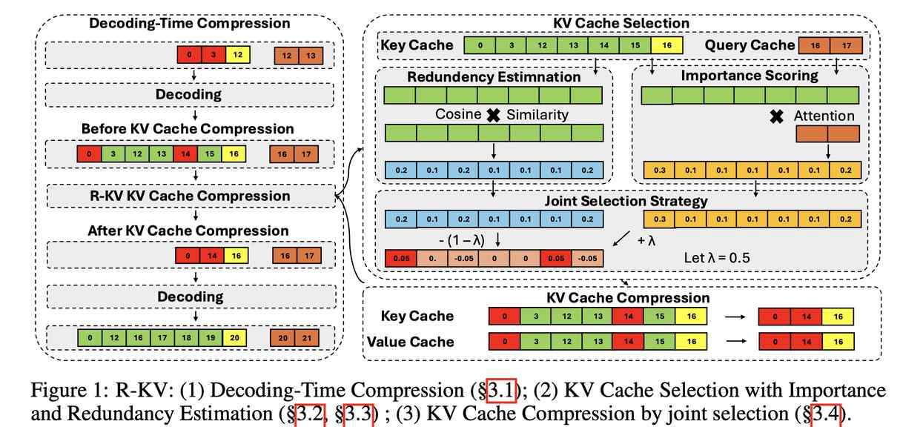

# R-KV: Redundancy-aware KV Cache Compression for Training-Free Reasoning Models Acceleration

> Zefan Cai, Wen Xiao, Hanshi Sun, Cheng Luo, Yikai Zhang, Ke Wan, Yucheng Li, Yeyang Zhou, Li-Wen Chang, Jiuxiang Gu, Zhen Dong, Anima Anandkumar, Abedelkadir Asi, Junjie Hu

---

> **⚠️ 本 note 由 AI Agent 自动生成（Hermes Agent），生成时间：2025年。**
> 所有内容基于论文原文的阅读和理解撰写，仅供参考，请以原文为准。

---

## 一句话总结

R-KV 是一种面向推理模型（如 DeepSeek-R1）的**冗余感知 KV 缓存压缩方法**，通过在解码阶段联合评估 token 的重要性和冗余性，仅需 10% 的 KV 缓存即可保持接近完整的推理性能，同时实现 90% 的内存节省和 6.6 倍的吞吐量提升。

---

## 摘要翻译

推理模型（reasoning models）在自我反思和链式思维推理方面表现出色，但往往会生成过长的输出，导致推理过程中 KV 缓存内存消耗极大。虽然链式思维推理能显著提升复杂推理任务的性能，但在使用现有 KV 缓存压缩方法部署时，可能导致推理失败。为此，我们提出了 **R-KV**（Redundancy-aware KV Cache Compression for Reasoning models），一种专门针对推理模型中冗余 token 的新方法。该方法仅使用 10% 的 KV 缓存即可保留接近 100% 的完整 KV 缓存性能，远超现有 KV 缓存基线方法（后者仅能达到 60% 的性能）。更值得注意的是，R-KV 在使用 16% 的 KV 缓存时，甚至能达到完整 KV 缓存性能的 105%。这种 KV 缓存压缩还带来了 90% 的内存节省和相对于标准链式思维推理推理的 6.6 倍吞吐量提升。实验结果表明，R-KV 在两个数学推理数据集上始终优于现有 KV 缓存压缩基线方法。

---

## 研究动机

### 问题背景
推理模型（如 DeepSeek-R1）在解决复杂问题时，会生成**极长的链式思维（CoT）推理链**。例如，DeepSeek-R1-Distill-Llama-8B 在解决一道数学题时可能生成 32K token，需要 15.5GB 内存加载模型权重，另外 4.1GB 内存存储 KV 缓存。这种长序列推理导致 KV 缓存的内存消耗不可持续。

### 核心观察
1. **冗余性**：推理模型的输出中存在**大量冗余**。超过一半的 token 对任务性能贡献极小，包含不必要的反思、重复的自我验证和冗长的自我对话。在 MATH-500 数据集上，推理模型的生成长度是真实答案的 8-14 倍，1-gram 和 2-gram 的平均频率也远高于真实答案（5-7 倍），说明存在大量重复内容。

2. **现有方法的不足**：现有 KV 缓存压缩方法（如 SnapKV）主要针对长输入（prefill 阶段），未充分考虑长生成输出（decoding 阶段）的压缩。更关键的是，基于注意力权重的方法在推理模型中会失败——**重复内容会产生很高的注意力信号**，因为它们与之前生成的重复文本高度相似。简单地基于注意力权重裁剪 token 会保留冗余内容，同时可能去除关键但分散的推理信息。

### 研究目标
提出一种**冗余感知**的 KV 缓存压缩方法，在解码阶段动态识别并去除冗余 token，同时保留重要的推理上下文，以在内存受限的情况下实现无损推理。

---

## 方法

### 整体框架

R-KV 由三个核心组件组成：
1. **基于注意力权重的重要性评分**（Importance Scoring）
2. **基于语义相似度的冗余估计**（Redundancy Estimation）
3. **联合选择策略**（Joint Selection Strategy）

### 1. 解码时压缩（Decoding-time Compression）

与现有方法（如 SnapKV）主要在 prefill 阶段进行压缩不同，R-KV 专注于 **decoding 阶段**的压缩，这正是推理模型中生成输出显著长于输入 prompt 的独特场景。

**具体流程**：
- 分配两个内存组件：一个大小为 $B_{budget}$ 的缓存用于存储保留的 KV token，一个大小为 $B_{buffer}$ 的缓冲区用于新生成的文本 token
- 总内存需求：$B_{total} = B_{budget} + B_{buffer}$
- 在模型每生成固定长度的文本段后，执行 KV 缓存压缩
- 每段末尾保留最后 $\alpha$ 个 token 作为观察 token（observation tokens）
- 将现有 $B_{budget}$ 个缓存 token 与缓冲区中前 $B_{buffer} - \alpha$ 个 token 拼接，得到 $n = B_{budget} + B_{buffer} - \alpha$ 个候选 KV token
- 对每个候选 token 计算选择分数，选择 top-k（$k = B_{budget} - \alpha$）个 token 留在缓存中

**超参数设置**：$B_{buffer} = 128$，$\alpha = 8$，$\lambda = 0.1$

### 2. 基于注意力权重的重要性评分（Importance Scoring via Attention Weights）

遵循 SnapKV 等方法，利用注意力权重估计 token 的重要性。支持两种注意力机制：

**多头注意力（MHA）**：
- 给定最后 $\alpha$ 个观察 token 的查询 $Q_h \in \mathbb{R}^{\alpha \times d}$ 和 $n$ 个 key 状态 $K_h \in \mathbb{R}^{n \times d}$
- 注意力分数 $A_h = \text{softmax}(Q_h \cdot K_h^\top / \sqrt{d})$

**分组查询注意力（GQA）**：
- 每个 key/value 头被 G 个查询头共享
- 对 G 个查询头的注意力分数进行 max-pooling 操作，然后重新归一化

**稳定性与重要性估计**：
- 使用滑动窗口（大小 2W）的 max-pooling 操作来平滑注意力分数，减少离群值的影响
- 最终得到每个 token 的重要性分数 $I_h^i$

### 3. 基于语义相似度的冗余估计（Redundancy Estimation via Semantic Similarity）

通过测量 key 状态之间的余弦相似度来识别冗余 token：

**余弦相似度计算**：
- 对每个 head h 的 key token $K_h$，先进行 L2 归一化得到 $\hat{K}_h$
- 计算相似度矩阵 $S_h = \hat{K}_h \cdot \hat{K}_h^\top$
- 将对角线置零（防止 token 与自身被标记为冗余）

**强制保留最近的 token**：
- 识别与 token i 高度相似的 token 集合（相似度 > 阈值 T）
- 保留其中最近的 $\beta$ 个 token，将它们在相似度矩阵中的对应值置零
- 这样避免了天真地去除所有冗余 token 导致性能下降

**冗余分数估计**：
- 计算每个 token 的平均相似度 $\bar{S}_h^i = \frac{1}{n} \sum_{j=0}^{n-1} S_h^{j,i}$
- 使用 softmax 归一化得到冗余分数 $R_h^i$

### 4. 联合选择策略（Joint Selection Strategy）

综合重要性分数和冗余分数，最终选择分数为：

$$Z_h^i = \lambda I_h^i - (1-\lambda) R_h^i$$

其中：
- $\lambda$ 控制重要性和冗余性之间的权衡
- $\lambda = 0$：完全由冗余估计决定（效果差）
- $\lambda = 1$：完全由注意力分数决定（效果也差）
- **$\lambda = 0.1$**：最佳平衡点

然后对每个 head 的选择分数取均值（跨 head 聚合），选择 top-$B_{budget}$ 个 token 留在 KV 缓存中。

---

## 实验结果

### 实验设置
- **模型**：DeepSeek-R1-Distill-Llama-8B（R1-Llama-8B）、DeepSeek-R1-Distill-Qwen-14B（R1-Qwen-14B）
- **数据集**：MATH-500、AIME 2024
- **评估方式**：pass@1（每题生成 64 个响应，采样温度 0.6，top-p 0.95）
- **基线**：SnapKV（适配为 decoding 时压缩）、FullKV（完整 KV 缓存）
- **设备**：NVIDIA A100 80G

### 主要结果

#### 准确率对比

| 模型 | 数据集 | KV缓存比例 | R-KV | SnapKV | FullKV |
|------|--------|-----------|------|--------|--------|
| R1-Llama-8B | MATH-500 | 34% | ~82.3% | ~78.4% | 82.38% |
| R1-Llama-8B | AIME-2024 | 10% | ~45.3% | ~15.7% | 49.79% |
| R1-Llama-8B | AIME-2024 | 16% | **105% FullKV** | - | 49.79% |
| R1-Qwen-14B | MATH-500 | 54% | ~92.7% | ~90.9% | 94.58% |
| R1-Qwen-14B | AIME-2024 | 25% | ~42.7% | ~25.0% | 65.68% |

**关键发现**：
- R-KV 在使用 10-34% 的 KV 缓存时即可实现**无损压缩**
- 在 16% KV 缓存预算下，R-KV 甚至达到了完整 KV 缓存性能的 **105%**（R1-Llama-8B 在 AIME-24 上）
- R-KV 比 SnapKV 提升最高 **40%** 的准确率
- 无损压缩的 KV 缓存预算随生成长度增加而增加（如 MATH-500 约 34%，AIME-2024 约 10%）

#### 效率对比

| 配置 | 内存节省 | 批量大小 | 吞吐量 (tok/s) |
|------|---------|---------|----------------|
| FullKV (16K) | - | 30 (max) | 347.03 |
| R-KV (10%, 16K) | 90% | 271 (max) | 2,300.28 |
| R-KV (固定 1024, 16K) | 93.75% | 402 (max) | 3,188.82 |

**关键发现**：
- 在 16K 序列长度下，R-KV（10%）实现 **9 倍** 更大批量大小和 **6.6 倍** 更高吞吐量
- 在固定预算 1024 下，实现 **13.4 倍** 更大批量大小和 **9.2 倍** 更高吞吐量
- 内存节省高达 **90%**（10% 压缩比）或 **93.75%**（固定 1024）

### λ 超参数分析
- $\lambda = 0.1$：最佳平衡点
- $\lambda = 0$（纯冗余）和 $\lambda = 1$（纯注意力）效果最差
- 最优范围：$0.01 \leq \lambda \leq 0.1$

---

## 优势

1. **训练无关（Training-Free）**：无需额外训练或微调，即插即用
2. **模型无关（Model-Agnostic）**：适用于不同架构的推理模型
3. **显著的性能保持**：在仅使用 10% KV 缓存的情况下，保持接近完整的推理性能
4. **卓越的效率提升**：90% 内存节省，6.6-9.2 倍吞吐量提升
5. **超越基线**：在所有实验设置中一致优于 SnapKV
6. **解码时压缩**：专门针对推理模型的长生成输出，填补了现有方法的空白
7. **冗余感知**：通过语义相似度识别冗余 token，弥补了纯注意力方法的不足
8. **可应用于 RL 工作流**：可作为强化学习中 rollout 阶段的优化手段

---

## 局限

1. **与 Paged Attention 的兼容性**：当前方法与某些先进注意力机制（如 paged attention）的兼容性有限，需要进一步研究
2. **与服务框架的集成**：在不提供原生 KV 缓存压缩接口的服务框架中，需要重新分配内存来存储压缩的 KV 缓存，可能引入显著开销
3. **仅在数学推理上验证**：目前仅在数学推理数据集（MATH-500、AIME 2024）上进行验证，未扩展到其他推理任务（如代码生成、逻辑推理等）
4. **模型规模限制**：主要在 7B-14B 规模的模型上验证，更大规模模型的表现有待观察
5. **超参数敏感性**：λ 的选择对性能有显著影响，需要针对不同模型和数据集进行调整
6. **固定的压缩间隔**：每生成固定长度的 token 后才压缩，可能错过最佳压缩时机

---

## 与 EfficientPaper 相关的研究方向

1. **KV 缓存压缩**：R-KV 是 KV 缓存稀疏化（kv_cache_sparse）方向的重要工作，专注于解码阶段的冗余感知压缩，与其他 KV 压缩方法（SnapKV、PyramidKV、H2O、HeadKV 等）形成互补
2. **高效推理（Efficient Reasoning）**：R-KV 与高效推理方向密切相关，特别是针对推理模型的长序列输出问题，与通过 RL 优化或 SFT 减少 CoT 长度的方法不同，R-KV 从 KV 缓存压缩的角度解决同一问题
3. **长上下文推理**：R-KV 的解码时压缩策略可应用于长上下文场景，尤其是推理模型生成极长输出的场景
4. **推理模型优化**：R-KV 为推理模型（如 DeepSeek-R1）的部署提供了实用的内存优化方案，可与 RL 训练流程（如 rollout 阶段）结合使用
5. **自适应压缩**：R-KV 的联合选择策略为自适应 KV 缓存管理提供了新思路，结合注意力重要性和冗余估计，比单一指标更鲁棒
6. **推理效率与准确性的权衡**：R-KV 在保持推理准确性的同时显著提升效率，为推理模型的实用部署提供了新的平衡方案
