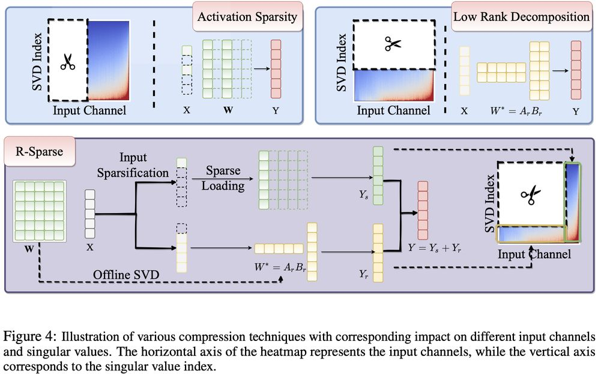

# R-Sparse: Rank-Aware Activation Sparsity for Efficient LLM Inference

> **⚠️ 生成声明：本 note 由 AI Agent 自动生成，基于 arXiv 论文全文阅读与分析。生成时间：2025年6月。**

---

## 一句话总结

R-Sparse 是一种免训练的激活稀疏化方法，通过联合利用输入通道的稀疏性和权重矩阵奇异值分量的低秩性，在 LLM 推理中实现 50% 模型级稀疏度，同时保持与完整模型相当的性能，并带来 43% 的端到端加速。

---

## 摘要翻译

大语言模型（LLMs）虽然在各种应用中展现了卓越的能力，但由于其庞大的模型规模，在推理过程中面临显著挑战，尤其是在边缘设备上部署时。激活稀疏性提供了一种有前景的解决方案，可以减少计算和内存访问，从而实现更高效的推理，特别适用于小批量的设备端应用。然而，当前方法在非 ReLU 激活函数（大多数先进 LLM 所采用）方面存在局限，或者需要大量持续训练。此外，预测活跃通道的困难和可实现的稀疏比有限，制约了基于激活稀疏的方法的有效性。本文介绍了 R-Sparse，一种免训练的激活稀疏方法，能够在高级 LLM 中实现高稀疏水平。我们对单个线性层内不同组件对输出的贡献进行了两项初步调查，发现了两个关键观察结果：（i）输入函数的非稀疏分量可以被视为少量偏差项；（ii）完整的计算可以通过输入通道和权重奇异值的适当组合来有效近似。基于此，我们用一种秩感知的稀疏推理方法替换 LLM 中的线性层，该方法利用输入通道和奇异值分量的稀疏性，消除了基于输出稀疏方法中活跃通道预测的需要。在 Llama-2/3 和 Mistral 模型上的十个多样化任务的实验表明，R-Sparse 在 50% 模型级稀疏度下实现了可比的性能，通过定制内核实现 43% 的端到端效率提升。

---

## 研究动机

### LLM 推理的效率瓶颈

LLM 的推理过程通常受内存带宽限制（memory-bound），特别是在解码阶段，需要频繁将权重参数从 HBM 加载到 SRAM，导致显著的延迟和内存开销。对于边缘设备部署，这一问题尤为严重。

### 现有方法的三大局限

1. **非 ReLU 激活函数的可行性问题**：大多数先进 LLM 使用 SiLU 或 GELU 等非 ReLU 激活函数，直接应用 ReLU 稀疏化会损害模型功能。现有方法要么需要大量持续预训练（如 150B tokens，64 A100 GPU 上约一个月），要么只能实现有限的稀疏比。

2. **活跃通道预测困难**：基于输出稀疏的方法需要提前预测活跃通道，预测准确性直接影响效果，策略包括利用语义相似 token 的激活相似性、门控投影后的激活、或可学习的预测器。

3. **稀疏比受限**：不依赖大量重训练的方法（如 CATS、GRIFFIN）在 MLP 块中只能达到 50% 稀疏度，模型级稀疏度仅约 1/3，更高稀疏水平仍具挑战。

### 核心研究问题

非稀疏部分的激活是否真正必要？能否用轻量级策略在不进行大量预训练的情况下缓解非稀疏部分？R-Sparse 正是针对这些问题提出的解决方案。

---

## 方法（技术细节）

### 3.1 基本观察

#### 观察一：非稀疏分量可视为偏差项

作者使用软多阶段 ReLU 函数 $\sigma_T(\cdot)$ 来逼近非 ReLU 激活函数。关键发现是：**仅将 l 从 1 增加到 2，性能就能显著恢复，即使在 90% 的稀疏比下也是如此**。

具体地，将非稀疏通道的激活按阈值分组后，每个分组对应一个数据依赖的偏差项 $B_j$，使得非稀疏分量可以用少量偏差项近似。这意味着非稀疏部分具有**低秩结构**。

#### 观察二：秩感知激活稀疏性

对权重矩阵 W 进行奇异值分解（SVD），得到 $W = U\Sigma V^T = \sum_{i=1}^{n} \sigma_i U[:,i]V^T[:,i]$。输出 Y 可表示为：
$$Y = \sum_{i=1}^{n} \sum_{j=1}^{m} \sigma_i X_j V[j,i] U^T[:,i]$$

其中 $S_{i,j} := \sigma_i X_j V[j,i]$ 衡量第 j 个输入通道和第 i 个 SVD 分量对输出的贡献。

**关键发现**：在 Llama-2-7B 的实验中，主要贡献集中在**右下角**（即大奇异值分量和特定输入通道的组合），且几乎所有层都表现出显著的稀疏性质。不同层的稀疏特征各异：
- o.proj 层比 q.proj 和 k.proj 层更依赖小奇异值分量
- 中间层表现出更高的稀疏度
- 首层和末层更难以稀疏化

### 3.2 R-Sparse 推理框架

R-Sparse 将线性层 $Y = XW^T$ 的计算分解为两个部分：
$$Y = Y_s + Y_r$$

其中：
- **稀疏部分**：$Y_s = \sigma_{t(s)}(X)W^T$，通过阈值 $t(s)$ 确定稀疏分量
- **低秩部分**：$Y_r = (X - \sigma_{t(s)}(X))(A_r B_r)^T$，使用权重的低秩近似

#### 输入激活稀疏化

给定预定义的稀疏预算 s，阈值 $t(s)$ 估计为 X 的第 s 百分位数。稀疏化函数定义为：
$$\sigma_{t(s)}(X)_j = \begin{cases} X_j & \text{if } |X_j| \geq t(s) \\ 0 & \text{if } |X_j| < t(s) \end{cases}$$

#### 低秩近似

对预训练权重 W 进行 SVD 分解，选择最重要的 r 个分量：
- $A_r = U_r \Sigma_r^{1/2}$
- $B_r = \Sigma_r^{1/2} V_r^T$

该低秩近似可通过离线 SVD 操作完成，不会影响推理时延。

#### 关键设计优势

- **面向输入侧**：与之前的输出激活稀疏方法不同，R-Sparse 利用输入通道的稀疏性，不需要预测活跃通道
- **适用于所有线性层**：不仅限于 MLP 块，还包括 Attention 模块
- **内存 I/O 开销**：由两个超参数 (r, s) 决定，相对于完整线性层的开销为 $r \cdot \frac{m+n}{mn} + s$

#### 列主序存储

权重以列主序格式存储，以提高内存带宽利用率（GPU 每次访问获取连续内存条目）。

### 3.3 进化搜索算法

不同层的稀疏-低秩特征各异，因此使用**进化策略**搜索每层的最优稀疏比例 $\rho_i$。

- 定义 $\rho_i$ 为第 i 层稀疏部分的相对比例
- 稀疏预算 $s_i = \rho_i C_i$，秩 $r_i = (1-\rho_i)C_i \cdot \frac{mn}{m+n}$
- 优化目标：$\rho^* = \arg\min_\rho L(f, \rho)$，其中 L 是 C4 训练集中 16 个随机样本的平均困惑度
- 群体大小 32，变异率 $p_m = 0.5$，交叉率 $p_c = 0.5$，总代数 5
- 采用分组策略（组大小 28），加速收敛
- **搜索开销极低**：在单个 A6000 GPU 上约 1 小时（Llama-2-7B）

---

## 实验结果

### 实验设置

- **模型**：Llama-2-7B、Llama-3-8B、Mistral-7B
- **任务**：8 个常识推理任务（WG、PIQA、SciQ、OBQA、HellaSwag、BoolQ、ARC-E、ARC-C）、文本摘要（XSUM）、语言建模（WikiText-2）
- **基线方法**：
  - ReLUfication：直接替换 ReLU，不重训练
  - CATS：基于门控投影输出激活的大小进行稀疏化
  - GRIFFIN：基于预填充阶段统计信息稀疏化所有 MLP 层
- **稀疏度**：报告模型级稀疏度
- **精度**：FP32，Hugging Face 库
- **硬件**：单张 NVIDIA A6000 GPU

### 主要结果

| 方法 | 模型级稀疏度 | Llama-2-7B 平均准确率 | Llama-3-8B 平均准确率 | Mistral-7B 平均准确率 |
|------|------------|---------------------|---------------------|---------------------|
| 完整模型 | 0% | 65.88 | 69.44 | 69.89 |
| CATS | 22% | 64.32 | 66.42 | 68.51 |
| CATS | 40% | 46.26 | 35.91 | 37.58 |
| GRIFFIN | 33% | 55.68 | 56.04 | 59.78 |
| GRIFFIN | 50% | 45.91 | 45.11 | 48.07 |
| **R-Sparse** | **40%** | **65.00** | **68.37** | **68.40** |
| **R-Sparse** | **50%** | **64.06** | **66.20** | **68.39** |

#### 关键发现

1. **R-Sparse 在所有方法中表现最优**：在相同模型级稀疏预算下，R-Sparse 比 CATS 平均提升 18.74%，比 GRIFFIN 提升 18.15%（Llama-2-7B）。

2. **性能接近完整模型**：在约 50% 模型级稀疏度下，R-Sparse 性能与完整模型相当，部分任务（如 SciQ）在 70% 稀疏度下仍能达到匹配性能。

3. **部分任务在适度稀疏下性能略有提升**：例如 30% 稀疏度下 OpenBookQA 提升 1.60%。

### 效率提升

- 使用定制 Triton 内核，R-Sparse 在 Llama-2-7B 上实现 **42% 生成速度提升**
- 在 Llama-3-8B 上实现 **40% 生成速度提升**
- 基于 FP32 精度，Hugging Face 库，单张 A6000 GPU

### 与权重量化兼容

| 方法 | WG | PIQA | SciQ | OBQA | 平均 |
|------|-----|------|------|------|------|
| FP16 完整模型 | 69.14 | 78.07 | 93.80 | 31.40 | 68.10 |
| INT4 | 68.19 | 77.48 | 93.80 | 29.80 | 67.32 |
| R-Sparse 40% | 68.03 | 77.31 | 93.90 | 30.80 | 67.51 |
| R-Sparse 50% | 67.40 | 77.31 | 93.90 | 31.40 | 67.50 |
| INT4 + R-Sparse 40% | 66.93 | 76.71 | 92.80 | 29.20 | 66.41 |
| INT4 + R-Sparse 50% | 66.38 | 75.95 | 92.10 | 28.60 | 65.76 |

R-Sparse 与 INT4 量化结合后性能损失较小，表明两种技术可以叠加使用。

### 消融实验

1. **稀疏 vs 低秩基线**：R-Sparse（结合稀疏和低秩）优于纯稀疏（平均提升 0.98%）和纯低秩方法（性能大幅下降）。

2. **自适应稀疏方案 vs 统一方案**：进化搜索的自适应方案在 40%-70% 稀疏比范围内平均提升约 1.13%-1.95%，在高稀疏比时优势更明显（70% 稀疏度下提升 2.60%）。

### 鲁棒性验证

- 跨不同数据集（C4、RedPajama 的 GitHub、ArXiv、StackExchange、Wikipedia）和不同样本数量（1 到 1024）的重要性模式保持一致
- 证明了 R-Sparse 方法的泛化能力

---

## 优势

1. **免训练（Training-free）**：无需额外的预训练或持续训练，直接应用于预训练模型，节省大量计算资源（对比 ReLUfication 需要 150B tokens）。

2. **适用于非 ReLU 激活函数**：可直接应用于使用 SiLU、GELU 等激活函数的现代 LLM，无需替换激活函数。

3. **无需活跃通道预测**：基于输入激活稀疏性而非输出，消除了预测活跃通道的困难。

4. **覆盖所有线性层**：不仅适用于 MLP 块，还可应用于 Attention 块（Q/K/V/O 投影），实现更高稀疏比。

5. **高稀疏度下的优异性能**：50% 模型级稀疏度下性能接近完整模型，部分任务甚至在 70% 稀疏度下仍表现良好。

6. **与量化兼容**：可与 INT4 权重量化叠加使用，进一步提升效率。

7. **低搜索开销**：进化搜索算法仅需约 1 小时（单张 A6000 GPU），即可找到最优的逐层稀疏-低秩配比。

8. **显著的端到端加速**：通过定制 Triton 内核实现 42-43% 的生成速度提升。

9. **数据无关性**：重要性模式在不同数据集和样本数下保持稳定，具有良好的泛化能力。

---

## 局限

1. **依赖 SVD 分解**：需要对每个线性层的权重矩阵进行 SVD 分解以获得低秩近似，增加预处理开销（虽然可离线完成）。

2. **内存开销计算复杂度**：内存 I/O 开销由两个超参数 (r, s) 决定，$r \cdot \frac{m+n}{mn} + s$，需要针对不同模型和稀疏比进行调优。

3. **自适应搜索仍需一定计算**：虽然搜索开销较低（约 1 小时），但对于大规模模型或多层优化仍需一定计算资源。

4. **仅在解码阶段应用**：论文主要关注解码阶段的稀疏化，预填充阶段的优化未详细讨论。

5. **定制内核依赖**：为了实现显著的加速效果，需要定制的 Triton 内核，通用硬件支持可能受限。

6. **仅验证了 7B 级模型**：实验主要在 Llama-2-7B、Llama-3-8B 和 Mistral-7B 上进行，更大规模模型（如 70B）的效果尚未验证。

7. **自适应方案的泛化性**：虽然在不同数据集上表现稳定，但自适应方案的最优配比是否能迁移到其他模型架构还需进一步验证。

8. **与 KV Cache 压缩的结合**：论文提到 KV Cache 压缩与权重减少是正交的，可以结合使用，但未提供具体实验结果。

---

## 与 EfficientPaper 相关的研究方向

### 相关技术方向

1. **激活稀疏性（Activation Sparsity）**：
   - CATS（Lee et al., 2024）：基于门控投影输出的上下文感知阈值稀疏化
   - GRIFFIN（Dong et al., 2024）：基于预填充阶段统计信息的通道稀疏化
   - Deja Vu（Liu et al., 2023）：上下文稀疏性用于高效 LLM 推理
   - ProSparse（Song et al., 2024）：增强 LLM 内在激活稀疏性
   - TurboSparse（Song et al., 2024）：最少激活参数下的 SOTA 性能

2. **低秩分解与压缩**：
   - GaLore（Jaiswal et al., 2024）：低秩梯度中的非均匀低秩权重
   - 低秩权重近似（q.proj 和 k.proj 层可更易通过低秩逼近压缩）

3. **权重量化**：
   - GPTQ（Frantar et al., 2022）：精确的训练后量化
   - AWQ（Lin et al., 2024）：激活感知权重量化
   - SmoothQuant（Xiao et al., 2023）：准确高效的训练后量化
   - KIVI（Liu et al., 2024）：免调优的 KV Cache 2-bit 量化

4. **结构化剪枝**：
   - LLM-Pruner（Ma et al., 2023）：LLM 的结构化剪枝
   - Owl（Yin et al., 2023）：异常值加权的逐层稀疏性

5. **高效架构与系统优化**：
   - FlashAttention（Dao et al., 2022）：快速内存高效精确注意力
   - PagedAttention（Kwon et al., 2023）：高效的 KV Cache 管理
   - Mamba（Gu & Dao, 2023）：线性时间序列建模
   - LLM in a Flash（Alizadeh et al., 2023）：受限内存下的高效 LLM 推理

6. **模型蒸馏**：
   - MiniTron（Sreenivas et al., 2024）：LLM 剪枝与蒸馏的实践
   - Transformers to SSMs（Bick et al., 2024）：从二次方知识蒸馏到亚二次方模型

### EfficientPaper 关键词关联

- **sparse_pruning**：R-Sparse 直接属于激活稀疏/剪枝范畴
- **activation_sparsity**：核心贡献是输入激活稀疏性，而非输出激活稀疏性

### 研究趋势

R-Sparse 代表了 LLM 推理优化中**免训练激活稀疏化**的重要进展，其将稀疏性和低秩分解相结合的思路为后续研究提供了新的范式。特别是：

1. **输入侧 vs 输出侧稀疏性**：R-Sparse 的输入侧方法避免了活跃通道预测的困难，是一个值得关注的新方向。
2. **稀疏 + 低秩的混合压缩**：不同层的最优策略不同，这种自适应混合方案是实现高效推理的关键。
3. **与量化技术的协同**：R-Sparse 与 INT4 量化兼容，表明稀疏性和量化可以叠加使用，未来有望实现更极致的压缩。
4. **从 MLP 扩展到 Attention**：R-Sparse 扩展到所有线性层，这为更全面的模型压缩奠定了基础。
5. **边缘部署的前景**：43% 的生成速度提升对于边缘设备部署具有重要意义，这与 LLM 推理的实时性和能效需求高度契合。
