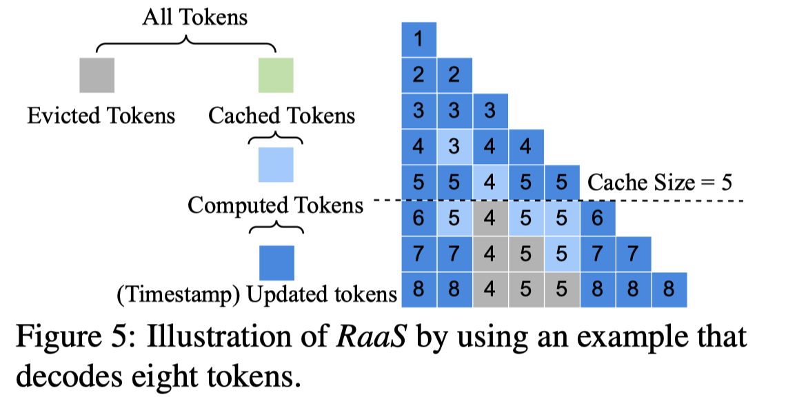

# Efficient Long-Decoding Inference with Reasoning-Aware Attention Sparsity

> **本文由 AI Agent 自动生成，基于论文全文阅读，仅供学习参考。生成时间：2025年6月**

---

## 一句话总结

RaaS 首次识别出推理任务解码阶段的"瀑布式"注意力模式（milestone tokens），通过时间戳机制动态追踪里程碑 token 的重要性，在保留所有 prefill token 的前提下，以 O(L) 时间和 O(L) 内存复杂度实现与 Quest 相当的精度，突破了 KV cache 稀疏算法在精度-时间-内存上的"不可能三角"。

---

## 摘要翻译

大语言模型（LLM）在各个领域展现出强大能力，尤其在数学推理和编程等具有挑战性的推理任务上取得了进展。然而，解决推理任务通常需要长解码链（思维链），产生 O(N) 的时间和内存消耗，其中 N 是链的长度。为缓解 O(N) 的时间和内存消耗，现有的基于稀疏的算法提出仅保留最关键 token 的中间数据（即 key-value cache），丢弃其余部分。然而，这些现有算法难以在精度、时间和内存之间取得平衡（"不可能三角"）。例如，最先进的算法 Quest 实现了高精度和 O(L) 时间复杂度，但内存复杂度为 O(N)（L 为缓存预算，L ≪ N）。为解决这一问题，本文识别了推理任务解码阶段的新注意力模式：里程碑 token（类似于数学证明中的引理）出现、被使用，然后变得不再重要。基于此模式，本文提出了名为 RaaS 的新算法，仅在 milestone token 不再需要之前对其进行识别和保留，以高精度实现 O(L) 时间和 O(L) 内存复杂度。

---

## 研究动机

### 1. 长推理链的计算瓶颈

LLM 在推理任务（如 OpenAI o1、DeepSeek R1）中需要生成极长的思维链，decode 阶段占总推理时间的 99%。标准密集注意力的 O(N) 时间和内存复杂度导致严重瓶颈。以 LLaMA 3.1 8B 处理 128k tokens 为例，单个请求的 KV cache 可达 16GB，处理时间数千秒。

### 2. "不可能三角"的困境

现有稀疏算法（StreamingLLM、H2O、Quest）无法同时兼顾精度、时间和内存：

| 方法 | 时间复杂度 | 内存复杂度 | 精度 |
|------|----------|----------|------|
| Dense | O(N) | O(N) | 高 |
| StreamingLLM | O(L) | O(L) | 低 |
| H2O | O(L)* | O(L)* | 低-高（不稳定） |
| Quest | O(L) | O(N) | 高 |

其中 L ≪ N。StreamingLLM 仅保留初始和近期 token，丢弃关键的中间推理 token；H2O 过度依赖累积历史注意力分数，导致保留过时 token；Quest 保守地保留全部 KV cache 以避免丢失 token，导致 O(N) 内存。

### 3. 推理任务的独特注意力模式

与长 prefill 场景（如 RAG）不同，推理任务具有"短 prefill + 长 decode"的特征。decode 阶段存在一种新的"瀑布式"注意力模式，现有算法未利用此模式，导致效率与精度无法兼得。

---

## 方法（技术细节）

### 1. 瀑布式注意力模式（Waterfall Attention Pattern）

通过对 Qwen2.5-Math-7B 在 MATH500 数据集上 100 个样本的注意力图进行人工检查（覆盖 28 层 × 28 头），论文发现了两种关键 token 模式：

**（1）里程碑 token（Milestone Tokens）**
- 占比约 20%-25% 的注意力图
- 类似于数学证明中的"引理"：出现后被频繁引用，然后逐渐淡出
- 在注意力图上表现为亮度逐渐减弱的"水柱"
- 原因：推理过程中，新生成的子结论（新引理）替代了旧的引理，后续 token 依赖新引理而非旧的
- 示例：在"将点 (0,3) 从直角坐标转为极坐标"的任务中，初始引理 ①②③ 先被引用，随后被新引理 ④⑤ 替代，最终答案 ⑥ 仅依赖 ④⑤

**（2）凤凰 token（Phoenix Tokens）**
- 占比约 1%-2% 的注意力图
- 在长时间内被忽略（可能超过 128 个 decode 步骤），但后来重新变得重要
- 通常出现在短 prefill prompt 中（如用户问题）
- Quest 为避免丢失凤凰 token 而保留全部 KV cache，导致 O(N) 内存

### 2. RaaS 算法设计

RaaS 由两个核心思想组成：

**（1）基于时间戳的里程碑 token 追踪**
- 为每个 KV page 维护一个时间戳（单调递增属性）
- 当一个 token 的注意力分数超过阈值 α（如 α = 0.01）时，赋予其最新时间戳
- 里程碑 token 在被需要时总是获得最新时间戳，直到变得不再重要
- 当缓存满时，驱逐时间戳最旧的 token/page

**（2）保留所有 prefill token 不驱逐**
- prefill token 通常较短，凤凰 token 几乎总是出现在 prefill tokens 中
- 保留这些 token 确保关键信息不丢失

**α 的选择**：α 影响时间戳分布。α 太小会导致太多 token 获得最新时间戳，无法有效区分里程碑 token；α 太大则大部分 token 被视为无关。论文采用自适应策略：每步为注意力分数最高的 50% token 分配最新时间戳，此时 α ≈ 0.0001。

### 3. 页级 RaaS（Page-Based RaaS）

实际实现中，token 级管理存在两个挑战：
1. token 级内存管理效率低（小间隙导致 GPU 计算困难）
2. 需要所有 token 的注意力分数来更新时间戳，但与 FlashAttention 等高效注意力内核不兼容

**解决方案**：
- **固定页大小**：page_size = 16，时间戳管理和缓存淘汰以页为单位（与 vLLM 等推理引擎一致）
- **代表性注意力分数**：在使用优化注意力内核之前，添加轻量级步骤，为每个页选取代表性 key，query 与代表性 key 计算每页单一注意力分数（采用 Quest 的代表性选择方法）
- 基于此分数更新每页时间戳，以页为单位进行淘汰决策
- 代表性 key 选择和估计注意力分数计算与自注意力计算交错进行
- 时间戳更新和 KV page 驱逐在每次自回归迭代后批量处理，时间开销可忽略

### 4. 实现细节

- 基于 Hugging Face 和 Quest 实现，约 2000 行 Python 代码
- 从 Quest 的公开仓库移植
- 实现扩展了标准 Transformer 架构（Dense），增加代表性 key 选择、时间戳管理和页级驱逐

---

## 实验结果

### 实验设置

- **硬件**：单块 NVIDIA A100-80GB GPU，128 核 Intel Xeon Platinum 8358P CPU，1TB DRAM，Ubuntu 20.04，CUDA 12.6
- **数据集**：GSM8k、MATH500、AIME（各取前 200 题）
- **模型**：Marco o1、Qwen2.5-Math-7B、Mistral-Math-7B、DeepScaleR-1.5B
- **基线**：Dense、StreamingLLM、H2O、Quest
- **指标**：Job Completion Time (JCT)、Accuracy
- **参数**：α = 0.0001，page_size = 16

### 准确度 vs 缓存预算

- H2O 和 StreamingLLM 在固定缓存预算下精度较差
- Quest 和 RaaS 达到最佳精度，当缓存预算为 1024 tokens 时，基本匹配 Dense 的精度
- RaaS 在缓存预算较小时表现不佳（因 prefill tokens 占用大部分预算，decode tokens 被丢弃），此时建议用 Quest 处理 prefill、RaaS 处理 decode

### 延迟与内存消耗

- **延迟**：Dense 延迟随 decode tokens 增加二次增长，RaaS 和 Quest 线性增长（O(N²) vs O(NL)）
- **内存**：Dense 和 Quest 随 decode tokens 线性增长，RaaS 初始线性增长后趋于平稳（O(N) vs O(L)）
- 综合来看，RaaS 实现了常量内存消耗，同时保持与 Quest 相当的精度和时间性能

### 微基准测试

- **丢弃里程碑 token 的影响**：H2O-128 和 Sink-128 导致解码长度增加，模型丢失推理线索，陷入无限重复尝试
- **α 的影响**：α = 0.0001 通常最优，α 太小或太大均会降低精度

---

## 优势

1. **突破"不可能三角"**：首次在推理任务中实现高精度、O(L) 时间和 O(L) 内存的三者兼顾，解决了现有稀疏算法无法同时优化精度、时间和内存的根本问题。
2. **发现新的注意力模式**：揭示了推理任务中"瀑布式"注意力模式（milestone tokens）和"凤凰"token 模式，为理解推理任务的注意力动态提供了新视角。
3. **简单有效的算法设计**：仅需时间戳机制和 prefill token 保留策略，算法设计简洁，易于理解和实现。
4. **常量内存消耗**：与 Quest 的 O(N) 内存相比，RaaS 实现 O(L) 内存，显著提升推理引擎的吞吐量潜力。
5. **兼容高效注意力内核**：通过页级管理和代表性 key 选择，与 FlashAttention 等优化内核兼容，避免 H2O 中因绕过高效内核导致的性能退化。
6. **适用于推理密集型场景**：针对长推理链（如数学推理）优化，契合 OpenAI o1/o3、DeepSeek R1 等推理模型的推理范式。

---

## 局限

1. **适用场景有限**：RaaS 专为传统推理任务（短问题 + 长推理链）设计，对 prefill token 较多的场景（如 RAG）可能不适用，需与 Quest 结合使用（Quest 处理 prefill，RaaS 处理 decode）。
2. **评估模型有限**：仅在 4 个模型上进行评估（Marco o1、Qwen2.5-Math-7B、Mistral-Math-7B、DeepScaleR-1.5B），未在更大规模模型（如 DeepSeek-R1、Qwen2.5-Max）上验证。
3. **推理长度限制**：受计算资源限制，未进行极长推理长度（>8k）的端到端评估，尽管小规模实验表明瀑布模式具有普适性。
4. **代表性选择算法未优化**：为与 Quest 公平对比，采用了 Quest 相同的代表性 key 选择方法，未针对 RaaS 的目标设计更优的代表性选择策略。
5. **开源代码未公开**：论文提到实现了约 2000 行 Python 代码，但未公开代码仓库链接。
6. **α 参数选择的探索不足**：虽然提出了自适应策略（取最高 50% token），但未深入探索最优 α/r 及其理论依据。
7. **评估仅覆盖数学推理**：仅在数学推理数据集上进行评估，未验证在其他推理任务（如编程推理、逻辑推理）上的效果。

---

## 与 EfficientPaper 相关的研究方向

1. **KV cache 稀疏与压缩**：RaaS 与 H2O、StreamingLLM、Quest、ArkVale、SnapKV、ScissorHands 等 KV cache 稀疏/压缩方法直接相关，属于 KV cache 稀疏算法的最新进展，实现了真正的 O(L) 时间和内存复杂度。
2. **推理任务的高效推理**：RaaS 专注于推理任务的长 decode 阶段优化，与 OpenAI o1/o3、DeepSeek R1 等推理模型的高效部署密切相关，可应用于 OpenR 等推理框架。
3. **注意力模式分析**：论文揭示的"瀑布式"注意力模式为理解 LLM 推理过程中的 token 依赖关系提供了新视角，与注意力机制的可解释性研究相关。
4. **页级 KV cache 管理**：RaaS 采用页级缓存管理（page_size=16），与 vLLM、PagedAttention、SGLang 等推理引擎的内存管理方式兼容，可直接集成到现有系统中。
5. **长 prefill 与长 decode 的分离优化**：论文建议对 prefill tokens 使用 Quest，对 decode tokens 使用 RaaS，体现了推理任务中 prefill 和 decode 阶段的差异性优化思路，与 DistServe 等 prefill/decode 分离架构相关。
6. **KV cache 量化与稀疏的结合**：RaaS 专注于稀疏策略，未来可与 KV cache 量化（如 KIVI、SmoothQuant、ZeroQuant）结合，进一步压缩内存占用。
7. **FlashAttention 兼容性**：RaaS 通过代表性 key 选择与高效注意力内核兼容，与 FlashAttention、Minference 等注意力加速方法互补。
