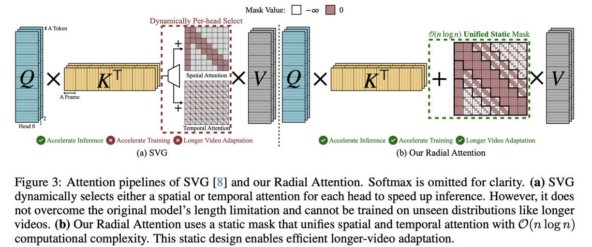

# Radial Attention: $O(n\log n)$ Sparse Attention with Energy Decay for Long Video Generation

> Xingyang Li, Muyang Li, Tianle Cai, Haocheng Xi, Shuo Yang, Yujun Lin, Lvmin Zhang, Songlin Yang, Jinbo Hu, Kelly Peng, Maneesh Agrawala, Ion Stoica, Kurt Keutzer, Song Han
> 
> 🏫 MIT, NVIDIA, Princeton, UC Berkeley, Stanford, First Intelligence
> 📅 2025
> 🔗 [arXiv:2506.19852](http://arxiv.org/abs/2506.19852v1)
> 💻 [GitHub](https://github.com/mit-han-lab/radial-attention)
> 🏷️ `sparse_pruning`, `attention_sparsity`

---

## 一句话总结

Radial Attention 是一种基于时空能量衰减（Spatiotemporal Energy Decay）现象设计的 $O(n\log n)$ 稀疏注意力机制，通过静态注意力掩码将注意力分数的指数衰减转化为计算密度的指数衰减，在视频扩散模型中实现显著加速（推理最高 3.7×，训练最高 4.4×），同时保持视频质量，支持 4 倍长度扩展。

---

## 摘要翻译

近年来，扩散模型在高质量视频生成方面取得了显著进展，但额外的时间维度显著增加了计算成本，使得长视频的训练和推理代价极为昂贵。本文发现了一个现象——**时空能量衰减（Spatiotemporal Energy Decay）**：在视频扩散模型中，后 softmax 注意力分数随 token 之间空间和时间距离的增加而衰减，类似于自然界中信号或波在空间和时间上的物理衰减。基于此，我们提出了 **Radial Attention**，一种具有 $O(n\log n)$ 复杂度的可扩展稀疏注意力机制，将能量衰减转化为指数级递减的计算密度，比标准 $O(n^2)$ 密集注意力更高效，比线性注意力更具表达力。具体而言，Radial Attention 采用简单的静态注意力掩码，每个 token 关注空间上邻近的 token，注意力窗口大小随时间距离缩小。此外，它允许预训练的视频扩散模型通过高效的 LoRA 微调扩展生成长度。大量实验表明，Radial Attention 在 Wan2.1-14B、HunyuanVideo 和 Mochi 1 上保持了视频质量，实现了最高 1.9× 的加速。通过最少的调优，它可以生成最长 4× 的视频，同时将训练成本降低高达 4.4×，推理加速高达 3.7×。

---

## 研究动机

1. **视频生成的计算瓶颈**：视频扩散模型需要处理额外的时间维度，导致 token 数量大幅增加。例如，HunyuanVideo 生成 5 秒 720p 视频需要约 115K token，自注意力的 $O(n^2)$ 复杂度使其在长视频场景下难以承受。

2. **现有方法的不足**：
   - **Sparse VideoGen (SVG)**：动态分类注意力头为空间或时间类型，但在训练中可能误分类，且无法处理长视频的未见分布。
   - **线性注意力**：需要大量架构修改，且难以捕捉局部细节，导致质量下降。
   - **滑动窗口注意力 (STA)**：固定感受野限制了长距离依赖。
   - **PowerAttention (PA)**：虽然实现了 $O(n\log n)$ 复杂度，但忽略了视频数据的时空结构。
   - **RIFLEx**：无训练扩展方法在 2× 以上长度时质量退化严重。

3. **核心发现——时空能量衰减**：作者观察到在 HunyuanVideo 等视频扩散模型中，后 softmax 注意力分数随空间和时间距离的增加呈指数衰减。这类似于物理中信号在空间和时间上传播时的能量衰减。回归分析表明，衰减符合指数分布（$R^2 > 0.985$）。

4. **设计目标**：利用这种衰减特性，设计一种静态稀疏注意力模式，同时实现 $O(n\log n)$ 复杂度、支持训练和推理加速、允许 LoRA 微调扩展视频长度。

---

## 方法

### 4.1 时空能量衰减（Spatiotemporal Energy Decay）

对 HunyuanVideo 的注意力图分析发现，空间注意力（同一帧内或相邻帧的 token 间注意力）具有高时间衰减、低空间衰减；时间注意力（同一空间位置跨帧的注意力）则相反。

形式化定义：对于位于第 $i_0$ 帧第 $k_0$ 个空间位置的 query token，其后 softmax 注意力分数 $p$ 满足：

$$p_{js+l} \leq C_{rel} e^{-\alpha|j-i_0| - \beta|l-k_0|} p_{i_0s+k_0}$$

其中 $\alpha$ 控制时间衰减率，$\beta$ 控制空间衰减率。

### 4.2 Radial Attention 设计

**核心思想**：将能量衰减转化为计算密度衰减，通过静态注意力掩码实现。

**时间维度的密度衰减**：
- 帧 $i$ 和帧 $j$ 之间的计算密度为 $(\frac{1}{2})^{\lfloor \log_2(\max(|i-j|, 1)) \rfloor}$
- 注意力图被划分为 $2^{\lceil\log_2(\max(f, 2))\rceil - 1}$ 条对角带
- 中心带（band 0）保留 100% 计算密度
- 每条向外的带的宽度翻倍，但计算密度减半
- 形成"径向衰减"效果

**空间维度的密度衰减**：
- 帧 $i$ 到帧 $j$ 的注意力对角线宽度为 $\lfloor \frac{s}{2^{\lfloor\log_2(\max(|i-j|, 1))\rfloor}} \rfloor$
- 当对角线宽度低于 1 时，降低对角线频率（只保留满足 $|i-j| \mod \lceil 2^{\lfloor\log_2(\max(|i-j|, 1))\rfloor} / s \rceil = 0$ 的帧）
- 保持相同的摊销注意力密度衰减

**形式化掩码定义**：4D 掩码 $\tilde{M} \in \{-\infty, 0\}^{f \times f \times s \times s}$：

$$\tilde{M}_{i,j,k,l} = \begin{cases} 0, & \text{if } 2^{\lfloor\log_2(\max(|i-j|, 1))\rfloor} \leq s \text{ and } |k-l|+1 \leq \frac{s}{2^{\lfloor\log_2(\max(|i-j|, 1))\rfloor}} \\ 0, & \text{if } |i-j| \mod \lceil 2^{\lfloor\log_2(\max(|i-j|, 1))\rfloor} / s \rceil = 0 \text{ and } k = l \\ -\infty, & \text{otherwise} \end{cases}$$

**注意力 Sink**：确保每个 token 都关注第一帧的所有 token。

**与 SVG 的关系**：Radial Attention 用单个注意力掩码统一了 SVG 中的空间和时间注意力。中心带涵盖了 SVG 的空间注意力，外侧带则根据时间衰减优化了 SVG 的时间注意力。

### 4.3 复杂度分析

掩码中零元素的上界为：
$$\#\text{zeros in } \tilde{M} \leq 4s^2f \cdot \lfloor\log_2 f\rfloor \leq 4sn(\log_2 n - \log_2 s)$$

对于长视频（大 $f$）且固定空间分辨率 $s$，复杂度为 $O(n\log n)$。

### 4.4 误差分析

$$\|\tilde{p} - p\|_1 \leq C_{rel} \left[ \frac{8e^{-\beta}(s/2+1)}{(1-e^{-\alpha})(1-e^{-\beta})} + \frac{4(1+e^{-\beta})}{1-e^{-\beta}} \frac{e^{-\alpha}(s+1)}{1-e^{-\alpha}} \right] = O(C_{rel} e^{-\min(\beta/2, \alpha)s})$$

误差随衰减率 $\alpha$ 和 $\beta$ 指数递减。

### 4.5 低秩自适应（LoRA）扩展长视频

- 由于 Radial Attention 仅剪枝不重要的 token 关系，不修改 softmax 注意力机制，因此原始预训练权重可保持大部分不变。
- 在注意力层的 query、key、value、output 投影中应用 LoRA，显著降低内存和计算成本。
- 实验表明，LoRA 微调与 Radial Attention 结合不仅降低开销，还能通过聚焦关键权重改善视频质量。
- 长度扩展 LoRA 与现有风格 LoRA 兼容。

### 硬件实现

- 采用 128×128 的块大小进行块稀疏注意力计算
- 训练使用 Block-Sparse Attention
- 推理使用 FlashInfer 和 FlashAttention-2

---

## 实验结果

### 实验设置

- **模型**：Mochi 1 (10B), HunyuanVideo (13B), Wan2.1-14B (14B)
- **评测指标**：Vision Reward、PSNR、SSIM、LPIPS、VBench（Subject Consistency, Aesthetic Quality, Image Quality）
- **硬件**：单张 NVIDIA H100 GPU
- **基线**：SVG、STA (FA3)、PowerAttention (PA)、LongLoRA、SANA、RIFLEx

### 默认长度推理加速（Table 1）

| 模型 | 方法 | PSNR↑ | SSIM↑ | LPIPS↓ | Vision Reward↑ | TFLOPs | 延迟(s) | 加速比 |
|------|------|-------|-------|--------|----------------|--------|---------|--------|
| HunyuanVideo (117帧) | Original | – | – | – | 0.141 | 612 | 1649 | – |
| | STA (FA3) | 26.7 | 0.866 | 0.167 | 0.132 | 331 | 719 | 2.29× |
| | SVG | 27.2 | 0.895 | 0.114 | 0.144 | 340 | 867 | 1.90× |
| | **Ours** | **27.3** | **0.886** | **0.114** | **0.139** | **339** | **876** | **1.88×** |
| Wan2.1-14B (69帧) | Original | – | – | – | 0.136 | 560 | 1630 | – |
| | **Ours** | **23.9** | **0.842** | **0.163** | **0.128** | **323** | **917** | **1.77×** |

### 长视频生成（Table 2）

**HunyuanVideo 4× 延长（509帧）**：

| 方法 | Sparsity | 训练时间(h) | 训练加速 | 推理时间(s) | 推理加速 | Vision Reward↑ | VBench S.C. | A.Q. | I.Q. |
|------|----------|------------|---------|------------|---------|----------------|-------------|------|------|
| Original | 0% | – | – | 2895 | 1.00× | 0.054 | 0.988 | 0.545 | 0.451 |
| RIFLEx | 0% | – | – | 2895 | 1.00× | 0.037 | 0.989 | 0.539 | 0.456 |
| Full FT | 0% | 93.6 | 1.00× | 2895 | 1.00× | 0.133 | 0.977 | 0.590 | 0.635 |
| **Ours** | **88.3%** | **21.4** | **4.37×** | **781** | **3.71×** | **0.134** | **0.973** | **0.623** | **0.672** |

### 其他关键结果

- **509 帧 720p 视频**：Radial Attention 减少 9× 注意力计算量，实现 3.7× 推理加速，节省 4.6× 训练成本
- **与 LoRA 兼容**：可与现有风格 LoRA 无缝组合，在 4× 长度扩展时保持风格
- **注意力误差**：Radial Attention 的 MSE 为 $3.9 \times 10^{-3}$，显著低于 SVG ($4.4 \times 10^{-3}$) 和 STA ($1.5 \times 10^{-2}$)
- **回归分析**：注意力衰减曲线的 $R^2 > 0.985$，验证了指数衰减模型的合理性
- **LoRA 有效性**：Radial Attention + LoRA 组合甚至优于 Full Fine-tuning，尤其在长视频生成场景

---

## 优势

1. **理论扎实**：基于物理能量衰减的直觉，有严格的数学推导和误差界分析
2. **高效且有效**：$O(n\log n)$ 复杂度，推理加速最高 3.7×，训练加速最高 4.4×，同时保持甚至提升视频质量
3. **简单且通用**：静态注意力掩码，硬件友好（128×128 块稀疏），适用于多种视频扩散模型（HunyuanVideo、Wan2.1、Mochi 1）
4. **支持长视频扩展**：通过 LoRA 微调可实现 4× 长度扩展，训练成本大幅降低
5. **与现有 LoRA 兼容**：可与风格 LoRA 无缝组合
6. **统一空间和时间注意力**：用单一掩码取代 SVG 的动态头选择，消除在线分析开销
7. **优于基线**：在相似计算预算下，优于 STA、PA、LongLoRA、SANA 等方法

---

## 局限

1. **指数衰减假设的简化**：假设注意力分数按指数衰减（公式 3），简化了自然视频数据中复杂的时空依赖关系
2. **空间分辨率仍为二次复杂度**：对于高分辨率视频，方法在空间维度上仍为 $O(s^2)$，即整体复杂度为 $O(s^2 f \log f)$，对高分辨率视频的扩展性有限
3. **仅用于微调**：目前仅用于微调以扩展视频长度，未探索作为预训练方法（如 NSA、MoBA）
4. **训练数据集偏小**：长度扩展 LoRA 的训练数据集较小，可能导致轻微的风格偏差，尤其与风格 LoRA 合并时
5. **FlashAttention-2 限制**：当前实现使用 FA2，未升级到 FA3，速度进一步提升空间存在
6. **无可训练代码公开**：代码仓库仅有 GitHub 链接，尚未公开完整实现

---

## 与 EfficientPaper 相关的研究方向

1. **稀疏注意力机制**：Radial Attention 属于视频扩散模型中稀疏注意力的重要进展，与 SVG、STA、PowerAttention 等工作共同推动了视频生成的高效化
2. **视频扩散模型加速**：与 SageAttention、FlashAttention-3、分布式推理等技术互补，可用于构建更高效的视频生成流水线
3. **长视频生成**：与 RIFLEx、Framepack、SANA 等长视频生成方法形成互补，提供了一种高效的长视频扩展方案
4. **低秩自适应 (LoRA)**：展示了 LoRA 在视频扩散模型中的高效应用，特别是与稀疏注意力结合时的优势
5. **块稀疏注意力实现**：128×128 的块大小设计和硬件友好的实现为实际部署提供了参考
6. **模型架构优化**：将物理原理（能量衰减）融入注意力设计，为高效的注意力机制设计提供了新思路

---

> ⚠️ **本 note 由 AI Agent 自动生成**，基于论文全文阅读和理解，可能存在遗漏或偏差。生成时间：2025 年。
