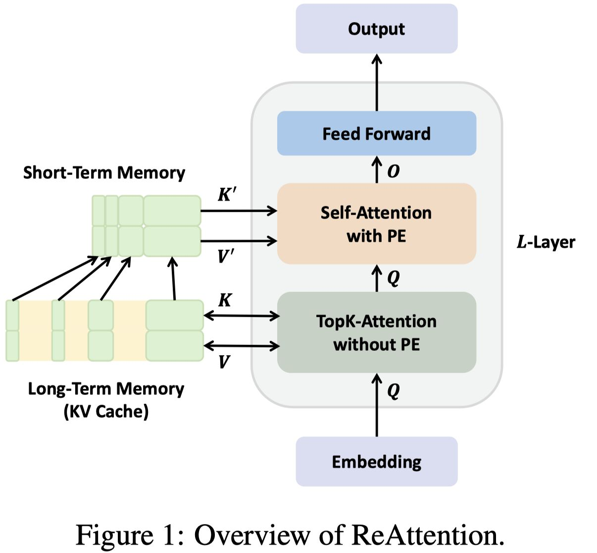

# ReAttention: Training-Free Infinite Context with Finite Attention Scope



> **本文由 AI Agent 自动生成（Hermes Agent, Nous Research），生成日期：2025-06-04**
> **⚠ 声明：本笔记为 AI 自动摘要，可能存在遗漏或理解偏差，请以论文原文为准。**

---

## 一句话总结

ReAttention 是一种**免训练**的方法，通过在传统位置感知自注意力之前执行**无位置信息的 top-k 注意力**，使得基于自注意力机制的 LLM 能够以**有限的注意力窗口**支持**无限长的上下文**，成功将 LLaMA3.1-8B 的上下文扩展至至少 1M tokens，将 LLaMA3.2-3B-chat 的上下文扩展 128 倍至 4M tokens。

---

## 摘要翻译

大型语言模型（LLM）的长上下文能力已取得重大突破，但长度外推中支持的最大上下文长度仍然是限制其实际应用的关键瓶颈。LLM 的上下文长度约束源于自注意力机制——它无法通过有限的预训练位置信息和注意力范围，有效且高效地捕捉无限长上下文中的语义关系。

本文提出 ReAttention，一种免训练的方法，使得基于自注意力机制的 LLM 能够在足够的内存资源下，以有限的注意力范围支持无限上下文。ReAttention 在普通的**位置感知自注意力**之前，先执行**无位置信息的 top-k 注意力**，从而使 LLM 免于长度外推问题。我们在 LongBench、L-Eval 和 InfiniteBench 上验证了 ReAttention 的性能，表明其与传统方法相当。

此外，我们将 ReAttention 应用于主流 LLM（包括 LLaMA3.1-8B 和 Mistral-v0.3-7B），使其至少支持 1M 的上下文长度，甚至将 LLaMA3.2-3B-chat 的上下文长度扩展 128 倍至 4M，无需任何额外训练（在 Needle-In-A-Haystack 测试中）。我们还使用 Triton 优化了 ReAttention 的效率，实现了无额外开销的高效外推。

---

## 研究动机

1. **上下文长度瓶颈**：尽管 LLM 长上下文能力不断进步，但最大支持的上下文长度（通过长度外推）仍是实际应用中的关键瓶颈。
2. **无限上下文的三个必要条件**（论文提出）：
   - **位置信息不 OOD**：推理阶段的位置信息不应与训练阶段相比出现分布外（out-of-distribution）问题。
   - **注意力熵不随长度增长**：推理阶段的自注意力熵不应随输入长度增加（否则注意力会变得过于分散，难以聚焦关键信息）。
   - **有效感知上下文信息**：LLM 在每个推理步骤中应能有效感知关键上下文信息。
3. **现有方法的不足**：
   - **位置插值/缩放方法**（如 PI、NTK）：解决了位置 OOD 问题，但注意力熵仍随长度增加，存在外推上限。
   - **StreamingLLM/LM-Infinite**：保持了输出稳定，但牺牲了全局上下文感知。
   - **InfLLM/LongHeads**：通过提前提取关键信息扩展上下文，但 InfLLM 存在分块表示和 ReRoPE 位置嵌入引入的偏差，LongHeads 仍受位置信息上限限制。
4. **核心洞察**：类比人类"只在每步推理时需要少量信息"，LLM 也可以只提取当前推理步骤中最重要的有限上下文段进行注意力计算。

---

## 方法（技术细节）

### 整体架构

ReAttention 的整体结构包含两个阶段：
1. **无位置信息的 top-k 注意力**（Position-Agnostic Top-K Attention）：负责全上下文缓存选择
2. **传统位置感知自注意力**（Self-Attention with Position Embedding）：执行正常的注意力计算

两者通过免训练集成（Training-Free Integration）连接，无需任何额外训练。

### 2.1 全上下文缓存选择（Full-Context Cache Selection）

**KV Cache 分段**：
将 KV cache 分为三部分：
```
Kcache = [Kglobal, Kmiddle, Klocal]
Vcache = [Vglobal, Vmiddle, Vlocal]
```
- **Kglobal**：输入开头部分，对应全局重要的提示信息
- **Klocal**：输入结尾部分，对应当前推理步骤的局部信息
- **Kmiddle**：中间部分，通过 top-k 选择提取

**Top-K 选择**：
使用当前步骤的查询向量 $q_t$ 与中间 KV cache 的键向量计算点积（无位置信息），选择最重要的 KV 缓存段：
```
Indices = top-k(q_t * K_middle^T)
K_select = K_middle[Indices]
V_select = V_middle[Indices]
```

**关键设计细节**：
- 每层独立进行全上下文选择，不同层可以选择不同的 KV cache
- 多头投票机制：多个注意力头和查询向量共同投票确定 top-k' 个 KV cache
- 保留邻居条目（m 个）以保证语义连贯性，重叠部分去重
- **无需分块**：不同于 InfLLM/LongHeads 的分块选择，ReAttention 使用查询与键的点积直接选择，避免了固定分块导致的语义碎片化

### 2.2 免训练集成（Training-Free Integration）

将选择的 KV cache 段拼接到全局和局部部分之间：
```
Kcache' = [Kglobal, Kselect, Klocal]
Vcache' = [Vglobal, Vselect, Vlocal]
qt, Kcache' = PE(qt, Kcache')  # 应用位置编码
ot = SelfAttn(qt, Kcache', Vcache')
```

**关键设计**：
- **位置编码后置**：不同于 HuggingFace 的预缓存位置编码，ReAttention 将位置编码与 KV cache 分离，在缓存选择后才应用位置编码。
- **位置信息不 OOD**：由于拼接后的缓存长度始终在预训练上下文长度内，位置编码永远不会超出分布。
- **无位置信息的 KV cache**：被选中的 KV cache 不包含位置信息，使得注意力分数（无位置嵌入）更有利于定位上下文中的关键信息。
- **兼容 FlashAttention**：ReAttention 与现有注意力加速方法（FlashAttention2）兼容。

### 2.3 效率优化（Triton Kernel）

- 使用 Triton（GPU 编程语言）开发自定义的 top-k 注意力内核
- 参考 FlashAttention 的设计思路，将注意力分数计算和 top-k 计算融合到一个内核中
- 整个过程在 GPU 缓存中运行，显著减少 GPU 内存 I/O
- 标准 PyTorch 实现在超过 64K 序列时内存超过 80GB，而 Triton 实现仅使用输入和输出矩阵的内存
- 在 64K 序列长度下，Triton 实现比 PyTorch 实现快数百倍

### 超参数设置（默认配置）

| 参数 | 值 |
|------|-----|
| Kglobal 长度 | 32 |
| Klocal 长度 | 4096 |
| Span 大小 | 32 |
| top-k | 4 |
| top-k' | 127 |

最大注意力窗口 = 32 + 4096 + 127 × 32 = 8192（与 LLaMA3-8B-8K 匹配）

---

## 实验结果

### 实验设置

- **模型**：LLaMA3-8B-8K、LLaMA3.1-8B-128K、LLaMA3.1-70B-128K、LLaMA3.2-3B-128K、Mistral-v0.3-7B-32K、InternLM2.5-7B-1M、Qwen2-7B-128K、Qwen2-72B-128K、Qwen2-1B-32K
- **评估框架**：OpenCompass
- **精度**：FP16
- **加速**：FlashAttention2
- **评测基准**：LongBench、L-Eval、InfiniteBench、Needle-In-A-Haystack（NIAH）

### LongBench 结果（核心对比）

| 模型 | 方法 | 平均分 |
|------|------|--------|
| LLaMA3-8B-8K | 原始 | 35.48 |
| LLaMA3-8B-8K | + StreamingLLM | 32.49 |
| LLaMA3-8B-8K | + InfLLM | 32.51 |
| LLaMA3-8B-8K | + **ReAttention** | **35.03** |
| LLaMA3.1-8B-128K | 原始 | 38.79 |
| LLaMA3.1-8B-128K | + StreamingLLM | 37.06 |
| LLaMA3.1-8B-128K | + InfLLM | 37.14 |
| LLaMA3.1-8B-128K | + **ReAttention** | **38.63** |
| LLaMA3.2-3B-128K | 原始 | 40.76 |
| LLaMA3.2-3B-128K | + StreamingLLM | 35.08 |
| LLaMA3.2-3B-128K | + InfLLM | 28.21 |
| LLaMA3.2-3B-128K | + **ReAttention** | **39.43** |

**结论**：ReAttention 在所有 9 个模型上均优于 StreamingLLM，且与全注意力相当甚至超越（如 LLaMA3.1-70B-128K 和 Qwen2-1B-32K）。

### InfiniteBench 结果

- 在 128K 上下文长度下，ReAttention 在 En.MC、En.QA、En.Sum 任务上均一致优于全注意力和 InfLLM
- DynamicNTK 在 32K 下表现良好，但存在明显外推上限

### Needle-In-A-Haystack（NIAH）测试

- **LLaMA3.1-8B-Instruct-128K**：多针 NIAH，上下文扩展至 1M，整体得分 93.85
- **LLaMA3.2-3B-Instruct-128K**：单针 NIAH，上下文扩展至 2M，整体得分 90.48
- **Qwen2-1B-Instruct-32K**：单针 NIAH，上下文扩展至 4M，整体得分 87.07
- 这是目前已知的**免训练上下文长度扩展的最大倍率**（128×）

### 效率分析

- **Triton 内核**：相比 PyTorch 实现，在 64K+ 序列长度下内存和延迟大幅降低
- **首 Token 延迟**（TTFT）：与 HuggingFace Transformers + FlashAttention2 相当
- **吞吐量**：支持更大的 batch size，保持可比或更好的 token 处理速率
- **超过 192K**：标准实现 OOM，而 ReAttention 仍可继续工作

---

## 优势

1. **免训练**：无需任何额外训练或微调，即插即用
2. **无限上下文**：以有限注意力窗口实现无限上下文长度支持
3. **性能优秀**：在 LongBench、L-Eval、InfiniteBench 等基准上与全注意力相当
4. **扩展能力强大**：成功将主流 LLM 的上下文扩展至 1M-4M tokens
5. **高效实现**：通过 Triton 自定义内核实现无额外开销，与 FlashAttention 兼容
6. **无位置 OOD 问题**：KV cache 中不含位置信息，位置编码仅在自注意力时应用
7. **避免语义碎片化**：不依赖分块选择，直接使用点积选择关键信息
8. **通用性强**：适用于不同规模和架构的 LLM（LLaMA、Mistral、InternLM、Qwen 等）
9. **每层独立选择**：不同层可以选择不同的 KV cache，实现更灵活的注意力分布

---

## 局限

1. **RULER 基准表现不佳**：在合成的混乱文本任务（如 RULER 的 NIAH-MultiKey3）上，ReAttention 和 InfLLM 均表现较差，仅基于全注意力的 DynamicNTK 能有效处理。这是因为无位置嵌入的 KV cache 选择无法在多个重叠的流形中识别正确的分支。
2. **内存需求**：需要足够大的内存来存储完整的 KV cache（尽管推理时的注意力范围有限）。
3. **预填充开销**：虽然推理效率高，但预填充阶段需要处理完整的 KV cache。
4. **合成任务局限**：在高度结构化的合成任务中，由于缺乏位置信息，ReAttention 可能无法有效处理。
5. **未验证与 Qwen2-72B 等更大模型的兼容性**：虽然实验覆盖了多种模型，但对更大规模模型的全面验证可能需要更多研究。
6. **依赖 KV cache 的完整存储**：在极长上下文场景下，KV cache 本身的内存管理仍是挑战。

---

## 与 EfficientPaper 相关的研究方向

1. **KV Cache 管理与压缩**：ReAttention 属于 KV cache 管理的前沿方法，可与 SnapKV、H2O、PyramidKV 等 token 驱逐/压缩方法结合。
2. **注意力稀疏性（Attention Sparsity）**：ReAttention 利用注意力分数的稀疏性，通过 top-k 选择减少注意力范围，与稀疏注意力研究高度相关。
3. **长度外推（Length Extrapolation）**：ReAttention 是免训练长度外推的重要方向，与 RoPE 扩展（NTK、PI、YARN、LongRoPE）形成互补。
4. **推理效率**：通过 Triton 优化和自定义内核实现高效推理，与 FlashAttention、MInference 等推理加速方法相关。
5. **KV Cache 稀疏选择**：ReAttention 的无位置信息缓存选择机制，与 InfLLM、LongHeads、DuoAttention 等方法在 KV cache 稀疏选择上形成研究脉络。
6. **长上下文评估**：ReAttention 在 LongBench、InfiniteBench、NIAH 上的评估方法，为长上下文 LLM 评估提供了有价值的参考。
7. **内存效率**：在长上下文场景下如何高效利用内存，是 ReAttention 与 EfficientPaper 研究方向的重要交叉点。

---

## 论文信息

- **标题**：ReAttention: Training-Free Infinite Context with Finite Attention Scope
- **作者**：Xiaoran Liu, Ruixiao Li, Qipeng Guo, Zhigeng Liu, Yuerong Song, Kai Lv, Hang Yan, Linlin Li, Qun Liu, Xipeng Qiu
- **机构**：复旦大学、华为、上海人工智能实验室、上海创新研究院
- **发表**：ICLR 2025
- **代码**：https://github.com/OpenMOSS/ReAttention
- **arXiv**：http://arxiv.org/abs/2407.15176v3
- **关键词**：sparse_pruning, attention_sparsity, kv_cache_management
