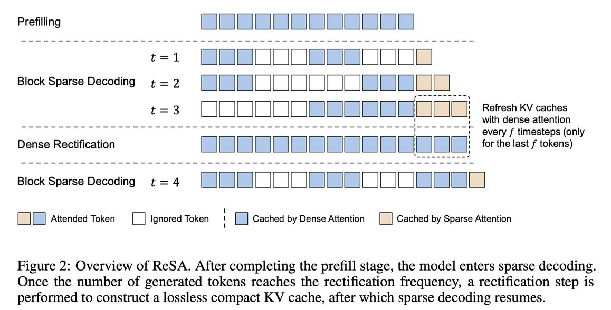

# Rectified Sparse Attention (ReSA)

> **生成声明**：本笔记由 AI Agent 自动生成（基于论文全文提取与分析），生成时间：2025年6月。所有中文内容为 AI 生成的翻译与解读，仅供参考。

---

## 一句话总结

ReSA 通过在块稀疏注意力解码过程中周期性地执行密集前向传播（Dense Rectification）来刷新 KV 缓存，以极小的开销修正近似误差的累积，从而在 256K 上下文长度下实现近乎无损的生成质量和最高 2.42× 的端到端加速。

---

## 摘要翻译

高效的长序列生成是大语言模型（LLM）面临的关键挑战。近期的稀疏解码方法虽然提升了效率，但存在 KV 缓存对齐问题（KV cache misalignment），即近似误差不断累积导致生成质量下降。本文提出 **Rectified Sparse Attention（ReSA）**，一种简单而有效的方法，将块稀疏注意力（block-sparse attention）与周期性密集修正（periodic dense rectification）相结合。通过在固定间隔内使用密集前向传播刷新 KV 缓存，ReSA 限制了误差累积，并保持了与预训练分布的对齐。在数学推理、语言建模和检索任务上的实验表明，ReSA 在显著提升效率的同时实现了近乎无损的生成质量。值得注意的是，ReSA 在 256K 序列长度的解码中可实现高达 **2.42× 的端到端加速**，为可扩展的长上下文推理提供了实用方案。

---

## 研究动机

1. **长序列生成的计算瓶颈**：在标准自回归解码中，每个 token 需要访问完整的 KV 缓存，导致频繁的内存访问和 IO 压力，尤其在长上下文场景中，内存访问成为延迟的主要瓶颈。

2. **现有稀疏解码的局限**：虽然 Quest、InfLLM 等方法通过选择性注意力来减少计算量，但它们的 KV 缓存会因近似误差累积而逐渐偏离预训练分布，导致随着解码长度增加性能持续下降（如 Figure 1 所示）。

3. **test-time scaling 的需求**：随着推理时计算（test-time scaling）在数学推理等任务中的重要性日益增加（如 DeepSeek-R1），长序列生成效率成为关键瓶颈。

4. **训练感知方法的高成本**：NSA、MoBA 等方法虽然集成了稀疏注意力结构，但需要在预训练阶段进行大量改造，成本高昂。

ReSA 的核心动机是：如何在不改变模型结构、不需要重新训练的前提下，通过轻量级的修正机制来解决稀疏解码的误差累积问题。

---

## 方法（技术细节）

ReSA 的核心思想是在稀疏解码和周期性密集修正之间交替进行，由两个主要阶段组成：

### 1. Group Block Sparse Attention（群组块稀疏注意力）

**块表示（Block Representation）**：
- 将 Key 矩阵划分为大小为 $b$ 的非重叠块（默认 $b=16$）
- 每个块用一对统计向量 $(k_{\min}, k_{\max})$ 概括其分布范围
- 这种表示完全不依赖训练，可增量更新

**块选择（Block Selection）**：
- 使用 Quest 算法的相似度评分：对每个 GQA 组的 pooling query $q$ 和每个块 $i$，计算 $score_i = \sum_{j=1}^{d} \max(q_j \cdot k_{\max,i,j}, \; q_j \cdot k_{\min,i,j})$
- 采用动态 top-$n$ 策略：
  - 固定保留 $n_{\text{local}}$ 个最近的块（确保局部一致性）
  - 设置最小块数 $n_{\min}=16$（避免短序列性能退化）
  - 根据活跃比率 $p$ 动态确定 $n = \max(n_{\min}, \lceil M \times p \rceil)$

**群组共享（Group Sharing）**：
- 借鉴 Native Sparse Attention（NSA）的共享分组策略
- 每个 GQA 组内的多个 query head 共享相同的稀疏注意力模式
- 通过 average pooling 选择同一组内所有 head 的共同 KV 块

### 2. Dense Rectification（密集修正）

这是 ReSA 的核心创新：

**算法流程**：
- 设定修正频率 $f$（默认 $f=32$）
- 每进行 $f$ 步稀疏解码后，将最近生成的 $f$ 个 token 批量执行一次密集前向传播（dense attention）
- 用密集计算的结果刷新 KV 缓存和块键缓存
- 之后继续稀疏解码，如此交替循环

**关键优势**：
- 将误差累积限制在常数窗口大小（$f$ 个 token）内
- 修正步骤可通过批处理高效分摊（amortized），不会大幅增加延迟
- 与现代 LLM 服务系统兼容（continuous batching、chunked prefill）

**内存访问分析**：
- 平均每步内存访问量：$\text{Avg}(\text{mem}) = \text{mem}(\text{KV cache}) \times \left(\frac{1}{b} + p + \frac{1}{f}\right)$
- 相比密集解码（每步访问完整 KV 缓存），理论内存访问降低为 $\frac{1}{b} + p + \frac{1}{f}$

### 3. 内核实现（Kernel Implementation）

- 基于 Flash Decoding 的 split-execution 策略
- 每个 GQA 组分配到独立的 Streaming Multiprocessor（SM）
- 在块索引级别进行工作负载分割，每个 SM 独立获取和处理分配的 KV 块
- 最大化 SM 占用率，最小化跨 SM 通信

### 与 Speculative Decoding 的对比

ReSA 与稀疏 KV 缓存的自推测解码（Self-Speculation）有相似的计算特征，但关键区别在于：
- ReSA **不需要** 每个 token 的 accept/reject 决策
- 自推测解码需要严格的逐 token 验证，通常每次仅接受约 8/16 个 token（即约 50% 效率）
- ReSA 在保持接近密集注意力精度的同时，速度比自推测解码快约 **1.92×**

---

## 实验结果

### 实验设置
- 基础模型：Qwen2.5 系列（1.5B / 7B）、DeepSeek-R1-Qwen-Distill 7B/1.5B
- 硬件：NVIDIA A100-80G GPU
- 默认超参数：块大小 $b=16$，$n_{\min}=16$，$n_{\text{local}}=1$，稀疏比率 $p=0.9$，修正频率 $f=32$
- 使用 INT4 量化（Marlin kernel，group size 128）进行效率测试

### 数学推理任务（Table 1）
| 模型 | Dense | Sparse | ReSA |
|------|-------|--------|------|
| R1-Qwen-Distill 1.5B | 46.82 | 43.50 | 45.56 |
| R1-Qwen-Distill 7B | 60.72 | 57.72 | 60.52 |

- ReSA 在 7B 模型上达到 60.52 的平均准确率，接近 Dense 的 60.72
- Sparse 仅 57.72，差距约 3 个百分点
- 平均生成长度约 6000-8000 token，属于长序列场景

### 语言建模（Figure 4, 5）
- 使用长序列书籍数据，评估 Top-3 准确率
- 不同序列长度（8K-64K）下，ReSA 显著缩小了密集与稀疏解码的质量差距
- $f=32$ 时性能接近上界（Decode Only）
- $p=0.8$ 时困惑度与密集设置相当，但 $p=0.9$ 为更好的性能-效率平衡点

### 长序列检索（RULER，Table 2）
| 设置 | Avg |
|------|-----|
| Dense | 0.549 |
| ReSA p=0.95 | 0.531 |
| ReSA p=0.9 | 0.559 |
| ReSA p=0.8 | 0.552 |

- ReSA p=0.9 甚至略优于 Dense baseline（0.559 vs 0.549）
- 短输出序列中，修正作用较小，主要由稀疏注意力质量决定

### 推理效率

**Kernel 级延迟（Figure 6）**：
- 16K、64K、256K 序列长度下，ReSA 显著降低总延迟
- 修正开销在 256K 下占注意力相关延迟的 32.7%，64K 下 28.9%
- 随序列长度增加，修正比例收敛到 $1/f$

**端到端吞吐量（Figure 7, 8）**：
| 精度 | 4K | 16K | 64K | 256K |
|------|-----|-----|-----|------|
| FP16 | 1.02× | 1.11× | 1.47× | 2.18× |
| INT4 | 1.03× | 1.18× | 1.70× | 2.44× |

- 在 256K 上下文长度下，FP16 提速 2.18×，INT4 提速 2.44×
- 序列越长，加速效果越显著

### 消融实验（Figure 9）
- 修正频率 $f \in \{16, 32, 64, 128\}$，稀疏比率 $p \in \{0.9, 0.95, 0.98\}$
- $f=32$ 在大多数数据集上最接近密集基线
- 即使 $f=128$，修正机制仍能保留大部分性能增益
- 在所有稀疏比率下，ReSA 一致优于纯稀疏基线

### 与 Self-Speculation 对比（Table 3，Appendix B）
- 修正频率 $f=16$，推测长度 16
- ReSA 在所有数学推理任务上比自推测解码快约 **1.92×**
- 原因：自推测解码每次验证仅接受约 8 个 token，生成速率减半

---

## 优势

1. **简单有效**：仅需引入周期性密集修正，无需修改模型架构或重新训练
2. **近乎无损**：在数学推理和语言建模中，ReSA 的生成质量接近密集注意力
3. **显著加速**：256K 下 INT4 加速 2.44×，FP16 加速 2.18×
4. **灵活可调**：通过调整 $b$、$p$、$f$ 灵活权衡效率与精度
5. **与现有系统兼容**：自然兼容 continuous batching、chunked prefill 等 LLM 服务优化
6. **无需接受/拒绝判断**：相比 speculative decoding，避免了逐 token 验证的开销
7. **开箱即用**：基于 Qwen2.5 等标准预训练模型，无需特殊训练
8. **理论可分析**：内存访问量有明确的理论公式，便于调参

---

## 局限

1. **修正频率的权衡**：$f$ 过小会增加密集修正开销，$f$ 过大会降低精度，需要根据任务和序列长度调优
2. **依赖块选择策略**：块稀疏注意力的质量受限于 Quest 算法的块选择精度，虽然可与 SeerAttention 等方法结合，但当前未验证
3. **短序列效率优势有限**：在短序列（如 4K）下加速效果仅 1.02×-1.03×，几乎没有收益
4. **稀疏比率的饱和效应**：当块大小固定时，进一步提高稀疏比率不会带来显著加速（因为 sparse estimation 的开销与稀疏比率为 1/b 相关）
5. **仅在 Qwen2.5/DeepSeek-R1 上验证**：虽然方法具有通用性，但未在更多模型架构（如 LLaMA、Mistral）上验证
6. **未在多模态模型上验证**：论文主要聚焦文本生成，对视觉-语言模型等多模态场景未涉及
7. **Kernel 实现依赖特定硬件**：内核优化基于 A100，不同 GPU 架构可能需要调整

---

## 与 EfficientPaper 相关的研究方向

ReSA 与 EfficientPaper 中多篇论文有密切关联，可归入以下研究方向：

1. **KV Cache 管理与压缩**：ReSA 的块稀疏注意力机制与 Quest、InfLLM、NSA 等方法属于同一类 KV Cache 优化研究，关键词为 `kv_cache_sparse`
2. **稀疏注意力与加速**：与 Quest（Query-aware sparsity）、InfLLM、MagicPig、ClusterKV、MoBA 等工作直接相关
3. **推测解码与自推测**：与 TriForce、MagicDec 等基于稀疏 KV 缓存的自推测方法有计算特征上的相似性，但 ReSA 避免了 accept/reject 决策
4. **长上下文推理**：与 Gemini 1.5、Qwen2.5-1M 等长上下文模型的研究方向一致
5. **训练感知 vs 训练无关**：ReSA 是训练无关（training-free）方法，与 NSA、MoBA 等训练感知方法形成互补
6. **端到端推理优化**：结合量化（INT4）和稀疏注意力，体现了推理效率的多维度优化

---

## 关键数据

| 指标 | 数值 |
|------|------|
| 论文来源 | arXiv: 2506.04108v2 (2025) |
| 机构 | Microsoft Research, Tsinghua University, The University of Hong Kong |
| 代码 | https://github.com/microsoft/unilm/tree/master/ReSA |
| 默认参数 | b=16, n_min=16, n_local=1, p=0.9, f=32 |
| 最大加速 | 2.42× (INT4, 256K) |
| 数学推理 (7B) | Dense 60.72 vs ReSA 60.52 vs Sparse 57.72 |
| 与 Self-Spec 对比 | 1.92× 更快 |
