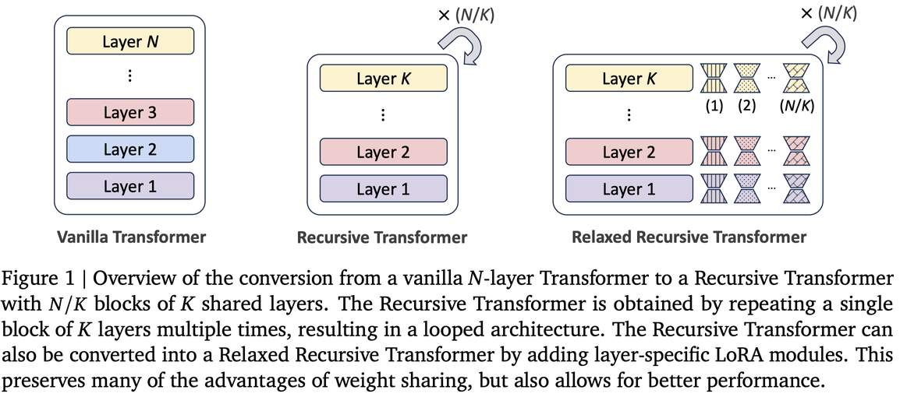

# Relaxed Recursive Transformers: Effective Parameter Sharing with Layer-wise LoRA

> Sangmin Bae, Adam Fisch, Hrayr Harutyunyan, Ziwei Ji, Seungyeon Kim, Tal Schuster

## 一句话总结

本文提出 **Relaxed Recursive Transformers**，通过将现有 LLM 的多层 Transformer 压缩为参数共享的递归架构，并辅以层级 LoRA 模块松弛绑定约束，以极小的参数开销实现接近原始全尺寸模型的性能，并提出了 **Continuous Depth-wise Batching** 推理范式，理论上可实现 2-3× 的吞吐量提升。

---

## 摘要翻译

大语言模型（LLM）的部署成本高昂。参数共享提供了一条降低模型大小和成本的可行路径，但其在现代 LLM 中的效果仍然相当有限。在本工作中，我们重新审视了"层绑定"作为一种 Transformer 中的参数共享形式，并引入了新颖的方法，将现有 LLM 转换为更小的"递归 Transformer"，这些模型跨层共享参数，且性能损失极小。我们的递归 Transformer 从标准预训练 Transformer 高效初始化，但仅使用一组唯一的层块，然后在循环中多次重复。我们进一步通过引入 **Relaxed Recursive Transformers** 来提升性能，该方法通过深度方向的低秩适应（LoRA）模块为层绑定约束添加灵活性，同时仍保持整体模型的紧凑性。我们展示递归模型（如 recursive Gemma 1B）优于类似大小的普通预训练模型（如 TinyLlama 1.1B 和 Pythia 1B）和知识蒸馏基线——甚至可以恢复原始"全尺寸"模型（如 Gemma 2B）的大部分性能。最后，我们提出了 **Continuous Depth-wise Batching**，这是一种由递归 Transformer 与早期退出结合所启用的新型推理范式。理论分析表明，该方法有潜力带来显著的（2-3×）推理吞吐量提升。

---

## 研究动机

1. **LLM 部署成本高昂**：大型模型具有优越的性能，但其内存和计算需求昂贵，限制了在资源受限场景下的部署。

2. **参数共享效果有限**：虽然参数共享方法（如 ALBERT）在减少模型大小方面有前景，但在现代 LLM 中的应用效果有限，尚缺乏系统性的方法来将现有预训练模型转换为高效的共享参数架构。

3. **层跳跃/剪枝的启发**：现有研究表明，跳过少量层或进行结构化剪枝可以在大幅减少计算量的情况下保持较高性能，这为通过层重复+低秩适配实现压缩提供了动机。

4. **推理吞吐量优化需求**：现有的连续序列批处理方法（Continuous Sequence-wise Batching）虽能提升效率，但受限于 Transformer 的线性计算结构。递归结构可以在此基础上进一步优化深度维度的并行计算。

---

## 方法（技术细节）

### 2.1 Recursive Transformer：循环层绑定

递归 Transformer 采用 **CYCLE 策略**（Takase and Kiyono, 2023），将一个 N 层的 Transformer 转换为一个具有 K 个唯一层块的模型，该层块被重复 N/K 次：

$$h_t^\ell = f(h_t^{\ell-1}; \Phi'_{((\ell-1) \bmod L/B)+1}), \quad \ell \in [1, L]$$

其中 B 是循环块数（例如，Gemma 2B 的 18 层可转换为 2 个循环块的 9 层模型）。

**初始化技术**（从预训练模型到递归模型的参数转换）：

- **Stepwise 方法**：在等间隔位置选择中间层，保持首尾层固定。基于 LLM 可以跳过少数层而不影响性能的先验发现。
- **Average 方法**：对共享权重取各层权重矩阵的平均值。
- **Lower 方法**：直接使用未共享模型前 K 层的权重。

**关键发现**：Stepwise 方法在非松弛递归模型中表现最佳，Average 方法在松弛递归模型中表现最佳。

### 2.2 Relaxed Recursive Transformer：多 LoRA 层

为了缓解完全层绑定的局限性（可选模型大小有限、每层需服务多个深度角色），论文引入 **层级 LoRA 模块**：

$$h_t^\ell = f(h_t^{\ell-1}; \Phi'_{((\ell-1) \bmod L/B)+1}, \Delta\Phi'_\ell), \quad \ell \in [1, L]$$

其中 $\Delta\Phi'$ 是 LoRA 模块的参数。每个循环层配备多个 LoRA 模块（例如，2 个循环迭代的模型，每层有 2 个 LoRA 模块，分别用于第一次和第二次循环迭代）。

**前向传播**：对于基础变换 $h = W'x$，修改后的前向传播为 $h = W'x + BAx$，其中 $A \in \mathbb{R}^{r \times k}$，$B \in \mathbb{R}^{d \times r}$ 是 LoRA 权重矩阵，$r$ 是秩。

### 2.3 LoRA 初始化：截断 SVD

不同于标准 LoRA 微调（仅训练 LoRA 参数并零初始化），本文所有参数均训练。通过 **截断奇异值分解（Truncated SVD）** 初始化 LoRA 模块：

$$U_r^\ell, \Sigma_r^\ell, V_r^\ell = \text{Truncated SVD}(W^\ell - W'_{((\ell-1) \bmod L/B)+1}; r)$$

其中保留前 $r$ 个最大奇异值对应的列。LoRA 权重初始化为：$B = U_r \Sigma_r$，$A = V_r^T$。

**关键意义**：LoRA 的秩 $r$ 作为关键超参数，使得 Relaxed Recursive Transformer 可以在 vanilla Transformer 和纯递归 Transformer 之间无缝过渡。$r$ 足够大时逼近原始模型，$r=0$ 时退化为纯递归模型。

### 2.4 Continuous Depth-wise Batching 与 Early-Exiting

递归 Transformer 的重复结构允许在深度维度（循环迭代）上进行动态调度：

- **Depth-wise Batching**：由于不同深度使用相同的层函数，可以在同一个前向传播中联合计算不同样本的不同循环迭代，最大化批处理利用率。
- **Early-Exiting**：结合早退出机制，高置信度样本可在早期迭代直接退出，其空位被立即填补，进一步提升吞吐量。
- **理论优势**：解决了早退出的同步问题——在 vanilla Transformer 中，早退出的 token 需等待同批中所有 token 完成全部层处理，而在递归 Transformer 中，不同深度的 token 可并行计算。

**Early-Exit 训练策略**：采用激进系数策略（aggressive coefficient），对中间输出使用 0.1 的损失系数，对最终输出保持 1.0，结合知识蒸馏（detached final outputs），有效保留最终性能的同时增强中间输出质量。

---

## 实验结果

### 实验设置
- **模型**：Gemma 2B（18层）、TinyLlama 1.1B（22层）、Pythia 1B（16层）
- **循环块数**：B=2（默认）
- **数据集**：SlimPajama（uptraining）
- **评估**：7 个 few-shot 任务（LAMBADA、HellaSwag、PIQA、WinoGrande、ARC-easy、ARC-challenge、OpenBookQA）

### 主要结果

1. **递归 Gemma 1B 超越同尺寸模型**：
   - 递归 Gemma 1B 在 few-shot 准确率上比 reduced-size 模型高出最多 **13.5 个百分点**（51.7% vs. 38.2%）
   - 递归 Gemma 1B 甚至超越了全尺寸的 TinyLlama 1.1B 和 Pythia 1B
   - 递归 TinyLlama 在仅 15B token 的 uptraining 后，性能可与预训练 105B token 的原始模型媲美

2. **Relaxed 模型实现性能与全尺寸模型的匹配**：
   - Relaxed Gemma（rank=512）达到与原始 Gemma 2B（3T token 预训练）相当的性能（**58.4% vs. 58.6%**）
   - 通过知识蒸馏 + 60B token 的 uptraining，松弛递归模型的 few-shot 准确率提升最多 **4.1 个百分点**

3. **吞吐量提升**：
   - Recursive Transformer + Early-Exiting 理论上可实现 **2.66×** 吞吐量提升
   - Recursive Gemma 相比 vanilla Pythia 可实现接近 **4×** 的吞吐量提升
   - Relaxed 模型在性能与吞吐量之间提供明确的 Pareto 前沿

4. **SVD 初始化显著优于零初始化**：在 LoRA rank=512 时，SVD 初始化带来最多 **6.5 个百分点** 的准确率提升。

---

## 优势

1. **高效的参数压缩**：通过参数共享将模型大小减半（B=2 时），同时保持接近全尺寸模型的性能。
2. **灵活的松弛机制**：LoRA 的秩 $r$ 作为关键超参数，可在纯递归模型和原始模型之间平滑过渡，适应不同部署场景。
3. **高效的初始化方法**：三种初始化策略（Stepwise、Average、Lower）以及 SVD 初始化的 LoRA 模块，使模型能够从预训练权重高效迁移，减少 uptraining 需求。
4. **创新的推理范式**：Continuous Depth-wise Batching 利用递归结构的深度维度并行性，理论上实现 2-3× 的吞吐量提升，且与早退出机制天然兼容。
5. **解决早退出的同步问题**：递归结构使不同深度的 token 可并行计算，解决了 vanilla Transformer 中早退出 token 需等待全批完成的瓶颈。
6. **与现有技术互补**：该方法可与量化、剪枝等稀疏设计方法结合，形成递归稀疏架构。

---

## 局限

1. **主要在小模型上验证**：实验仅在 ~1B 参数级别的模型上进行，未扩展到 7B 及以上的大模型。大规模模型的 uptraining 成本可能显著增加，且隐藏维度的增大可能限制批处理大小的提升。
2. **理论吞吐量提升**：使用 oracle-exiting 方法（假设中间预测与最终预测一致时可退出），而非基于置信度的实际早退出算法，实际部署需考虑解码瓶颈（如早退出 token 的 KV 缓存计算）。
3. **数据分布偏移问题**：在不同数据分布上 uptraining 时（如 SlimPajama 与 Gemma 原始预训练数据差异大），全尺寸模型性能也会下降，影响了对递归模型性能的准确评估。
4. **Relaxed 模型的多 LoRA 推理效率**：Relaxed 模型在批处理推理时需计算不同的 LoRA 模块，类似多任务学习的挑战，引入了冗余。虽可通过 LoRA 权重拼接优化，但仍有改进空间。
5. **未探索的架构方向**：尚未将 Mixture-of-Experts、激活跳跃、SSM 组件等技术与递归结构结合。
6. **Early-Exit 训练策略的通用性**：论文中针对非松弛模型的最优策略直接应用于松弛模型，可能不是最优的。

---

## 与 EfficientPaper 相关的研究方向

1. **结构设计（Structure Design）**：本文的核心是通过层共享和 LoRA 模块优化 Transformer 架构，是 EfficientPaper 中 structure_design 类别的代表性工作。
2. **参数共享与权重共享**：与 ALBERT（2020）、Universal Transformer（2019）等经典工作一脉相承，但首次将方法应用到现代 LLM 并提出系统性的转换框架。
3. **低秩适应（LoRA）**：与 LoRA（2022）相关联，但创新性地将其应用于松弛递归结构中的层间差异建模。
4. **知识蒸馏**：结合 forward KL 散度的知识蒸馏进一步提升性能，与 MiniLM 等工作相关。
5. **推理效率与批处理优化**：Continuous Depth-wise Batching 为递归架构设计了新型推理范式，与 continuous sequence-wise batching（vLLM）形成互补。
6. **早期退出（Early-Exiting）**：递归结构天然支持早退出，解决了传统早退出的同步问题，与 Confident Adaptive Transformers、LayerSkip 等工作相关。
7. **模型压缩的统一视角**：本文与剪枝（Lottery Ticket）、量化、层跳跃（LayerSkip）、嵌套（MatFormer）等方法互补，为模型压缩提供了新的参数共享视角。
8. **潜在推理（Latent Reasoning）**：论文提出递归深度可用于潜在推理（如 contemplation tokens、连续空间表示），为推理任务的递归架构研究提供了方向。

---

## 生成声明

本笔记由 AI Agent 自动生成，基于论文 `Relaxed Recursive Transformers: Effective Parameter Sharing with Layer-wise LoRA`（arXiv:2410.20672v3）的全文内容。生成日期：2026年6月4日。内容涵盖了一句话总结、摘要翻译、研究动机、方法（技术细节）、实验结果、优势、局限性以及与 EfficientPaper 相关的研究方向。
