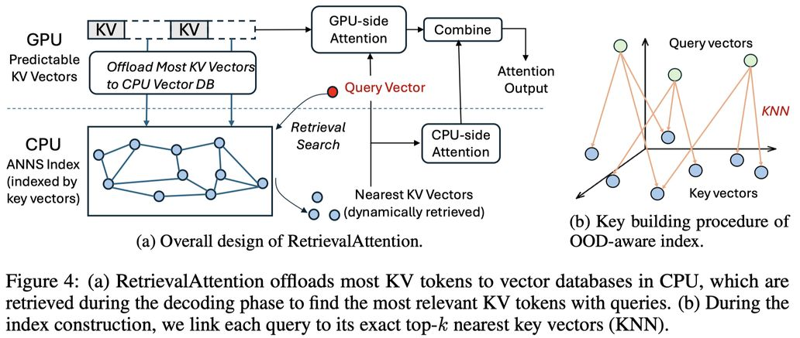

# RetrievalAttention: Accelerating Long-Context LLM Inference via Vector Retrieval

> Di Liu, Meng Chen, Baotong Lu, Huiqiang Jiang, Zhenhua Han, Qianxi Zhang, Qi Chen, Chengruidong Zhang, Bailu Ding, Kai Zhang, Chen Chen, Fan Yang, Yuqing Yang, Lili Qiu



> **声明：本 note 由 AI Agent 自动生成，基于论文全文阅读和分析。生成时间：2025 年 6 月。**

---

## 一句话总结

RetrievalAttention 利用注意力机制的动态稀疏性，在 CPU 内存中构建基于查询向量分布感知的 ANNS 索引，仅需扫描 1–3% 的 KV 向量即可实现接近全注意力的精度，使单张 RTX4090（24GB）即可高效服务 128K token 的长上下文 LLM 推理。

---

## 摘要翻译

基于 Transformer 的大语言模型（LLM）日益重要。然而，由于注意力计算的二次时间复杂度，将 LLM 扩展到更长的上下文会导致推理速度极慢且 GPU 内存消耗巨大（需要缓存 Key-Value 向量）。本文提出 RetrievalAttention，一种免训练方法，同时加速注意力计算并减少 GPU 内存消耗。RetrievalAttention 利用注意力机制的动态稀疏性，在 CPU 内存中为 KV 向量构建近似最近邻搜索（ANNS）索引，并在生成过程中通过向量搜索检索最相关的 KV 向量。然而，现有 ANNS 索引由于查询向量与 Key 向量之间的分布外（OOD）问题，在此类检索任务中往往效果不佳。RetrievalAttention 通过设计一种注意力感知的向量搜索算法来适应查询向量的分布，从而解决 OOD 挑战。评估表明，RetrievalAttention 在仅访问 1–3% 数据的情况下实现了接近全注意力的精度。这显著降低了长上下文 LLM 的推理成本，并大幅减少了 GPU 内存占用。特别地，RetrievalAttention 仅需单张 NVIDIA RTX4090（24GB）即可服务 128K token 的 8B 参数 LLM，生成每个 token 仅需 0.188 秒。

---

## 研究动机

### 长上下文推理的两大瓶颈

1. **GPU 显存瓶颈**：KV 缓存占用巨大，例如 Llama-3-8B 在 1M token 时需要约 125GB 显存，远超单卡容量（RTX4090 24GB、A100 80GB）。
2. **推理延迟瓶颈**：注意力计算具有二次复杂度，1M token 的预填充需要约 1765 秒，其中 96% 以上的时间花在注意力计算上。

### 动态稀疏性的关键洞察

论文通过实验验证了注意力机制的高稀疏性：
- 使用 top-1000 关键 token 可恢复 89% 的全注意力得分（100K 上下文，Llama-3-8B）。
- **动态性**：关键 token 随查询动态变化，静态选择会导致恢复率从 89% 降至 71%。
- 这意味着需要**动态**地为每个查询选择最相关的 KV 向量。

### 传统 ANNS 索引的 OOD 挑战

- 传统向量索引（如 IVF、HNSW）假设查询和 Key 来自同一分布，但注意力机制中 Query 向量和 Key 向量由不同权重投影，分布差异显著。
- Mahalanobis 距离显示 Query 与 Key 的距离比 Key 之间距离大 10 倍以上。
- 传统 ANNS 在 Query→Key 检索中需要扫描 30–50% 数据才能达到 0.95 召回率，无法有效利用稀疏性。
- 这是**首次**识别 ANNS 在注意力计算中的 OOD 问题。

---

## 方法（技术细节）

### 整体架构

RetrievalAttention 采用 CPU-GPU 协同执行架构：

```
GPU: 可预测的 KV 向量（静态模式）→ FlashAttention → 部分注意力输出
CPU: 基于 ANNS 索引的动态检索 → 部分注意力输出
最终: γ₁ · o_W + γ₂ · o_Ω → 合并输出
```

### 1. 近似注意力（§3.1）

基于公式 (1) 的全注意力：
- 定义 $I_{t,\epsilon}$ 为注意力得分超过阈值 $\epsilon$ 的 token 索引子集
- 仅考虑 $I_{t,\epsilon}$ 中的 token 进行注意力计算，使用归一化的注意力得分：
  $\tilde{a}_{t,i} = \frac{e^{z_i}}{\sum_{j \in I_{t,\epsilon}} e^{z_j}}$

### 2. 注意力感知向量搜索（§3.2）——核心创新

**问题**：传统 ANNS 索引在 Query→Key 检索中效果差（OOD 问题）。

**解决方案**：

1. **利用 prefill 阶段的 Query 向量指导索引构建**：
   - 在 prefill 阶段，使用 GPU 计算精确的 KNN（查询向量→最近的 Key 向量），形成 Query→Key 的分布映射。
   - 建立从查询向量到其最近 Key 向量的显式连接。

2. **投影技术消除 Query 向量**：
   - 借鉴跨模态 ANNS 索引 RoarGraph 的投影技术。
   - 将 KNN 连接投影到 Key 向量上，通过链接被同一 Query 向量连接的 Key 向量。
   - 这样在索引中仅需存储 Key 向量，同时保持了从 Query 视角的邻近关系。
   - 最终索引中的 Key 向量的邻近关系反映了从 Query 视角看的"近似关系"。

**效果**：仅扫描 1–3% Key 向量即可达到 >0.95 召回率，相比 IVF 索引，索引搜索延迟降低 74%。

### 3. CPU-GPU 协同执行（§3.3）

**KV 向量分配**：
- **GPU 上的可预测 KV 向量**：类似 StreamingLLM，保留固定初始 token + 最近滑动窗口 token（如 640 个 token）在 GPU 缓存中。
- **CPU 上的动态 KV 向量**：其余 KV 向量卸载到 CPU 内存，构建 ANNS 索引。

**并行执行与合并**：
- GPU 端：使用 FlashAttention 计算可预测 KV 的部分注意力。
- CPU 端：通过向量搜索检索最相关的 KV 向量，计算部分注意力。
- 合并：使用类似 FlashAttention 的数值稳定方法合并两个部分输出：
  $o_t = \gamma_1 \cdot o_W + \gamma_2 \cdot o_\Omega$
  其中 $\gamma_1, \gamma_2$ 是重新缩放因子，保证合并后结果与在 $I_{t,\epsilon}$ 上的全注意力等价。

### 算法伪代码（Algorithm 1）

```
输入: Query 向量 q_t
数据: GPU KV Cache W, CPU 向量数据库 H
输出: 注意力输出 o_t

1. W' ← PredictActiveTokens(...)
2. 将可预测 KV 移至 GPU，不可预测的移至 CPU
3. o_W ← FlashAttention(q_t, K[W,:], V[W,:])  // GPU 并行
4. Ω ← VectorSearch(q_t)                       // CPU 检索
5. o_Ω ← AttentionCPU(Ω)                       // CPU 计算
6. o_t = γ₁ · o_W + γ₂ · o_Ω                   // 合并
```

### 实现优化

- **Prefill 优化**：将 KV 向量移至 CPU 与 GPU 注意力计算以流水线方式重叠，减少预填充时间。
- **多头并行**：在 CPU 端利用多线程并行检索不同注意力头的索引，充分利用多核 CPU。
- **GQA 处理**：对 GQA 模型，每个查询头构建独立索引（即使共享 KV 向量），因为不同查询头的查询分布不同。
- **内存优化**：同组注意力头共享 KV 向量副本，仅在索引中存储指针。未来计划引入 8-bit 量化进一步压缩。

---

## 实验结果

### 实验设置

- **硬件**：RTX4090 (24GB) / A100 (80GB)；CPU: Intel i9-10900X 10 核 / AMD EPYC 7V13 24 核
- **模型**：Llama-3-8B-Instruct-262k、Yi-6B-200K、Yi-9B-200K
- **基准方法**：Full Attention、vLLM、StreamingLLM、SnapKV、InfLLM、Quest、InfiniGen、Flat（精确 KNN）、IVF
- **评测基准**：∞-Bench（7 个任务）、RULER（4 类 13 个任务）、Needle-in-a-Haystack

### 精度结果

#### ∞-Bench（Table 2）
- **Llama-3-8B**：RetrievalAttention 平均精度 48.9%（100 个 token 检索）/ 49.6%（2000 个 token 检索），与全注意力 50.4% 差距极小（-1.5%/-0.8%）。
- **Yi-9B**：50.8% / 52.2%，与全注意力 52.8% 差距极小（-2.0%/-0.6%）。
- **Yi-6B**：45.0%，与全注意力 45.5% 相当。
- KV Retrieval 任务（最复杂）：RetrievalAttention 在 top-2000 检索时接近全注意力精度（14.0% vs 17.5%）。
- 对比：StreamingLLM 下降 30%，SnapKV 下降 2-10%，InfLLM 下降 3-7%。

#### RULER（Table 3）
- **Llama-3-8B**：RetrievalAttention 平均 84.70%，全注意力 86.54%（-1.85%）。
- **Yi-9B**：76.43%，全注意力 76.87%（-0.44%）。
- **Yi-6B**：65.86%，全注意力 67.86%（-2.00%）。
- 在 128K 上下文长度下优势尤为明显，其他方法精度大幅下降。

#### Needle-in-a-Haystack（Figure 5）
- RetrievalAttention 能有效关注不同位置的信息，覆盖 4K 到 128K 的上下文窗口。
- StreamingLLM 仅在静态模式范围内的针能被正确找到。

### 延迟结果（Table 4）

**RTX4090 上的每 token 生成延迟（Llama-3-8B）：**

| 方法 | 4K | 8K | 16K | 32K | 64K | 128K |
|------|-----|-----|------|------|------|------|
| Full (无缓存) | 0.527 | 1.167 | 2.672 | 6.214 | 15.263 | 43.927 |
| vLLM | OOM | OOM | OOM | OOM | OOM | OOM |
| StreamingLLM | 0.029 | 0.030 | 0.029 | 0.030 | 0.030 | 0.029 |
| InfLLM | 0.058 | 0.063 | 0.063 | 0.065 | 0.067 | 0.069 |
| Flat | 0.140 | 0.178 | 0.226 | 0.328 | 0.522 | 0.922 |
| IVF | 0.128 | 0.140 | 0.162 | 0.201 | 0.253 | 0.373 |
| **RetrievalAttention** | **0.137** | **0.144** | **0.156** | **0.162** | **0.169** | **0.188** |

- 128K 时 vs Flat：**4.9× 加速**
- 128K 时 vs IVF：**1.98× 加速**
- 从 4K 到 128K，延迟增加仅 37%（0.137→0.188），表现极佳。

### 延迟分解（Table 5，128K，Llama-3-8B）

| 方法 | 检索 | 其他 | 总计 |
|------|------|------|------|
| Flat | 0.798 | 0.083 | 0.922 |
| IVF | 0.250 | 0.084 | 0.373 |
| **RetrievalAttention** | **0.064** | **0.081** | **0.188** |

- 检索占比：RetrievalAttention 仅 34%，vs Flat 86.6%、IVF 67%。
- 检索延迟：相比 Flat 降低 91%，相比 IVF 降低 74%。

### A100 结果（Table 7-8）

- 128K 上下文下，RetrievalAttention 在 Yi-6B/Yi-9B/Llama-3-8B 上分别为 0.150/0.227/0.155 秒。
- 100K→1M 上下文，RetrievalAttention 延迟仅增加 8%（0.159→0.172），而 Flat/IVF 延迟成倍增加。

### 大模型实验（Table 11，Llama-3-70B）

- RetrievalAttention 与 Flat 精度相当（23.5% vs 24.0%），比 Quest 高 80%（23.5% vs 13.0%）。
- 解码延迟 1.62 秒，vs Flat 5.68 秒（3.5× 加速）。

### 极长上下文测试（Figure 8，1M Needle-in-a-Haystack）

- 在 Llama-3-8B-1048K 上，250K 到 1M 上下文均通过测试，展示注意力感知索引的鲁棒性。

---

## 优势

1. **免训练（Training-free）**：无需对模型进行任何修改或再训练，可直接应用于现有 LLM。
2. **接近全注意力精度**：在 ∞-Bench 和 RULER 上精度损失通常 <2%，在 KV Retrieval 等复杂任务上表现优异。
3. **极低延迟**：128K token 生成仅需 0.188 秒/token（RTX4090），比精确 KNN 快 4.9 倍。
4. **低显存需求**：单张 RTX4090（24GB）即可服务 8B 参数模型的 128K 上下文，极大降低了硬件门槛。
5. **高效向量搜索**：仅需扫描 1–3% 的 KV 向量，显著优于传统 ANNS 方法的 30–50%。
6. **扩展到极长上下文**：在 1M token 上下文下延迟仅增加 8%。
7. **支持大模型**：在 Llama-3-70B 上同样有效。
8. **CPU-GPU 协同**：充分利用 CPU 和 GPU 资源，避免 PCIe 传输瓶颈。

---

## 局限

1. **依赖预计算**：假设 prefill 阶段已完成（需要单独的预填充服务），不适用于一次性端到端推理。
2. **静态模式的局限**：GPU 上的可预测 KV 向量仍采用类似 StreamingLLM 的静态模式（初始 token + 最近滑动窗口），可能不适用于所有场景。
3. **索引构建开销**：需要在 prefill 阶段额外构建 ANNS 索引，可能增加预填充时间（尽管通过流水线优化缓解）。
4. **内存开销**：CPU 内存需要同时存储 KV 向量和索引结构，对超长上下文（如 1M token）需要大量 DRAM。
5. **仅适用于解码阶段**：主要优化 token 生成阶段（decoding），对 prefill 阶段的加速有限。
6. **索引仅适用于特定模型架构**：当前实现针对 GQA 架构，非 GQA 模型可能需要调整。
7. **需要 CPU-GPU 协同**：依赖于 CPU-GPU 之间的通信，可能受 PCIe 带宽限制（尽管通过并行计算缓解）。
8. **精度仍有差距**：在最复杂的 KV Retrieval 任务中，即使检索 2000 个 token，仍有约 10-15% 的精度差距。
9. **量化压缩尚未充分**：论文提到未来计划 8-bit 量化，但当前实现使用 FP16，内存优化空间有限。

---

## 与 EfficientPaper 相关的研究方向

### KV Cache 管理与稀疏注意力

1. **KV Cache 压缩**：RetrievalAttention 属于动态 KV cache 管理方法，与 SnapKV、InfLLM、Quest 等方法形成竞争/互补关系。
2. **注意力稀疏性利用**：利用动态稀疏注意力进行高效推理，与 StreamingLLM、SparQ、InfiniGen 等工作相关。
3. **CPU-GPU 协同推理**：与 FlexGen、Lamina 等 offloading 方法相关，但 RetrievalAttention 通过向量检索显著提高了效率。

### 向量检索加速

4. **跨模态 ANNS**：借鉴 RoarGraph 的投影技术处理 OOD 问题，对跨模态检索有启示意义。
5. **OOD 感知向量搜索**：首次识别注意力计算中的 OOD 问题，为向量数据库设计提供新视角。

### 长上下文 LLM 推理优化

6. **Prefill 与解码分离**：与 Splitwise、Mooncake、DistServe 等工作相关，支持预填充和解码分离。
7. **极端长上下文支持**：在 1M token 上下文下保持低延迟，与 RingAttention 等序列并行方法互补。
8. **推理成本优化**：使 8B 模型在消费级 GPU（RTX4090）上高效运行，降低部署门槛。

### 关键词标签

- `kv_cache_sparse`：动态稀疏 KV 缓存
- `kv_cache_management`：KV 缓存管理
- `vector_retrieval`：向量检索加速
- `attention_computation`：注意力计算优化
- `cpu_gpu_co_execution`：CPU-GPU 协同执行
- `out_of_distribution`：OOD 问题
