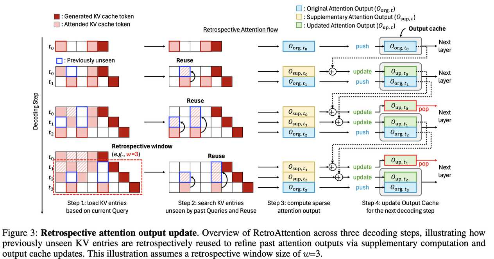

# Retrospective Sparse Attention for Efficient Long-Context Generation

> Seonghwan Choi, Beomseok Kang, Dongwon Jo, Jae-Joon Kim
> Seoul National University



> ⚠️ **本文由 AI Agent 自动生成**，基于 arXiv:2508.09001v1 论文全文阅读与分析。生成时间：2025 年 6 月。

---

## 一句话总结

RetroAttention 通过在后续解码步骤中利用新加载的 KV 条目回溯修正先前步骤的注意力输出，以极低的额外开销（<1ms/token）实现更高质量的长文本生成，有效 KV 暴露量提升最高 1.6×，准确率最高提升 21.9%。

---

## 摘要翻译

大型语言模型（LLM）越来越多地应用于推理、代码生成和多轮对话等长上下文任务。然而，扩展上下文的推理被 KV 缓存所瓶颈——其内存占用随序列长度线性增长，并在每个解码步骤中主导延迟。虽然近期的 KV 缓存压缩方法能够识别和加载重要 token，但它们主要关注输入上下文，未能解决长解码过程中产生的累积注意力误差。本文引入 RetroAttention，一种新颖的 KV 缓存更新技术，它利用后续解码步骤中到达的新 KV 条目回溯修正过去的注意力输出。通过维护轻量级的输出缓存，RetroAttention 使过去的查询能够高效访问更相关的上下文，同时仅带来极小的延迟开销。这打破了固定注意力输出范式，允许对先前的近似进行持续修正。在长生成基准上的大量实验表明，RetroAttention 持续超越 SOTA KV 压缩方法，有效 KV 暴露量提升最高 1.6×，准确率提升最高 21.9%。

---

## 研究动机

### 核心问题

在长上下文生成场景下（如推理、代码生成、多轮对话），KV 缓存的内存占用随序列长度线性增长，成为推理瓶颈。现有 KV 缓存压缩方法主要分为两类：

1. **基于驱逐的方法**（如 StreamingLLM、H2O、TOVA）：永久丢弃部分 KV 条目，但被丢弃的 token 在后续解码中可能重新变得重要，导致累积误差。
2. **非驱逐方法**（如 Quest、InfLLM）：保持完整 KV 缓存但稀疏加载，允许重新访问先前不相关的条目，但仍然只关注当前步骤的查询，无法纠正先前步骤中的近似误差。

### 关键观察

论文通过动机实验发现：

- **当前加载的 KV 条目对先前查询也有用**：约 70-80% 的当前 KV 条目在先前步骤中曾位于 top-k 集合内，约 15-20% 曾位于 next-k 范围但被遗漏。
- **回溯更新可显著提升有效 KV 预算**：通过利用未来查询加载的 KV 条目补充先前查询，有效 KV 暴露量在 n=7 步时达到 1.60×，而无需增加实际 KV 缓存预算。

### 根本挑战

随着生成长度增加，基于稀疏注意力的压缩模型与全注意力模型之间的性能差距逐渐扩大（如在 PG-19 上，生成 8k token 时相对困惑度达到 1.24）。这是一个根本性问题：现有的稀疏注意力方法在每个解码步骤中仅优化当前查询的 KV 选择，但先前步骤的近似误差会随解码过程持续累积。

---

## 方法（技术细节）

RetroAttention 的核心思想是：**打破注意力输出的固定范式，利用后续步骤的 KV 条目回溯修正先前查询的注意力输出**。

### 3.1 基础：动态稀疏注意力（Quest）

RetroAttention 采用 Quest 的 KV 缓存选择策略。Quest 将每个 KV 缓存页抽象为 Kmin 和 Kmax（页内 Key 向量的逐元素最小值和最大值），用于高效估计 Query 与页的重要性：

$$\text{score}_j(Q) = \sum_i \max(Q_i K_{j,\min,i}, Q_i K_{j,\max,i})$$

该方法的特点是未被选中的 KV 条目不被永久丢弃，可在后续步骤中重新加载。RetroAttention 在此基础上，将焦点从"查询依赖的可变性"转向"条目的可复用性"。

### 3.2 回溯注意力输出更新

#### 3.2.1 补充注意力输出（Supplementary Attention Output）

在每个解码步骤中，RetroAttention 不仅为当前查询计算注意力，还回溯地为先前步骤计算额外的注意力输出：

- **原始输出** $O_{\text{org}, t}$：当前步骤的稀疏注意力输出（使用当前加载的 KV 页）
- **补充输出** $O_{\text{sup}, t}^{t+s}$：在 t+s 步，利用当前加载但先前未见的 KV 条目，为先前查询 $Q_t$ 计算的额外注意力输出

关键：通过一个掩码（mask）跟踪每个 KV 页最近被加载的步骤，以识别"先前未见"的条目，避免重复更新。

#### 3.2.2 注意力输出缓存（Attention Output Cache）

回溯更新需要访问先前步骤的注意力输出（这些输出通常在解码步骤后被丢弃）。RetroAttention 引入注意力输出缓存来存储这些输出：

- **缓存大小**：$(w-1, B, L, D)$，其中 $w$ 是回溯窗口大小，$B$ 是批大小，$L$ 是层数，$D$ 是隐藏维度。该大小与生成长度无关。
- **三个操作**：
  1. **Push**：每个解码步骤的注意力输出存入缓存
  2. **Update**：当补充输出可用时，利用加权组合更新缓存中的输出（支持原始→更新和更新→再更新）
  3. **Pop**：当缓存条目超过窗口大小时，驱逐最旧条目

#### 3.2.3 注意力输出更新公式

受 FlashAttention 启发，原始 softmax 方程可重写为原始输出和补充输出的线性组合：

$$O_{\text{up}, t}^{t+1} = \frac{\alpha_{\text{org}} \cdot O_{\text{org}, t} + \alpha_{\text{sup}}^{t+1} \cdot O_{\text{sup}, t}^{t+1}}{\alpha_{\text{org}} + \alpha_{\text{sup}}^{t+1}}$$

该过程递归应用于后续步骤，逐步修正先前查询的注意力输出。

### 3.3 回溯 KV 缓存更新（Retrospective KV Cache Update）

回溯更新不仅影响单个层内的注意力输出，还通过层间传播影响深层的 KV 缓存：

- 对于最新步骤 $t_3$：层 $l+1$ 首次生成 $Q_{t_3}$, $K_{t_3}$, $V_{t_3}$，新增到 KV 缓存
- 对于先前步骤 $t_1$-$t_2$：使用更新后的注意力输出重新嵌入，生成新的 KV 条目 $\hat{K}_{t_1}$, $\hat{V}_{t_1}$，**覆盖**先前基于原始输出生成的旧 KV 条目

这样，下游步骤访问这些 KV 条目时，受益于更高质量的注意力状态。

### 3.4 开销分析

RetroAttention 利用解码阶段的闲置并行性（GEMV 操作导致极低的 PE 利用率），通过战略性设计使额外计算仅带来极小开销：

**注意力层**：
- FLOPs 与回溯窗口大小 $w$、加载页数 $k_{\text{page}}$、Query 头数 $h_q$、页内 token 数 $P$、头维度 $d$ 成正比
- 内存 I/O 比率接近 1（因为 KV 加载主导内存访问）
- 在 $w < 100$ 时保持内存瓶颈，延迟主要由内存驱动

**线性层**：
- 输入矩阵大小为 $w \times b \times D$，但当 $wb$ 低于几百时保持内存瓶颈
- 内存流量增加 $w$ 倍，但权重矩阵维度（$D_{\text{in}} \times D_{\text{out}}$）主导，仅产生极小延迟开销

### 3.5 算法流程（Algorithm 1）

```
输入: 页选择器 PAGESELECT; 查询 Qi:t, 键 Ki:t, 值 Vi:t; K/V 缓存 C; 缓存输出 Oi:t-1; 缓存 LSE Zi:t-1; 窗口大小 w
输出: 输出 Oi:t; 更新后的缓存 C

1. i ← t - w + 1                    // 窗口起始索引
2. UpdateKV(Ki:t-1, Vi:t-1, C)     // 更新先前 KV 条目
3. AppendKV(Kt, Vt, C)              // 追加当前 KV 条目
4. St ← PAGESELECT(Qt, C)           // 选择当前页
5. M ← UpdateAndBuildMask(St, C)    // 更新并构建掩码
6. (Oi:t, Zi:t) ← Attention(Qi:t, St, M, C)  // 计算注意力
7. (Oi:t-1, Zi:t-1) ← MergeOutput(...)       // 合并缓存输出
8. CacheOutput(O..., Z..., C)       // 缓存当前输出
```

---

## 实验结果

### 数据集与设置

- **主要基准**：LONGGENBENCH（CSQA, GSM8K, MMLU）
- **推理任务**：AIME 2024, GPQA-DIAMOND, LIVECODEBENCH-V5
- **语言建模**：PG-19
- **模型**：LLAMA-3.1-8B-INSTRUCT（主要），DEEPSEEK-R1-DISTILL-LLAMA-8B（推理任务）
- **硬件**：NVIDIA A100 80G
- **实现**：基于 FlashInfer，采用 Quest 的页选择器

### 主要结果

#### LONGGENBENCH 准确率（相对 KV 预算 0.15，回溯窗口 w=2）

| 方法 | GSM8K (15/30/45) | MMLU (15/30/45) | CSQA (15/30/45) |
|------|------------------|-----------------|-----------------|
| Full Attention | 66.7/60.8/58.0 | 62.5/58.7/57.1 | 73.5/74.1/71.9 |
| StreamingLLM | 0.0/0.0/0.0 | 1.2/2.1/2.5 | 0.8/1.1/4.0 |
| TOVA | 0.2/0.3/0.2 | 9.7/8.7/9.4 | 6.7/6.3/11.1 |
| Quest | 58.2/50.9/48.6 | 58.8/54.9/50.6 | 70.9/53.5/46.1 |
| **RetroAttention** | **61.3/52.6/55.4** | **59.3/55.4/51.2** | **68.8/59.1/53.0** |
| Δ(Ours-Quest) | +3.1/+1.7/+6.8 | +0.5/+0.5/+0.6 | -2.1/+5.7/+6.9 |

#### 推理任务准确率

| 方法 | AIME 2024 | GPQA-DIAMOND | LIVECODEBENCH-V5 |
|------|-----------|--------------|------------------|
| Full Attention | 47.1 | 38.9 | 37.6 |
| Quest | 33.8 | 33.6 | 32.7 |
| **RetroAttention** | **39.2** | **33.6** | **34.1** |
| Δ(Ours-Quest) | **+5.4** | 0.0 | +1.4 |

#### 关键性能指标

- **有效 KV 暴露量**：最高提升 1.6×（n=7 步）
- **准确率提升**：平均 5.6%，最高 21.9%
- **内存开销**：CSQA 3.0%，MMLU 1.6%，GSM8K 2.0%
- **延迟开销**：w=2 时 <1ms/token，w=8 时 ~2ms/token，不随上下文长度变化

#### 语言建模（PG-19）

- RetroAttention 在所有生成长度区间内持续降低困惑度
- 增大回溯窗口 $w$（2→8）性能逐渐接近全注意力基准
- 超过 w=8 后增益趋于饱和

### 消融实验

- **回溯窗口大小**：w=2/4/8/16，随着 w 增大，RetroAttention 逐渐接近全注意力性能
- **KV 预算**：在给定预算下，RetroAttention 相比 Quest 显著提升准确率，且内存流量增加可忽略

---

## 优势

1. **突破性思路**：首次提出"回溯修正"范式，打破注意力输出的固定性，允许在后续步骤中持续修正先前步骤的近似误差
2. **零额外 KV 预算**：不增加实际 KV 缓存大小，仅通过复用后续步骤加载的 KV 条目提升有效暴露量
3. **极低开销**：延迟增加 <1ms/token（w=2），内存开销 1.6%-3.0%，不影响系统吞吐量
4. **广泛适用性**：可与任何非驱逐动态稀疏注意力方法结合（不限于 Quest）
5. **层级传播**：通过层间 KV 缓存覆盖机制，将修正效果传递到深层网络
6. **实验验证充分**：在多数据集（CSQA/GSM8K/MMLU/AIME/GPQA/LCB）和多模型上验证了有效性

---

## 局限

1. **回溯窗口有限**：性能增益在 w>8 后趋于饱和，无法无限扩展
2. **Query 表示漂移**：回溯更新使用跨步骤的 Query，由于 Query 表示随更新演变，存在近似误差（论文假设跨步骤变化 <5% for Q/K, <10% for V）
3. **非驱逐方法依赖**：RetroAttention 依赖于非驱逐的稀疏注意力方法（如 Quest），无法直接应用于驱逐式方法
4. **仅验证 8B 模型**：实验仅在 8B 参数模型上进行，未在更大规模模型上验证
5. **显式掩码开销**：需要维护每个 KV 页每个头的最后一次加载步骤信息，增加额外内存
6. **对长文本输入的有效性**：主要针对长生成（解码阶段），对长输入的预填充阶段未做优化

---

## 与 EfficientPaper 相关的研究方向

### 1. KV 缓存压缩（KV Cache Compression）
RetroAttention 是 EfficientPaper 中 `kv_cache_sparse` 和 `kv_cache_management` 关键词下的重要工作。它通过回溯修正机制，提供了一种新的 KV 缓存优化范式，与 Quest 等现有方法形成互补。

### 2. 动态稀疏注意力（Dynamic Sparse Attention）
RetroAttention 与 Quest、InfLLM、SnapKV、ClusterKV 等方法同属非驱逐式动态稀疏注意力家族，但其创新在于关注注意力输出的持续修正，而非仅关注当前步骤的 KV 选择。

### 3. 长文本生成优化（Long-context Generation）
论文专注于解码阶段的长生成场景，与 LONGGENBENCH 等基准和 DeepSeek-R1 等推理模型的长链思考场景密切相关。对于 EfficientPaper 中关注的长上下文推理（reasoning）、代码生成（code generation）和多轮对话（multi-turn dialogue）有直接应用价值。

### 4. 推理效率（Inference Efficiency）
RetroAttention 通过利用解码阶段的闲置并行性实现极低开销的回溯更新，这与 EfficientPaper 关注的"高效推理"主题一致。其延迟分析和内存分析为 KV 缓存压缩方法的开销评估提供了理论框架。

### 5. 与相关工作的对比
- **与 Quest 的关系**：RetroAttention 建立在 Quest 之上，使用其页选择器作为基础，但在注意力输出层面增加了回溯修正机制
- **与 Rectified Sparse Attention（Sun et al. 2025）的对比**：后者通过周期性使用密集注意力刷新先前输出，但计算开销显著更大，而 RetroAttention 通过复用 KV 条目避免了额外的密集注意力计算
- **与 Reasoning Path Compression（Song et al. 2025）的关系**：后者利用推理轨迹的语义稀疏性，属于驱逐式方法，与 RetroAttention 的非驱逐思路形成对比

---

*本 note 由 AI Agent 自动生成，基于 arXiv:2508.09001v1 全文阅读。*
