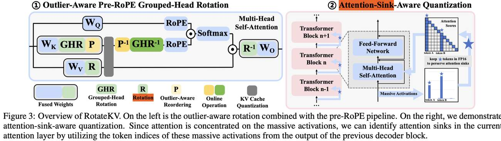

# RotateKV: Accurate and Robust 2-Bit KV Cache Quantization for LLMs via Outlier-Aware Adaptive Rotations

> Zunhai Su, Zhe Chen, Wang Shen, Hanyu Wei, Linge Li, Huangqi Yu, Kehong Yuan

> ⚠️ **本 note 由 AI Agent 自动生成（Hermes Agent, Nous Research），基于论文全文阅读撰写，仅供参考。**

---

## 一句话总结

**RotateKV 是一种面向 LLM 的 2-bit KV Cache 量化方法，通过提出 Outlier-Aware 旋转、Pre-RoPE 分组头旋转和 Attention-Sink 感知量化三项创新，在极低比特下实现高精度、高鲁棒性的 KV 缓存压缩，同时大幅降低显存占用、提升吞吐量。**

---

## 摘要翻译

KV 缓存通过避免对过去 Key-Value 的重复计算来提升大语言模型（LLM）推理效率。随着批大小和上下文长度的增加，过大的 KV 缓存成为显著的内存瓶颈，亟需高效压缩。现有的 KV 量化方法依赖细粒度量化或保留大量高比特缓存，这既损害压缩比，又难以在极低平均比特宽度下保持鲁棒性。

本文探索旋转技术在 2-bit KV 量化中的潜力，提出 RotateKV，通过以下三项创新实现准确且鲁棒的性能：（i）**Outlier-Aware 旋转**：利用通道重排序使旋转适应不同通道的离群值分布，同时保持快速 Walsh-Hadamard 变换（FWHT）的计算效率；（ii）**Pre-RoPE 分组头旋转**：缓解旋转位置编码（RoPE）对 Outlier-Aware 旋转的影响，并在多个注意力头之间进一步平滑离群值；（iii）**Attention-Sink 感知量化**：利用大量激活值（massive activations）精确识别和保护注意力汇聚点（attention sinks）。

RotateKV 在 LLaMA-2-13B 上以 2-bit 量化实现 WikiText-2 上低于 0.3 的困惑度（PPL）退化，保持强大的 CoT 推理和长上下文能力，在 GSM8K 上仅低于 FP16 基线 1.7%，在更低平均比特宽度下仍优于现有方法。此外，RotateKV 实现了 **3.97× 峰值显存缩减**，支持 **5.75× 更大批大小**，并达到 **2.32× 解码加速**。

---

## 研究动机

### 背景问题
- KV 缓存是 LLM 推理的核心机制，但随上下文长度和批大小增长，显存消耗急剧上升，成为推理瓶颈。
- 现有 KV 缓存量化方法主要分为两类：
  - **按通道（per-channel）量化**（如 KIVI、GEAR、KVQuant）：因 Key 中存在显著通道离群值，需细粒度量化或保留部分高比特缓存，压缩效率受限。
  - **按 token（per-token）量化**（如 ZipCache、MiKV、SKVQ）：关注 token 间显著性差异，分配高比特给重要 token，同样牺牲压缩比。
- 两种方法在极低比特（如 2-bit）下难以维持鲁棒性。

### 核心洞察
- **旋转技术**（Hadamard 变换）在 4-bit LLM 量化中已展现消除离群值的潜力，但其在极低比特 KV 量化中的潜力尚未被充分挖掘。
- 现有旋转方法（如 QuaRot、SpinQuant）存在三个关键局限：
  1. 对所有注意力头应用**相同旋转矩阵**，无法适应不同头的通道离群值分布。
  2. 旋转在 **RoPE 之后**进行，RoPE 破坏了通道幅度一致性。
  3. 对注意力汇聚点的处理仅保留序列开头的 sink token，忽略了其他位置的 sink。

---

## 方法（技术细节）

RotateKV 的整体流程如图3所示，包含三大核心组件：

### 1. Outlier-Aware 旋转

**问题**：现有基于 FWHT 的旋转对所有头使用相同的 Hadamard 矩阵，无法适应不同注意力头中各异的通道离群值分布。

**方案**：提出 **通道重排序（channel reordering）**，在不破坏 FWHT 效率的前提下提升旋转对离群值的适应性。

- **重排序策略**：对每个 token 的 Key 通道按旋转后的值进行排序，通过重新排列通道来减少每个量化组内的离群值。
- **校准过程**（Algorithm 1）：
  1. 对旋转后的 Key 状态 K 进行 reshape
  2. 计算每个通道的总和
  3. 按通道总和排序得到重排序索引
- **关键特性**：重排序索引通过快速校准获得，在所有 token 推理过程中保持一致，无需存储多个矩阵。
- **实验验证**（Table 1）：在 LLaMA-2-7B 上测试多种 outlier-aware 策略（smoothing、reordering、rotate 等组合），发现旋转+重排序的组合在 2-bit 下表现最佳（PPL=6.33），而 smooth 在 2-bit 下完全失败（PPL=16.97）。

### 2. Pre-RoPE 分组头旋转

**问题**：现有方法在 RoPE 之后对每个头单独进行旋转，存在两个局限：
1. RoPE 破坏了 Key 的通道幅度一致性（Figure 6），使得旋转的离群值抑制效果大打折扣。
2. 旋转局限于单个头内部，无法跨头平滑离群值。
- 实验表明（Table 2），RoPE 导致量化误差增加 145%。

**方案**：
- **Pre-RoPE 管线**：将 outlier-aware 旋转移到 RoPE 之前，消除 RoPE 对旋转的负面影响，同时允许将旋转和重排序操作融合到权重中，推理时仅需执行逆操作。
- **分组头旋转（Grouped-Head Rotation）**：将多个注意力头分组进行联合旋转，实现跨头的离群值平滑。
- **分组大小选择**（Table 3）：平衡计算开销与性能收益，4 个头一组是合理选择（PPL=6.99，FLOPs 增加有限）。

### 3. Attention-Sink 感知量化

**问题**：现有方法仅保留序列开头的 sink token，忽略了其他位置的注意力汇聚点。原因在于高效的注意力计算（如 FlashAttention）不暴露中间注意力分数，无法动态识别额外的 sink token。

**方案**：利用 **massive activations**（Transformer 块输出残差求和中显著大于其他值的激活）来间接识别注意力汇聚点。

- **原理**：研究表明，当 massive activations 出现时，对应 token 会吸引集中注意力，形成 attention sink。
- **实现**：
  1. 利用前一个 decoder 块输出的 massive activation 的 token 索引
  2. 在当前注意力层中识别额外的 sink token
  3. 在量化过程中将这些 token 保持在 FP16 精度
- **实例**（Figure 5）：在 LLaMA-2-7B 中，Block 10 的输出在 token 0 和 110 的通道 1415 和 2533 出现 massive activations，后续注意力层的注意力集中在 token 0 和 110 上。

### 整体流程（Summary）

1. 快速校准获取重排序索引
2. 将分组头旋转和通道重排序融合到 Key 权重中
3. 对 Key 执行 outlier-aware 旋转，使其更适合量化
4. 更新 KV 缓存时，执行在线逆重排序和逆旋转
5. 对 Value 采用简单的离线旋转（因 Value 无显著离群值）
6. 量化采用 per-token 非对称整数量化，group size 为 128，scale 用 FP8 存储，zero-point 用 INT8 存储

---

## 实验结果

### 1. Perplexity 评估（WikiText-2）

| 方法 | LLaMA-2-7B | LLaMA-2-13B | LLaMA-3-8B | Mistral-7B |
|------|-----------|------------|-----------|-----------|
| FP16 | 5.12 | 4.57 | 5.75 | 4.91 |
| QuaRot-2bit | 8.94 | 6.96 | 21.43 | 6.62 |
| KVQuant-2bit | 5.59 | 4.95 | 6.75 | 5.34 |
| **RotateKV-2bit** | **5.50** | **4.84** | **6.69** | **5.24** |

- 在 LLaMA-2-13B 上 2-bit PPL 仅退化 0.27（4.57→4.84）
- 相比 QuaRot 在 2-bit 下 PPL 大幅降低
- 相比 KVQuant 在所有模型上 2-bit PPL 均有约 0.1 的改善
- 使用更简单的整数量化（而非 KVQuant 的非均匀量化）

### 2. GSM8K 推理能力（CoT 8-shot）

| 方法 | LLaMA-2-7B | LLaMA-2-13B | LLaMA-3-8B | Mistral-7B | 平均比特 |
|------|-----------|------------|-----------|-----------|---------|
| FP16 | 14.18 | 25.40 | 51.33 | 42.68 | 16 |
| KIVI | 13.19 | 24.64 | 43.44 | 39.12 | 2.50 |
| **RotateKV** | **13.95** | **25.09** | **50.49** | **42.99** | **2.25** |

- RotateKV 平均比特宽度最低（2.25），但 CoT 推理性能最优
- 相比 FP16 退化不到 1.7%
- 在更低比特下超越所有基线方法

### 3. 长上下文和多模态任务（LongBench & MileBench）

- 在 8 个任务上，KIVI（group size=128）在 LLaMA-2-7B 上平均性能退化 46.5%
- RotateKV 在相同 group size 下仅有不到 1.4% 的性能损失
- 在 Mistral-7B 和 LLaVA-v1.6-Mistral-7B 上表现尤其突出

### 4. Needle-in-a-Haystack（40K 上下文）

- RotateKV 在 40K 上下文长度下保持与 FP16 几乎相同的检索能力
- FP16 准确率 86.44%，RotateKV 准确率 86.40%，差异可忽略

### 5. 效率分析

- **峰值显存缩减**：3.97×
- **支持更大批大小**：5.75×
- **解码加速**：2.32×
- 使用 Triton 实现量化/反量化内核，CUDA 实现 FWHT

### 6. 消融实验

- **Table 7**（LLaMA-2-13B 2-bit PPL）：
  - Original Rotations: 6.96（退化 2.39）
  - + Pre-RoPE 分组头旋转: 5.67（降低 1.29）
  - + Attention-Sink 感知量化: 5.52（降低 0.15）
  - + Outlier-Aware 旋转: 4.84（降低 0.68）
- 每项创新都有显著贡献，尤其 Pre-RoPE 分组头旋转和 Outlier-Aware 旋转
- **Table 8**（量化粒度）：group size=32 时 LLaMA-2-13B 2-bit PPL=4.75，进一步改善

---

## 优势

1. **极低比特高精度**：在 2-bit 量化下 PPL 退化极小（<0.3），优于所有现有方法
2. **无需调优（tuning-free）**：校准过程高效（<5 分钟在单张 4090 上），无需搜索超参数
3. **多任务鲁棒性**：在 CoT 推理、长上下文、多模态任务中均表现优秀
4. **显著效率提升**：3.97× 显存缩减，5.75× 更大批大小，2.32× 解码加速
5. **计算效率保持**：使用 FWHT 保持 O(n log n) 复杂度，重排序索引通过快速校准获得
6. **简单量化方案**：使用 per-token 非对称整数量化，无需复杂的非均匀量化
7. **通用性**：校准在 WikiText-2 上进行，可有效泛化到其他数据集
8. **首篇工作**：据作者所知，是首个全面探索旋转技术在极低比特 KV 量化中潜力的方法

---

## 局限

1. **在线计算开销**：预 RoPE 分组头旋转需要在线逆操作，可能增加推理延迟
2. **校准依赖**：需要对校准数据进行离线处理，虽然高效但仍是额外步骤
3. **分组大小权衡**：分组头旋转的头数增加可改善 PPL，但同时增加计算成本
4. **注意力 sink 识别的间接性**：依赖 massive activations 间接识别注意力汇聚点，可能不完全精确
5. **硬件优化空间**：当前实现可通过内核融合进一步优化，当前实现仍有改进空间
6. **校准泛化性**：虽然实验表明 WikiText-2 校准可泛化到其他数据集，但对极端分布的泛化能力仍需验证
7. **仅探索了 KV 缓存旋转**：虽然 Value 采用简单离线旋转，但未深入探索 Value 旋转的潜力

---

## 与 EfficientPaper 相关的研究方向

### 基线方法
RotateKV 的 baseline 包括：
- **2024/KIVI**：per-channel 2-bit KV 量化，使用 per-channel 量化和残差保留
- **2024/KVQuant**：非均匀量化 + per-vector dense-and-sparse 量化，保留 0.5% FP16 离群值
- **2024/MiKV**：重要性感知混合精度量化
- **2024/ZipCache**：准确高效的 KV 缓存量化，基于显著 token 识别
- **2024/GEAR**：近无损生成推理的 KV 缓存压缩方案

### 相关研究方向

1. **KV 缓存量化**：本论文的核心方向，属于 KV 缓存压缩的量化方法，与 KIVI、KVQuant、ZipCache、GEAR、SKVQ 等方法直接竞争
2. **LLM 量化**：本方法属于后训练量化（post-training quantization），与 GPTQ、AWQ、QuaRot、SpinQuant 等方法相关
3. **旋转技术（Rotation-based Quantization）**：Hadamard 变换在 LLM 量化中的应用，与 QuaRot、SpinQuant、ResQ 等方法相关
4. **注意力汇聚点（Attention Sinks）**：利用 attention sink 优化量化，与 IntactKV、SKVQ 等方法相关
5. **长上下文推理**：支持极长上下文（40K+）的 KV 缓存压缩，与 KVQuant 的 "10M context length" 目标相关
6. **多模态 LLM 推理**：在 VLM（LLaVA 等）上的实验验证了方法的通用性
7. **高效推理系统**：通过 KV 缓存压缩提升 LLM 推理效率，与 FlashAttention、QServe 等系统级优化方法互补

### 代码
- GitHub: https://github.com/ZunhaiSu/RotateKV
- 框架: Pytorch
