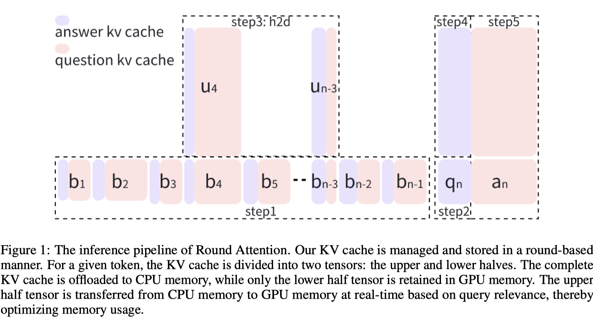

# Round Attention: A Novel Round-Level Attention Mechanism to Accelerate LLM Inference

> Yaohua Tang, Zhicheng Hu, Kun Cheng, Fan Mo, Qiheng Lv, Hua Wang, Zhi Chen

## Abstract

The increasing context window size in large language models (LLMs) has improved their ability to handle complex, long-text tasks. However, as the conversation rounds continue, it is required to store a large amount of KV cache in GPU memory, which significantly affects the efficiency and even availability of the model serving systems. This paper analyzes dialogue data from real users on the granularity of round and discovers that the LLM inference manifests a watershed layer, after which the distribution of round-level attention shows notable similarity. Based on this, we propose Round Attention - a novel round-level attention mechanism that selectively processes the KV cache of top-k relevant rounds, where k is dynamically determined through the attention matrix in the watershed layer. Theoretical analysis demonstrates that our method reduces memory usage by 54\% to 82\%, while experimental results confirm that loading sparse critical-round KV cache maintains answer accuracy without performance degradation.

KV cache offload 到cpu中，在每轮对话（round) ,根据上一轮的对话中的kv cache的重要性，选取topk load到gpu中，从而节省HBM空间和计算需求