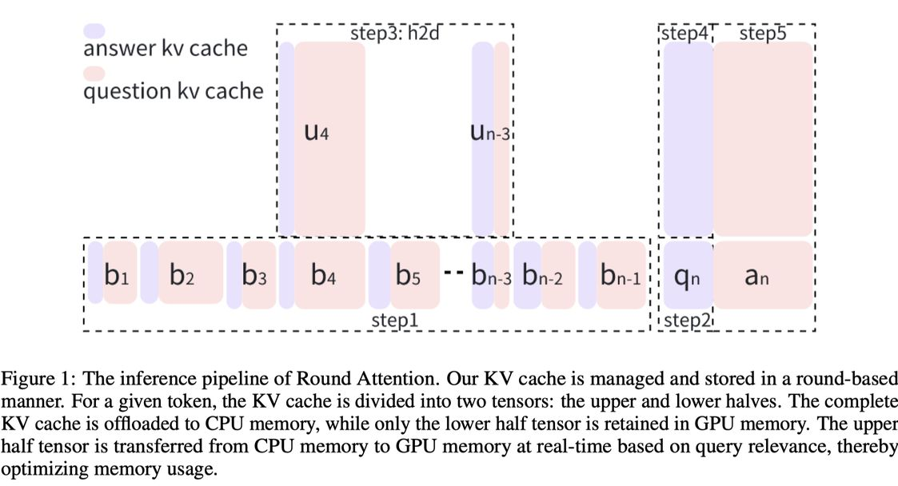

# Round Attention: A Novel Round-Level Attention Mechanism to Accelerate LLM Inference

> Yaohua Tang, Zhicheng Hu, Kun Cheng, Fan Mo, Qiheng Lv, Hua Wang, Zhi Chen
> Moore Threads AI

> ⚠️ **本 note 由 AI Agent（Hermes）自动生成，基于 arXiv 论文 2502.15294v3 的全文内容分析。生成时间：2026-06-04。**

---

## 一句话总结

**Round Attention 是一种基于对话轮次（round）粒度的 KV cache 稀疏化方法，通过在"分水岭层"一次性计算 top-k 相关轮次，将 KV cache 从 GPU 卸载至 CPU 内存并按需加载，实现 54%–82% 的 GPU 显存节省和更低的推理延迟，且不损失回答质量。**

---

## 摘要翻译

随着大语言模型（LLM）上下文窗口的增大，其处理复杂长文本任务的能力得到了显著提升。然而，随着对话轮次的持续增加，需要在 GPU 显存中存储大量 KV cache，这严重影响了模型服务系统的效率甚至可用性。本文在轮次粒度上分析了真实用户的对话数据，发现 LLM 推理中存在一个"分水岭层"（watershed layer），在此层之后，轮次级别的注意力分布表现出显著的相似性。基于此发现，我们提出了 Round Attention——一种新颖的轮次级别注意力机制，该机制选择性地处理 top-k 相关轮次的 KV cache，其中 k 通过分水岭层的注意力矩阵动态确定。理论分析表明，该方法可将显存使用量减少 54% 至 82%；实验结果证实，加载稀疏关键轮次的 KV cache 能够保持回答准确率，无性能下降。

---

## 研究动机

1. **KV cache 显存瓶颈**：随着 LLM 上下文窗口增长（如 128K），KV cache 占用大量 GPU 显存。例如，NVIDIA A100 40GB 显卡仅能容纳一个 128K 上下文的 LLaMA 请求，且近 50% 的处理时间用于 KV cache 访问。
2. **现有方法的不足**：
   - **Token 级稀疏注意力**（如 H2O、Quest）：仍在 GPU 中保存全部 KV cache，仅在自回归生成时选择重要 token，不减少显存总量。
   - **CPU 卸载方法**（如 ShadowKV、MagicPig）：将 KV cache 存入 CPU，但以 token 粒度逐层传输，导致大量 h2d（host-to-device）通信开销。
   - 以上方法在每层都需要计算 top-k，增加了额外的计算开销。
3. **轮次粒度的优势被忽视**：现有工作大多局限于 token 粒度，但 LONGMEMEVAL 基准测试表明，轮次（round）是存储和利用交互历史的最佳粒度。
4. **关键发现**：
   - **观察 1**：同一轮次中，"问题"和"答案"对历史轮次的注意力分布高度相似（仅需对问题做 prefill 即可确定重要轮次）。
   - **观察 2**：从某一层开始，各层之间的轮次注意力分布变得高度相似（"分水岭层"效应），意味着只需在分水岭层计算一次 top-k，后续层可直接复用。

---

## 方法（技术细节）

### 3.1 轮次注意力分布分析

以对话轮次 `<q, a>` 对为基本分析单元。对于层 l，定义轮次 k 的注意力分数：

- **问题注意力**：$qAtt_k^l = \sum_{i \in q_n, j \in <q_k, a_k>} Att(Q_i^l, K_j^l)$
- **答案注意力**：$aAtt_k^l = \sum_{i \in a_n, j \in <q_k, a_k>} Att(Q_i^l, K_j^l)$

归一化后得到分布 $P_q^l$ 和 $P_a^l$。

**分析方法**：使用 ShareGPT 数据集和 Qwen2.5-0.5B 模型，计算层间 KL 散度来发现分水岭层。

### 3.2 推理流程（Round Attention Pipeline）

将 KV cache 按轮次存储为两个张量：
- **$b^m$**：第 1 至 Lw 层的 KV cache（低层，始终在 GPU）
- **$u^m$**：第 Lw+1 至 L 层的 KV cache（高层，按需从 CPU 加载）

推理步骤：
1. **Step 1**：将 $b^1 \ldots b^{n-1}$ 从 CPU 加载到 GPU
2. **Step 2**：对 $q_n$ 在层 1~Lw 上执行 prefill
3. **Step 3**：利用 $qAtt^{L_w}$ 选择 top-k 相关轮次，将对应的 $\{u^m\}_{m \in top\text{-}k}$ 从 CPU 传到 GPU
4. **Step 4**：完成剩余层的 prefill
5. **Step 5**：自回归解码 $a_n$

**核心优势**：以轮次为粒度进行整体张量传输（而非 token 级碎片化传输），充分利用 PCIe 带宽；且仅在分水岭层计算一次 top-k，避免逐层重复计算。

### 3.3 三种 Top-k 轮次选择策略

| 策略 | 方法 | 参数 |
|------|------|------|
| **固定轮次（Fixed）** | 选择注意力分数 > 阈值的轮次 | $v = 0.1$ |
| **Top-k 轮次** | 选择注意力分数 top 10% 的轮次 | 占 80%+ 累积注意力 |
| **自适应轮次（Adaptive）** | 选择分数 > mean + k×std 的轮次 | 动态阈值 |

实验表明 **top-k 策略** 效果最佳。

### 3.4 KV cache Dropping

某些轮次的 KV cache 从不被激活，即使移除也不影响推理质量，可直接丢弃以节省空间。

### 3.5 显存节省分析

设上下文长度 S、隐藏维度 H、总层数 L、批次大小 B，KV cache 总量：

$$M_{orig} = 4 \cdot B \cdot S \cdot H \cdot L$$

Round Attention 的显存：

$$M_{round} = 4B \cdot S \cdot H \cdot L_w + 4B \cdot \frac{K}{T} \cdot S \cdot H \cdot (L - L_w)$$

节省比例：

$$\frac{M_{round}}{M_{orig}} = \frac{L_w}{L} + \frac{K}{T}(1 - \frac{L_w}{L})$$

当 K << T 时，近似为 $L_w / L$，即 **54%–82%** 的显存节省。

---

## 实验结果

### 实验设置
- **数据集**：ShareGPT（52K 用户对话）、LONGMEMEVAL（长上下文记忆基准）
- **模型**：Qwen2.5（0.5B/1.5B/3B/7B/14B/72B）、Llama3-8B、Llama3.1-8B、Llama3.2（1B/3B）
- **硬件**：NVIDIA A100 80GB GPU + Intel Xeon Gold 6346 CPU（1TB 内存）
- **评估方法**：GPT-4o 作为 Judger，每条回答评估 5 次取平均

### 准确率评估（ShareGPT）

| 方法 | mini | small | medium | large | 平均 |
|------|------|-------|--------|-------|------|
| Flash Attention | 7.51 | 7.49 | 7.42 | 7.49 | 7.477 |
| Round Attention (top-k) | 7.50 | 7.47 | 7.50 | 7.46 | **7.483** |

- 大轮次（50-100 轮）下 token 处理量减少 **88%**
- 多模型泛化验证：Qwen2.5、Llama3 系列均表现接近标准推理

### LONGMEMEVAL 基准（客观任务）

| 模型 | Flash | Round |
|------|-------|-------|
| Llama3-8B | 0.250 | 0.242 |
| Qwen2.5-7B | 0.114 | **0.240** |

- Qwen2.5-7B 上 Round Attention 准确率是 Flash Attention 的 **2 倍**
- 时间推理任务中 Round Attention 持续优于 Flash Attention（避免过量信息干扰）

### 显存与延迟
- **显存节省**：54%–82%（取决于模型的分水岭层位置）
- **延迟降低**：所有轮次类别下 Round Attention 延迟均低于 Flash Attention
- **延迟分解**：仅在 Lw 层有一次轻微的 top-k 计算 + h2d 传输峰值，decode 阶段持续节省

### 轮次 vs Token 粒度对比

| 粒度 | 综合准确率 |
|------|-----------|
| Token 级 | 0.16 |
| Round 级 | **0.20** |

- Round 粒度在 Single-session-assistant 任务上优势显著（0.4545 vs 0.1818）

---

## 优势

1. **显存节省显著**：54%–82% 的 GPU 显存节省，适用于长对话场景
2. **一次计算，多层复用**：利用分水岭层特性，仅需计算一次 top-k，减少计算开销
3. **轮次级张量传输**：以完整轮次为单位进行 h2d 传输，充分利用 PCIe 带宽，避免碎片化通信
4. **无损或提升的准确率**：在多个模型和数据集上，Round Attention 与标准 Flash Attention 持平甚至更优
5. **通用性强**：适用于 Qwen2.5、Llama3 等多种开源模型
6. **延迟更低**：decode 阶段的 KV cache 减少带来的计算节省，最终超过 top-k 选择和 h2d 传输的一次性开销
7. **KV cache Dropping**：进一步丢弃不活跃轮次的 KV cache，节省更多空间

---

## 局限

1. **CPU 内存开销**：虽然 CPU 内存比 GPU 显存便宜，但仍需额外的系统内存开销
2. **超长对话 OOM 风险**：当对话轮次达到一定阈值时，Round Attention 仍可能出现 GPU OOM，需与其他压缩技术（如 KV cache Dropping、量化等）结合使用
3. **短对话收益有限**：对于较短的对话（<10 轮），Round Attention 的优势不明显，更适合长对话场景
4. **分水岭层预设**：需要针对不同模型预先确定分水岭层位置（Lw），增加了部署复杂度
5. **无开源代码**：论文未提供开源实现（code url 为空），难以直接复现
6. **评估方式主观性**：ShareGPT 的评价依赖 GPT-4o 作为 Judger，可能存在偏差

---

## 与 EfficientPaper 相关的研究方向

本论文属于 **KV cache 稀疏化与管理（kv_cache_sparse / kv_cache_management）** 领域，与 EfficientPaper 中以下研究方向高度相关：

1. **KV Cache 压缩与驱逐**：如 H2O、FastGen、TOVA、StreamingLLM、Quest、SparQ 等，均在 token 粒度上压缩 KV cache
2. **KV Cache CPU 卸载**：如 ShadowKV（低秩 key + 价值缓存卸载）、MagicPig（LSH 采样 + CPU 端计算）、RetrievalAttention（向量检索加速）、InfiniGen（动态 KV cache 管理）
3. **注意力稀疏性**：如 Deja Vu（上下文稀疏性）、Dynamic Sparse Attention（动态稀疏注意力）
4. **层级冗余**：如 ShortGPT（层级冗余）、Cross-Layer Attention Sharing（跨层注意力共享）、Inter-Layer Attention Similarity（层间注意力相似性压缩）
5. **长上下文推理加速**：如 FlashAttention、FlashInfer 等高效注意力实现

**Round Attention 的独特贡献**在于将 KV cache 管理从 token 粒度提升到轮次粒度，利用"分水岭层"效应实现一次计算、多层复用，是一个有创意的工程优化方向。
