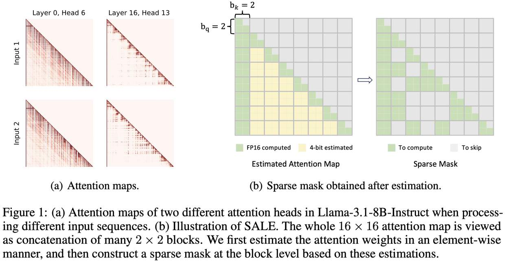

# SALE: Low-bit Estimation for Efficient Sparse Attention in Long-context LLM Prefilling

> **注意：本 note 由 AI Agent 自动生成，内容基于论文全文阅读，仅供参考。生成时间：2025-06-04。**

---

## 一句话总结

SALE 通过 4-bit 低精度量化近似注意力权重，并结合自定义相对注意力分数（Relative Attention Score）指标，在块级稀疏注意力框架下实现了细粒度的注意力图估计，以约 11% 的额外开销换取长序列预填充阶段至少 3.36 倍加速，同时保持模型精度几乎无损。

---

## 摘要翻译

许多先进的大型语言模型（LLM）应用需要长上下文处理，但在推理的预填充阶段，自注意力模块因与序列长度的二次时间复杂度而成为瓶颈。现有的稀疏注意力方法通过跳过注意力图中不太重要的区域来加速注意力计算，但这些方法通常对注意力图进行粗粒度检查，导致模型精度显著下降。本文提出 SALE，一种细粒度稀疏注意力方法，能够以可忽略的精度损失加速 LLM 的长上下文预填充阶段。SALE 通过 4-bit 量化的查询-键乘积实现快速准确的细粒度注意力权重估计，随后通过块稀疏注意力加速预填充计算。对于查询-键对的重要性评估，我们采用相对注意力分数（Relative Attention Score）指标，在我们的框架内提供显著更高的效率。我们实现了针对该方法优化的自定义 CUDA kernel 以提高硬件效率，将额外开销降低到全注意力延迟的大约 11%。值得注意的是，SALE 无需参数训练，且可通过极小的代码修改无缝集成到现有系统中。在长上下文基准测试上的实验表明，我们的方法在精度-效率权衡方面优于现有方法，在处理超过 64K 的序列时，在 Llama-3.1-8B 上实现了至少 3.36 倍的加速，同时保持模型质量。

---

## 研究动机

1. **长上下文推理瓶颈**：LLM 在预填充阶段的自注意力计算具有 O(N²) 时间复杂度，当序列长度增长时（如 64K、128K tokens），计算成本急剧上升，成为推理性能的主要瓶颈。

2. **现有稀疏注意力方法的不足**：
   - **静态稀疏模式**（如 stride、window、streaming pattern）：由于注意力稀疏分布高度动态，导致严重性能退化。
   - **动态稀疏方法**（如 MInference、SampleAttention）：依赖对注意力图的粗粒度近似（如 Vertical-Slash 分解），无法进行细粒度检查，精度损失较大。
   - **块级代理方法**（如 FlexPrefill、SpargeAttn、HiP Attention）：使用压缩 token 的注意力图作为真实注意力图的代理，同样存在粗粒度近似的问题。

3. **核心洞察**：注意力图中并非所有位置都同等重要，可以跳过大量不重要的注意力计算，但需要更细粒度的估计方法来实现更好的精度-效率权衡。

---

## 方法（技术细节）

### 整体架构

SALE 的流程分为三个顺序阶段：**量化（Quantization）** → **选择阶段（Selection-Pass）** → **计算阶段（Computation-Pass）**。

在 Selection-Pass 中，以块粒度选择重要的注意力区域并记录块坐标；在 Computation-Pass 中，仅对选中的块执行注意力计算。

### 1. 4-bit 注意力权重近似（4-bit Attention Weight Approximation）

- 使用 4-bit 量化的查询（Q）和键（K）矩阵 $\tilde{Q}$、$\tilde{K}$ 来近似注意力权重 $\tilde{S} = \tilde{Q}\tilde{K}^T / \sqrt{d}$。
- 量化解码（dequantization）的开销可忽略不计。
- 4-bit 量化使得利用高吞吐量低比特 Tensor Core 指令和减少 GPU 全局内存访问成为可能。
- 使用 SageAttention-2 提出的量化算法实现。
- 与全精度 16-bit 相比，4-bit 量化显著减少了额外开销（实验表明，不使用 QK 量化时计算开销大幅增加）。

### 2. 相对注意力分数（Relative Attention Score）

- **关键观察**：注意力图中每一行的 "sink-local" 区域（序列开头和末尾）的注意力分数通常持续较高，且在不同输入序列间保持一致。
- 设计了一个新的重要性评估指标 $\tilde{P}[i, j]$：
  - 先计算 sink-local 区域的全精度注意力权重，得到中间值 $\tilde{m}_i$（最大值）和 $\tilde{l}_i$（指数和）。
  - 相对注意力分数公式：$\tilde{P}[i, j] = \exp(\tilde{S}[i,j] - \tilde{m}_i) / \tilde{l}_i$
  - 如果块内所有 $\tilde{P}[i, j]$ 值都小于阈值 $\tau$（如 0.004），该块被标记为非关键块，在后续计算中跳过。
- **优势**：与传统的注意力分数（需要 Softmax）相比，计算开销极小，并且可以根据输入自适应调整稀疏度。

### 3. 逐头阈值校准（Per-head Threshold Calibration）

- 不同注意力头的注意力分数分布差异大，统一阈值会导致次优性能。
- **离线校准流程**：
  - 初始阈值 $\tau_0$（如 0.008），逐步减半 $\tau$ 直到误差 $Err(\tau) = \|O - \tilde{O}\|_1 / N$ 落在预定义误差界 $\theta$ 以下。
  - 通过调节 $\theta$ 可以控制稀疏度（Llama-3.1 默认 $\theta=0.4$，Qwen-2.5 默认 $\theta=2.0$）。
- 校准耗时约 5 分钟（RTX4090，Llama-3.1）。

### 4. 内核优化（Kernel Optimization）

1. **减少反量化操作**：利用 per-thread 量化策略，使同一线程内的所有元素共享相同的量化缩放因子，只需对最大近似注意力权重进行反量化。
2. **相对注意力分数比较优化**：通过数学变换 $\tilde{S}[i, j] \geq \ln(\tau \cdot \tilde{l}_i + \tilde{m}_i)$ 将复杂的除法和指数运算替换为单次浮点比较指令。
3. **与 SageAttention 集成**：Computation-Pass 阶段使用 SageAttention 的 QKV 量化策略进一步加速。

### 5. 实现细节

- **块大小**：$b_q = 64$，$b_k = 32$。
- **Sink 区域**：32 tokens；Local 区域：不超过 256 tokens。
- **CUDA 实现**：Selection-Pass 用 C++ CUDA 编写，量化用 Triton 编译器加速。
- **硬件**：8× RTX 4090（无 tensor-parallel/context-parallel）。
- **模型**：Llama-3.1-8B-Instruct、Qwen-2.5-32B-Instruct。

---

## 实验结果

### LongBench 评测

| 指标 | FA2 | MInference | FlexPrefill | SpargeAttn | **SALE** |
|------|-----|-----------|------------|-----------|----------|
| Llama-3.1 平均分 | 48.77 | 47.03 | 46.18 | 47.48 | **48.39** |
| Qwen-2.5 平均分 | 50.85 | 51.29 | 49.88 | 50.57 | **51.30** |
| Llama-3.1 加速比(64K) | 1.00× | 1.07× | 2.21× | 3.11× | **3.36×** |
| Qwen-2.5 加速比(64K) | 1.00× | 1.25× | 1.39× | 2.55× | **3.28×** |

- SALE 在两个模型上均实现了最佳的精度-效率权衡。
- Llama-3.1 上仅有轻微精度退化，Qwen-2.5 上甚至有所提升（可能因过滤噪声信息）。

### InfiniteBench 评测

| 指标 | FA2 | MInference | FlexPrefill | SpargeAttn | **SALE** |
|------|-----|-----------|------------|-----------|----------|
| Llama-3.1 平均分 | 37.75 | 27.47 | 33.55 | 35.83 | **37.11** |
| Qwen-2.5 平均分 | 28.66 | 30.70 | 29.50 | 28.02 | **30.92** |

- 在超长上下文（>100K）评测中同样实现最佳精度-效率权衡。

### Needle-In-A-Haystack 评测

- SALE 在 128K 长度上达到 96.0% 平均得分（仅比 FA2 的 96.1% 低 0.1%），同时实现 3.81× 端到端加速。

### 延迟分解

| 上下文长度 | 8K | 16K | 32K | 64K | 128K |
|-----------|-----|------|------|------|------|
| 量化+选择开销占比 | 23.9% | 16.7% | 13.3% | 11.5% | **11.1%** |
| Computation-Pass 加速比 | 2.08× | 3.04× | 4.23× | 5.57× | **6.87×** |

- 随序列长度增加，开销占比持续下降，加速效果持续提升。
- 注意力图检查的自定义 CUDA 实现仅占全注意力计算时间的约 11%。

### 消融实验

- **逐头阈值校准**：显著提升性能（Figure 3b）。
- **QK 量化**：使用 4-bit 量化显著减少开销；不使用量化时开销大幅增加，但可实现更高稀疏度和略低精度（Figure 5）。

---

## 优势

1. **无需训练**：SALE 是纯推理时方法，无需任何参数训练或微调，可无缝集成到现有系统。
2. **细粒度估计**：与现有的块级代理方法不同，SALE 通过 4-bit 量化实现逐元素的注意力权重估计，实现更高精度的稀疏掩码。
3. **自适应稀疏度**：通过相对注意力分数和逐头校准，SALE 可根据输入内容自适应调整稀疏度。
4. **高效实现**：自定义 CUDA kernel 优化（减少反量化、数学变换比较），额外开销仅约 11%。
5. **最佳精度-效率权衡**：在 LongBench、InfiniteBench、NIAH 三个基准测试中均优于所有基线方法。
6. **可扩展性**：序列越长加速效果越好，适应超长上下文需求。
7. **与量化正交**：Computation-Pass 集成 SageAttention 量化，进一步加速计算。

---

## 局限

1. **硬件依赖**：依赖高吞吐量 4-bit Tensor Core 指令（如 RTX 4090），在不支持高效 4-bit 矩阵乘法的硬件上可能失去性能优势。
2. **量化类型限制**：当前实现仅支持 Int4 量化，对于支持 FP4 GEMM 或 LUT-based 低比特 GEMM 的硬件需要额外适配（作者留作未来工作）。
3. **校准开销**：逐头阈值校准需要约 5 分钟（RTX 4090），且需要使用校准样本。
4. **预填充阶段限制**：SALE 主要针对预填充阶段，对解码阶段的注意力加速需要其他方法。
5. **精度损失**：在某些任务上（如 InfiniteBench 的 Math.Find、2WikiMQA），SALE 存在一定精度下降。
6. **块粒度限制**：稀疏掩码以块为粒度（b_q=64, b_k=32），可能无法完全适应所有注意力模式。

---

## 与 EfficientPaper 相关的研究方向

### 1. 稀疏注意力加速（Sparse Attention for Long-context）
- **MInference**（NeurIPS 2024）：动态稀疏注意力，使用 Vertical-Slash 模式。
- **FlexPrefill**（ICLR 2025）：上下文感知的块稀疏注意力。
- **SpargeAttn**（2025）：精确稀疏注意力加速。
- **HiP Attention**（ICLR 2025）：层级剪枝注意力。
- **SampleAttention**（2024）：自适应结构化稀疏注意力。
- SALE 通过细粒度 4-bit 估计在这些方法中实现了最佳精度-效率权衡。

### 2. 注意力量化（Attention Quantization）
- **SageAttention**（ICLR 2025）：8-bit 注意力量化。
- **SageAttention-2**（2024）：4-bit 注意力量化。
- SALE 将 4-bit 量化应用于注意力权重估计，而非最终计算，形成创新性结合。

### 3. KV 缓存压缩（KV Cache Compression）
- **H2O**（NeurIPS 2023）：Heavy-hitter oracle。
- **SnapKV**（NeurIPS 2024）：LLM 知道你在找什么。
- **Scissorhands**（NeurIPS 2023）：基于重要性持久性假设的 KV 缓存压缩。
- SALE 的方法与这些 KV 缓存压缩技术正交，可以结合使用进一步提升端到端推理效率。

### 4. 注意力 Sink 现象
- **StreamingLLM**（ICLR 2024）：注意力 sink 现象的发现。
- SALE 利用 sink-local 区域的注意力分数持续较高的观察来设计 Relative Attention Score 指标。

### 5. 训练时/推理时注意力加速对比
- SALE 是训练时免费的（training-free），属于推理时加速方法。
- **Native Sparse Attention**（2025）、**MOBA**（2025）等需要训练，与 SALE 形成对比。
- **Linear Attention**（RWKV、GLA）、**State Space Models**（Mamba）等替代方案需要全模型重训练，采用成本高。

### 6. CUDA Kernel 优化
- **FlashAttention**（NeurIPS 2022）、**FlashAttention-2**（2023）、**FlashAttention-3**（NeurIPS 2024）。
- SALE 在 Selection-Pass 中借鉴了 FlashAttention2 的块级遍历策略，并进行了定制优化。
