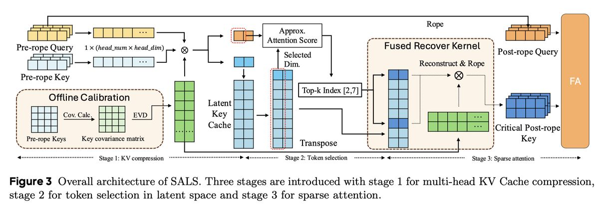

# SALS: Sparse Attention in Latent Space for KV cache Compression

> Junlin Mu, Hantao Huang, Jihang Zhang, Minghui Yu, Tao Wang, Yidong Li

## 一句话总结

SALS 通过在 RoPE 之前的潜在空间中进行低秩 KV 缓存压缩和稀疏 token 选择，实现了 6.4 倍 KV 缓存压缩和 5.7 倍注意力计算加速，同时保持了与基线相当的精度。

## 摘要翻译

能够处理扩展上下文的大型语言模型需求旺盛，但其推理仍因巨大的 KV 缓存大小和高内存带宽需求而面临挑战。先前研究已证明 KV 缓存在隐藏维度上表现出低秩特性，暗示了有效压缩的潜力。然而，由于现代 LLM 广泛采用旋转位置嵌入（RoPE）机制，朴素的低秩压缩会遭受严重的精度下降或产生新的速度瓶颈，因为低秩缓存必须先重建才能应用 RoPE。本文提出了两个关键洞察：第一，对 key 向量应用 RoPE 会增加其方差，从而导致更高的秩；第二，将 key 向量变换到潜在空间后，它们在大多数层中大体保持了其表示。基于这些洞察，我们提出了稀疏潜在空间注意力（SALS）框架。SALS 通过低秩投影将 KV 缓存投射到紧凑的潜在空间中，并在该空间中使用无 RoPE 的 query-key 交互进行稀疏 token 选择。通过仅重建少量重要 token，避免了全量 KV 缓存重建的开销。我们在两个大规模模型（LLaMA2-7b-chat 和 Mistral-7b）上对 SALS 进行了全面评估，并在 RULER-128k 基准上使用 LLaMA3.1-8B-Instruct 验证了其可扩展性。实验结果表明，SALS 在保持竞争力精度的同时达到了 SOTA 性能。在不同设置下，SALS 相比 FlashAttention2 在 4K 序列上实现了 6.4 倍 KV 缓存压缩和 5.7 倍注意力算子加速。对于端到端吞吐性能，SALS 在 4K 和 32K 序列上分别比 GPT-fast 提升了 1.4 倍和 4.5 倍。

## 研究动机

1. **KV 缓存瓶颈**：随着 LLM 服务请求的指数级增长，尤其是长上下文应用场景，KV 缓存已成为推理的主要性能瓶颈。序列长度增加时，KV 缓存占用大量 GPU 显存，高资源需求迫切需要缓解 KV 缓存的内存开销并提高注意力效率。

2. **低秩压缩的困境**：先前研究（如 Palu）表明 KV 缓存在隐藏维度上具有低秩特性，可通过低秩投影压缩。但存在权衡：单独压缩每个 KV 头减少开销但损失精度，而联合压缩所有头虽保留全局信息但重建成本显著增加。

3. **RoPE 与低秩压缩的冲突**：RoPE 通过将 query 和 key 状态与旋转矩阵相乘引入位置信息，这阻止了低秩权重融合到 query 状态中，且需要从潜在空间重建 key 状态。本文发现 RoPE 应用于 key 向量会增加其方差，导致更高秩，使得在 post-RoPE 空间进行低秩压缩效果差。

4. **已有稀疏注意力方法的局限**：大多数后训练稀疏注意力方法（如 StreamingLLM、Quest、Double-Sparse）主要减少带宽和计算成本，但未压缩 KV 缓存，仍存在潜在瓶颈。NSA 需要从头训练，而非后训练适配。

## 方法（技术细节）

### 核心框架：SALS（Sparse Attention in Latent Space）

SALS 框架包含三个阶段：KV 缓存压缩、关键 token 选择和稀疏注意力计算。

#### 阶段一：多头 KV 缓存压缩到潜在空间

**离线校准**：
- 从预训练语料（C4 数据集）中随机采样 512 个长度为 4096 的序列
- 收集其 pre-RoPE key 张量，合并头数与头维度：K ∈ R^{s×nd}
- 计算经验协方差矩阵：C = K^T K
- 对 C 进行特征值分解：C = UΣU^T
- 选择前 r 个特征向量 U_r 作为最优秩-r 投影矩阵

**联合压缩（Lemma 1）**：
- 将所有头的 key 向量合并后进行联合低秩投影，而非逐头独立投影
- 证明：联合投影的最优投影矩阵捕获的能量 ≥ 逐头投影的最优投影矩阵捕获的能量
- 原因：逐头投影的投影矩阵块是分块对角的，而联合搜索空间更大

**压缩率**：
- SALS-25%：r/d = 25%（d 为 head dimension）
- SALS-12.5%：r/d = 12.5%
- Value 缓存不进行低秩投影（几乎全秩），而是进行逐通道分组量化（4-bit 或 2-bit）

#### 阶段二：潜在空间中的关键 token 选择

**关键洞察**：pre-RoPE 的潜在 key 在大多数层中保持了 token 表示（重叠分数 > 90%），因此可以直接在潜在空间中进行 token 选择，无需重建完整 key。

**实现**：
- 查询投影：q̃ = U^T_r q，取前 r* 维度（r* = 0.5r）
- Key 已存储其完整潜在向量 k̃_j = U^T_r k_j，取前 r* 维度
- 近似注意力分数：s_j = q̃^T_{:r*} k̃_{j,:r*}
- 这是廉价的内积运算，直接从现有 key 缓存中计算，无需额外存储
- 选择 top-k 个关键 token 索引

**预设**：
- 跳过层 0、1 和 31 的稀疏化（根据观察到的重叠分数图）
- 最近窗口 w 个 token 保持高精度（仅压缩 50%）
- 保持 16 个 sink token + Nc 个关键 token + 64 个最近 token

#### 阶段三：选择性重建与稀疏注意力

- 从潜在空间中仅重建选中的关键 token 的 key 和 value
- 对重建的 key 应用 RoPE
- 使用 FlashAttention 进行稀疏注意力计算
- 避免全量 KV 缓存重建的开销

### 性能分析

**数据移动分析**：
- 全量注意力：2sd 个元素（s 个 token，d 维度）
- SALS：sr* + 2kr 个元素（r* 为近似分数维度，r 为潜在维度，k 为选中 token 数）
- 加速比：2sd / (sr* + 2kr)

**Triton 融合内核**：
- 将 token 选择、重建和 RoPE 旋转融合为单次操作
- 减少 7.69× 到 14.28× 的内存流量（相比 FlashAttention）

### 关键公式

**潜在空间变换**（pre-RoPE）：
- K̃ = KU（U ∈ R^{d×r}，r ≪ d）
- 注意力分数近似：QK^T ≈ QUU^T K^T

**RoPE 对 key 的影响**：
- post-RoPE：Q K^T ≈ QR_i (UU^T R^T_j) K^T
- pre-RoPE：Q K^T ≈ QR_i (R^T_j UU^T) K^T
- RoPE 增加 key 向量方差，使低秩压缩效果变差

## 实验结果

### 实验设置
- 模型：LLaMA2-7b-chat（MHA）、Mistral-7b-v0.2（GQA）、LLaMA3.1-8B-Instruct
- 基准：GSM8K、CoQA、LongBench（16 个英文子集）、RULER-128k
- 硬件：Xeon Platinum 8336C CPU，一块 Ampere 架构 GPU，128GB RAM
- 基线方法：KIVI（量化）、Palu（低秩投影）、Double Sparse、Hshare、Loki

### KV 缓存压缩对比

**GSM8K & CoQA（LLaMA2-7b-chat）**：
- SALS-25%：GSM8K 0.2312/0.2343（几乎与基线 0.2335/0.2335 持平），CoQA 0.5975（接近基线 0.5997）
- SALS-12.5%：GSM8K 0.2176/0.2229，CoQA 0.6070（甚至略高于基线）
- 对比：Palu-50%(3bit) GSM8K 仅 0.0614/0.0879，精度下降严重
- SALS 在压缩比接近的情况下，精度显著优于 Palu

**LongBench（LLaMA2-7b-chat）**：
- SALS-25%：平均 32.26，几乎与基线 32.65 持平，内存访问仅 0.11
- SALS-12.5%：平均 31.97，内存访问仅 0.06，仍优于 Palu-30%(3bit) 的 30.91
- SALS-12.5% 在压缩到仅 6% 内存访问时，仍保持了竞争力的精度

**LongBench（Mistral-7b-v0.2）**：
- SALS-25%：平均 42.79（基线 43.12），内存访问 0.11
- SALS-12.5%：平均 40.99，内存访问 0.06

### Token 稀疏对比（LLaMA2-7b-chat）

在相同稀疏率（1/8）下：
- SALS-25%：平均 32.26，内存访问 0.11
- Double Sparse：平均 31.64，内存访问 0.16
- HShare：平均 31.83，内存访问 0.14
- Loki：平均 31.95，内存访问 0.19

SALS-25% 和 SALS-12.5% 均在精度和内存访问方面优于所有竞争稀疏方法。

### RULER 基准（LLaMA3.1-8B-Instruct，4K 序列）
- SALS-25%：平均 80.81（基线 81.60），几乎无精度损失
- SALS-12.5%：平均 75.86，在极高压缩下仍有竞争力
- SALS-25% 在 NIAH-Single-1/2、Multi-Value、Multi-Query 等检索任务上表现稳定

### 效率评估

**注意力算子延迟（Table 6）**：
- bs=8, 4k 序列：Flash-attn 1.630ms → SALS-25% 0.530ms → SALS-12.5% 0.439ms
- bs=16, 4k 序列：Flash-attn 3.230ms → SALS-25% 0.757ms → SALS-12.5% 0.565ms
- 加速比：约 5.7×（SALS-25%）和 3.7×（SALS-12.5%）
- 短序列（1k）有一定开销，但长序列加速显著

**端到端吞吐（Table 7）**：
- 4k 序列：GPT-Fast 118 → SALS-12.5% 163.5（1.39×）
- 32k 序列：GPT-Fast 19.8 → SALS-12.5% 89.47（4.52×）
- 64k 序列：GPT-Fast 9.2 → SALS-12.5% 42.96（4.67×）

## 优势

1. **高效的 KV 缓存压缩**：在 pre-RoPE 空间进行低秩压缩，避免了 RoPE 导致的秩增加问题，压缩率可达 12.5%（8 倍压缩）
2. **精准的关键 token 选择**：利用潜在空间中 token 表示的高重叠率（>90%），无需重建完整 key 即可准确选择重要 token
3. **统一的框架**：将低秩压缩和稀疏注意力统一在一个框架中，同时降低内存占用和计算成本
4. **后训练适配**：无需从头训练，仅需离线校准（512 个序列的特征值分解），可应用于已有模型
5. **显著的加速效果**：注意力算子 5.7× 加速，端到端 4.5× 吞吐提升
6. **联合投影优势**：多头联合低秩投影优于逐头独立投影，保留更多信息
7. **Triton 融合内核**：将 token 选择、重建和 RoPE 旋转融合，减少 7.69×-14.28× 内存流量

## 局限

1. **短序列开销**：在短序列（如 1k）上，token 选择和重建的开销可能导致性能不如 FlashAttention
2. **极高压缩下的精度损失**：SALS-12.5% 在某些检索任务（如 NIAH-Single-1、Multi-Key-2）上精度明显下降
3. **依赖预校准**：需要离线校准数据集（512 个序列），虽然开销不大，但仍需额外步骤
4. **未开源代码**：论文声明代码将在未来公开，但当前尚无可用代码
5. **跳跃层策略**：跳过层 0、1、31 的稀疏化依赖于观察到的重叠分数图，对不同模型可能不通用
6. **未涉及量化与压缩的联合优化**：虽然 Value 使用了量化，但未深入探索更复杂的联合压缩策略
7. **对 GQA 的适配有限**：虽然在 Mistral-7b（GQA）上验证了有效性，但对更多 GQA 变体的泛化能力未充分探索

## 与 EfficientPaper 相关的研究方向

1. **KV 缓存压缩**：SALS 是低秩 KV 缓存压缩与稀疏注意力的结合，属于 EfficientPaper 中 KV 缓存压缩方向的重要工作，与 Palu、KIVI、Loki 等方法形成对比
2. **稀疏注意力**：SALS 属于后训练稀疏注意力方法，与 Double Sparse、HShare、Loki、Quest 等方法在稀疏 token 选择方面进行比较
3. **低秩投影**：SALS 的核心是利用 KV 缓存的低秩特性，与 ASVD、SVD-LLM、CALDERA 等权重压缩方法共享低秩分解思想
4. **RoPE 与注意力优化**：SALS 深入分析了 RoPE 对低秩压缩的影响，对理解 RoPE 机制与注意力优化的关系有重要参考价值
5. **推理效率优化**：SALS 在长序列场景下的显著加速效果，与 EfficientPaper 中关注的推理优化方向高度相关
6. **预训练后校准**：SALS 的离线校准方法（特征值分解）是一种高效的预训练后适配策略，可与其他需要校准的推理优化方法（如量化校准）结合
7. **混合精度与压缩策略**：SALS 中 Value 使用量化、Key 使用低秩投影的混合策略，与 KIVI 等量化方法形成互补
8. **长上下文推理**：SALS 在 RULER-128k 上的可扩展性验证，对长上下文 LLM 推理优化具有指导意义

---

> 本 note 由 AI Agent 自动生成，基于论文全文阅读和分析。生成时间：2025年。
