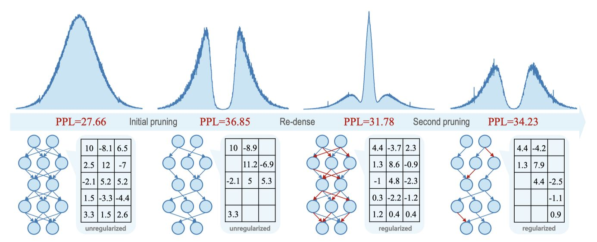

# Enhancing One-shot Pruned Pre-trained Language Models through Sparse-Dense-Sparse Mechanism

> ⚠️ 本文 note 由 AI Agent（Hermes）自动生成，基于 arXiv 论文 2408.10473v1 的全文内容。生成时间：2025年。

---

## 一句话总结

SDS 提出一种"稀疏-稠密-稀疏"（Sparse-Dense-Sparse）三阶段剪枝框架，通过优化权重分布的剪枝友好性，在不增加额外校准数据的情况下，显著提升一次性剪枝预训练语言模型的性能，超越 SparseGPT 和 Wanda 等现有方法。

---

## 摘要翻译

预训练语言模型（PLMs）在上下文理解方面表现稳健，但在自然语言处理任务中表现出色的同时，其巨大的规模带来了显著的计算和存储成本。现代剪枝策略采用一次性技术来压缩 PLMs，无需在任务特定数据上重新训练；然而，这些方法往往导致不可忽视的性能下降。在本文中，我们提出 SDS，一种稀疏-稠密-稀疏剪枝框架，从权重分布优化的角度提升剪枝后 PLMs 的性能。我们将剪枝过程分为三个步骤：首先，使用传统一次性剪枝方法去除模型中不太关键的连接；其次，通过稀疏正则化重新激活被剪枝的连接，重建具有剪枝友好权重分布的稠密模型；最后，执行第二轮剪枝，获得优于初始剪枝的模型。实验结果表明，在相同稀疏度配置下，SDS 优于最先进的剪枝技术 SparseGPT 和 Wanda。例如，对于 2:4 稀疏度的 OPT-125M，SDS 在 Raw-WikiText2 上降低了 9.13 的困惑度，并在多个零样本基准测试上平均提高了 2.05% 的准确率。

---

## 研究动机

1. **PLM 压缩的必要性**：预训练语言模型（如 OPT、LLaMA）参数量巨大，推理时延迟和能耗高，需要有效的压缩方法。

2. **一次性剪枝的局限性**：SparseGPT 和 Wanda 等方法在超大模型（70B、175B）上效果显著，但在紧凑模型（如 OPT-125M、OPT-350M）上效果显著下降。例如，SparseGPT 剪枝 OPT-350M 的 50% 权重后困惑度为 31.58，反而高于仅有一半参数的 OPT-125M 密集模型（27.66）。

3. **紧凑模型更难压缩**：紧凑模型的参数分布更均匀，已经充分训练，自然更难压缩。此外，PLM 在预训练阶段缺乏稀疏感知的正则化，使得直接剪枝效果不佳。

4. **关键发现**：通过层间稠密重建实验发现，仅用 128 个样本就能将稀疏模型恢复到接近稠密模型的性能（如 OPT-125M 从 60.43 困惑度恢复到 27.94）。这表明：(a) 剪枝过程中丢失的知识是可恢复的；(b) 被剪枝的 PLM 可以用有限资源优化。

5. **生物启发**：人脑神经元的连接呈现"稀疏-稠密-稀疏"的生长模式，启发了本工作。

---

## 方法（技术细节）

### 整体框架：Sparse-Dense-Sparse (SDS)

SDS 是一个三阶段框架，包含：初始剪枝（Initial Pruning）、稠密重建（Re-dense Weight Reconstruction）、二次剪枝（Second Pruning）。

#### 第一阶段：初始剪枝

- 使用传统的单次剪枝方法（SparseGPT 或 Wanda）对 PLM 进行初步剪枝，去除不太重要的连接。
- **SparseGPT**：利用二阶信息（Hessian 逆）指导稀疏掩码选择，并通过列向剪枝补偿被剪枝列的误差（更新未剪枝列的权重）。
- **Wanda**：考虑权重幅度和激活幅度进行掩码选择，无需权重更新。
- 初始剪枝后的权重呈现"截断的双峰分布"（truncated bimodal distribution），在极端正负值处集中，对模型的泛化能力和稳定性有负面影响。

#### 第二阶段：稠密重建（Re-dense Weight Reconstruction）

**目标**：找到一个具有"剪枝友好"（pruning-friendly）权重分布的稠密模型，作为新一轮剪枝的起点。

**方法**：采用层间知识蒸馏（Layer-wise Knowledge Distillation），使用与初始剪枝相同的 128 个样本，将稀疏模型重建为稠密模型。具体优化公式：

$$\hat{W}_{\text{re-dense}}^\ell = \arg\min_{W_{\text{sparse}}^\ell} \left( \|W_{\text{dense}}^\ell X^{\ell-1} - W_{\text{sparse}}^\ell X^{\ell-1}\|_2^2 + \lambda_1 \|W_{\text{sparse}}^\ell\|_1 + \lambda_2 \|W_{\text{sparse}}^\ell\|_2 \right)$$

其中 $\lambda_1 = \lambda_2 = 0.1$。

**三种稀疏正则化策略**：

1. **残差稀疏特征（Residual Sparse Characteristics）**：初始剪枝提供先验信息，指导稠密重建过程中哪些权重相对重要。这确保重建后的模型保留了剪枝的稀疏特征，而不是简单地回到原始稠密模型。

2. **基于数据的正则化（Data-based Regularization）**：使用高损失样本（稀疏模型的高损失激活）作为输入，避免过拟合。实验表明 SD-data（使用稀疏模型生成的数据）在 SDS 流程中效果最佳。

3. **基于权重的正则化（Weight-based Regularization）**：使用 L1 和 L2 正则化直接为稠密权重赋予稀疏特征，增加剪枝友好性。

**层间知识对齐**：相邻层之间使用前一层的输出作为下一层的输入，避免额外的前向传播，防止误差累积。

**重建效果**：稠密重建后，权重呈现三峰分布（three-peaked distribution），在零值附近更集中，表明更高的"剪枝友好性"。性能略低于原始稠密模型，但显著优于初始稀疏模型。

#### 第三阶段：二次剪枝（Second Pruning: Sparse Weight Adjustment）

**目标**：对重建后的稠密模型进行二次剪枝和权重调整。

**方法**：
1. 使用与初始剪枝相同的稀疏化方法（SparseGPT 或 Wanda）对稠密重建模型进行剪枝，得到 $W_{\text{sparse-2nd}}$。
2. 使用软稀疏掩码（Soft Sparse Mask）进行权重调整：

$$\hat{W}_{\text{SDS}}^\ell = \text{Mask}_{\text{soft}}^\ell \odot \arg\min_{W_{\text{sparse-2nd}}^\ell} \|W_{\text{dense}}^\ell X^{\ell-1} - W_{\text{sparse-2nd}}^\ell X^{\ell-1}\|_2^2$$

其中 $\text{Mask}_{\text{soft}}^\ell$ 根据 $|W_{\text{sparse-2nd}}^\ell|$ 在每轮迭代中动态选择（基于 absmin 的掩码选择策略）。

**关键特点**：
- 使用 L2 损失函数，天然强调异常值（outlier）区域的损失，保护异常值免受权重调整的影响。
- 对于 30 亿参数以上的模型，可以直接对稠密重建模型进行一次性剪枝（跳过权重调整），并超越初始剪枝的性能，实现提前退出（early-exit）。
- 二次剪枝后，权重分布更平滑、更均匀，表明模型参数在不同范围内具有适当的值，具有更强的泛化能力。

### 校准数据

- 使用 128 段 × 2048 tokens 的 C4 数据集（与 SparseGPT/Wanda 一致）。
- 全程零样本，不暴露任务特定信息。

---

## 实验结果

### 实验设置

- **模型**：OPT（125M, 350M, 1.3B, 2.7B）和 LLaMA（7B）、LLaMA2（7B）
- **稀疏度配置**：50%（非结构化）、2:4（结构化）、4:8（结构化）
- **评估指标**：Raw-WikiText2 困惑度（PPL）；零样本准确率（COPA、Lambada、OpenBookQA、PIQA、RTE、StoryCloze、Winogrande）
- **基线方法**：SparseGPT、Wanda

### 语言建模性能

| 稀疏度 | 方法 | OPT-125M | OPT-350M | OPT-1.3B | OPT-2.7B | LLaMA-7B | LLaMA2-7B |
|--------|------|----------|----------|----------|----------|----------|-----------|
| Dense | — | 27.66 | 22.01 | 14.62 | 12.46 | 5.68 | 5.47 |
| 50% | SparseGPT | 36.85 | 31.58 | 17.46 | 13.48 | 7.36 | 6.72 |
| 50% | SDS-SparseGPT | 34.23 | 29.36 | 17.07 | 13.38 | 7.32 | 6.69 |
| 2:4 | SparseGPT | 60.43 | 51.11 | 24.34 | 17.18 | 11.32 | 10.88 |
| 2:4 | SDS-SparseGPT | 51.30 | 46.23 | 22.67 | 16.78 | 10.65 | 10.18 |
| 2:4 | Wanda | 82.47 | 113.17 | 28.33 | 21.20 | 11.54 | 12.14 |
| 2:4 | SDS-Wanda | 59.17 | 73.56 | 23.94 | 17.99 | 10.80 | 11.34 |

**关键结果**：
- 在 50% 稀疏度下，SDS 平均降低困惑度 1.8 个点。
- 在 2:4 稀疏度下，SDS 平均降低困惑度 7.5 个点。
- 在 4:8 稀疏度下，SDS 平均降低困惑度 3.3 个点。
- OPT-125M 2:4 稀疏度下，SDS 降低 9.13 的困惑度（从 60.43 降至 51.30）。
- OPT-350M 2:4 稀疏度下，SDS-Wanda 降低 39.61 的困惑度（从 113.17 降至 73.56）。

### 零样本下游任务性能

- 在 50% 稀疏度下，SDS 比 SparseGPT 平均提升约 1.83%。
- 在 2:4 稀疏度下，SDS 比 SparseGPT 平均提升约 2.2%。
- OPT-125M 2:4 稀疏度：SDS-SparseGPT 准确率 49.61% vs SparseGPT 47.56%。
- LLaMA-7B 2:4 稀疏度：SDS-Wanda 准确率 63.03% vs Wanda 61.58%。
- LLaMA2-7B 2:4 稀疏度：SDS-Wanda 准确率 63.51% vs Wanda 61.93%。

### 推理加速

使用 DeepSparse 库在 AMD Ryzen 7 PRO 5850U 上进行推理测试：
- OPT-1.3B：1.19x 加速
- OPT-2.7B：1.35x 加速
- OPT-6.7B：1.52x 加速
- LLaMA-7B：1.87x 加速

### 消融实验

消融实验验证了：
1. 残差稀疏特征的有效性（在 5 个任务上超越 SparseGPT）。
2. 权重正则化和数据正则化的作用：SD-data（使用稀疏模型生成的数据）在 SDS 流程中最优。
3. 使用相同样本即可获得优异结果，无需额外样本。
4. 三种稀疏正则化（残差稀疏特征、数据正则化、权重正则化）相互增强。

---

## 优势

1. **显著的性能提升**：在所有稀疏度配置和模型上一致超越 SparseGPT 和 Wanda，尤其在高稀疏度（2:4）下效果显著。
2. **低数据需求**：仅需 128 个样本（与一次性剪枝相同），无需任务特定数据或额外训练数据。
3. **兼容性好**：可与多种基线剪枝方法（SparseGPT、Wanda、OWL）结合使用。
4. **硬件友好的加速**：2:4 和 4:8 稀疏度配置支持专用硬件加速，实测可获 1.19x-1.87x 加速。
5. **可扩展性**：适用于从 125M 到 7B 参数规模的多种 PLM。
6. **理论支撑**：从权重分布优化的角度提供清晰的解释框架，包括三峰分布的形成和剪枝友好性的量化分析。
7. **非结构化和非均匀稀疏**均支持，且在两种场景下都能提升性能。

---

## 局限

1. **额外计算开销**：SDS 的稠密重建和二次剪枝需要额外的计算。优化 7B 规模模型在 8 GPU 上并行需要超过 2 小时。
2. **主要聚焦紧凑模型**：论文主要验证了 OPT 和 LLaMA 的小规模模型（125M-7B），对更大模型（如 13B、70B）的验证较少。
3. **仅适用于全连接层**：剪枝目标限定为全连接层（MLP 和注意力的 Q/K/V/O 投影），未考虑注意力头级别的结构化剪枝。
4. **特定硬件依赖**：加速实验仅在 AMD CPU（Ryzen 7 PRO 5850U）上验证，未覆盖 GPU 或专用加速器。
5. **未开源代码**：论文中未提供代码实现（代码 URL 为空）。
6. **校准数据依赖**：仍需 C4 数据集的样本，对于数据受限场景可能不够灵活。
7. **性能上界限制**：稠密重建后的模型性能仍略低于原始密集模型（受正则化约束），存在一定的性能上界。

---

## 与 EfficientPaper 相关的研究方向

1. **模型剪枝与压缩**：SDS 与 EfficientPaper 中的 SparseGPT（2024/Wanda）、Wanda（2023/sparsegpt）等方法直接相关，属于模型压缩/剪枝方向。
2. **权重分布优化**：SDS 的"稀疏-稠密-稀疏"机制与 Dense-Sparse-Dense (DSD) 训练方法（Han et al., ICLR 2017）有关，是从权重分布角度优化的典型工作。
3. **高效推理加速**：通过稀疏化实现的推理加速（2:4 稀疏、4:8 稀疏）与硬件加速直接相关。
4. **一次性剪枝方法论**：SDS 的工作流程（先剪枝、再重建、再剪枝）为一次性剪枝提供了新的改进思路，可以作为其他剪枝方法的通用增强框架。
5. **知识蒸馏与重建**：SDS 中的层间知识蒸馏与模型重建策略，为压缩后的模型恢复性能提供了新方法。
6. **非结构化与结构化稀疏**：SDS 同时支持非结构化稀疏和结构化稀疏（2:4、4:8），与稀疏硬件加速生态（如 NVIDIA Ampere 的 2:4 稀疏支持）相关。

---

## 参考信息

- **论文标题**: Enhancing One-shot Pruned Pre-trained Language Models through Sparse-Dense-Sparse Mechanism
- **缩写**: SDS
- **作者**: Guanchen Li, Xiandong Zhao, Lian Liu, Zeping Li, Dong Li, Lu Tian, Jie He, Ashish Sirasao, Emad Barsoum
- **机构**: Advanced Micro Devices (AMD)
- **发表**: COLING 2025
- **arXiv**: http://arxiv.org/abs/2408.10473v1
- **关键词**: sparse_pruning, weight_sparsity
- **代码**: 未开源
- **基线**: SparseGPT, Wanda
