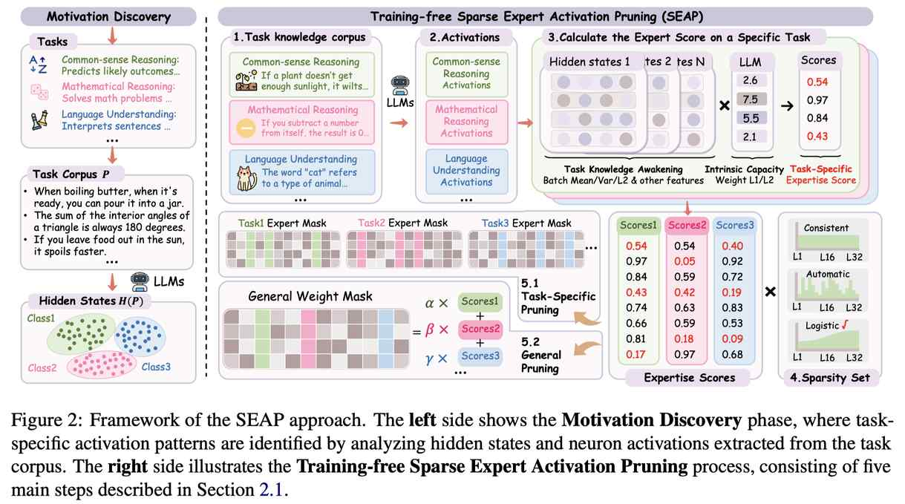

# SEAP: Training-free Sparse Expert Activation Pruning Unlock the Brainpower of Large Language Models

> **一句话总结**：SEAP 是一种免训练的任务自适应结构化剪枝方法，通过分析 LLM 中不同任务的隐藏状态聚类模式，为每个任务动态生成稀疏掩码，在 20% 剪枝率下仅损失 2.2% 性能，50% 剪枝率下超越 Wanda 和 FLAP 超过 20%。

---

## 摘要翻译

大语言模型（LLM）在各种自然语言处理任务中取得了显著成功，但其推理阶段的高计算成本仍是主要瓶颈。本文提出了**稀疏专家激活剪枝（SEAP）**，一种免训练的剪枝方法，通过选择性保留任务相关参数来减少推理开销。受 LLM 中隐藏状态和激活的聚类模式启发，SEAP 识别特定任务的专家激活模式，并在保持任务性能和提高计算效率的同时对模型进行剪枝。实验结果表明，SEAP 在显著降低计算开销的同时保持了有竞争力的准确率。特别是在 50% 剪枝率下，SEAP 超越 Wanda 和 FLAP 超过 20%；在 20% 剪枝率下，与密集模型相比仅有 2.2% 的性能下降。这些发现突显了 SEAP 的可扩展性和有效性，使其成为优化大规模 LLM 的一种有前景的方法。

---

## 研究动机

1. **LLM 推理效率瓶颈**：大语言模型在推理阶段面临巨大的计算开销，受内存带宽和硬件限制，部署在资源受限环境（如实时系统和边缘计算）中尤为困难。

2. **现有剪枝方法的局限性**：现有剪枝方法（如 SparseGPT、Wanda、FLAP）大多是静态的，依赖于从通用数据集（如 WikiText-2、C4）收集的激活分布，对所有任务采用统一的剪枝策略，无法充分利用任务特定的知识需求。

3. **认知神经科学启发**：受脑分区理论启发——不同大脑区域根据任务需求选择性激活以优化认知效率，作者假设 LLM 中也存在类似机制：不同任务依赖于不同的神经元集合协作。因此，剪枝策略应该是**自适应的**而非静态的，能够根据每个任务动态选择最相关的参数。

4. **关键假设验证**：通过多任务实验（7 类任务：常识推理、数学推理、科学问答等）分析 LLM 隐藏状态，发现不同任务在隐藏状态空间中占据不同区域，相似任务的激活模式高度重叠，而不同任务的激活模式显著分离。这与人脑的功能特化形成了有趣的平行。

---

## 方法（技术细节）

### 整体框架

SEAP（Sparse Expert Activation Pruning）是一个**免训练、任务自适应的结构化剪枝**框架，包含以下 5 个主要步骤：

### 1. 任务特定知识语料库构建
- 从各类任务（推理、数学、科学问答等）中构建任务特定知识语料库
- 将问题、选项和正确答案组合成统一的输入格式
- 例如 HellaSwag、PIQA、OBQA、WinoGrande、ARC、GSM8K、BoolQ 等任务

### 2. 激活模式建模（Activation Patterns Modeling）
- 将语料库输入 LLM，提取多层隐藏状态激活
- 定义任务类型 τ 下，prompt p_i 的隐藏状态向量 h(p_i)^τ
- 计算三个关键统计量：
  - **均值激活** μ^τ_j：任务 τ 下维度 j 的平均激活
  - **方差** (σ^τ_j)²：激活的变化程度
  - **L2 范数** ‖h^τ_j‖₂：激活的总能量
- 通过热力图可视化（Figure 3），同一任务的激活模式高度一致，不同任务呈现独特的"热点"

### 3. 神经元重要性评分（Compute Neuron Importance Scores）
- **任务知识唤醒（Task Knowledge Awakening）**：基于激活统计量计算任务特定的专家评分
- 评分函数 f(·) 结合了激活均值、方差、L2 范数和对应权重的范数
- 两种具体的评分策略：
  - **s_F（FLAP 风格）**：s_F,i = (σ²_i) × ‖w_i‖₂²（方差 × 权重 L2 范数平方）
  - **s_W（Wanda 风格）**：s_W,i = ‖h_i‖₂² × ‖w_i‖₁（激活 L2 范数平方 × 权重 L1 范数）
- 在 MLP 层中，每个神经元索引直接对应一个通道，逐通道计算评分
- 在注意力层中，将神经元评分聚合到 head 级别

### 4. 稀疏度动态分配（Sparsity Setting）
- **Logistic 稀疏度函数**：使用可微分的 logistic 函数在层间平滑分配稀疏度
  - 将层索引 ℓ 映射到 [0,1]：x_ℓ = (ℓ-1)/(L-1)
  - 稀疏度公式：ρ_ℓ = Λ / (1 + exp(-k(x_ℓ - x_0)))
  - 其中 k 控制陡峭度，x_0 设置拐点，Λ 为最大稀疏度
- 实验参数：(x_0, k) = (0.3, 1)
- **关键发现**：浅层对剪枝更敏感，深层能容忍更高稀疏度；因此将最后 n 层的稀疏度设为 0
- 通过数值搜索调整 Λ 以满足全局稀疏度目标 G

### 5. 两种剪枝策略
#### 5.1 专家剪枝（Expert-Based Pruning）
- 使用任务特定的重要性评分生成剪枝掩码
- 推理时可根据任务类型灵活应用不同的剪枝掩码
- 适合已知任务类型的场景

#### 5.2 通用剪枝（General Pruning）
- 聚合多个任务的重要性评分，生成统一的通用掩码
- 评分公式：s_i = Σ_τ α_τ × s_i^(ℓ,τ)
- WikiText2 赋予权重 3，其他任务赋予权重 2
- 适用于通用场景

### 结构化剪枝
- 对权重矩阵 W 的列（对应隐藏状态的维度）进行零化
- 实现结构化稀疏，对硬件推理加速友好

---

## 实验结果

### 实验设置
- **模型**：Llama-2-7B、Llama-2-13B
- **评估框架**：EleutherAI LM Harness，零样本评估
- **7 个基准任务**：BoolQ、ARC Easy、ARC Challenge、HellaSwag、OBQA、PiQA、WinoGrande
- **基线方法**：Dense（原始模型）、Wanda（结构化扩展 Wanda-sp）、FLAP
- **剪枝率**：20% 和 50%
- **剪枝时间**：Llama-2-7B 上约 5-10 分钟（单张 NVIDIA H800 80GB GPU）

### 主要结果

#### Llama-2-7B（Table 1）
| 剪枝率 | 方法 | 平均准确率 |
|--------|------|-----------|
| 0% | Dense | 66.97% |
| 20% | WandA-sp | 60.95% |
| 20% | FLAP | 62.07% |
| 20% | SEAP (s_F) | **65.46%** |
| 50% | WandA-sp | 45.23% |
| 50% | FLAP | 46.82% |
| 50% | SEAP (s_F) | **55.73%** |

#### Llama-2-13B（Table 4）
- 20% 剪枝率下，SEAP (s_F) 平均 68.12%，SEAP-gen (s_F) 平均 68.75%
- 50% 剪枝率下，SEAP-gen (s_F) 平均 60.89%，显著优于基线

#### 关键性能指标
- **20% 剪枝**：SEAP 仅损失 2.2% 性能（与密集模型相比）
- **50% 剪枝**：SEAP 超越 Wanda 和 FLAP 超过 20%

#### 推理速度（Table 2）
| 剪枝率 | 方法 | Llama-2-7B (Tokens/s) | 加速比 | Llama-2-13B (Tokens/s) | 加速比 |
|--------|------|----------------------|--------|------------------------|--------|
| 0% | Dense | 31.88 | - | 27.45 | - |
| 20% | SEAP-gen | 37.32 | ×1.17 | 33.02 | ×1.20 |
| 50% | SEAP-gen | 47.10 | ×1.48 | 41.78 | ×1.52 |

#### 稀疏度设置对比（Table 3）
- SEAP-gen 使用 Logistic-based (LB) 稀疏度设置，在 20% 和 50% 下均优于 WandA-sp 和 FLAP
- LB 设置比统一层稀疏度 (UL) 和自适应层稀疏度 (AL) 更有效

#### 附加实验
- **困惑度（PPL）**：在 WikiText2 上，20% 稀疏度下 SEAP 的 PPL 略高于 WandA 和 FLAP；50% 下所有方法 PPL 均有增加，但 SEAP-gen 增幅最大，仍在可接受范围内
- **任务分类器**：基于 0 层嵌入向量训练单层分类器，准确率 93%，支持动态选择任务特定掩码
- **生成质量**：20% 剪枝下生成质量良好；50% 下生成质量显著下降

---

## 优势

1. **免训练**：无需微调或重新训练，直接从预训练模型进行剪枝
2. **任务自适应**：为每个任务生成独立的剪枝掩码，充分利用任务特定的知识模式
3. **结构化剪枝**：剪枝整个列（维度），对硬件推理加速友好，支持实际加速
4. **高性能**：在 20% 剪枝率下仅损失 2.2% 性能；50% 下超越基线超过 20%
5. **灵活性**：评分策略可与现有方法（Wanda、FLAP）结合，框架高度灵活
6. **高效剪枝**：单 GPU 上约 5-10 分钟完成剪枝
7. **低开销任务分类**：通过轻量级分类器实现动态掩码选择，分类准确率 93%
8. **理论基础扎实**：受认知神经科学启发，有实验验证（隐藏状态聚类模式）

---

## 局限

1. **困惑度略有增加**：与其他方法相比，SEAP 可能导致语言建模质量（PPL）略有上升，以保留任务特定参数
2. **通用剪枝效果不如专家剪枝**：通用掩码（SEAP-gen）在某些任务上不如专家掩码（SEAP），尤其是当任务知识语料库不够丰富时
3. **任务分类器依赖**：专家剪枝需要一个任务分类器来路由任务，增加了额外的推理开销
4. **数据多样性不足**：任务特定激活值的获取可以从更多样化的数据中受益，引入数据合成技术可提升泛化能力
5. **未扩展到更大模型**：实验仅在 Llama-2-7B 和 13B 上进行，更大模型（如 70B+）的效果未验证
6. **高稀疏度下生成质量下降**：50% 剪枝下生成文本质量显著退化（如 Table 7、8 所示）
7. **特定任务不适用**：BoolQ 等简单任务（True/False 类型）的语料库不够丰富，任务特定剪枝效果不明显

---

## 与 EfficientPaper 相关的研究方向

1. **结构化剪枝**：SEAP 与 EfficientPaper 中的 Wanda（2024/Wanda）和 FLAP（2024/flap）构成直接对比关系，属于结构化稀疏剪枝的前沿方法
2. **任务自适应模型压缩**：SEAP 的任务自适应策略可扩展到其他压缩方法（如量化、蒸馏），为任务感知的模型压缩提供新范式
3. **免训练高效推理**：SEAP 作为免训练方法，与量化、MoE 等免训练方法（如 LLM-Pruner、QPruner）形成互补
4. **稀疏专家激活**：SEAP 的"专家激活"概念与 MoE（Mixture of Experts）架构有天然联系，可探索将 SEAP 与 MoE 结合
5. **激活感知剪枝**：SEAP 的激活模式分析方法可用于激活剪枝研究（如 TEAL、CATS、SCAP），提供新的激活重要性度量
6. **大模型高效部署**：SEAP 为边缘设备和资源受限环境下的 LLM 部署提供了高效的压缩方案
7. **任务分类与路由**：SEAP 的轻量级任务分类器可与任务路由机制结合，实现更高效的自适应推理

---

> **生成声明**：本 note 由 AI Agent 自动生成，基于 arXiv 论文 2503.07605v1 全文内容撰写。生成时间：2025年。如有错误或遗漏，请以原文为准。
